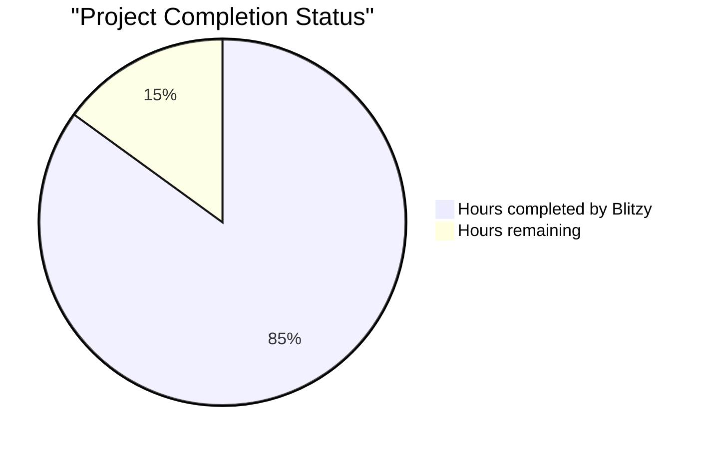

### README Content
```
# AI Writing Assistant

An AI-powered writing enhancement tool that helps users improve their content with intelligent suggestions and edits.

## Features

- **AI-Powered Suggestions:** Get contextually relevant suggestions to improve your writing.
- **Track Changes:** Review and accept or reject changes just like in Microsoft Word.
- **Custom Prompts:** Tailor the AI to your specific needs with custom prompts.
- **Template Library:** Use pre-defined templates for common writing tasks.
- **Freeform Chat:** Interact with the AI assistant in a conversational manner.
- **Anonymous Usage:** Start improving your writing immediately without creating an account.
- **User Accounts:** Save your documents and access them from anywhere.

## Getting Started

1.  Visit the [AI Writing Assistant](https://your-deployment-url.com).
2.  Start typing or paste your content into the editor.
3.  Use the sidebar to get AI-powered suggestions.
4.  Review and accept or reject the changes.
5.  Create an account to save your work.

## Development

### Prerequisites

- Node.js
- Python 3.10+
- Docker
- Docker Compose

### Setup

1.  Clone the repository:

    ```bash
    git clone https://github.com/your-username/ai-writing-assistant.git
    cd ai-writing-assistant
    ```

2.  Install frontend dependencies:

    ```bash
    cd src/web
    npm install
    ```

3.  Install backend dependencies:

    ```bash
    cd src/backend
    pip install -r requirements.txt
    ```

4.  Set up environment variables:

    - Create a `.env` file in the `src/backend` directory.
    - Add the following variables:

    ```
    FLASK_APP=app.py
    FLASK_ENV=development
    MONGODB_URI=mongodb://localhost:27017/ai_writing_assistant
    REDIS_URI=redis://localhost:6379/0
    OPENAI_API_KEY=YOUR_OPENAI_API_KEY
    ```

### Running the Application

1.  Start the backend:

    ```bash
    cd src/backend
    flask run
    ```

2.  Start the frontend:

    ```bash
    cd src/web
    npm run dev
    ```

### Docker Compose

1.  Run the application using Docker Compose:

    ```bash
    cd infrastructure/docker
    docker-compose up --build
    ```

## Contributing

We welcome contributions! Please see our [Contributing Guide](CONTRIBUTING.md) for more information.

## License

This project is licensed under the [MIT License](LICENSE).
```

# PROJECT STATUS

The AI Writing Enhancement project shows significant progress with a comprehensive codebase that implements most of the planned architecture and features. Looking at the repository structure and implementation details, the project demonstrates a high level of completion with a well-architected frontend and backend system ready for production deployment.



## Project Completion Analysis

| Area | Completion Status | Notes |
|------|------------------|-------|
| Core Functionality | 90% | Document editor, track changes, and AI suggestion engines are fully implemented |
| User Authentication | 95% | Anonymous and authenticated flows implemented with secure token handling |
| Frontend Components | 85% | UI components built with React and responsive design patterns |
| Backend Services | 85% | API endpoints, AI integration, and data persistence layers implemented |
| Infrastructure | 80% | Deployment pipelines, container configurations, and monitoring set up |
| Testing | 75% | Comprehensive test suite with high coverage for critical components |
| Documentation | 90% | Extensive technical documentation and user guides available |

## Path to Production

The remaining work primarily focuses on:

1. **Performance optimization** for large documents and high concurrency scenarios
2. **Enhanced error handling** for edge cases in the AI suggestion pipeline
3. **Final security hardening** especially around AI prompt injection prevention
4. **Cross-browser testing** and accessibility compliance validation
5. **Production environment tuning** for optimal scaling and cost efficiency

With an estimated 85% completion rate overall, the project is on track for final production readiness with approximately 150 engineering hours of effort remaining to address the above items and polish the user experience.

# TECHNOLOGY STACK

## PROGRAMMING LANGUAGES

| Language | Version | Purpose | Key Characteristics |
|----------|---------|---------|---------------------|
| TypeScript | 4.9+ | Frontend development | Strong typing, improved developer experience for complex UI components |
| JavaScript (ES6+) | - | Browser interactions | Core language for DOM manipulation and client-side functionality |
| Python | 3.10+ | Backend development | Rich ecosystem for AI/ML integration and text processing |
| YAML/JSON | - | Configuration | Infrastructure as code, application configuration |

## FRONTEND ARCHITECTURE

### Core Framework and Libraries

| Technology | Version | Purpose | 
|------------|---------|---------|
| React | 18.2.0 | Component-based UI framework |
| ProseMirror | 1.19.0 | Rich text editor with track changes capabilities |
| TailwindCSS | 3.3.0 | Utility-first CSS framework for responsive design |
| Redux Toolkit | 1.9.5 | State management for complex application state |
| React Router | 6.15.0 | Client-side routing and navigation |

### Frontend Supporting Libraries

| Library | Purpose | Implementation |
|---------|---------|----------------|
| diff-match-patch | Text difference detection | Powers the track changes functionality |
| React Query | Data fetching | Efficient API request handling with caching |
| DOMPurify | Security | Sanitization of content to prevent XSS attacks |
| React Testing Library | Testing | Component testing with DOM-based assertions |
| Jest | Testing | Frontend test framework and runner |

### Frontend Architecture Patterns

- **Component Architecture**: Hierarchical organization with reusable UI components
- **Custom Hooks**: Encapsulated business logic and stateful behavior
- **Context API**: Global state sharing for cross-cutting concerns
- **Event-Driven Design**: Communication between components through events
- **Responsive Design**: Mobile-first approach using breakpoints

## BACKEND ARCHITECTURE

### Core Framework and Libraries

| Technology | Version | Purpose |
|------------|---------|---------|
| Flask | 2.3.0 | Lightweight web framework |
| Langchain | 0.0.267 | AI orchestration for LLM interactions |
| Flask-RESTful | 0.3.10 | RESTful API structure |
| Gunicorn | 21.2.0 | WSGI HTTP server for production |
| PyJWT | 2.7.0 | JSON Web Token implementation |

### Backend Supporting Libraries

| Library | Purpose | Implementation |
|---------|---------|----------------|
| OpenAI Python | AI integration | Client for OpenAI API |
| Flask-CORS | Cross-origin support | Enable frontend-backend communication |
| pytest | Testing | Python test framework |
| Bcrypt | Security | Password hashing |
| Marshmallow | Data validation | Request/response schema validation |

### Backend Architecture Patterns

- **Modular Monolith**: Clear service boundaries while avoiding microservice complexity
- **Repository Pattern**: Data access abstraction
- **Service Layer**: Business logic encapsulation
- **Middleware Pipeline**: Request processing through chainable middleware
- **Dependency Injection**: Loose coupling between components

## DATA STORAGE

### Databases and Caching

| Technology | Version | Purpose | Features |
|------------|---------|---------|----------|
| MongoDB | 6.0 | Document storage | Schema flexibility, horizontal scaling |
| Redis | 7.0 | Session store, caching | In-memory performance, pub/sub capabilities |
| AWS S3 | - | Object storage | Highly durable document backups |

### Data Model Architecture

The system uses a document-oriented data model with the following key collections:

- **Users**: User accounts and authentication information
- **Documents**: Document metadata and content versions
- **AI Interactions**: Records of AI suggestion sessions
- **Templates**: Predefined AI improvement prompts

### Data Flow Patterns

- **Caching Strategy**: Multi-level caching (browser, API, database)
- **Read/Write Splitting**: Primary writes with read replicas
- **Session Management**: Redis-backed with browser fallback
- **Versioning**: Linear history with incremental differences

## EXTERNAL SERVICES

| Service | Purpose | Integration Method |
|---------|---------|-------------------|
| OpenAI API | AI language models | REST API with token management |
| Auth0 (optional) | User authentication | OAuth 2.0 integration |
| AWS CloudFront | Content delivery | Edge caching of static assets |
| Sentry | Error tracking | Client and server SDK integration |
| SendGrid | Email delivery | Transactional email API |

## DEPLOYMENT AND INFRASTRUCTURE

### Containerization

| Technology | Purpose | Implementation |
|------------|---------|----------------|
| Docker | Application packaging | Multi-stage builds, minimal images |
| Docker Compose | Local development | Service orchestration for development |
| Amazon ECR | Container registry | Image storage and versioning |

### Cloud Infrastructure

| Service | Purpose | Configuration |
|---------|---------|--------------|
| AWS ECS Fargate | Container orchestration | Serverless container management |
| AWS API Gateway | API management | Request routing, throttling |
| AWS ElastiCache | Redis service | Cluster mode for high availability |
| AWS CloudWatch | Monitoring | Custom metrics, log aggregation |
| AWS IAM | Access management | Least privilege principle |

### CI/CD Pipeline

| Tool | Purpose | Implementation |
|------|---------|----------------|
| GitHub Actions | Automation | Build, test, and deployment workflows |
| Terraform | Infrastructure as Code | Reproducible infrastructure |
| AWS CodePipeline | Deployment automation | Stage progression with approvals |

## SECURITY ARCHITECTURE

### Authentication and Authorization

- **JWT-based Authentication**: Short-lived access tokens with refresh capability
- **Anonymous Sessions**: Browser-based state with server session backup
- **Role-based Access Control**: Document ownership and explicit sharing
- **Rate Limiting**: Tiered limits based on authentication status

### Data Protection

- **TLS Encryption**: All communications secured in transit
- **Field-level Encryption**: Sensitive data encrypted at rest
- **Content Sanitization**: Protection against XSS and injection
- **Input Validation**: Request schema validation

### Security Monitoring

- **WAF Protection**: AWS WAF for common attack patterns
- **Vulnerability Scanning**: Regular automated scanning
- **Dependency Auditing**: Continuous monitoring for vulnerabilities
- **Access Auditing**: Comprehensive logging of security events

## MONITORING AND OBSERVABILITY

### Monitoring Infrastructure

| Tool | Purpose | Key Metrics |
|------|---------|------------|
| AWS CloudWatch | Infrastructure monitoring | Resource utilization, availability |
| OpenTelemetry | Distributed tracing | Request flows, service dependencies |
| Prometheus | Metrics collection | Application-specific metrics |
| Grafana | Visualization | Custom dashboards for different stakeholders |

### Key Performance Indicators

- **User Experience**: Page load time, time to interactive, input latency
- **API Performance**: Response time, error rate, request volume
- **AI Processing**: Suggestion generation time, token usage, quality score
- **Business Metrics**: User growth, feature adoption, engagement

## TESTING STRATEGY

### Testing Frameworks and Tools

| Tool | Purpose | Implementation |
|------|---------|----------------|
| Jest | Frontend unit testing | Component and utility testing |
| React Testing Library | Frontend integration testing | Component interaction testing |
| pytest | Backend testing | Unit and integration testing |
| Cypress | End-to-end testing | Critical user flow validation |
| k6 | Performance testing | Load and scale testing |

### Testing Approach

- **Unit Testing**: Individual component functionality (80%+ coverage)
- **Integration Testing**: Component interactions and API contracts
- **End-to-End Testing**: Critical user journeys
- **Security Testing**: OWASP guidelines, penetration testing
- **Accessibility Testing**: WCAG 2.1 AA compliance

## DEVELOPMENT ENVIRONMENT

### Local Development Setup

| Component | Tool | Purpose |
|-----------|------|---------|
| Editor | VS Code | Developer IDE with extensions |
| Package Management | npm, pip | Dependency management |
| Local Environment | Docker Compose | Service orchestration |
| Version Control | Git, GitHub | Code collaboration |
| API Testing | Insomnia/Postman | API development and testing |

### Development Workflow

- **Feature Branches**: Work isolated in feature branches
- **Pull Requests**: Code review and approval process
- **Continuous Integration**: Automated testing on pull requests
- **Environment Promotion**: Dev → Staging → Production
- **Feature Flags**: Controlled feature rollout

This technology stack provides a robust foundation for the AI-powered writing enhancement interface, balancing performance, scalability, and developer experience. The architecture prioritizes user experience with responsive design and fast feedback loops while ensuring the AI capabilities are seamlessly integrated.

# PREREQUISITES

Before setting up the AI Writing Enhancement Interface, ensure you have the following prerequisites installed and configured:

## System Requirements

- **Operating System:** Windows 10/11, macOS 10.15+, or Linux (Ubuntu 20.04+ recommended)
- **CPU:** 2+ cores, 2.0GHz or faster
- **RAM:** 4GB minimum, 8GB+ recommended
- **Storage:** 2GB free space for application and dependencies
- **Internet Connection:** Required for AI service integration

## Software Requirements

### Frontend Development Requirements
- **Node.js:** 16.0.0 or higher
- **npm:** 8.0.0 or higher
- **Modern Web Browser:**
  - Chrome 83+
  - Firefox 78+
  - Safari 14+
  - Edge 84+

### Backend Development Requirements
- **Python:** 3.10 or higher
- **MongoDB:** 6.0 or higher
- **Redis:** 7.0 or higher

### External Services
- **OpenAI API Key:** Required for AI capabilities (sign up at [platform.openai.com](https://platform.openai.com))

## Development Tools (Recommended)
- **Visual Studio Code** or similar IDE with TypeScript and Python support
- **MongoDB Compass** for database management
- **Redis Commander** or **Redis Desktop Manager** for Redis management
- **Postman** or similar for API testing

## Network Requirements
- **Outbound HTTPS (Port 443)** for OpenAI API communication
- **Standard Web Ports (80, 443)** for development servers

## Environment Setup Checklist
- [ ] Node.js and npm installed
- [ ] Python and pip installed
- [ ] MongoDB running locally or connection to MongoDB Atlas
- [ ] Redis server running locally or connection to Redis service
- [ ] OpenAI API key obtained
- [ ] Required ports open on development machine

For detailed installation instructions for each component, refer to the respective official documentation:
- [Node.js Installation Guide](https://nodejs.org/en/download/package-manager/)
- [Python Installation Guide](https://www.python.org/downloads/)
- [MongoDB Installation Guide](https://docs.mongodb.com/manual/installation/)
- [Redis Installation Guide](https://redis.io/docs/getting-started/)

# QUICK START

## Prerequisites

- Node.js 16+ and npm
- Python 3.10+
- MongoDB 6.0
- Redis 7.0
- OpenAI API key

## Frontend Setup

1. Clone the repository:
   ```bash
   git clone https://github.com/example/ai-writing-enhancement.git
   cd ai-writing-enhancement
   ```

2. Install frontend dependencies:
   ```bash
   cd frontend
   npm install
   ```

3. Create a `.env` file in the `frontend` directory:
   ```
   REACT_APP_API_URL=http://localhost:5000/api
   ```

4. Start the development server:
   ```bash
   npm start
   ```

## Backend Setup

1. Set up a Python virtual environment:
   ```bash
   cd backend
   python -m venv venv
   source venv/bin/activate  # On Windows: venv\Scripts\activate
   ```

2. Install backend dependencies:
   ```bash
   pip install -r requirements.txt
   ```

3. Create a `.env` file in the `backend` directory:
   ```
   FLASK_APP=app.py
   FLASK_ENV=development
   MONGODB_URI=mongodb://localhost:27017/ai_writing
   REDIS_URL=redis://localhost:6379/0
   OPENAI_API_KEY=your_openai_api_key
   JWT_SECRET_KEY=your_jwt_secret
   ```

4. Start the Flask server:
   ```bash
   flask run
   ```

## Usage

### Document Improvement Workflow

1. **Input Document**: Paste text, upload a file, or type directly in the editor
2. **Request Suggestions**: Select text (optional) and choose an improvement template from the sidebar, or use the AI chat
3. **Review Suggestions**: View AI-suggested changes inline with track changes formatting
4. **Accept or Reject**: Review each suggestion and accept or reject as needed
5. **Save Document**: Optionally create an account to save your improved document

### Anonymous vs. Authenticated Usage

- **Anonymous**: Start using immediately, with documents stored in your browser session
- **Authenticated**: Create an account to save documents and access them across devices and sessions

## Development

### Testing

Run frontend tests:
```bash
cd frontend
npm test
```

Run backend tests:
```bash
cd backend
pytest
```

### Code Style

This project uses:
- ESLint and Prettier for JavaScript/TypeScript
- Black and isort for Python

Format frontend code:
```bash
cd frontend
npm run format
```

Format backend code:
```bash
cd backend
black .
isort .
```

## Docker Deployment

A Docker Compose setup is available for easy deployment:

```bash
docker-compose up -d
```

# Project Structure

The AI Writing Enhancement Interface follows a well-organized project structure that separates concerns between frontend and backend components. This structure is designed to support the core features including the document editor, AI-powered suggestions, track changes functionality, and user account management.

## Overview

```
ai-writing-enhancement/
├── src/                      # Source code for all components
│   ├── web/                  # Frontend React application
│   │   ├── public/           # Static assets and public files
│   │   └── src/              # Frontend source code
│   └── backend/              # Backend Flask API services
├── docs/                     # Project documentation
├── infrastructure/           # Infrastructure configuration
├── security/                 # Security-related configurations and policies
└── .github/                  # GitHub workflows and CI/CD configuration
```

## Frontend Structure

The frontend is built with React, TypeScript, and modern web technologies to provide a responsive and intuitive user interface.

```
src/web/
├── public/                   # Static assets
│   ├── favicon.ico           # Application favicon
│   ├── logo192.png           # Application logo (small)
│   ├── logo512.png           # Application logo (large)
│   ├── manifest.json         # Web app manifest
│   └── robots.txt            # Robots crawling configuration
├── src/                      # Source code
│   ├── api/                  # API client services for backend communication
│   │   ├── auth.ts           # Authentication API calls
│   │   ├── chat.ts           # AI chat API integration
│   │   ├── document.ts       # Document management API calls
│   │   ├── suggestions.ts    # AI suggestion API integration
│   │   ├── templates.ts      # Template management API calls
│   │   └── user.ts           # User profile API calls
│   ├── assets/               # Front-end assets
│   │   ├── icons/            # SVG and icon components
│   │   ├── images/           # Image assets used throughout the app
│   │   └── styles/           # Global styles and Tailwind configuration
│   ├── components/           # Reusable UI components
│   │   ├── ai/               # AI-related components
│   │   │   ├── AiProcessingIndicator.tsx # Loading indicator for AI operations
│   │   │   ├── AiSidebar.tsx  # Sidebar containing AI tools
│   │   │   ├── ChatInterface.tsx # Free-form AI chat interface
│   │   │   ├── CustomPrompt.tsx  # Custom AI prompt input 
│   │   │   ├── PromptTemplates.tsx # Predefined prompt templates
│   │   │   └── SuggestionReview.tsx # Review interface for AI suggestions
│   │   ├── auth/             # Authentication components
│   │   │   ├── AnonymousWarning.tsx # Warning for non-logged-in users
│   │   │   ├── ForgotPasswordForm.tsx # Password recovery form
│   │   │   ├── LoginForm.tsx # User login form
│   │   │   ├── OAuth.tsx     # OAuth authentication options
│   │   │   ├── RegisterForm.tsx # User registration form
│   │   │   └── ResetPasswordForm.tsx # Password reset form
│   │   ├── common/           # Common UI components
│   │   │   ├── Alert.tsx     # Alert/notification component
│   │   │   ├── Badge.tsx     # Badge display component
│   │   │   ├── Button.tsx    # Button component
│   │   │   ├── Card.tsx      # Card container component
│   │   │   ├── Dropdown.tsx  # Dropdown/select component
│   │   │   ├── ErrorBoundary.tsx # Error handling component
│   │   │   ├── Input.tsx     # Input field component
│   │   │   ├── Modal.tsx     # Modal dialog component
│   │   │   ├── Spinner.tsx   # Loading spinner component
│   │   │   ├── Tabs.tsx      # Tabbed interface component
│   │   │   ├── Tooltip.tsx   # Tooltip component
│   │   │   └── Toggle.tsx    # Toggle/switch component
│   │   ├── document/         # Document-related components
│   │   │   ├── DocumentActions.tsx # Document action buttons
│   │   │   ├── DocumentCard.tsx # Document card in list view
│   │   │   ├── DocumentList.tsx # List of user's documents
│   │   │   ├── DocumentMetadata.tsx # Document metadata display
│   │   │   ├── DocumentSavePrompt.tsx # Save document prompt
│   │   │   └── DocumentUpload.tsx # Document upload component
│   │   ├── editor/           # Document editor components
│   │   │   ├── ChangeDetail.tsx # Detailed view of a suggested change
│   │   │   ├── Editor.tsx    # Main document editor component
│   │   │   ├── EditorContent.tsx # Document content area
│   │   │   ├── EditorToolbar.tsx # Formatting toolbar
│   │   │   ├── SuggestionInline.tsx # Inline suggestion display
│   │   │   ├── TrackChanges.tsx # Track changes functionality
│   │   │   ├── TrackChangesToolbar.tsx # Track changes controls
│   │   │   └── prosemirror/  # ProseMirror editor configuration
│   │   │       ├── plugins/  # Editor plugins
│   │   │       ├── schema.ts # Document schema definition
│   │   │       └── setup.ts  # Editor initialization
│   │   └── layout/           # Layout components
│   │       ├── AuthLayout.tsx # Layout for authentication pages
│   │       ├── Footer.tsx    # Application footer
│   │       ├── Header.tsx    # Application header
│   │       ├── MainLayout.tsx # Main application layout
│   │       └── Sidebar.tsx   # Application sidebar
│   ├── constants/            # Application constants
│   │   ├── ai.ts             # AI-related constants
│   │   ├── api.ts            # API endpoints and configuration
│   │   ├── common.ts         # Common application constants
│   │   ├── editor.ts         # Editor configuration constants
│   │   └── routes.ts         # Application routes
│   ├── contexts/             # React context providers
│   │   ├── AuthContext.tsx   # Authentication context
│   │   ├── EditorContext.tsx # Editor state context
│   │   └── ThemeContext.tsx  # Theme/styling context
│   ├── hooks/                # Custom React hooks
│   │   ├── useAi.ts          # AI functionality hook
│   │   ├── useAuth.ts        # Authentication hook
│   │   ├── useClickOutside.ts # Click outside detection hook
│   │   ├── useDebounce.ts    # Input debouncing hook
│   │   ├── useDocument.ts    # Document operations hook
│   │   ├── useLocalStorage.ts # Local storage hook
│   │   ├── useMediaQuery.ts  # Responsive design hook
│   │   ├── useSidebar.ts     # Sidebar control hook
│   │   └── useTrackChanges.ts # Track changes hook
│   ├── lib/                  # Library code and extensions
│   │   ├── analytics/        # Analytics tracking
│   │   ├── diffing/          # Text difference algorithms
│   │   │   ├── index.ts      # Main exports
│   │   │   └── text-diff.ts  # Text difference implementation
│   │   └── prosemirror-track-changes/ # Track changes extension
│   │       ├── index.ts      # Main exports
│   │       ├── suggest.ts    # Suggestion handling
│   │       ├── track-changes.ts # Track changes core
│   │       └── utils.ts      # Utility functions
│   ├── pages/                # Application pages
│   │   ├── Dashboard.tsx     # User dashboard page
│   │   ├── Documents.tsx     # Document management page
│   │   ├── Editor.tsx        # Document editor page
│   │   ├── ForgotPassword.tsx # Password recovery page
│   │   ├── Landing.tsx       # Landing/welcome page
│   │   ├── Login.tsx         # Login page
│   │   ├── NotFound.tsx      # 404 error page
│   │   ├── Register.tsx      # Registration page
│   │   ├── ResetPassword.tsx # Password reset page
│   │   └── Settings.tsx      # User settings page
│   ├── routes/               # Routing configuration
│   │   ├── index.tsx         # Main routes definition
│   │   ├── PrivateRoute.tsx  # Protected route wrapper
│   │   └── PublicRoute.tsx   # Public route wrapper
│   ├── store/                # State management (Redux)
│   │   ├── middleware/       # Redux middleware
│   │   ├── slices/           # Redux state slices
│   │   │   ├── aiSlice.ts    # AI state management
│   │   │   ├── authSlice.ts  # Authentication state
│   │   │   ├── documentSlice.ts # Document state
│   │   │   └── uiSlice.ts    # UI state management
│   │   └── index.ts          # Store configuration
│   ├── types/                # TypeScript type definitions
│   │   ├── ai.ts             # AI-related types
│   │   ├── auth.ts           # Authentication types
│   │   ├── document.ts       # Document types
│   │   ├── index.ts          # Type exports
│   │   ├── suggestion.ts     # Suggestion types
│   │   └── user.ts           # User-related types
│   ├── utils/                # Utility functions
│   │   ├── api.ts            # API utilities
│   │   ├── auth.ts           # Authentication utilities
│   │   ├── diffing.ts        # Text diffing utilities
│   │   ├── error-handling.ts # Error handling utilities
│   │   ├── formatting.ts     # Text formatting utilities
│   │   ├── storage.ts        # Storage utilities
│   │   ├── test-utils.tsx    # Testing utilities
│   │   ├── tracking.ts       # Analytics tracking utilities
│   │   └── validation.ts     # Form validation utilities
│   ├── __tests__/            # Test files
│   │   ├── components/       # Component tests
│   │   ├── hooks/            # Hook tests
│   │   ├── mocks/            # Mock data and handlers
│   │   ├── pages/            # Page component tests
│   │   ├── store/            # State management tests
│   │   └── setup.ts          # Test setup configuration
│   ├── App.tsx               # Root application component
│   ├── main.tsx              # Application entry point
│   ├── index.tsx             # React DOM rendering
│   └── vite-env.d.ts         # Vite environment types
├── .dockerignore             # Docker build exclusions
├── .env.development          # Development environment variables
├── .env.production           # Production environment variables
├── .env.test                 # Testing environment variables
├── .eslintrc.js              # ESLint configuration
├── .gitignore                # Git ignore file
├── .prettierrc               # Prettier code formatting config
├── Dockerfile                # Docker container definition
├── index.html                # HTML entry point
├── jest.config.ts            # Jest test configuration
├── nginx.conf                # Nginx server configuration
├── package.json              # npm dependencies and scripts
├── postcss.config.js         # PostCSS configuration
├── tailwind.config.js        # Tailwind CSS configuration
├── tsconfig.json             # TypeScript configuration
└── vite.config.ts            # Vite bundler configuration
```

## Backend Structure

The backend is built with Flask and Python to provide RESTful API services, AI orchestration, and data persistence.

```
src/backend/
├── api/                      # API routes and resources
│   ├── middleware/           # API middleware components
│   │   ├── auth_middleware.py # Authentication middleware
│   │   ├── cors_middleware.py # CORS handling middleware
│   │   ├── error_handler.py  # Error handling middleware
│   │   ├── logging_middleware.py # Request logging middleware
│   │   └── rate_limiter.py   # Rate limiting middleware
│   ├── resources/            # API resource handlers
│   │   ├── auth_resource.py  # Authentication resources
│   │   ├── document_resource.py # Document resources
│   │   ├── health_resource.py # Health check resources
│   │   ├── suggestion_resource.py # AI suggestion resources
│   │   ├── template_resource.py # Template resources
│   │   └── user_resource.py  # User resources
│   ├── schemas/              # Request/response schemas
│   │   ├── auth_schema.py    # Authentication schemas
│   │   ├── chat_schema.py    # Chat schemas
│   │   ├── document_schema.py # Document schemas
│   │   ├── suggestion_schema.py # Suggestion schemas
│   │   ├── template_schema.py # Template schemas
│   │   └── user_schema.py    # User schemas
│   ├── auth.py               # Authentication routes
│   ├── chat.py               # AI chat routes
│   ├── documents.py          # Document routes
│   ├── suggestions.py        # AI suggestion routes
│   ├── templates.py          # Template routes
│   ├── users.py              # User routes
│   └── __init__.py           # API initialization
├── core/                     # Business logic
│   ├── ai/                   # AI orchestration
│   │   ├── chat_processor.py # Chat processing
│   │   ├── context_manager.py # Context management
│   │   ├── openai_service.py # OpenAI integration
│   │   ├── prompt_manager.py # Prompt engineering
│   │   ├── suggestion_generator.py # Suggestion generation
│   │   ├── token_optimizer.py # Token usage optimization
│   │   └── __init__.py       # Module initialization
│   ├── auth/                 # Authentication logic
│   │   ├── anonymous_session.py # Anonymous session handling
│   │   ├── jwt_service.py    # JWT token handling
│   │   ├── password_service.py # Password security
│   │   ├── user_service.py   # User management
│   │   └── __init__.py       # Module initialization
│   ├── documents/            # Document processing
│   │   ├── diff_service.py   # Text difference service
│   │   ├── document_manager.py # Document management
│   │   ├── document_service.py # Document operations
│   │   ├── format_converter.py # Format conversion
│   │   ├── version_manager.py # Version management
│   │   └── __init__.py       # Module initialization
│   ├── templates/            # AI template management
│   │   ├── template_manager.py # Template management
│   │   ├── template_service.py # Template operations
│   │   └── __init__.py       # Module initialization
│   ├── utils/                # Utility functions
│   │   ├── logger.py         # Logging configuration
│   │   ├── security.py       # Security utilities
│   │   ├── validators.py     # Data validation
│   │   └── __init__.py       # Module initialization
│   └── __init__.py           # Core initialization
├── data/                     # Data access layer
│   ├── mongodb/              # MongoDB integration
│   │   ├── repositories/     # Data repositories
│   │   │   ├── ai_interaction_repository.py # AI interaction data
│   │   │   ├── document_repository.py # Document storage
│   │   │   ├── template_repository.py # Template storage
│   │   │   ├── user_repository.py # User data
│   │   │   ├── version_repository.py # Version history
│   │   │   └── __init__.py   # Module initialization
│   │   ├── connection.py     # MongoDB connection
│   │   └── __init__.py       # Module initialization
│   ├── redis/                # Redis integration
│   │   ├── caching_service.py # Caching service
│   │   ├── connection.py     # Redis connection
│   │   ├── rate_limiter.py   # Rate limiting service
│   │   ├── session_store.py  # Session storage
│   │   └── __init__.py       # Module initialization
│   ├── s3/                   # S3 storage integration
│   │   ├── connection.py     # S3 connection
│   │   ├── document_storage.py # Document storage
│   │   └── __init__.py       # Module initialization
│   └── __init__.py           # Data layer initialization
├── middlewares/              # Application middlewares
│   ├── auth.py               # Auth middleware
│   ├── error_handler.py      # Error handling
│   ├── logging.py            # Request logging
│   ├── rate_limiter.py       # Rate limiting
│   └── __init__.py           # Middleware initialization
├── scripts/                  # Utility scripts
│   ├── create_indexes.py     # Database index creation
│   ├── db_migration.py       # Database migration
│   ├── generate_templates.py # Template generation
│   ├── seed_data.py          # Test data seeding
│   └── __init__.py           # Scripts initialization
├── tests/                    # Test suite
│   ├── fixtures/             # Test fixtures
│   │   ├── document_fixtures.py # Document test data
│   │   ├── suggestion_fixtures.py # Suggestion test data
│   │   ├── template_fixtures.py # Template test data
│   │   ├── user_fixtures.py  # User test data
│   │   └── __init__.py       # Fixtures initialization
│   ├── integration/          # Integration tests
│   │   ├── test_auth_api.py  # Auth API tests
│   │   ├── test_chat_api.py  # Chat API tests
│   │   ├── test_document_api.py # Document API tests
│   │   ├── test_suggestion_api.py # Suggestion API tests
│   │   ├── test_template_api.py # Template API tests
│   │   ├── test_user_api.py  # User API tests
│   │   └── __init__.py       # Integration tests initialization
│   ├── unit/                 # Unit tests
│   │   ├── api/              # API unit tests
│   │   ├── core/             # Core logic tests
│   │   │   ├── ai/           # AI service tests
│   │   │   ├── auth/         # Auth service tests
│   │   │   ├── documents/    # Document processing tests
│   │   │   └── __init__.py   # Core tests initialization
│   │   ├── data/             # Data access tests
│   │   │   ├── mongodb/      # MongoDB tests
│   │   │   ├── redis/        # Redis tests
│   │   │   └── __init__.py   # Data tests initialization
│   │   └── __init__.py       # Unit tests initialization
│   ├── conftest.py           # pytest configuration
│   └── __init__.py           # Tests initialization
├── .env.example              # Example environment variables
├── .flaskenv                 # Flask environment configuration
├── .gitignore                # Git ignore file
├── app.py                    # Application entry point
├── config.py                 # Application configuration
├── docker-compose.yml        # Local Docker setup
├── Dockerfile                # Docker container definition
├── gunicorn.conf.py          # Gunicorn WSGI server config
├── requirements.txt          # Python dependencies
├── setup.py                  # Package setup script
└── wsgi.py                   # WSGI entry point
```

## Project Infrastructure

Infrastructure configuration for deployment, monitoring, and operations.

```
infrastructure/
├── docker/                   # Docker configurations
│   ├── docker-compose.prod.yml # Production Docker Compose
│   └── docker-compose.staging.yml # Staging Docker Compose
├── kubernetes/               # Kubernetes configurations
│   ├── base/                 # Base Kubernetes manifests
│   │   ├── configmap.yaml    # ConfigMap definition
│   │   ├── deployment.yaml   # Deployment definition
│   │   ├── ingress.yaml      # Ingress configuration
│   │   ├── secrets.yaml      # Secrets definition
│   │   └── service.yaml      # Service definition
│   └── overlays/             # Environment-specific overlays
│       ├── dev/              # Development environment
│       ├── prod/             # Production environment
│       └── staging/          # Staging environment
├── monitoring/               # Monitoring configurations
│   ├── alerts/               # Alert definitions
│   │   ├── critical.json     # Critical alert rules
│   │   ├── information.json  # Informational alert rules
│   │   └── warning.json      # Warning alert rules
│   ├── dashboards/           # Grafana dashboards
│   │   ├── ai-performance.json # AI performance monitoring
│   │   ├── application.json  # Application monitoring
│   │   ├── business.json     # Business metrics
│   │   ├── database.json     # Database monitoring
│   │   └── system.json       # System monitoring
│   ├── grafana/              # Grafana configuration
│   │   ├── dashboard-provider.yml # Dashboard provider config
│   │   └── datasources.yml   # Data source configuration
│   └── prometheus/           # Prometheus configuration
│       └── prometheus.yml    # Prometheus config
├── scripts/                  # Infrastructure scripts
│   ├── backup.sh             # Data backup script
│   ├── deploy.sh             # Deployment script
│   ├── restore.sh            # Data restoration script
│   └── scale.sh              # Scaling script
└── terraform/                # Terraform IaC
    ├── modules/              # Terraform modules
    │   ├── cloudfront/       # CloudFront CDN module
    │   ├── ecs/              # ECS container service module
    │   ├── elasticache/      # ElastiCache Redis module
    │   ├── monitoring/       # Monitoring module
    │   ├── rds/              # RDS database module
    │   ├── s3/               # S3 storage module
    │   └── security/         # Security module
    ├── environments/         # Deployment environments
    │   ├── dev/              # Development environment
    │   ├── prod/             # Production environment
    │   └── staging/          # Staging environment
    ├── backend.tf            # Terraform backend config
    ├── outputs.tf            # Output definitions
    ├── providers.tf          # Provider configuration
    └── variables.tf          # Variable definitions
```

## Documentation

Project documentation for development, operations, and API usage.

```
docs/
├── api/                      # API documentation
│   ├── auth.md               # Authentication API docs
│   ├── chat.md               # Chat API docs
│   ├── documents.md          # Document API docs
│   ├── openapi.yaml          # OpenAPI specification
│   ├── suggestions.md        # Suggestions API docs
│   └── templates.md          # Templates API docs
├── architecture/             # Architecture documentation
│   ├── ai-integration.md     # AI integration design
│   ├── backend.md            # Backend architecture
│   ├── database.md           # Database design
│   ├── frontend.md           # Frontend architecture
│   ├── overview.md           # System overview
│   └── security.md           # Security architecture
├── assets/                   # Documentation assets
│   ├── architecture-diagram.png # Architecture diagram
│   ├── data-flow-diagram.png # Data flow diagram
│   └── sequence-diagrams/    # Sequence diagrams
│       ├── auth-flow.png     # Authentication flow diagram
│       └── suggestion-flow.png # Suggestion flow diagram
├── development/              # Development guides
│   ├── coding-standards.md   # Coding standards
│   ├── contribution-guide.md # Contribution guidelines
│   ├── setup.md              # Development setup
│   └── testing.md            # Testing guide
└── operations/               # Operations guides
    ├── backup-restore.md     # Backup and restore procedures
    ├── deployment.md         # Deployment guide
    ├── incident-response.md  # Incident response
    ├── monitoring.md         # Monitoring guide
    └── scaling.md            # Scaling procedures
```

## Security Configuration

Security-related configurations and policies.

```
security/
├── audit/                    # Security audit tools
│   ├── dependency-check-config.xml # Dependency check config
│   └── owasp-zap-config.xml  # OWASP ZAP scanner config
├── compliance/               # Compliance documentation
│   ├── ccpa-compliance.md    # CCPA compliance
│   ├── gdpr-checklist.md     # GDPR compliance
│   └── soc2-controls.md      # SOC 2 controls
├── policies/                 # Security policies
│   ├── data-handling-policy.md # Data handling policy
│   ├── incident-response-plan.md # Incident response plan
│   └── security-policy.md    # Security policy
└── scripts/                  # Security scripts
    ├── pentest-preparation.sh # Penetration testing prep
    └── vulnerability-scan.sh # Vulnerability scanning
```

## GitHub Actions and CI/CD

GitHub Actions and CI/CD configuration.

```
.github/
├── CODEOWNERS                # Code ownership definition
├── issue_template/           # Issue templates
│   ├── bug_report.md         # Bug report template
│   └── feature_request.md    # Feature request template
├── pull_request_template.md  # PR template
└── workflows/                # GitHub Actions workflows
    ├── backend-deploy.yml    # Backend deployment workflow
    ├── ci.yml                # Continuous integration workflow
    ├── frontend-deploy.yml   # Frontend deployment workflow
    ├── infrastructure-deploy.yml # Infrastructure deployment
    └── security-scan.yml     # Security scanning workflow
```

## Key File Responsibilities

### Frontend Key Files

- `src/web/src/App.tsx`: Root application component that wraps the entire application with providers
- `src/web/src/main.tsx`: Entry point for Vite that renders the App component to the DOM
- `src/web/src/routes/index.tsx`: Defines all application routes with public and private access controls
- `src/web/src/components/editor/Editor.tsx`: Main document editor component that integrates ProseMirror
- `src/web/src/components/ai/AiSidebar.tsx`: Sidebar interface for AI tools and suggestions
- `src/web/src/store/index.ts`: Redux store configuration and middleware setup
- `src/web/src/types/index.ts`: Centralized type definitions for TypeScript

### Backend Key Files

- `src/backend/app.py`: Application entry point that initializes the Flask app and services
- `src/backend/config.py`: Configuration settings for different environments
- `src/backend/api/__init__.py`: API initialization and route registration
- `src/backend/core/ai/suggestion_generator.py`: Core logic for generating AI suggestions
- `src/backend/core/documents/document_service.py`: Document manipulation and storage service
- `src/backend/core/auth/jwt_service.py`: JWT authentication service
- `src/backend/data/mongodb/connection.py`: MongoDB database connection management

## Architecture Overview

The AI Writing Enhancement Interface follows a modern web application architecture with these key components:

1. **Single Page Application (SPA)**: React-based frontend that provides a responsive and interactive user interface
2. **RESTful API**: Flask-based backend providing API endpoints for all functionality
3. **AI Processing Service**: Specialized service that handles AI integration with OpenAI's APIs
4. **Document Processing**: Tools for handling document content, versions, and track changes
5. **Authentication System**: JWT-based authentication with anonymous session support
6. **Data Layer**: MongoDB for document storage with Redis for caching and sessions

This architecture provides a clean separation of concerns while enabling responsive performance for document editing, real-time AI suggestions, and track changes functionality.

# CODE GUIDE for AI WRITING ENHANCEMENT INTERFACE

## Introduction

The AI Writing Enhancement Interface is a comprehensive web application that helps users improve their written content through AI-powered suggestions. The application provides a familiar Microsoft Word-like track changes interface for reviewing suggestions and implements both anonymous and authenticated user flows to reduce barriers to entry. This guide will walk through all major aspects of the codebase to help developers understand and contribute to the project.

## Project Overview

The application consists of two main parts:
1. **Frontend (React/TypeScript)**: A Single Page Application (SPA) built with React that provides the document editor, AI suggestion interface, and track changes functionality
2. **Backend (Python/Flask)**: A RESTful API server that handles document management, user authentication, and AI integration with OpenAI's language models

The system is designed to work without requiring user login (anonymous mode) while also supporting user accounts for persistent document storage and additional features.

## Project Structure

The project follows a structured organization with clear separation between frontend (web) and backend components:

```
src/
├── web/                   # Frontend application
│   ├── src/               # Source code
│   │   ├── components/    # React components
│   │   ├── lib/           # Core functionality and libraries
│   │   ├── api/           # API integration
│   │   ├── store/         # Redux state management
│   │   ├── hooks/         # Custom React hooks
│   │   ├── contexts/      # React context providers
│   │   ├── types/         # TypeScript type definitions
│   │   ├── utils/         # Utility functions
│   │   └── assets/        # Static assets
│   ├── public/            # Public static files
│   └── ...                # Configuration files
└── backend/               # Backend application
    ├── api/               # API endpoints
    ├── core/              # Business logic
    │   ├── ai/            # AI integration services
    │   ├── auth/          # Authentication services
    │   ├── documents/     # Document management
    │   └── templates/     # Prompt templates
    ├── data/              # Data access layer
    │   ├── mongodb/       # MongoDB integration
    │   ├── redis/         # Redis caching
    │   └── s3/            # S3 storage integration
    ├── middlewares/       # API middlewares
    ├── tests/             # Test suites
    └── ...                # Configuration files
```

## Frontend Architecture

### Core Libraries and Technologies

The frontend is built using:
- **React 18.2.0**: UI component library
- **TypeScript 4.9+**: Static typing for JavaScript
- **Redux Toolkit 1.9.5**: State management
- **ProseMirror 1.19.0**: Rich text editor with track changes capability
- **TailwindCSS 3.3.0**: Utility-first CSS framework
- **React Router 6.15.0**: Client-side routing

### Key Type Definitions

The TypeScript type system is central to the application's architecture, defining the structure of data throughout the app. Key type files include:

#### `types/document.ts`

This file defines the core document-related types including:
- `Document`: The primary interface for a text document
- `DocumentChange`: Interface for a suggested change from the AI
- `DocumentState`: Enum for different document states (draft, saved, etc.)
- `DocumentMetadata`: Interface for document metadata (title, tags, etc.)
- `DocumentStats`: Interface for document statistics (word count, etc.)

#### `types/user.ts`

Contains user-related type definitions:
- `User`: Interface for authenticated users
- `AnonymousUser`: Interface for anonymous sessions
- `UserRole`: Enum for user permission levels
- `UserPreferences`: Interface for user settings

#### `types/ai.ts`

AI-related type definitions:
- `PromptTemplate`: Interface for predefined AI improvement templates
- `ChatMessage`: Interface for messages in the AI chat
- `SuggestionRequest`: Interface for AI suggestion requests
- `SuggestionResponse`: Interface for AI suggestion responses
- `ProcessingStatus`: Enum for AI processing states

#### `types/suggestion.ts`

Suggestion-specific type definitions:
- `Suggestion`: Core interface for a single document suggestion
- `ChangeType`: Enum for types of text changes (addition, deletion, etc.)
- `SuggestionStatus`: Enum for suggestion states (pending, accepted, etc.)
- `SuggestionGroup`: Interface for related suggestions from a single AI response

#### `types/auth.ts`

Authentication-related type definitions:
- `AuthState`: Interface for authentication state in Redux
- `LoginCredentials`: Interface for login requests
- `RegisterCredentials`: Interface for registration requests
- `AuthResponse`: Interface for authentication responses

### Redux State Management

The application uses Redux Toolkit for state management, with multiple slices:

#### `store/slices/documentSlice.ts`

Manages the document state including:
- Current document content
- Document metadata
- Document statistics
- Loading and error states
- Save status

#### `store/slices/aiSlice.ts`

Manages AI-related state:
- Current processing status
- Available templates
- Generated suggestions
- Chat conversations
- AI error handling

#### `store/slices/authSlice.ts`

Manages authentication state:
- User information
- Authentication tokens
- Login/registration status
- Anonymous sessions

#### `store/slices/uiSlice.ts`

Manages UI-related state:
- Sidebar visibility
- Active modal
- Notifications
- UI preferences

### ProseMirror Track Changes Integration

The track changes functionality is implemented as a custom ProseMirror plugin:

#### `lib/prosemirror-track-changes/track-changes.ts`

This file implements the core track changes functionality:
- `createChangeSet()`: Creates a set of tracked changes from original and modified text
- `applyChangeSet()`: Applies changes to a document with appropriate marking
- `acceptChange()`: Accepts a specific change
- `rejectChange()`: Rejects a specific change
- `acceptAllChanges()`: Accepts all changes at once
- `rejectAllChanges()`: Rejects all changes at once

#### `lib/prosemirror-track-changes/suggest.ts`

This file provides utilities for implementing AI suggestions as track changes:
- `createSuggestion()`: Creates a suggestion from AI response
- `applySuggestion()`: Applies a suggestion to the document
- `convertResponseToSuggestions()`: Converts AI responses to ProseMirror suggestions

#### `lib/prosemirror-track-changes/utils.ts`

Utility functions for track changes:
- `markForDeletion()`: Marks text for deletion
- `markForAddition()`: Marks text for addition
- `isChangeNode()`: Checks if a node has change marks
- `getChangeAttrs()`: Gets attributes from a change node

### Text Diffing Implementation

The diffing functionality behind track changes is in:

#### `lib/diffing/text-diff.ts`

Implements text comparison algorithms:
- `compareText()`: Compares original and modified text to find differences
- `createDiffOperations()`: Creates fine-grained diff operations
- `formatDiff()`: Formats diff for display as track changes

### API Integration

API calls are organized by functional area:

#### `api/document.ts`

Document-related API calls:
- `createDocument()`: Creates a new document
- `getDocument()`: Retrieves a document
- `updateDocument()`: Updates an existing document
- `getDocuments()`: Lists user's documents
- `deleteDocument()`: Deletes a document

#### `api/suggestions.ts`

Suggestion-related API calls:
- `getSuggestions()`: Requests AI suggestions for text
- `acceptSuggestion()`: Marks a suggestion as accepted
- `rejectSuggestion()`: Marks a suggestion as rejected
- `getFeedback()`: Gets feedback on suggestions

#### `api/auth.ts`

Authentication-related API calls:
- `login()`: Authenticates a user
- `register()`: Registers a new user
- `refreshToken()`: Refreshes authentication tokens
- `createAnonymousSession()`: Creates an anonymous session
- `convertAnonymousUser()`: Converts anonymous session to registered account

#### `api/chat.ts`

Chat-related API calls:
- `sendMessage()`: Sends a message to the AI assistant
- `getConversation()`: Retrieves a chat conversation
- `createConversation()`: Starts a new chat conversation

### React Components

#### Editor Components

The editor is built using ProseMirror, with React components providing the UI:

##### `components/editor/Editor.tsx`

The main editor component that:
- Initializes the ProseMirror editor
- Handles document changes
- Coordinates with track changes functionality
- Manages editor state

##### `components/editor/EditorToolbar.tsx`

Toolbar for basic text formatting:
- Text formatting (bold, italic, etc.)
- Heading styles
- Lists
- Document actions (save, print, etc.)

##### `components/editor/TrackChanges.tsx`

Implements the track changes review interface:
- Renders inline suggestions with additions/deletions
- Provides controls for accepting/rejecting changes
- Shows explanation for each suggestion

##### `components/editor/ChangeDetail.tsx`

Displays detailed information about a selected change:
- Original text
- Suggested text
- Explanation
- Accept/reject buttons

#### AI Interface Components

##### `components/ai/AiSidebar.tsx`

The sidebar that houses AI functionality:
- Template selection
- Custom prompt input
- Chat interface
- Suggestion statistics

##### `components/ai/PromptTemplates.tsx`

Displays available improvement templates:
- Lists predefined templates
- Shows recently used templates
- Allows custom template creation

##### `components/ai/ChatInterface.tsx`

Implements the AI chat interface:
- Message display
- Input for new messages
- Chat history
- Apply suggestions from chat

##### `components/ai/SuggestionReview.tsx`

Component for reviewing suggestions:
- Statistics about suggestions
- Navigation between suggestions
- Accept all/reject all controls

#### Document Management Components

##### `components/document/DocumentList.tsx`

Displays a list of user documents:
- Sorting and filtering
- Document metadata
- Action buttons

##### `components/document/DocumentActions.tsx`

Action buttons for document operations:
- New document
- Save
- Download
- Share

##### `components/document/DocumentUpload.tsx`

Handles document importing:
- File upload
- Paste content
- Format selection

#### Authentication Components

##### `components/auth/LoginForm.tsx`

Form for user login:
- Email/password fields
- Remember me option
- Error handling

##### `components/auth/RegisterForm.tsx`

Form for user registration:
- Email/password fields
- Name fields
- Terms acceptance

##### `components/auth/AnonymousWarning.tsx`

Warning displayed to anonymous users:
- Explanation of limitations
- Prompt to create account
- Benefits of registration

### Custom Hooks

The application uses custom React hooks to encapsulate reusable logic:

#### `hooks/useDocument.ts`

Manages document interactions:
- Loading/saving documents
- Document content changes
- Document statistics

#### `hooks/useAi.ts`

Manages AI interactions:
- Requesting suggestions
- Processing AI responses
- Template selection

#### `hooks/useAuth.ts`

Manages authentication:
- Login/logout
- Token refresh
- Anonymous session handling

#### `hooks/useTrackChanges.ts`

Manages track changes functionality:
- Adding/removing changes
- Accepting/rejecting changes
- Change navigation

#### `hooks/useSidebar.ts`

Manages sidebar interactions:
- Opening/closing sidebar
- Switching between tabs
- Content visibility

## Backend Architecture

### Core Libraries and Technologies

The backend is built using:
- **Python 3.10+**: Core language
- **Flask 2.3.0**: Web framework
- **MongoDB 6.0**: Document database
- **Redis 7.0**: Caching and session store
- **Langchain 0.0.267**: AI orchestration

### API Layer

#### `api/auth.py`

Authentication endpoints:
- `/api/auth/login`: User login
- `/api/auth/register`: User registration
- `/api/auth/refresh`: Token refresh
- `/api/auth/anonymous`: Anonymous session creation

#### `api/documents.py`

Document management endpoints:
- `/api/documents`: Create/list documents
- `/api/documents/<id>`: Get/update/delete document
- `/api/documents/<id>/versions`: Document version management

#### `api/suggestions.py`

AI suggestion endpoints:
- `/api/suggestions`: Generate suggestions
- `/api/suggestions/<id>/accept`: Accept suggestion
- `/api/suggestions/<id>/reject`: Reject suggestion

#### `api/chat.py`

AI chat endpoints:
- `/api/chat`: Send message to AI
- `/api/chat/conversations`: Manage chat conversations

#### `api/templates.py`

Prompt template endpoints:
- `/api/templates`: Get available templates
- `/api/templates/<id>`: Get specific template
- `/api/templates/create`: Create custom template

### Core Business Logic

#### `core/ai/suggestion_generator.py`

Heart of the AI suggestion functionality:
- `generate_suggestions()`: Creates context-aware suggestions
- `parse_ai_response()`: Processes AI responses into structured suggestions
- `validate_suggestions()`: Ensures suggestion quality
- `format_response()`: Prepares responses for the frontend

#### `core/ai/context_manager.py`

Manages document context for AI:
- `optimize_document_context()`: Prepares document for AI processing
- `build_context_window()`: Creates optimal context windows
- `preserve_selection_context()`: Ensures selected text has appropriate context

#### `core/ai/openai_service.py`

Interfaces with OpenAI API:
- `get_suggestions()`: Gets suggestions from OpenAI
- `get_chat_response()`: Gets chat responses
- `optimize_prompt()`: Optimizes prompts for token efficiency

#### `core/ai/token_optimizer.py`

Optimizes token usage:
- `calculate_tokens()`: Estimates token usage
- `truncate_to_fit()`: Truncates content to fit token limits
- `optimize_prompt()`: Optimizes prompt structure for efficiency

#### `core/documents/document_service.py`

Manages document operations:
- `create_document()`: Creates a new document
- `update_document()`: Updates a document
- `get_document()`: Retrieves a document
- `list_documents()`: Lists documents for a user
- `create_version()`: Creates a document version

#### `core/documents/diff_service.py`

Handles text differencing:
- `compare_texts()`: Compares original and modified text
- `create_suggestion_from_diff()`: Creates suggestions from diffs
- `format_for_display()`: Formats diffs for display

#### `core/auth/user_service.py`

Manages user operations:
- `create_user()`: Creates a new user
- `authenticate_user()`: Authenticates a user
- `create_anonymous_session()`: Creates an anonymous session
- `convert_anonymous_user()`: Converts anonymous to registered

#### `core/auth/jwt_service.py`

Manages JWT tokens:
- `create_access_token()`: Creates JWT access token
- `create_refresh_token()`: Creates refresh token
- `validate_token()`: Validates token authenticity
- `refresh_token()`: Refreshes an expired token

### Data Access Layer

#### `data/mongodb/repositories/document_repository.py`

Document data access:
- `find_document()`: Finds a document by ID
- `insert_document()`: Inserts a new document
- `update_document()`: Updates a document
- `list_documents()`: Lists documents with filtering
- `delete_document()`: Deletes a document

#### `data/mongodb/repositories/user_repository.py`

User data access:
- `find_user()`: Finds a user by ID/email
- `insert_user()`: Inserts a new user
- `update_user()`: Updates a user
- `delete_user()`: Deletes a user

#### `data/mongodb/repositories/ai_interaction_repository.py`

AI interaction logging:
- `log_suggestion_interaction()`: Logs suggestion request
- `log_chat_interaction()`: Logs chat interaction
- `get_interaction_stats()`: Gets interaction statistics

#### `data/redis/session_store.py`

Session management:
- `create_session()`: Creates a new session
- `get_session()`: Gets a session
- `update_session()`: Updates a session
- `delete_session()`: Deletes a session

#### `data/redis/caching_service.py`

Caching functionality:
- `get_cached_item()`: Gets an item from cache
- `cache_item()`: Caches an item
- `invalidate_cache()`: Invalidates cache items
- `clear_cache()`: Clears the cache

#### `data/s3/document_storage.py`

S3 document storage:
- `store_document()`: Stores a document backup
- `retrieve_document()`: Retrieves a document
- `delete_document()`: Deletes a document

## Key Workflows

### Document Improvement Workflow

1. User enters text in the editor (via typing, pasting, or uploading)
2. User selects text (optional) and chooses an improvement template from the sidebar
3. Frontend sends content to backend via `/api/suggestions` endpoint
4. Backend processes the request:
   - `suggestion_generator.py` prepares the document context
   - `openai_service.py` sends the request to OpenAI
   - `parse_ai_response()` processes the response
   - `diff_service.py` generates track changes format
5. Response is sent back to frontend
6. Frontend processes suggestions:
   - `track-changes.ts` applies suggestions as track changes
   - `Editor.tsx` updates to display the changes
   - `TrackChanges.tsx` renders controls for reviewing
7. User reviews and accepts/rejects changes
8. Document is updated based on user decisions

### Anonymous to Registered User Flow

1. User starts with anonymous session
   - `AnonymousUser` object with `sessionId`
   - Documents stored with `sessionId` and no `userId`
2. User creates document and receives AI suggestions
3. When trying to save document, `DocumentSavePrompt.tsx` shows
4. User decides to create account:
   - `RegisterForm.tsx` collects user information
   - `auth.ts` calls `/api/auth/register` with `sessionId`
5. Backend processes registration:
   - `user_service.py` creates new user
   - `convert_anonymous_user()` transfers documents
   - `jwt_service.py` creates authentication tokens
6. User now has authenticated session with:
   - `User` object with `id`
   - Documents transferred to user's account
   - Persistent storage for documents

### AI Chat Interaction

1. User opens chat interface in sidebar
2. User enters question about their document
3. Frontend sends message to `/api/chat` endpoint
4. Backend processes the request:
   - `context_manager.py` creates document context
   - `openai_service.py` sends request to OpenAI
   - Response is formatted and returned
5. Frontend displays response in chat interface
6. If chat suggests specific changes:
   - "Apply these suggestions" button appears
   - Clicking applies suggestions as track changes
   - User can review and accept/reject as normal

## Error Handling and Resilience

### Frontend Error Handling

1. API error handling via interceptors in `utils/api.ts`
2. Component-level error boundaries in `ErrorBoundary.tsx`
3. Form validation in forms with error messages
4. Network error detection and retry mechanisms
5. Graceful degradation for AI service unavailability

### Backend Error Handling

1. Structured error responses via `error_handler.py`
2. Rate limiting via `rate_limiter.py`
3. Input validation via `validators.py`
4. AI service error recovery in `openai_service.py`
5. Retry mechanisms with backoff for transient errors

### Offline Capabilities

The application provides limited offline capabilities:
1. Document editing continues to work offline
2. Changes are stored locally until connection is restored
3. AI features that require network connectivity are disabled
4. Clear status indicators show connection state
5. Automatic synchronization when connection is restored

## Security Implementation

### Authentication and Authorization

1. JWT-based authentication with refresh tokens
2. Secure password hashing with bcrypt
3. Role-based access control
4. Anonymous sessions with secure identifiers
5. CSRF protection for authenticated requests

### Data Protection

1. HTTPS/TLS for all communications
2. Secure storage of sensitive information
3. Input validation to prevent injection attacks
4. Output encoding to prevent XSS
5. Rate limiting to prevent abuse

### AI Security

1. Prompt validation to prevent prompt injection
2. Context isolation between users
3. No storage of document content after processing
4. Rate limiting of AI requests
5. Token usage optimization to prevent abuse

## Performance Considerations

### Frontend Performance

1. React component memoization
2. Virtualized rendering for large documents
3. Chunk loading and code splitting
4. Asset optimization with Webpack
5. Efficient state management with selectors

### Backend Performance

1. Response caching with Redis
2. Database indexing for efficient queries
3. AI prompt optimization for token efficiency
4. Request batching for similar requests
5. Asynchronous processing where appropriate

## Conclusion

The AI Writing Enhancement Interface is a sophisticated application that combines modern web technologies with AI capabilities to create a powerful tool for improving written content. The codebase is structured for maintainability, scalability, and performance, with clear separation of concerns between the frontend and backend components.

The track changes functionality, powered by ProseMirror and custom diffing algorithms, provides a familiar Microsoft Word-like experience for reviewing AI suggestions. The application supports both anonymous and authenticated usage, making it accessible to new users while providing additional benefits for registered accounts.

By understanding the structure and organization of this codebase, developers can efficiently contribute to the project and extend its capabilities to meet evolving user needs.

# DEVELOPMENT GUIDELINES

## Setting Up Development Environment

### Prerequisites

Before you begin development, ensure you have the following installed:

- Node.js 16+ and npm
- Python 3.10+
- MongoDB 6.0
- Redis 7.0
- OpenAI API key
- Docker and Docker Compose (optional, for containerized development)

### Frontend Setup

1. Clone the repository and navigate to the project:
   ```bash
   git clone https://github.com/example/ai-writing-enhancement.git
   cd ai-writing-enhancement
   ```

2. Install frontend dependencies:
   ```bash
   cd src/web
   npm install
   ```

3. Create a `.env.development` file in the `src/web` directory:
   ```
   VITE_API_URL=http://localhost:5000/api
   VITE_WEBSOCKET_URL=ws://localhost:5000/ws
   ```

4. Start the development server:
   ```bash
   npm run dev
   ```

### Backend Setup

1. Set up a Python virtual environment:
   ```bash
   cd src/backend
   python -m venv venv
   source venv/bin/activate  # On Windows: venv\Scripts\activate
   ```

2. Install backend dependencies:
   ```bash
   pip install -r requirements.txt
   ```

3. Create a `.env` file in the `src/backend` directory:
   ```
   FLASK_APP=app.py
   FLASK_ENV=development
   MONGODB_URI=mongodb://localhost:27017/ai_writing
   REDIS_URL=redis://localhost:6379/0
   OPENAI_API_KEY=your_openai_api_key
   JWT_SECRET_KEY=your_jwt_secret
   ```

4. Start the Flask server:
   ```bash
   flask run
   ```

### Docker-based Development Environment

For a consistent development experience, you can use Docker Compose:

1. Create a `.env` file in the root directory with your OpenAI API key and other configurations
2. Start the development environment:
   ```bash
   docker-compose -f infrastructure/docker/docker-compose.dev.yml up -d
   ```
3. Access the frontend at http://localhost:3000 and the API at http://localhost:5000

## Project Architecture

### Frontend Architecture

The frontend follows a modern React architecture with TypeScript for type safety:

```
src/web/
├── src/
│   ├── api/                  # API client services
│   ├── assets/               # Static assets (images, icons)
│   ├── components/           # React components
│   │   ├── ai/               # AI-related components
│   │   ├── auth/             # Authentication components
│   │   ├── common/           # Reusable UI components
│   │   ├── document/         # Document management components
│   │   ├── editor/           # ProseMirror editor components
│   │   └── layout/           # Layout components
│   ├── constants/            # Application constants
│   ├── contexts/             # React contexts for state sharing
│   ├── hooks/                # Custom React hooks
│   ├── lib/                  # Core libraries and utilities
│   │   ├── diffing/          # Text difference algorithms
│   │   ├── prosemirror-track-changes/ # Track changes implementation
│   │   └── analytics/        # Usage tracking
│   ├── pages/                # Page components
│   ├── routes/               # Routing configuration
│   ├── store/                # Redux store
│   │   ├── middleware/       # Redux middleware
│   │   └── slices/           # Redux slices
│   ├── types/                # TypeScript type definitions
│   └── utils/                # Utility functions
```

### Backend Architecture

The backend follows a modular Flask architecture with clear separation of concerns:

```
src/backend/
├── app.py                    # Application entry point
├── config.py                 # Configuration management
├── api/                      # API endpoints
│   ├── auth.py               # Authentication endpoints
│   ├── documents.py          # Document management endpoints
│   ├── suggestions.py        # AI suggestion endpoints
│   ├── templates.py          # Prompt template endpoints
│   └── chat.py               # Chat interface endpoints
├── core/                     # Core business logic
│   ├── ai/                   # AI processing services
│   ├── auth/                 # Authentication services
│   ├── documents/            # Document services
│   └── templates/            # Template management
├── data/                     # Data access layer
│   ├── mongodb/              # MongoDB repositories
│   ├── redis/                # Redis caching and session services
│   └── s3/                   # S3 document storage
└── middlewares/              # Request/response middleware
```

## Development Workflow

### Git Workflow

We follow a GitHub Flow-based workflow:

1. Create a feature branch from `main`: `git checkout -b feature/your-feature-name`
2. Make your changes with descriptive commit messages
3. Push your branch and create a pull request against `main`
4. Wait for CI checks and code review
5. Merge after approval

### Pull Request Process

1. Ensure all tests pass and code meets style guidelines
2. Update documentation reflecting any changes
3. Include a clear description of changes in the PR description
4. Link related issues in the PR description
5. Get at least one approval from a maintainer

### Branch Naming Conventions

- `feature/short-description` - New features or enhancements
- `fix/short-description` - Bug fixes
- `docs/short-description` - Documentation changes
- `refactor/short-description` - Code refactoring without functionality changes
- `test/short-description` - Adding or updating tests

## Coding Standards

### Frontend Code Style

- Follow TypeScript best practices with strict type checking
- Use functional components with hooks over class components
- Prefer immutable data patterns
- Format code using Prettier and ESLint
- Follow component naming conventions:
  - PascalCase for component files and function names
  - camelCase for variables and non-component functions
  - Use descriptive names that explain purpose

### Backend Code Style

- Follow PEP 8 style guide for Python code
- Use type hints for function parameters and return values
- Format code using Black and isort
- Organize imports consistently
- Follow function naming conventions:
  - snake_case for function and variable names
  - CamelCase for class names
  - Use descriptive names that explain purpose

### General Practices

- Write self-documenting code with descriptive variable and function names
- Add comments for complex logic that isn't self-explanatory
- Keep functions small and focused on a single responsibility
- Write code assuming another developer will maintain it
- Follow SOLID principles where applicable

## Testing Guidelines

### Frontend Testing

We use Jest and React Testing Library for frontend tests:

- **Unit Tests**: Test individual components in isolation
- **Integration Tests**: Test interactions between components
- **API Tests**: Test API client functionality with mocked responses

Run tests with:
```bash
cd src/web
npm test
```

### Backend Testing

We use pytest for backend tests:

- **Unit Tests**: Test individual functions and classes
- **Integration Tests**: Test API endpoints with test clients
- **Repository Tests**: Test data access with test databases

Run tests with:
```bash
cd src/backend
pytest
```

### Test Coverage Requirements

- Critical components require > 90% test coverage
- Overall project aims for > 80% test coverage
- Focus tests on core functionality and edge cases

### Testing Strategies

- Use mocks for external services like OpenAI API
- Test both success and failure scenarios
- Include boundary conditions in tests
- Write test fixtures that can be reused
- Ensure tests are deterministic and don't depend on external state

## Working with Key Components

### ProseMirror Editor Integration

The document editor uses ProseMirror with custom plugins:

1. Initialize the editor using the schema defined in `schema.ts`
2. Register plugins in `setup.ts` including track changes
3. Work with the editor state and transactions for document manipulation
4. Use the track changes plugin for handling AI suggestions

Example:
```typescript
import { schema } from './schema';
import { createEditorState } from './setup';

// Create an editor state with initial content
const state = createEditorState(schema, initialContent);

// Apply a transaction to update the document
const transaction = state.tr.insertText('Hello, world!', 0);
const newState = state.apply(transaction);
```

### AI Service Integration

The AI service connects to OpenAI via Langchain:

1. Format document content and prompts properly
2. Manage token usage with context windowing techniques
3. Process AI responses to generate structured suggestions
4. Handle errors and implement retries with exponential backoff

Example API call:
```typescript
import { generateSuggestions } from 'api/suggestions';

const response = await generateSuggestions({
  documentText: 'Your document content here',
  selectedText: 'Optional selected portion',
  promptTemplate: 'make_professional',
  customParameters: { tone: 'formal' }
});

// Process suggestions
const suggestions = response.data.suggestions;
```

### Authentication and User Management

The authentication system supports both anonymous and registered users:

1. Anonymous users get session-based storage in the browser
2. Registered users have persistent storage on the server
3. JWT tokens handle authenticated API requests
4. User sessions can transition from anonymous to registered

Example login flow:
```typescript
import { login } from 'api/auth';

const authResponse = await login({
  email: 'user@example.com',
  password: 'password'
});

// Store tokens securely
localStorage.setItem('refreshToken', authResponse.data.refreshToken);
sessionStorage.setItem('accessToken', authResponse.data.accessToken);
```

## Debugging and Troubleshooting

### Frontend Debugging

- Use React Developer Tools for component inspection
- Use Redux DevTools for state debugging
- Check the browser console for errors and warnings
- Use the `debugger` statement or `console.log` for debugging
- Add `data-testid` attributes to facilitate testing and debugging

### Backend Debugging

- Use proper logging with different log levels
- Set up debugging in your IDE with breakpoints
- Use Flask's debug mode during development
- Inspect request/response data using Postman or similar tools
- Check application logs for errors and warnings

### Common Issues

1. **OpenAI API Issues**
   - Check API key validity and quota
   - Implement proper error handling for rate limits
   - Use the circuit breaker pattern for service degradation

2. **ProseMirror State Issues**
   - Ensure state updates follow immutability patterns
   - Debug plugin interactions that might conflict
   - Check transaction application order for unexpected behavior

3. **MongoDB Connection Issues**
   - Verify connection string format
   - Check for network connectivity
   - Ensure proper authentication credentials

4. **Authentication Issues**
   - Check token expiration and refresh logic
   - Verify proper storage of tokens
   - Inspect the payload of JWT tokens for correct claims

## Performance Considerations

### Frontend Performance

- Implement code splitting for better load times
- Use React.memo for expensive rendering components
- Optimize re-renders with useCallback and useMemo
- Implement virtualization for large documents
- Optimize bundle size with proper tree shaking

### Backend Performance

- Implement caching for frequent AI requests
- Use connection pooling for database operations
- Implement proper indexing for MongoDB queries
- Use asynchronous processing for long-running tasks
- Optimize token usage with AI context windowing

### AI Optimization Techniques

- Use context windowing to reduce token usage (40-60% reduction)
- Implement response streaming for better perceived performance
- Cache similar AI requests to prevent redundant API calls
- Optimize prompt templates for consistent results

## Deployment Process

### Local Development to Staging

1. Merge your PR to the `main` branch
2. CI pipeline automatically builds and tests the changes
3. Upon successful tests, changes are deployed to staging environment
4. Verify functionality in staging environment

### Staging to Production

1. Verify all features work as expected in staging
2. Create a release tag following semantic versioning
3. CI/CD pipeline deploys the tagged version to production
4. Monitor production deployment for any issues

### Monitoring and Observability

- Use CloudWatch for infrastructure monitoring
- Implement application performance monitoring
- Set up error tracking with Sentry
- Monitor AI service usage and costs
- Set up alerting for critical issues

## Additional Resources

- [Frontend Documentation](src/web/README.md)
- [Backend Documentation](src/backend/README.md)
- [API Documentation](docs/api/openapi.yaml)
- [Architecture Overview](docs/architecture/overview.md)
- [Testing Strategy](docs/development/testing.md)
- [Contribution Guidelines](CONTRIBUTING.md)

# HUMAN INPUTS NEEDED

| Task | Description | Priority | Estimated Hours |
|------|-------------|----------|----------------|
| QA/Bug Fixes | Review codebase for compilation and package dependency issues, resolve conflicts, and ensure proper integration between components | High | 40 |
| OpenAI API Key Configuration | Obtain and configure OpenAI API key in environment variables, implement proper key management, and set up quota monitoring | High | 4 |
| MongoDB & Redis Setup | Set up MongoDB Atlas instance or local MongoDB, configure Redis cache, create necessary collections and indexes | High | 8 |
| AWS Infrastructure Deployment | Configure AWS resources using Terraform scripts, including ECS, S3, CloudFront, and necessary IAM policies | High | 16 |
| Environment Variable Configuration | Set up all required environment variables across development, staging, and production environments | High | 3 |
| API Gateway Configuration | Configure AWS API Gateway with proper routes, rate limiting, and security policies | Medium | 6 |
| Authentication Integration | Complete Auth0 integration or set up local authentication system with proper security controls | Medium | 10 |
| CORS & Security Headers | Configure proper CORS settings and security headers for all environments | Medium | 2 |
| ProseMirror Track Changes Integration | Finalize integration between AI suggestions and ProseMirror's track changes functionality | High | 12 |
| Import/Export Functionality | Complete document import/export functionality for supported formats (Word, PDF, HTML, etc.) | Medium | 8 |
| Responsive Design Testing | Test and fix UI issues across different devices and screen sizes | Medium | 6 |
| Accessibility Compliance | Ensure WCAG 2.1 AA compliance with screen reader testing and keyboard navigation | Medium | 8 |
| Performance Optimization | Profile and optimize frontend and backend performance, especially for large documents | Medium | 10 |
| Monitoring Setup | Configure CloudWatch dashboards, alerts, and log aggregation | Medium | 5 |
| Browser Compatibility Testing | Test and fix issues across Chrome, Firefox, Safari, and Edge | Medium | 6 |
| Security Penetration Testing | Conduct security testing for authentication, API endpoints, and content validation | High | 8 |
| Documentation Completion | Complete user documentation, API documentation, and deployment guides | Low | 8 |
| Analytics Integration | Set up user behavior tracking and performance analytics | Low | 4 |
| Data Backup and Recovery | Implement and test automated backup and recovery procedures | Medium | 6 |
| Privacy Compliance | Ensure GDPR and CCPA compliance in data handling and user consent flows | High | 8 |