# Technical Specifications

## 1. INTRODUCTION

### EXECUTIVE SUMMARY

| Component | Description |
|-----------|-------------|
| Project Overview | An AI-powered writing enhancement interface that enables users to improve written content through intelligent suggestions and edits |
| Business Problem | Writers struggle with efficient revision processes and lack accessible AI tools that provide contextual improvements with intuitive review capabilities |
| Key Stakeholders | Content creators, students, professionals, casual writers, editors, and educational institutions |
| Value Proposition | Streamlines the writing process by providing AI-assisted improvements with a familiar review interface, reducing editing time while improving content quality |

### SYSTEM OVERVIEW

#### Project Context

| Aspect | Details |
|--------|---------|
| Business Context | Addresses growing demand for intuitive AI writing tools in an increasingly competitive market where quality written communication is essential |
| Current Limitations | Existing AI writing tools often separate the editing and suggestion process from the document, creating friction in workflow and adoption |
| Enterprise Integration | Standalone system initially, designed with potential API touchpoints for future integration with existing document management systems |

#### High-Level Description

The system provides a document editing interface with integrated AI capabilities that suggest improvements directly within the text. Key components include:

- Browser-based document editor with Microsoft Word-like track changes functionality
- AI-powered writing assistant accessible through a contextual sidebar
- Dual interaction modes: guided improvement prompts and free-form AI chat
- Suggestion review system for accepting/rejecting changes inline
- Optional user account system with document storage capabilities
- Immediate usability without login requirement

#### Success Criteria

| Criteria Type | Metrics |
|--------------|---------|
| Measurable Objectives | • 40% reduction in editing time<br>• 25% improvement in final document quality<br>• 2000 active users within 3 months |
| Critical Success Factors | • Intuitive interface requiring minimal learning<br>• High-quality AI suggestions<br>• Responsive performance with minimal latency<br>• Seamless suggestion review experience |
| Key Performance Indicators | • User retention rate > 60%<br>• Average session duration > 15 minutes<br>• Suggestion acceptance rate > 70%<br>• User satisfaction rating > 4.2/5 |

### SCOPE

#### In-Scope

**Core Features and Functionalities:**
- Document input via paste, upload, or direct entry
- AI-powered contextual writing improvement suggestions
- Predefined improvement prompts (e.g., "Make it shorter," "More professional tone")
- Free-form AI assistant chat in sidebar
- Microsoft Word-style track changes for reviewing suggestions
- Anonymous usage without login requirement
- User account creation and authentication (optional)
- Document saving and retrieval for registered users

**Implementation Boundaries:**
- Browser-based web application
- Focus on text-based documents (essays, articles, emails, reports)
- Individual user-focused experience
- Initial focus on English language content
- Standard text formatting support

#### Out-of-Scope

- Enterprise-level user management and permissions
- Multi-language support (planned for future phases)
- Integration with third-party document systems (Google Docs, Microsoft Office)
- Specialized content types (code, technical documentation, legal documents)
- Mobile native applications (responsive web only initially)
- Real-time collaborative editing
- Advanced document formatting and layout capabilities
- Offline functionality

## 2. PRODUCT REQUIREMENTS

### FEATURE CATALOG

#### Document Input and Editor (F-001)

| Feature Metadata | Details |
|------------------|---------|
| Feature Name | Document Input and Editor |
| Feature Category | Core Functionality |
| Priority Level | Critical |
| Status | Approved |

**Description:**

| Aspect | Details |
|--------|---------|
| Overview | Web-based document editor that allows users to paste, upload, or directly enter text content |
| Business Value | Provides the foundation for all document interaction and editing capabilities |
| User Benefits | Familiar interface with standard text formatting capabilities requiring minimal learning curve |
| Technical Context | Serves as the primary document container and interaction surface for the application |

**Dependencies:**

| Type | Details |
|------|---------|
| Prerequisite Features | None - foundational component |
| System Dependencies | Modern web browser with JavaScript support |
| External Dependencies | None |
| Integration Requirements | Must integrate with AI suggestion engine (F-002) and track changes functionality (F-003) |

#### AI Suggestion Engine (F-002)

| Feature Metadata | Details |
|------------------|---------|
| Feature Name | AI Suggestion Engine |
| Feature Category | Core Functionality |
| Priority Level | Critical |
| Status | Approved |

**Description:**

| Aspect | Details |
|--------|---------|
| Overview | AI-powered system that analyzes document content and generates contextual improvement suggestions |
| Business Value | Provides the core intelligence that differentiates the product from standard editors |
| User Benefits | Reduces editing time and improves content quality through intelligent assistance |
| Technical Context | Leverages language models to process text and generate appropriate suggestions |

**Dependencies:**

| Type | Details |
|------|---------|
| Prerequisite Features | Document Input and Editor (F-001) |
| System Dependencies | Integration with AI/ML language model API |
| External Dependencies | ChatGPT or similar LLM service |
| Integration Requirements | Must integrate with Document Editor (F-001) and Track Changes Review System (F-003) |

#### Track Changes Review System (F-003)

| Feature Metadata | Details |
|------------------|---------|
| Feature Name | Track Changes Review System |
| Feature Category | Core Functionality |
| Priority Level | Critical |
| Status | Approved |

**Description:**

| Aspect | Details |
|--------|---------|
| Overview | Microsoft Word-style interface for reviewing, accepting, and rejecting suggested changes inline |
| Business Value | Provides familiar revision experience, increasing user adoption and satisfaction |
| User Benefits | Clear visualization of suggested changes with simple accept/reject controls |
| Technical Context | Requires text differencing algorithms and inline UI components for change management |

**Dependencies:**

| Type | Details |
|------|---------|
| Prerequisite Features | Document Input (F-001), AI Suggestion Engine (F-002) |
| System Dependencies | None |
| External Dependencies | None |
| Integration Requirements | Must integrate with Document Editor (F-001) and AI suggestion output (F-002) |

#### Improvement Prompt Templates (F-004)

| Feature Metadata | Details |
|------------------|---------|
| Feature Name | Improvement Prompt Templates |
| Feature Category | Enhancement |
| Priority Level | High |
| Status | Approved |

**Description:**

| Aspect | Details |
|--------|---------|
| Overview | Predefined improvement prompts (e.g., "Make it shorter", "More professional tone") available in sidebar |
| Business Value | Streamlines common improvement requests and guides users to effective AI utilization |
| User Benefits | Quick access to common improvement types without requiring prompt engineering skills |
| Technical Context | Curated set of prompt templates that produce consistent, high-quality improvements |

**Dependencies:**

| Type | Details |
|------|---------|
| Prerequisite Features | AI Suggestion Engine (F-002), Sidebar Interface (F-005) |
| System Dependencies | None |
| External Dependencies | None |
| Integration Requirements | Must integrate with Sidebar Interface (F-005) and AI Suggestion Engine (F-002) |

#### Sidebar Interface (F-005)

| Feature Metadata | Details |
|------------------|---------|
| Feature Name | Sidebar Interface |
| Feature Category | User Interface |
| Priority Level | Critical |
| Status | Approved |

**Description:**

| Aspect | Details |
|--------|---------|
| Overview | Context-aware sidebar providing access to AI assistant, improvement prompts, and suggestion controls |
| Business Value | Creates intuitive access point for AI capabilities without disrupting the document workspace |
| User Benefits | Keeps AI tools accessible while maximizing document viewing area |
| Technical Context | Flexible panel with multiple interaction components and state management |

**Dependencies:**

| Type | Details |
|------|---------|
| Prerequisite Features | Document Editor (F-001) |
| System Dependencies | None |
| External Dependencies | None |
| Integration Requirements | Must integrate with Improvement Prompts (F-004) and Free-form AI Chat (F-006) |

#### Free-form AI Chat (F-006)

| Feature Metadata | Details |
|------------------|---------|
| Feature Name | Free-form AI Chat |
| Feature Category | Enhancement |
| Priority Level | High |
| Status | Approved |

**Description:**

| Aspect | Details |
|--------|---------|
| Overview | Chat interface in sidebar allowing arbitrary prompts and conversation with AI assistant |
| Business Value | Provides flexibility beyond predefined templates for advanced users and specific needs |
| User Benefits | Enables customized assistance and document improvements through natural language requests |
| Technical Context | Conversational interface with context management and history |

**Dependencies:**

| Type | Details |
|------|---------|
| Prerequisite Features | Sidebar Interface (F-005), AI Suggestion Engine (F-002) |
| System Dependencies | None |
| External Dependencies | ChatGPT or similar conversational AI API |
| Integration Requirements | Must integrate with Sidebar Interface (F-005) and pass context to AI Suggestion Engine (F-002) |

#### Anonymous Usage (F-007)

| Feature Metadata | Details |
|------------------|---------|
| Feature Name | Anonymous Usage |
| Feature Category | User Access |
| Priority Level | Critical |
| Status | Approved |

**Description:**

| Aspect | Details |
|--------|---------|
| Overview | Ability to use the system immediately from landing page without login requirement |
| Business Value | Reduces barriers to adoption and increases new user conversion |
| User Benefits | Immediate value without commitment, encourages exploration and usage |
| Technical Context | Session-based state management with temporary document storage |

**Dependencies:**

| Type | Details |
|------|---------|
| Prerequisite Features | Document Editor (F-001) |
| System Dependencies | Browser session management |
| External Dependencies | None |
| Integration Requirements | Must maintain feature parity with logged-in experience except for document saving |

#### User Account Management (F-008)

| Feature Metadata | Details |
|------------------|---------|
| Feature Name | User Account Management |
| Feature Category | User Access |
| Priority Level | Medium |
| Status | Approved |

**Description:**

| Aspect | Details |
|--------|---------|
| Overview | User registration, authentication, and profile management functionality |
| Business Value | Creates ongoing user relationships and enables premium features/monetization |
| User Benefits | Provides document saving/retrieval and consistent experience across sessions |
| Technical Context | User management system with secure authentication and profile storage |

**Dependencies:**

| Type | Details |
|------|---------|
| Prerequisite Features | None |
| System Dependencies | User database, authentication system |
| External Dependencies | None (or optional OAuth providers if implemented) |
| Integration Requirements | Must integrate with Document Storage (F-009) |

#### Document Storage (F-009)

| Feature Metadata | Details |
|------------------|---------|
| Feature Name | Document Storage |
| Feature Category | Data Management |
| Priority Level | Medium |
| Status | Approved |

**Description:**

| Aspect | Details |
|--------|---------|
| Overview | Ability for authenticated users to save, retrieve, and manage their documents |
| Business Value | Increases retention by providing document continuity and portfolio value |
| User Benefits | Prevents work loss and enables returning to previous documents |
| Technical Context | Secure document storage with metadata and version management capabilities |

**Dependencies:**

| Type | Details |
|------|---------|
| Prerequisite Features | User Account Management (F-008) |
| System Dependencies | Document database, file storage system |
| External Dependencies | None |
| Integration Requirements | Must integrate with User Account Management (F-008) and Document Editor (F-001) |

### FUNCTIONAL REQUIREMENTS TABLE

#### Document Input and Editor (F-001)

| Requirement ID | Description | Acceptance Criteria | Priority |
|----------------|-------------|---------------------|----------|
| F-001-RQ-001 | The system shall provide a text editor interface with standard formatting capabilities | Editor displays properly in modern browsers with basic formatting tools visible | Must-Have |
| F-001-RQ-002 | Users shall be able to paste text content into the editor | Pasted content appears correctly formatted in the editor | Must-Have |
| F-001-RQ-003 | Users shall be able to manually type and edit text in the editor | Text input and cursor movement function as expected | Must-Have |
| F-001-RQ-004 | The editor shall support basic text formatting (bold, italic, headings) | Formatting controls work correctly when applied to selected text | Should-Have |

**Technical Specifications:**

| Aspect | Details |
|--------|---------|
| Input Parameters | Plain text or formatted text content, formatting commands |
| Output/Response | Rendered document with appropriate formatting |
| Performance Criteria | Editor loads in < 2 seconds, input latency < 50ms |
| Data Requirements | Support for common text formatting and structures |

**Validation Rules:**

| Aspect | Details |
|--------|---------|
| Business Rules | Maximum document size: 25,000 words |
| Data Validation | Input sanitization to prevent XSS and injection attacks |
| Security Requirements | Content isolation to prevent cross-document data access |
| Compliance Requirements | Web Content Accessibility Guidelines (WCAG) 2.1 Level AA |

#### AI Suggestion Engine (F-002)

| Requirement ID | Description | Acceptance Criteria | Priority |
|----------------|-------------|---------------------|----------|
| F-002-RQ-001 | The system shall analyze document content and generate relevant improvement suggestions | AI provides contextually appropriate suggestions for the document content | Must-Have |
| F-002-RQ-002 | The system shall process improvement requests from both predefined templates and custom prompts | Both template-based and custom prompts generate appropriate suggestions | Must-Have |
| F-002-RQ-003 | The system shall format suggestions in a way compatible with the track changes review system | Suggestions appear correctly in the track changes interface | Must-Have |
| F-002-RQ-004 | The system shall maintain document context throughout the suggestion process | Suggestions are coherent with the entire document context, not just isolated sections | Should-Have |

**Technical Specifications:**

| Aspect | Details |
|--------|---------|
| Input Parameters | Document text, improvement prompt (template or custom) |
| Output/Response | Structured suggestion data with original and suggested text |
| Performance Criteria | Suggestions generated within 5 seconds for typical documents |
| Data Requirements | Access to full document context and prompt history |

**Validation Rules:**

| Aspect | Details |
|--------|---------|
| Business Rules | Prioritize non-destructive suggestions that preserve original meaning |
| Data Validation | Ensure suggestions contain valid text and maintain document integrity |
| Security Requirements | No PII extraction from documents to external systems |
| Compliance Requirements | Content guidelines enforcement for inappropriate content |

#### Track Changes Review System (F-003)

| Requirement ID | Description | Acceptance Criteria | Priority |
|----------------|-------------|---------------------|----------|
| F-003-RQ-001 | The system shall display AI suggestions inline using a Microsoft Word-like track changes interface | Suggested changes appear visibly distinguished from original text | Must-Have |
| F-003-RQ-002 | Users shall be able to accept or reject each suggestion individually | Accept/reject controls function correctly for each suggestion | Must-Have |
| F-003-RQ-003 | Users shall be able to accept or reject all suggestions at once | Bulk accept/reject controls function correctly | Should-Have |
| F-003-RQ-004 | The system shall maintain document integrity throughout the review process | Document structure and formatting remain intact after accepting/rejecting changes | Must-Have |

**Technical Specifications:**

| Aspect | Details |
|--------|---------|
| Input Parameters | Original text, suggested text changes |
| Output/Response | Visual representation of differences with interactive controls |
| Performance Criteria | Change rendering within 1 second, action response within 500ms |
| Data Requirements | Original text, modified text, metadata about each change |

**Validation Rules:**

| Aspect | Details |
|--------|---------|
| Business Rules | Maintain change history for the duration of the session |
| Data Validation | Verify suggestion acceptance doesn't corrupt document structure |
| Security Requirements | No unauthorized modifications to document content |
| Compliance Requirements | Keyboard accessibility for all review controls |

### FEATURE RELATIONSHIPS

**Feature Dependencies Map:**

```
F-001 Document Input and Editor
  ↑
  | depends on
  ↓
F-002 AI Suggestion Engine ← F-004 Improvement Prompt Templates
  ↑                         ↑
  | depends on              | depends on
  ↓                         ↓
F-003 Track Changes ← F-005 Sidebar Interface ← F-006 Free-form AI Chat
  ↑                  ↑
  |                  |
  |                  ↓
  |         F-007 Anonymous Usage
  |                  ↑
  |                  |
  ↓                  ↓
F-009 Document Storage ← F-008 User Account Management
```

**Integration Points:**

| Feature | Integrates With | Integration Type | Purpose |
|---------|-----------------|------------------|---------|
| Document Editor (F-001) | AI Suggestion Engine (F-002) | Data Flow | Send document content for analysis |
| AI Suggestion Engine (F-002) | Track Changes (F-003) | Data Flow | Convert suggestions to reviewable changes |
| Sidebar Interface (F-005) | Improvement Prompts (F-004) | UI Component | Display prompt templates |
| Sidebar Interface (F-005) | Free-form AI Chat (F-006) | UI Component | Provide chat interface |
| Document Storage (F-009) | Document Editor (F-001) | Data Flow | Save and load documents |

**Shared Components:**

| Component | Used By | Purpose |
|-----------|---------|---------|
| Text Processing Engine | F-001, F-002, F-003 | Common text manipulation functionality |
| AI Service Connector | F-002, F-004, F-006 | Unified interface to AI services |
| User Interface Framework | F-001, F-003, F-005 | Consistent UI components and styling |
| Session Manager | F-007, F-008, F-009 | Manage user state and persistence |

### IMPLEMENTATION CONSIDERATIONS

**Technical Constraints:**

| Feature | Constraints |
|---------|-------------|
| Document Editor (F-001) | Browser compatibility requirements (Chrome, Firefox, Safari, Edge) |
| AI Suggestion Engine (F-002) | API rate limits and token constraints |
| Track Changes (F-003) | Performance impact with large documents and many changes |
| User Account Management (F-008) | Security and privacy compliance requirements |

**Performance Requirements:**

| Feature | Performance Metrics |
|---------|---------------------|
| Document Editor (F-001) | Initial load < 3 seconds, input response < 50ms |
| AI Suggestion Engine (F-002) | Suggestion generation < 5 seconds for standard documents |
| Track Changes (F-003) | UI remains responsive with 100+ suggestions |
| Document Storage (F-009) | Save operation completes < 2 seconds |

**Scalability Considerations:**

| Aspect | Considerations |
|--------|----------------|
| Concurrent Users | System should support at least 1,000 concurrent users |
| Document Size | Performance degrades gracefully with documents up to 50,000 words |
| AI Processing | Queue management for high-demand periods |
| User Data Growth | Storage architecture that scales with user base |

**Security Implications:**

| Area | Security Requirements |
|------|------------------------|
| User Data | Encryption at rest for all user content |
| Authentication | OWASP-compliant authentication practices |
| API Communication | TLS encryption for all data in transit |
| Content Security | Input validation and sanitization |

**Maintenance Requirements:**

| Requirement | Details |
|-------------|---------|
| AI Model Updates | Process for regular improvement of suggestion quality |
| Browser Compatibility | Regular testing with browser updates |
| Security Patches | Scheduled vulnerability assessment and patching |
| Performance Monitoring | Tools to identify and address performance bottlenecks |

## 3. TECHNOLOGY STACK

### PROGRAMMING LANGUAGES

| Component | Language | Justification |
|-----------|----------|---------------|
| Frontend | TypeScript 4.9+ | Provides type safety and improved developer experience for complex UI components like the document editor and track changes system |
| Frontend | JavaScript (ES6+) | Core language for web browser interactions and DOM manipulation |
| Backend | Python 3.10+ | Excellent ecosystem for AI/ML integration and text processing with mature libraries for working with language models |
| Infrastructure | YAML/JSON | Configuration languages for cloud resources and infrastructure definition |

### FRAMEWORKS & LIBRARIES

#### Frontend Core

| Framework/Library | Version | Purpose | Justification |
|-------------------|---------|---------|---------------|
| React | 18.2.0 | UI framework | Component-based architecture ideal for complex interfaces with state management needs |
| ProseMirror | 1.19.0 | Rich text editor | Provides document model and track changes capabilities similar to Microsoft Word |
| TailwindCSS | 3.3.0 | Styling | Utility-first CSS framework for efficient UI development with responsive design |
| Redux Toolkit | 1.9.5 | State management | Manages complex application state including document content and AI suggestions |
| React Router | 6.15.0 | Routing | Handles navigation between editor and account pages |

#### Backend Core

| Framework/Library | Version | Purpose | Justification |
|-------------------|---------|---------|---------------|
| Flask | 2.3.0 | Web framework | Lightweight framework with good scaling properties and simple API setup |
| Langchain | 0.0.267 | AI orchestration | Simplifies complex interactions with language models and maintains context |
| Flask-RESTful | 0.3.10 | API structure | Provides structure for RESTful API endpoints |
| Gunicorn | 21.2.0 | WSGI server | Production-grade application server for Python web applications |
| PyJWT | 2.7.0 | Authentication | JWT token handling for user authentication |

#### Supporting Libraries

| Library | Purpose | Justification |
|---------|---------|---------------|
| diff-match-patch | Text differencing | Powers the track changes functionality by comparing original and modified text |
| OpenAI Python | AI integration | Official library for OpenAI API integration |
| Flask-CORS | Cross-origin support | Essential for separating frontend and backend services |
| React Query | Data fetching | Efficient data fetching and cache management for AI responses |
| DOMPurify | Security | Sanitizes HTML content to prevent XSS attacks |

### DATABASES & STORAGE

| Component | Technology | Version | Purpose | Justification |
|-----------|------------|---------|---------|---------------|
| Primary Database | MongoDB | 6.0 | Document storage | Schema flexibility for storing documents with varying structure and metadata |
| Session Store | Redis | 7.0 | Session management | Fast in-memory storage for anonymous sessions and authentication tokens |
| Object Storage | AWS S3 | N/A | Document backup | Reliable, scalable storage for document backup and version history |
| Caching Layer | Redis | 7.0 | Response caching | Improved performance by caching frequent AI responses and user data |

### THIRD-PARTY SERVICES

| Service | Purpose | Integration Points |
|---------|---------|-------------------|
| OpenAI API | AI language model | Powers suggestion engine and free-form chat with GPT-4 or equivalent model |
| Auth0 | User authentication | Manages user accounts, authentication, and authorization |
| AWS CloudFront | Content delivery | Distributes static assets with low latency |
| Sentry | Error tracking | Real-time error monitoring and reporting |
| AWS CloudWatch | Monitoring | System metrics, logs, and performance monitoring |
| SendGrid | Email notifications | User account verification and notifications |

### DEVELOPMENT & DEPLOYMENT

| Component | Technology | Purpose |
|-----------|------------|---------|
| Source Control | Git/GitHub | Version control and code collaboration |
| Development Environment | Docker Compose | Local development environment matching production |
| CI/CD | GitHub Actions | Automated testing and deployment pipelines |
| Containerization | Docker | Application packaging and deployment |
| Container Orchestration | AWS ECS | Container management in production |
| Infrastructure as Code | Terraform | Reproducible infrastructure definition |
| API Documentation | Swagger/OpenAPI | API specification and documentation |
| Code Quality | ESLint, Pylint, Prettier | Code quality enforcement |

### SYSTEM ARCHITECTURE DIAGRAM

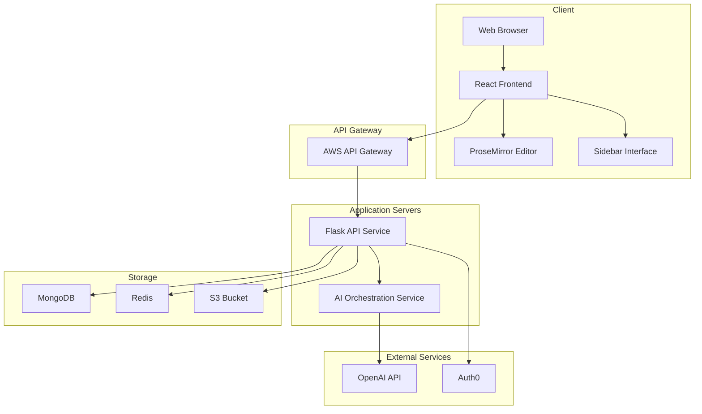
```mermaid
graph TD
    subgraph "Client"
        A[Web Browser] --> B[React Frontend]
        B --> C[ProseMirror Editor]
        B --> D[Sidebar Interface]
    end
    
    subgraph "API Gateway"
        E[AWS API Gateway]
    end
    
    subgraph "Application Servers"
        F[Flask API Service]
        G[AI Orchestration Service]
    end
    
    subgraph "Storage"
        H[MongoDB]
        I[Redis]
        J[S3 Bucket]
    end
    
    subgraph "External Services"
        K[OpenAI API]
        L[Auth0]
    end
    
    B --> E
    E --> F
    F --> G
    G --> K
    F --> H
    F --> I
    F --> J
    F --> L
```

### DATA FLOW DIAGRAM

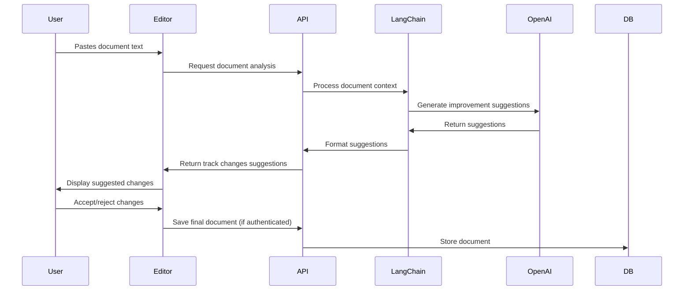
```mermaid
sequenceDiagram
    participant User
    participant Editor
    participant API
    participant LangChain
    participant OpenAI
    participant DB
    
    User->>Editor: Pastes document text
    Editor->>API: Request document analysis
    API->>LangChain: Process document context
    LangChain->>OpenAI: Generate improvement suggestions
    OpenAI->>LangChain: Return suggestions
    LangChain->>API: Format suggestions
    API->>Editor: Return track changes suggestions
    Editor->>User: Display suggested changes
    User->>Editor: Accept/reject changes
    Editor->>API: Save final document (if authenticated)
    API->>DB: Store document
```

### DEPLOYMENT PIPELINE

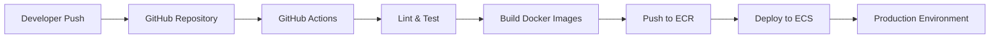
```mermaid
graph LR
    A[Developer Push] --> B[GitHub Repository]
    B --> C[GitHub Actions]
    C --> D[Lint & Test]
    D --> E[Build Docker Images]
    E --> F[Push to ECR]
    F --> G[Deploy to ECS]
    G --> H[Production Environment]
```

## 4. PROCESS FLOWCHART

### SYSTEM WORKFLOWS

#### Core Business Processes

##### Document Creation and Editing Workflow

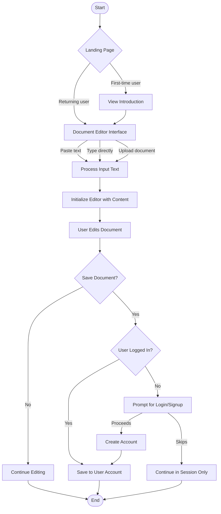
```mermaid
flowchart TD
    A([Start]) --> B{Landing Page}
    B -->|First-time user| C[View Introduction]
    B -->|Returning user| D[Document Editor Interface]
    C --> D
    D -->|Paste text| E[Process Input Text]
    D -->|Type directly| E
    D -->|Upload document| E
    E --> F[Initialize Editor with Content]
    F --> G[User Edits Document]
    G --> H{Save Document?}
    H -->|Yes| I{User Logged In?}
    I -->|Yes| J[Save to User Account]
    I -->|No| K[Prompt for Login/Signup]
    K -->|Proceeds| L[Create Account]
    K -->|Skips| M[Continue in Session Only]
    L --> J
    H -->|No| N[Continue Editing]
    N --> Z([End])
    J --> Z
    M --> Z
```

##### AI Suggestion Workflow

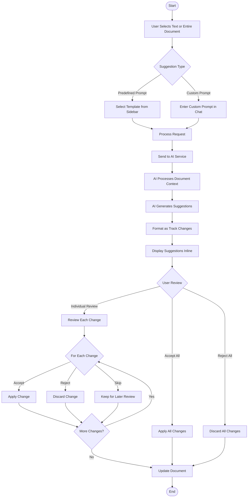
```mermaid
flowchart TD
    A([Start]) --> B[User Selects Text or Entire Document]
    B --> C{Suggestion Type}
    C -->|Predefined Prompt| D[Select Template from Sidebar]
    C -->|Custom Prompt| E[Enter Custom Prompt in Chat]
    D --> F[Process Request]
    E --> F
    F --> G[Send to AI Service]
    G --> H[AI Processes Document Context]
    H --> I[AI Generates Suggestions]
    I --> J[Format as Track Changes]
    J --> K[Display Suggestions Inline]
    K --> L{User Review}
    L -->|Accept All| M[Apply All Changes]
    L -->|Reject All| N[Discard All Changes]
    L -->|Individual Review| O[Review Each Change]
    O --> P{For Each Change}
    P -->|Accept| Q[Apply Change]
    P -->|Reject| R[Discard Change]
    P -->|Skip| S[Keep for Later Review]
    Q --> T{More Changes?}
    R --> T
    S --> T
    T -->|Yes| P
    T -->|No| U[Update Document]
    M --> U
    N --> U
    U --> V([End])
```

##### User Account Workflow

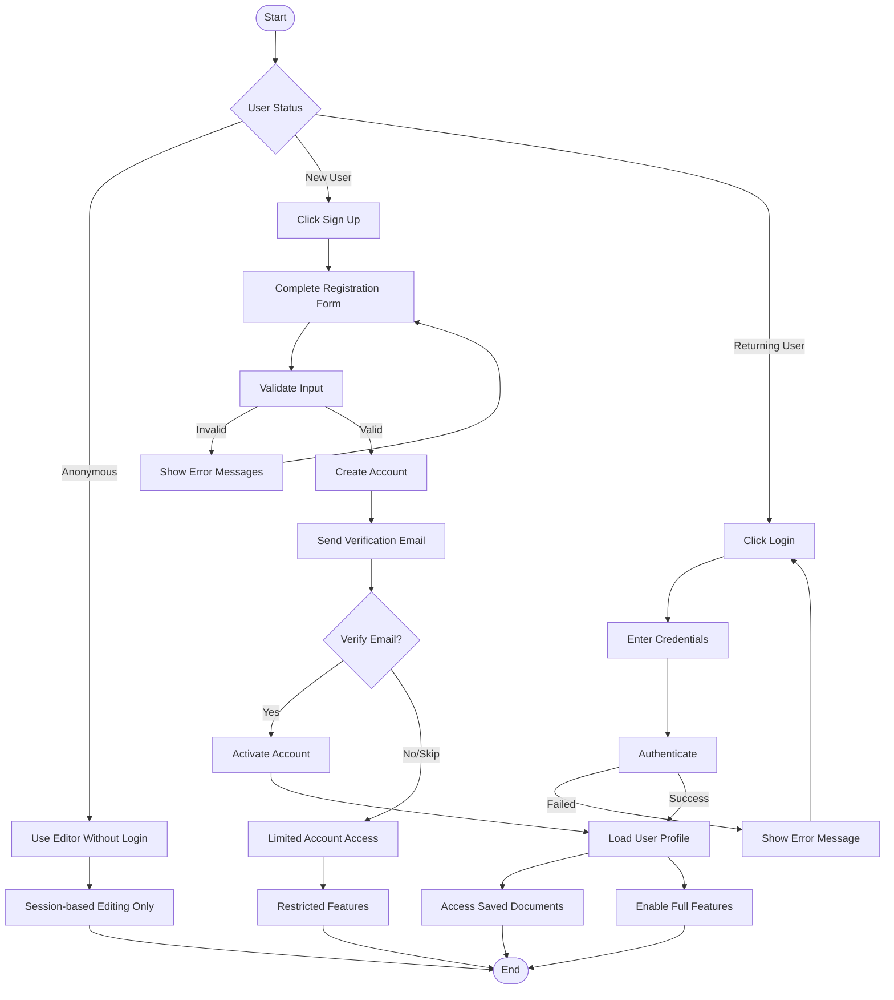
```mermaid
flowchart TD
    A([Start]) --> B{User Status}
    B -->|Anonymous| C[Use Editor Without Login]
    B -->|New User| D[Click Sign Up]
    B -->|Returning User| E[Click Login]
    D --> F[Complete Registration Form]
    F --> G[Validate Input]
    G -->|Invalid| H[Show Error Messages]
    H --> F
    G -->|Valid| I[Create Account]
    I --> J[Send Verification Email]
    E --> K[Enter Credentials]
    K --> L[Authenticate]
    L -->|Failed| M[Show Error Message]
    M --> E
    L -->|Success| N[Load User Profile]
    J --> O{Verify Email?}
    O -->|Yes| P[Activate Account]
    O -->|No/Skip| Q[Limited Account Access]
    P --> N
    Q --> R[Restricted Features]
    N --> S[Access Saved Documents]
    N --> T[Enable Full Features]
    C --> U[Session-based Editing Only]
    R --> V([End])
    S --> V
    T --> V
    U --> V
```

##### Error Handling Path

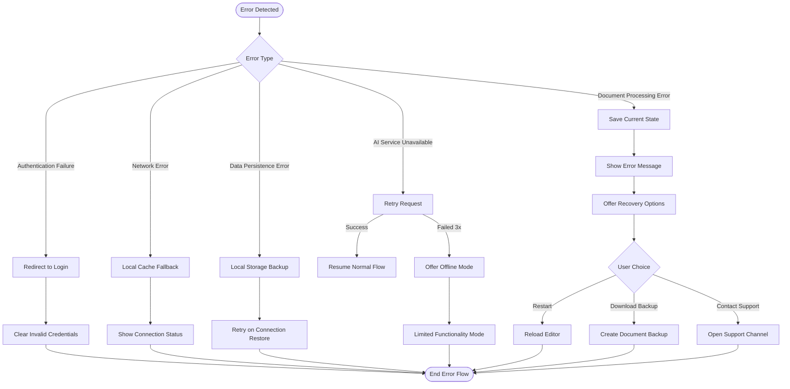
```mermaid
flowchart TD
    A([Error Detected]) --> B{Error Type}
    B -->|AI Service Unavailable| C[Retry Request]
    B -->|Document Processing Error| D[Save Current State]
    B -->|Authentication Failure| E[Redirect to Login]
    B -->|Network Error| F[Local Cache Fallback]
    B -->|Data Persistence Error| G[Local Storage Backup]
    C -->|Success| H[Resume Normal Flow]
    C -->|Failed 3x| I[Offer Offline Mode]
    D --> J[Show Error Message]
    J --> K[Offer Recovery Options]
    E --> L[Clear Invalid Credentials]
    F --> M[Show Connection Status]
    G --> N[Retry on Connection Restore]
    I --> O[Limited Functionality Mode]
    K --> P{User Choice}
    P -->|Restart| Q[Reload Editor]
    P -->|Download Backup| R[Create Document Backup]
    P -->|Contact Support| S[Open Support Channel]
    L --> T([End Error Flow])
    M --> T
    N --> T
    O --> T
    Q --> T
    R --> T
    S --> T
```

#### Integration Workflows

##### AI Service Integration Flow

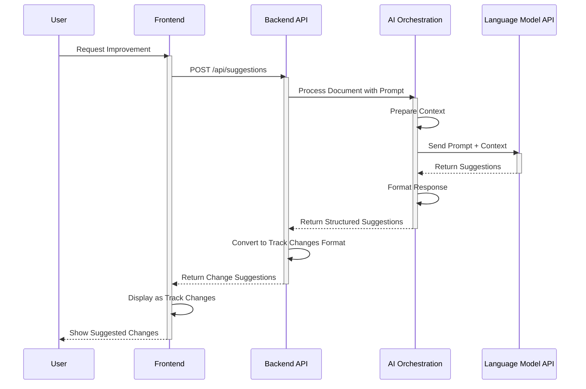
```mermaid
sequenceDiagram
    participant U as User
    participant FE as Frontend
    participant BE as Backend API
    participant AI as AI Orchestration
    participant LLM as Language Model API

    U->>FE: Request Improvement
    activate FE
    FE->>BE: POST /api/suggestions
    activate BE
    BE->>AI: Process Document with Prompt
    activate AI
    AI->>AI: Prepare Context
    AI->>LLM: Send Prompt + Context
    activate LLM
    LLM-->>AI: Return Suggestions
    deactivate LLM
    AI->>AI: Format Response
    AI-->>BE: Return Structured Suggestions
    deactivate AI
    BE->>BE: Convert to Track Changes Format
    BE-->>FE: Return Change Suggestions
    deactivate BE
    FE->>FE: Display as Track Changes
    FE-->>U: Show Suggested Changes
    deactivate FE
```

##### Document Storage Integration Flow

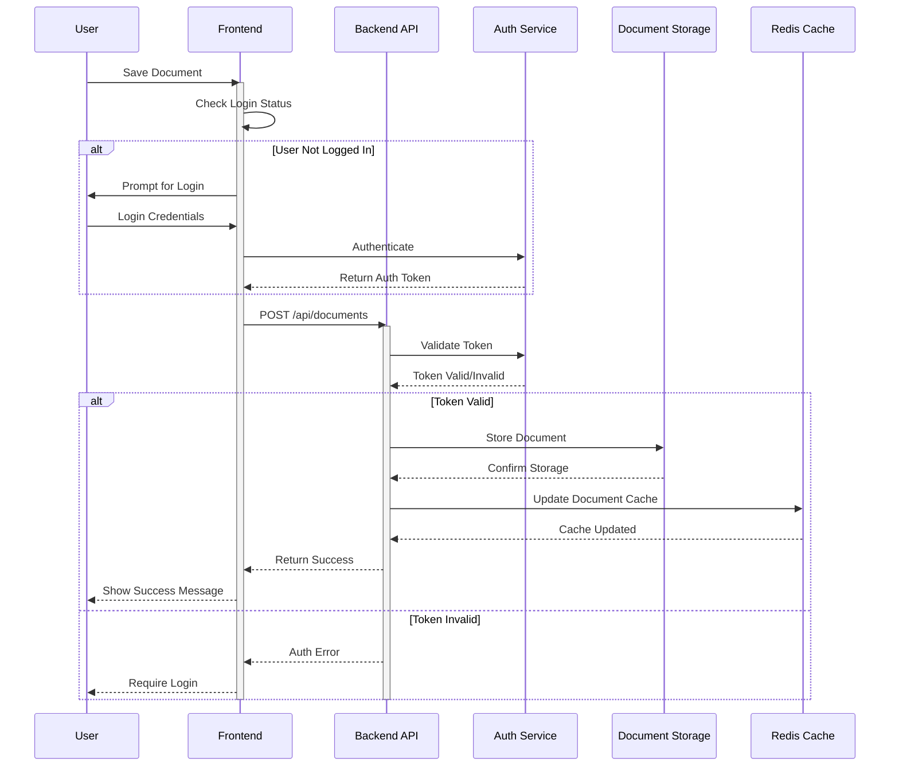
```mermaid
sequenceDiagram
    participant U as User
    participant FE as Frontend
    participant BE as Backend API
    participant Auth as Auth Service
    participant DB as Document Storage
    participant Cache as Redis Cache

    U->>FE: Save Document
    activate FE
    FE->>FE: Check Login Status
    
    alt User Not Logged In
        FE->>U: Prompt for Login
        U->>FE: Login Credentials
        FE->>Auth: Authenticate
        Auth-->>FE: Return Auth Token
    end
    
    FE->>BE: POST /api/documents
    activate BE
    BE->>Auth: Validate Token
    Auth-->>BE: Token Valid/Invalid
    
    alt Token Valid
        BE->>DB: Store Document
        DB-->>BE: Confirm Storage
        BE->>Cache: Update Document Cache
        Cache-->>BE: Cache Updated
        BE-->>FE: Return Success
        FE-->>U: Show Success Message
    else Token Invalid
        BE-->>FE: Auth Error
        FE-->>U: Require Login
    end
    deactivate BE
    deactivate FE
```

### FLOWCHART REQUIREMENTS

#### Document Editor User Journey

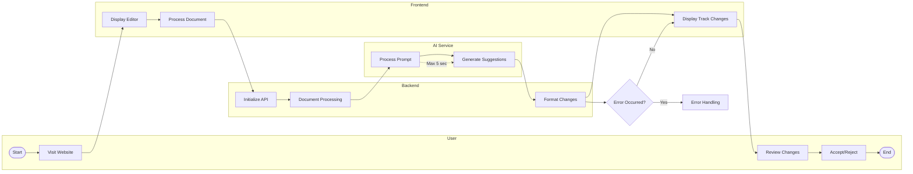
```mermaid
flowchart LR
    subgraph User
        A([Start]) --> B[Visit Website]
        Z[Review Changes] --> AA[Accept/Reject]
        AA --> AB([End])
    end
    
    subgraph Frontend
        C[Display Editor]
        D[Process Document]
        X[Display Track Changes]
    end
    
    subgraph Backend
        E[Initialize API]
        F[Document Processing]
        W[Format Changes]
    end
    
    subgraph "AI Service"
        G[Process Prompt]
        V[Generate Suggestions]
    end
    
    B --> C
    C --> D
    D --> E
    E --> F
    F --> G
    G --> V
    V --> W
    W --> X
    X --> Z
    
    %% Decision points
    Y{Error Occurred?} --> |Yes| ZZ[Error Handling]
    Y --> |No| X
    W --> Y
    
    %% SLA timing indicator
    G -.->|"Max 5 sec"| V
```

#### Validation Rules and Business Logic

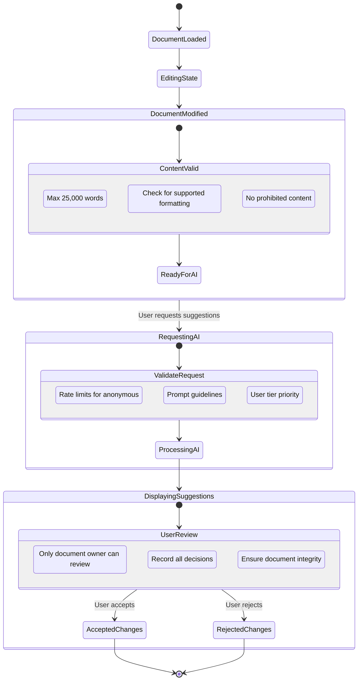
```mermaid
stateDiagram-v2
    [*] --> DocumentLoaded
    DocumentLoaded --> EditingState
    EditingState --> DocumentModified
    
    state DocumentModified {
        [*] --> ContentValid
        ContentValid --> ReadyForAI
        
        state ContentValid {
            ValidateLength: Max 25,000 words
            ValidateFormat: Check for supported formatting
            ValidateContent: No prohibited content
        }
    }
    
    DocumentModified --> RequestingAI: User requests suggestions
    
    state RequestingAI {
        [*] --> ValidateRequest
        ValidateRequest --> ProcessingAI
        
        state ValidateRequest {
            CheckAuth: Rate limits for anonymous
            CheckPrompt: Prompt guidelines
            CheckPriority: User tier priority
        }
    }
    
    ProcessingAI --> DisplayingSuggestions
    
    state DisplayingSuggestions {
        [*] --> UserReview
        UserReview --> AcceptedChanges: User accepts
        UserReview --> RejectedChanges: User rejects
        
        state UserReview {
            ReviewAccess: Only document owner can review
            ChangeTracking: Record all decisions
            ValidateChanges: Ensure document integrity
        }
    }
    
    AcceptedChanges --> [*]
    RejectedChanges --> [*]
```

### TECHNICAL IMPLEMENTATION

#### State Management Flow

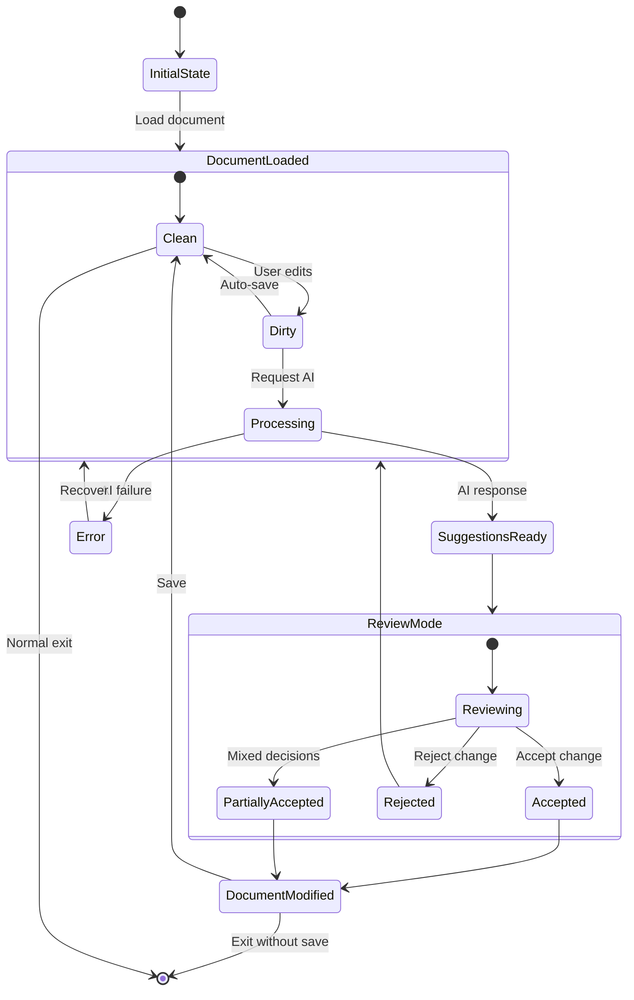
```mermaid
stateDiagram-v2
    [*] --> InitialState
    InitialState --> DocumentLoaded: Load document
    
    state DocumentLoaded {
        [*] --> Clean
        Clean --> Dirty: User edits
        Dirty --> Clean: Auto-save
        Dirty --> Processing: Request AI
    }
    
    Processing --> SuggestionsReady: AI response
    Processing --> Error: AI failure
    Error --> DocumentLoaded: Recover
    
    SuggestionsReady --> ReviewMode
    
    state ReviewMode {
        [*] --> Reviewing
        Reviewing --> Accepted: Accept change
        Reviewing --> Rejected: Reject change
        Reviewing --> PartiallyAccepted: Mixed decisions
    }
    
    Accepted --> DocumentModified
    Rejected --> DocumentLoaded
    PartiallyAccepted --> DocumentModified
    
    DocumentModified --> Clean: Save
    DocumentModified --> [*]: Exit without save
    
    Clean --> [*]: Normal exit
```

#### Error Handling and Recovery

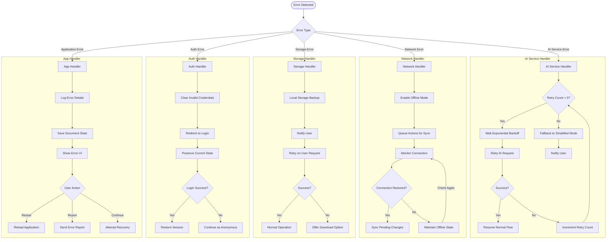
```mermaid
flowchart TD
A([Error Detected]) --> B{Error Type}

B -->|AI Service Error| C[AI Service Handler]
B -->|Network Error| D[Network Handler]
B -->|Storage Error| E[Storage Handler]
B -->|Auth Error| F[Auth Handler]
B -->|Application Error| G[App Handler]

subgraph AIServiceHandler [AI Service Handler]
    C --> C1{Retry Count < 3?}
    C1 -->|Yes| C2[Wait Exponential Backoff]
    C2 --> C3[Retry AI Request]
    C3 --> C4{Success?}
    C4 -->|Yes| C5[Resume Normal Flow]
    C4 -->|No| C6[Increment Retry Count]
    C6 --> C1
    C1 -->|No| C7[Fallback to Simplified Mode]
    C7 --> C8[Notify User]
end

subgraph NetworkHandler [Network Handler]
    D --> D1[Enable Offline Mode]
    D1 --> D2[Queue Actions for Sync]
    D2 --> D3[Monitor Connection]
    D3 --> D4{Connection Restored?}
    D4 -->|Yes| D5[Sync Pending Changes]
    D4 -->|No| D6[Maintain Offline State]
    D6 -->|Check Again| D3
end

subgraph StorageHandler [Storage Handler]
    E --> E1[Local Storage Backup]
    E1 --> E2[Notify User]
    E2 --> E3[Retry on User Request]
    E3 --> E4{Success?}
    E4 -->|Yes| E5[Normal Operation]
    E4 -->|No| E6[Offer Download Option]
end

subgraph AuthHandler [Auth Handler]
    F --> F1[Clear Invalid Credentials]
    F1 --> F2[Redirect to Login]
    F2 --> F3[Preserve Current State]
    F3 --> F4{Login Success?}
    F4 -->|Yes| F5[Restore Session]
    F4 -->|No| F6[Continue as Anonymous]
end

subgraph AppHandler [App Handler]
    G --> G1[Log Error Details]
    G1 --> G2[Save Document State]
    G2 --> G3[Show Error UI]
    G3 --> G4{User Action}
    G4 -->|Restart| G5[Reload Application]
    G4 -->|Report| G6[Send Error Report]
    G4 -->|Continue| G7[Attempt Recovery]
end
```

### DETAILED PROCESS FLOWS

#### Document Input and Processing Flow

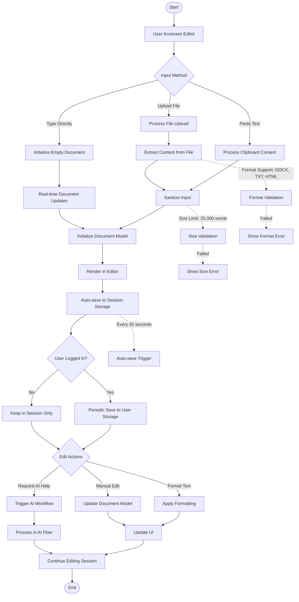
```mermaid
flowchart TD
    A([Start]) --> B[User Accesses Editor]
    B --> C{Input Method}
    C -->|Paste Text| D[Process Clipboard Content]
    C -->|Type Directly| E[Initialize Empty Document]
    C -->|Upload File| F[Process File Upload]
    
    D --> G[Sanitize Input]
    E --> H[Real-time Document Updates]
    F --> I[Extract Content from File]
    
    G --> J[Initialize Document Model]
    H --> J
    I --> G
    
    J --> K[Render in Editor]
    K --> L[Auto-save to Session Storage]
    
    L --> M{User Logged In?}
    M -->|Yes| N[Periodic Save to User Storage]
    M -->|No| O[Keep in Session Only]
    
    N --> P{Edit Actions}
    O --> P
    
    P -->|Format Text| Q[Apply Formatting]
    P -->|Request AI Help| R[Trigger AI Workflow]
    P -->|Manual Edit| S[Update Document Model]
    
    Q --> T[Update UI]
    R --> U[Process in AI Flow]
    S --> T
    
    T --> V[Continue Editing Session]
    U --> V
    V --> W([End])
    
    %% Validations and constraints
    G -.->|"Size Limit: 25,000 words"| G1[Size Validation]
    G1 -.->|"Failed"| G2[Show Size Error]
    I -.->|"Format Support: DOCX, TXT, HTML"| I1[Format Validation]
    I1 -.->|"Failed"| I2[Show Format Error]
    L -.->|"Every 30 seconds"| L1[Auto-save Trigger]
```

#### AI Suggestion Generation and Review Flow

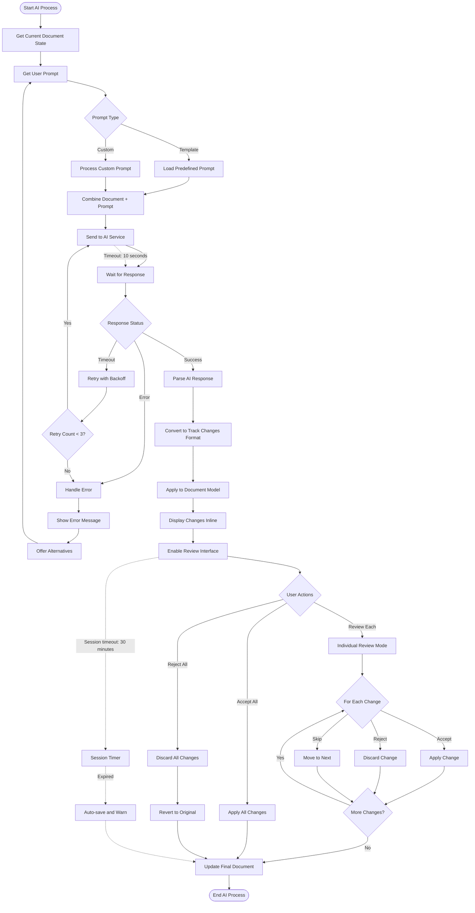
```mermaid
flowchart TD
    A([Start AI Process]) --> B[Get Current Document State]
    B --> C[Get User Prompt]

    C --> D{Prompt Type}
    D -->|Template| E[Load Predefined Prompt]
    D -->|Custom| F[Process Custom Prompt]

    E --> G[Combine Document + Prompt]
    F --> G

    G --> H[Send to AI Service]
    H --> I[Wait for Response]
    I --> J{Response Status}

    J -->|Success| K[Parse AI Response]
    J -->|Timeout| L[Retry with Backoff]
    J -->|Error| M[Handle Error]

    L --> N{Retry Count < 3?}
    N -->|Yes| H
    N -->|No| M

    K --> O[Convert to Track Changes Format]
    O --> P[Apply to Document Model]
    P --> Q[Display Changes Inline]

    M --> R[Show Error Message]
    R --> S[Offer Alternatives]
    S --> C

    Q --> T[Enable Review Interface]
    T --> U{User Actions}

    U -->|Accept All| V[Apply All Changes]
    U -->|Reject All| W[Discard All Changes]
    U -->|Review Each| X[Individual Review Mode]

    X --> Y{For Each Change}
    Y -->|Accept| Z[Apply Change]
    Y -->|Reject| AA[Discard Change]
    Y -->|Skip| AB[Move to Next]

    Z --> AC{More Changes?}
    AA --> AC
    AB --> AC

    AC -->|Yes| Y
    AC -->|No| AD[Update Final Document]

    V --> AD
    W --> AE[Revert to Original]
    AE --> AD

    AD --> AF([End AI Process])

    T1[Session Timer]
    T2[Auto-save and Warn]

    H -. Timeout: 10 seconds .-> I
    T -. Session timeout: 30 minutes .-> T1
    T1 -. Expired .-> T2
    T2 -.-> AD
```

#### User Authentication and Document Management Flow

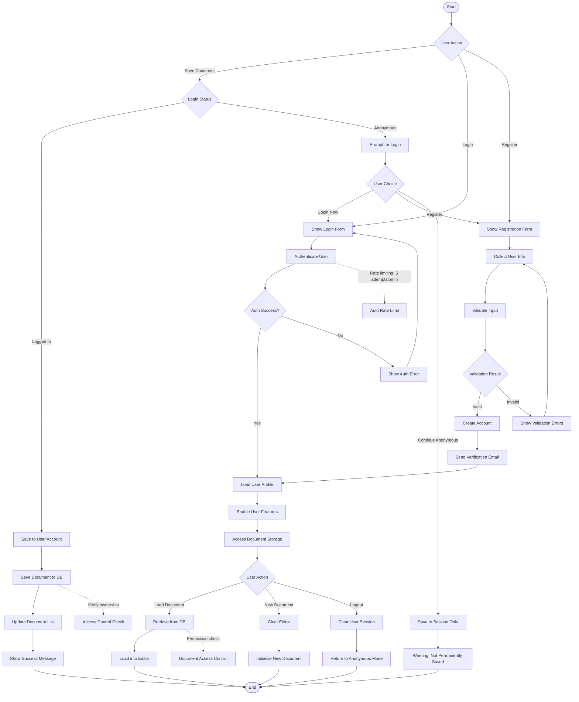
```mermaid
flowchart TD
    A([Start]) --> B{User Action}
    
    B -->|Save Document| C{Login Status}
    B -->|Login| D[Show Login Form]
    B -->|Register| E[Show Registration Form]
    
    C -->|Logged In| F[Save to User Account]
    C -->|Anonymous| G[Prompt for Login]
    
    G --> H{User Choice}
    H -->|Login Now| D
    H -->|Register| E
    H -->|Continue Anonymous| I[Save to Session Only]
    
    D --> J[Authenticate User]
    J --> K{Auth Success?}
    K -->|Yes| L[Load User Profile]
    K -->|No| M[Show Auth Error]
    M --> D
    
    E --> N[Collect User Info]
    N --> O[Validate Input]
    O --> P{Validation Result}
    P -->|Valid| Q[Create Account]
    P -->|Invalid| R[Show Validation Errors]
    R --> N
    
    Q --> S[Send Verification Email]
    S --> L
    
    L --> T[Enable User Features]
    T --> U[Access Document Storage]
    
    F --> V[Save Document to DB]
    V --> W[Update Document List]
    W --> X[Show Success Message]
    
    I --> Y[Warning: Not Permanently Saved]
    
    U --> Z{User Action}
    Z -->|Load Document| AA[Retrieve from DB]
    Z -->|New Document| AB[Clear Editor]
    Z -->|Logout| AC[Clear User Session]
    
    AA --> AD[Load into Editor]
    AB --> AE[Initialize New Document]
    AC --> AF[Return to Anonymous Mode]
    
    X --> AG([End])
    Y --> AG
    AD --> AG
    AE --> AG
    AF --> AG
    
    %% Security constraints
    J -.->|"Rate limiting: 5 attempts/5min"| J1[Auth Rate Limit]
    V -.->|"Verify ownership"| V1[Access Control Check]
    AA -.->|"Permission check"| AA1[Document Access Control]
```

### STATE TRANSITION DIAGRAM

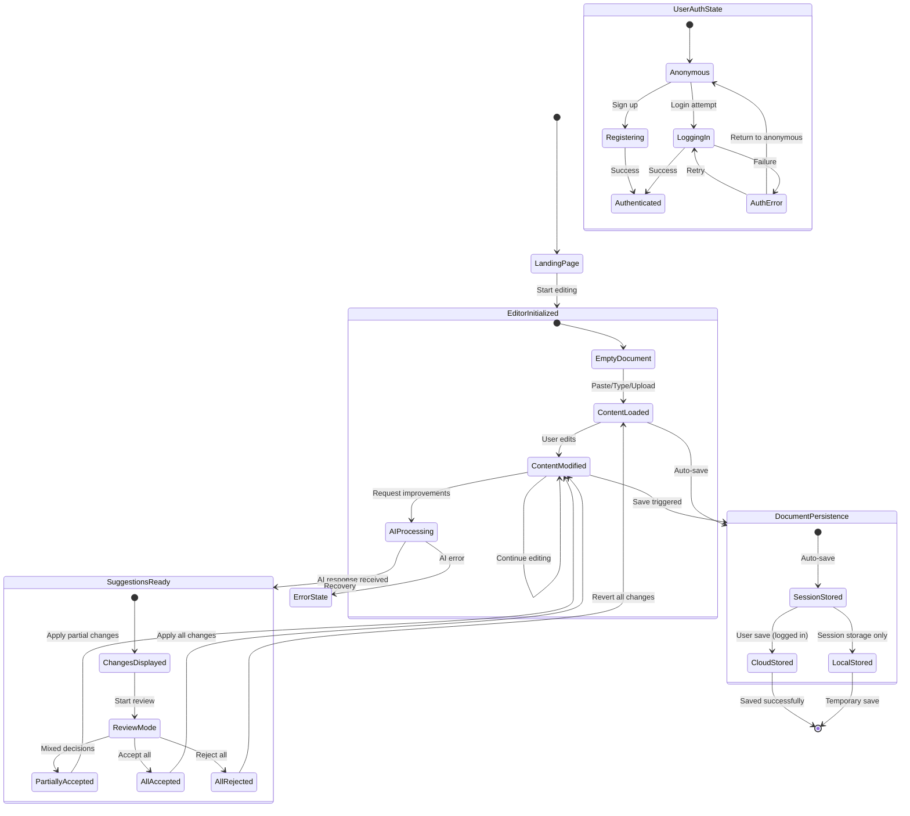
```mermaid
stateDiagram-v2
    [*] --> LandingPage
    
    LandingPage --> EditorInitialized: Start editing
    
    state EditorInitialized {
        [*] --> EmptyDocument
        EmptyDocument --> ContentLoaded: Paste/Type/Upload
        ContentLoaded --> ContentModified: User edits
        ContentModified --> ContentModified: Continue editing
        ContentModified --> AIProcessing: Request improvements
    }
    
    AIProcessing --> SuggestionsReady: AI response received
    AIProcessing --> ErrorState: AI error
    ErrorState --> EditorInitialized: Recovery
    
    state SuggestionsReady {
        [*] --> ChangesDisplayed
        ChangesDisplayed --> ReviewMode: Start review
        ReviewMode --> PartiallyAccepted: Mixed decisions
        ReviewMode --> AllAccepted: Accept all
        ReviewMode --> AllRejected: Reject all
    }
    
    PartiallyAccepted --> ContentModified: Apply partial changes
    AllAccepted --> ContentModified: Apply all changes
    AllRejected --> ContentLoaded: Revert all changes
    
    state DocumentPersistence {
        [*] --> SessionStored: Auto-save
        SessionStored --> CloudStored: User save (logged in)
        SessionStored --> LocalStored: Session storage only
    }
    
    ContentModified --> DocumentPersistence: Save triggered
    ContentLoaded --> DocumentPersistence: Auto-save
    
    CloudStored --> [*]: Saved successfully
    LocalStored --> [*]: Temporary save
    
    state UserAuthState {
        [*] --> Anonymous
        Anonymous --> LoggingIn: Login attempt
        LoggingIn --> Authenticated: Success
        LoggingIn --> AuthError: Failure
        AuthError --> Anonymous: Return to anonymous
        AuthError --> LoggingIn: Retry
        Anonymous --> Registering: Sign up
        Registering --> Authenticated: Success
    }
```

## 5. SYSTEM ARCHITECTURE

### HIGH-LEVEL ARCHITECTURE

#### System Overview

The AI writing enhancement interface follows a modern web application architecture with a clear separation between the presentation, application, and data layers. The architecture employs a client-heavy model with stateful frontend components connected to stateless backend services through RESTful APIs. This architecture was chosen to provide immediate user feedback while leveraging cloud-based AI services for advanced language processing.

Key architectural principles include:
- Clean separation between rich document editing (client) and AI processing (server)
- Stateless backend services for horizontal scalability
- Client-side state management for responsiveness and offline capability
- Event-driven communication between components
- Progressive enhancement for core functionality without login
- Secure document processing with privacy controls

The system boundaries encompass the browser-based frontend application, RESTful backend services, AI integration layer, and secure document storage. Major interfaces include the document editing UI, track changes interface, AI suggestion sidebar, and user account management screens.

#### Core Components Table

| Component Name | Primary Responsibility | Key Dependencies | Critical Considerations |
|----------------|------------------------|------------------|-------------------------|
| Document Editor | Provides rich text editing with track changes capability | ProseMirror, React | Text differencing performance, rendering efficiency |
| AI Suggestion Service | Processes document content with LLM to generate improvements | OpenAI/ChatGPT API, Langchain | Token optimization, prompt engineering, context management |
| Sidebar Interface | Manages user interaction with AI including templates and chat | React, Redux state | Context preservation, real-time updates, input validation |
| User Management | Handles authentication, profiles, and session management | Auth service, JWT | Anonymous sessions, secure transitions, data privacy |
| Document Storage | Manages persistent storage and retrieval of documents | MongoDB, Redis | Versioning, conflict resolution, access control |
| Track Changes Engine | Compares original and modified text to display differences | Diff libraries, ProseMirror | Large document performance, accuracy of change detection |

#### Data Flow Description

The primary data flow begins when a user inputs a document through pasting, typing, or uploading. This document is processed and normalized in the client's Document Editor component, which maintains the current document state. When the user requests improvements through the Sidebar Interface (either via templates or custom prompts), a structured request containing the document content, selected text (if applicable), and improvement directives is sent to the AI Suggestion Service.

The AI Suggestion Service transforms this request into an optimized prompt for the language model, preserving necessary context while managing token limits. The service communicates with external AI providers through secure API calls and receives improvement suggestions in return. These suggestions are then processed into a structured format compatible with the Track Changes Engine.

The Track Changes Engine applies a differencing algorithm to identify specific changes between the original and AI-suggested content. These differences are presented to the user as inline suggestions that can be individually reviewed. User decisions (accept/reject) are captured by the Document Editor and immediately reflected in the document state.

For authenticated users, document states and versions are periodically synchronized with the Document Storage service, which maintains persistent records. Anonymous users' documents are preserved only in browser session storage with appropriate warnings about potential data loss.

#### External Integration Points

| System Name | Integration Type | Data Exchange Pattern | Protocol/Format | SLA Requirements |
|-------------|------------------|------------------------|-----------------|------------------|
| OpenAI API | Service API | Request-Response | HTTPS/JSON | Response time < 5s, 99.9% availability |
| Authentication Service | Service API | Request-Response | HTTPS/JWT | Response time < 1s, 99.99% availability |
| Object Storage | Data Persistence | CRUD Operations | HTTPS/JSON | Response time < 2s, 99.95% availability |
| Analytics Service | Data Reporting | Event Streaming | HTTPS/JSON | Best effort delivery, non-blocking |

### COMPONENT DETAILS

#### Document Editor Component

**Purpose and Responsibilities:**
- Provide a Microsoft Word-like editing experience in the browser
- Maintain document state and handle user text modifications
- Render suggested changes in a track changes interface
- Support basic text formatting and structure
- Enable selection of content for targeted improvement requests

**Technologies and Frameworks:**
- ProseMirror as the core document model and editor framework
- React for component rendering and state management
- Redux for global state management
- Differential text comparison libraries for change tracking

**Key Interfaces and APIs:**
- Document state management API for content updates
- Change tracking interface for rendering and processing suggestions
- Selection API for identifying text for targeted improvements
- Formatting API for basic text styling

**Data Persistence Requirements:**
- Client-side state persistence in browser memory
- Periodic snapshots to session storage for recovery
- Optional synchronization with server storage for authenticated users

**Scaling Considerations:**
- Efficient rendering of large documents with many tracked changes
- Memory usage optimization for browser environment
- Pagination or virtualization for extremely large documents

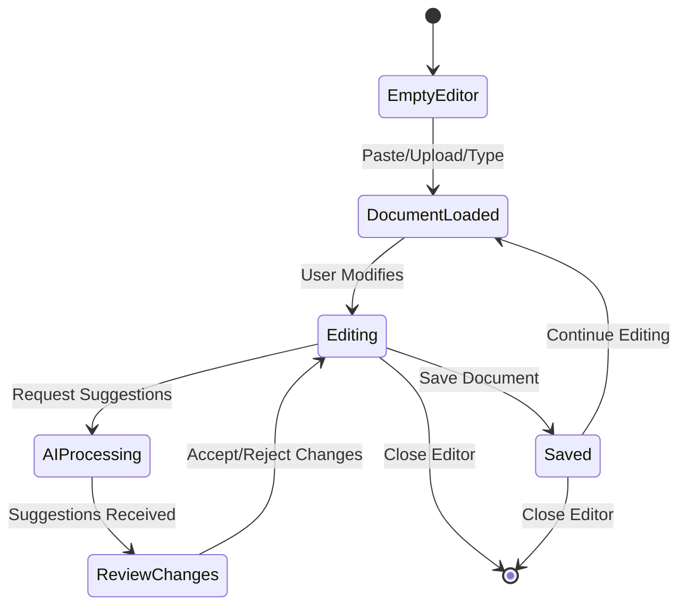
```mermaid
stateDiagram-v2
    [*] --> EmptyEditor
    EmptyEditor --> DocumentLoaded: Paste/Upload/Type
    DocumentLoaded --> Editing: User Modifies
    Editing --> AIProcessing: Request Suggestions
    AIProcessing --> ReviewChanges: Suggestions Received
    ReviewChanges --> Editing: Accept/Reject Changes
    Editing --> Saved: Save Document
    Saved --> DocumentLoaded: Continue Editing
    Editing --> [*]: Close Editor
    Saved --> [*]: Close Editor
```

#### AI Suggestion Service

**Purpose and Responsibilities:**
- Process document content and user prompts into optimal AI requests
- Communicate with external language model services
- Transform AI responses into structured suggestion formats
- Manage context and token limitations
- Provide template-based and free-form improvement capabilities

**Technologies and Frameworks:**
- Python with Flask for API endpoints
- Langchain for AI orchestration and context management
- OpenAI client libraries for API communication
- Text processing utilities for preparation and post-processing

**Key Interfaces and APIs:**
- `/api/suggestions` endpoint for document improvement requests
- `/api/chat` endpoint for free-form interactions
- Template management interface for predefined prompts
- Context management interface for maintaining document state

**Data Persistence Requirements:**
- Short-term caching of similar requests for performance
- No long-term storage of document content after processing
- Logging of anonymized performance metrics and error patterns

**Scaling Considerations:**
- Horizontal scaling for concurrent request handling
- Request queuing for high traffic periods
- Token budget management per request
- Rate limiting and fair usage policies

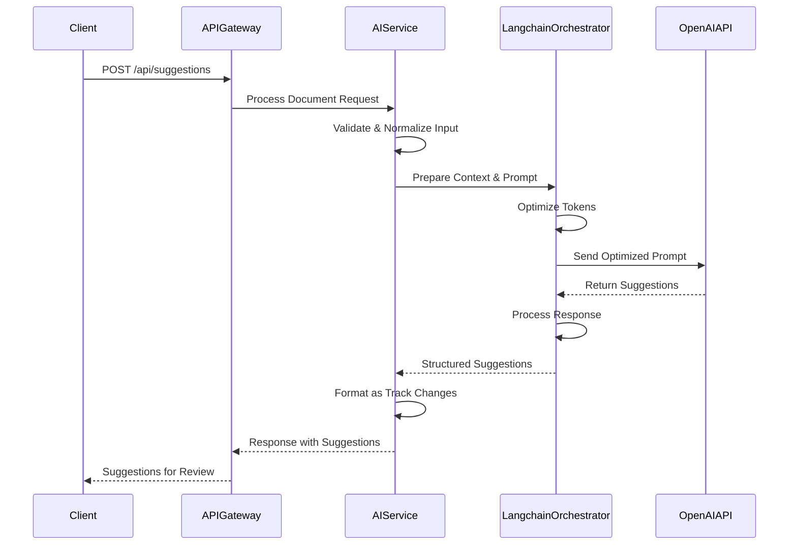
```mermaid
sequenceDiagram
    participant Client
    participant APIGateway
    participant AIService
    participant LangchainOrchestrator
    participant OpenAIAPI

    Client->>APIGateway: POST /api/suggestions
    APIGateway->>AIService: Process Document Request
    AIService->>AIService: Validate & Normalize Input
    AIService->>LangchainOrchestrator: Prepare Context & Prompt
    LangchainOrchestrator->>LangchainOrchestrator: Optimize Tokens
    LangchainOrchestrator->>OpenAIAPI: Send Optimized Prompt
    OpenAIAPI-->>LangchainOrchestrator: Return Suggestions
    LangchainOrchestrator->>LangchainOrchestrator: Process Response
    LangchainOrchestrator-->>AIService: Structured Suggestions
    AIService->>AIService: Format as Track Changes
    AIService-->>APIGateway: Response with Suggestions
    APIGateway-->>Client: Suggestions for Review
```

#### User Management Component

**Purpose and Responsibilities:**
- Support both anonymous and authenticated user sessions
- Handle user registration and authentication
- Manage user profiles and preferences
- Control access to saved documents
- Facilitate secure transitions from anonymous to registered users

**Technologies and Frameworks:**
- JWT for stateless authentication
- Redis for session management
- Flask-Login or similar for authentication flows
- Password hashing with bcrypt

**Key Interfaces and APIs:**
- `/api/auth` endpoints for registration, login, and token refresh
- `/api/user` endpoints for profile management
- Session management interface for anonymous usage
- Account upgrade path from anonymous to registered

**Data Persistence Requirements:**
- Secure storage of user credentials with proper hashing
- Session data with appropriate expiration policies
- User preferences and settings
- Audit logs for security-relevant actions

**Scaling Considerations:**
- Session store distribution for multiple application instances
- Token validation without database hits
- Cache invalidation for user data updates
- Regional compliance with data protection regulations

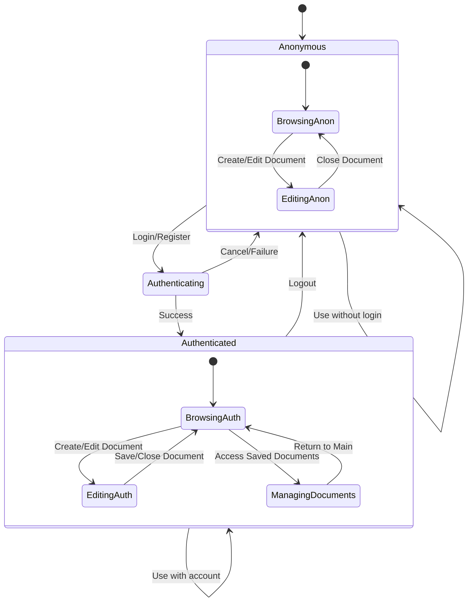
```mermaid
stateDiagram-v2
    [*] --> Anonymous
    Anonymous --> Anonymous: Use without login
    Anonymous --> Authenticating: Login/Register
    Authenticating --> Authenticated: Success
    Authenticating --> Anonymous: Cancel/Failure
    Authenticated --> Anonymous: Logout
    Authenticated --> Authenticated: Use with account
    
    state Anonymous {
        [*] --> BrowsingAnon
        BrowsingAnon --> EditingAnon: Create/Edit Document
        EditingAnon --> BrowsingAnon: Close Document
    }
    
    state Authenticated {
        [*] --> BrowsingAuth
        BrowsingAuth --> EditingAuth: Create/Edit Document
        EditingAuth --> BrowsingAuth: Save/Close Document
        BrowsingAuth --> ManagingDocuments: Access Saved Documents
        ManagingDocuments --> BrowsingAuth: Return to Main
    }
```

#### Track Changes Engine

**Purpose and Responsibilities:**
- Compare original and suggested text to identify specific changes
- Generate a structured representation of additions, deletions, and modifications
- Render changes visually in the document with appropriate styling
- Provide acceptance/rejection mechanisms for individual changes
- Maintain document integrity during the review process

**Technologies and Frameworks:**
- Diff-match-patch or similar text differencing library
- ProseMirror change tracking extensions
- React components for change visualization
- Event system for change acceptance/rejection

**Key Interfaces and APIs:**
- Text differencing API for change detection
- Change rendering interface for visual presentation
- Change management API for accepting/rejecting modifications
- Document state update API for applying decisions

**Data Persistence Requirements:**
- Temporary storage of original and suggested versions
- Change decision history for the current session
- No permanent storage of rejected suggestions

**Scaling Considerations:**
- Performance optimization for large documents
- Incremental updating for partial document changes
- Memory management for documents with many changes

```mermaid
sequenceDiagram
    participant Editor
    participant DiffEngine
    participant TrackChanges
    participant UIRenderer

    Editor->>DiffEngine: Original & Suggested Text
    DiffEngine->>DiffEngine: Compute Differences
    DiffEngine->>TrackChanges: Structured Changes
    TrackChanges->>TrackChanges: Process Change Metadata
    TrackChanges->>UIRenderer: Change Rendering Instructions
    UIRenderer->>Editor: Display Changes with Controls
    
    Note over Editor,UIRenderer: User Reviews Changes
    
    Editor->>TrackChanges: User Accepts Change X
    TrackChanges->>TrackChanges: Update Change Status
    TrackChanges->>Editor: Apply Change to Document
    Editor->>UIRenderer: Update Display
    
    Editor->>TrackChanges: User Rejects Change Y
    TrackChanges->>TrackChanges: Mark Change as Rejected
    TrackChanges->>Editor: Remove Change from Document
    Editor->>UIRenderer: Update Display
```

### TECHNICAL DECISIONS

#### Architecture Style Decisions

| Decision Area | Selected Approach | Alternatives Considered | Rationale |
|---------------|-------------------|-------------------------|-----------|
| Application Architecture | Single Page Application | Server-rendered, Hybrid | Provides best user experience for document editing with minimal latency after initial load |
| Backend Architecture | Modular Monolith with Service Boundaries | Microservices, Pure Monolith | Balances development velocity with service isolation while avoiding distributed system complexity for initial release |
| State Management | Client-heavy with Server Synchronization | Server-side State, Shared State | Enables offline-capable editing and immediate feedback while preserving data with server sync |
| AI Integration | Asynchronous Request-Response with Streaming Option | Synchronous Calls, WebSocket | Accommodates variable LLM response times while allowing progressive rendering of suggestions for large documents |

The architecture balances several competing concerns. The client-heavy approach with rich document editing capabilities provides the responsiveness needed for a word processor-like experience. The separation between editing and AI suggestion services allows for scalability where needed most (the computationally intensive AI operations) while keeping the user interface responsive.

The modular monolith approach for the backend services simplifies initial development and deployment while establishing clear service boundaries that could be separated into microservices if future scaling requires it. This approach avoids the complexity of distributed systems during initial development while preserving a path to scaling.

```mermaid
graph TD
    A[Architecture Decision] --> B{Deployment Model}
    B -->|Preferred| C[SPA with API Backend]
    B -->|Alternative| D[Server Rendered]
    B -->|Alternative| E[Desktop Application]
    
    C --> F{Backend Organization}
    F -->|Preferred| G[Modular Monolith]
    F -->|Alternative| H[Microservices]
    F -->|Alternative| I[Pure Monolith]
    
    G --> J{State Management}
    J -->|Preferred| K[Client State with Server Sync]
    J -->|Alternative| L[Server-Driven State]
    J -->|Alternative| M[Distributed State]
    
    K --> N{AI Integration}
    N -->|Preferred| O[Async with Streaming Option]
    N -->|Alternative| P[Synchronous API Calls]
    N -->|Alternative| Q[WebSocket Real-time]
```

#### Data Storage Solution Rationale

| Data Type | Selected Solution | Alternatives Considered | Rationale |
|-----------|-------------------|-------------------------|-----------|
| User Documents | MongoDB | PostgreSQL, S3 + Metadata DB | Document-oriented storage provides flexibility for varying document structures and metadata |
| User Profiles | MongoDB | PostgreSQL, DynamoDB | Consistency with document storage simplifies development and deployment |
| Session Data | Redis | In-memory, JWT-only | Fast access for frequent session operations with appropriate expiration handling |
| Application Logs | Structured Logging to CloudWatch | ELK Stack, Custom Solution | Managed service reduces operational burden while providing necessary analysis capabilities |

The document-oriented approach with MongoDB was selected as the primary data store due to the variable structure of documents and associated metadata. This provides flexibility for future enhancements without schema migrations. Redis complements this as a fast session store and caching layer for frequently accessed data.

For anonymous sessions, we use a combination of browser storage and server-side session data with appropriate TTLs. This balances immediate usability with reasonable resource usage. The JWT approach for authentication enables stateless authentication verification while Redis provides a central store for session invalidation when needed.

#### Caching Strategy Justification

| Cache Type | Implementation | Purpose | Invalidation Strategy |
|------------|----------------|---------|----------------------|
| Document Cache | Browser IndexedDB + Memory | Immediate access to recent documents | Time-based expiration, explicit clear |
| Session Cache | Redis | Fast authentication and session checks | TTL-based expiration, explicit logout |
| AI Response Cache | Redis | Reduce duplicate AI requests | Time-based with content hash keys |
| UI Component Cache | React Memo + Custom Hooks | Prevent expensive re-renders | Dependency-based invalidation |

Caching is critical for both performance and cost optimization with external AI services. Browser-side caching through IndexedDB provides offline capabilities and fast loading of recent documents. Server-side caching in Redis prevents redundant AI processing for similar requests, reducing both latency and API costs.

The document editor uses memory caching with strategic persistence to maintain editing performance while protecting against data loss. Careful cache invalidation strategies prevent stale data while maximizing cache hit rates.

#### Security Mechanism Selection

| Security Concern | Selected Mechanism | Alternatives Considered | Rationale |
|------------------|--------------------|-----------------------|-----------|
| Authentication | JWT with Short Expiry + Refresh | Session Cookies, OAuth-only | Balances statelessness for scaling with security and revocation capabilities |
| Authorization | Role-based Access Control | Attribute-based, Capability-based | Simpler implementation for initial requirements with clear permission model |
| Data Protection | TLS + Field-level Encryption for Sensitive Data | End-to-end Encryption, Full DB Encryption | Appropriate security level without excessive performance impact |
| AI Prompt Injection Prevention | Input Validation + Prompt Templates | LLM Guardrails Only, Manual Review | Defense in depth approach protects against various injection techniques |

Security mechanisms were selected based on the sensitive nature of user documents while balancing performance and usability requirements. TLS provides transport security while field-level encryption protects the most sensitive data at rest. JWT authentication enables stateless verification with the ability to revoke access when needed.

Special attention was given to AI prompt injection prevention due to the potential for data leakage or manipulation. A combination of input validation, template-based prompts, and LLM guardrails provides defense in depth against such attacks.

```mermaid
graph TD
    A[Security Decision] --> B{Authentication}
    B -->|Selected| C[JWT with Refresh]
    B -->|Alternative| D[Session Cookies]
    B -->|Alternative| E[OAuth Only]
    
    A --> F{Document Security}
    F -->|Selected| G[TLS + Field Encryption]
    F -->|Alternative| H[End-to-end Encryption]
    F -->|Alternative| I[Full DB Encryption]
    
    A --> J{AI Security}
    J -->|Selected| K[Input Validation + Templates]
    J -->|Alternative| L[LLM Guardrails Only]
    J -->|Alternative| M[Manual Review]
    
    C --> N[Short-lived Access Tokens]
    C --> O[Refresh Token Rotation]
    C --> P[Centralized Revocation]
    
    G --> Q[Transparent to Users]
    G --> R[Performance Optimized]
    G --> S[Selective Protection]
```

### CROSS-CUTTING CONCERNS

#### Monitoring and Observability Approach

The system implements a comprehensive monitoring strategy focusing on both user experience and system health. Key metrics are collected at multiple levels:

- **Frontend Monitoring:**
  - Page load and interaction timings
  - Error rates and types
  - Feature usage patterns
  - AI suggestion acceptance rates

- **Backend Monitoring:**
  - API response times and error rates
  - AI service latency and token usage
  - Database performance and query patterns
  - Authentication success/failure rates

- **Infrastructure Monitoring:**
  - Server resource utilization
  - Network performance and availability
  - Service health checks
  - Deployment status and history

Observability is implemented through distributed tracing with correlation IDs flowing through all system components. This enables end-to-end visibility of request flows, particularly for AI processing operations which may involve multiple services.

Alert thresholds are configured for critical paths with escalation procedures defined for different severity levels. A dashboard provides real-time visibility into system health and usage patterns.

#### Logging and Tracing Strategy

| Log Category | Content | Retention | Access Control |
|--------------|---------|-----------|----------------|
| Application Logs | Service operations, errors, warnings | 30 days | Developers, Operations |
| Security Logs | Authentication events, access patterns | 90 days | Security Team |
| User Activity Logs | Feature usage, document operations | 14 days | Product Team |
| Performance Traces | Timing data, resource usage | 7 days | Developers, Operations |

Logs are structured in JSON format with consistent fields across services. Each log entry includes:
- Timestamp with millisecond precision
- Correlation ID for request tracing
- Component and function identifier
- Event type and severity
- Anonymized user context when relevant
- Structured data relevant to the event

Personal or sensitive information is explicitly excluded from logs, with masking for any potentially identifying data. Logs are centralized in CloudWatch with appropriate IAM controls limiting access based on role and need.

#### Error Handling Patterns

The system implements a multi-layered approach to error handling:

- **User-Facing Errors:**
  - Friendly error messages with actionable guidance
  - Appropriate HTTP status codes for API errors
  - Automatic retry for transient failures when applicable
  - Graceful degradation of features when services are unavailable

- **Internal Error Management:**
  - Circuit breakers for external dependencies
  - Retry with exponential backoff for recoverable errors
  - Fallback strategies for critical functions
  - Dead letter queues for failed background operations

- **Error Reporting:**
  - Real-time error alerts for critical failures
  - Error aggregation and trending
  - Automated correlation with recent changes
  - User feedback collection on error encounters

```mermaid
flowchart TD
    A[Error Detected] --> B{Error Type}
    B -->|API Error| C[API Error Handler]
    B -->|UI Error| D[UI Error Handler]
    B -->|Network Error| E[Network Error Handler]
    B -->|AI Service Error| F[AI Error Handler]
    
    C --> G{Recoverable?}
    G -->|Yes| H[Retry with Backoff]
    G -->|No| I[Fail Gracefully]
    
    H --> J{Retry Succeeded?}
    J -->|Yes| K[Continue Operation]
    J -->|No| L[Show User Error]
    
    E --> M[Check Connection]
    M -->|Available| N[Retry Request]
    M -->|Unavailable| O[Enable Offline Mode]
    
    F --> P{Critical Function?}
    P -->|Yes| Q[Use Fallback Model]
    P -->|No| R[Disable Feature]
    
    I --> S[Log Details]
    L --> S
    O --> S
    Q --> S
    R --> S
    
    S --> T[Report to Monitoring]
```

#### Authentication and Authorization Framework

The system implements a layered authentication and authorization framework:

- **Anonymous Access:**
  - Immediate usability without login requirement
  - Session-based state management with browser storage
  - Clear indication of limited persistence
  - Seamless transition to authenticated state

- **User Authentication:**
  - Email/password with strong password requirements
  - Optional OAuth integration for social login
  - JWT-based access tokens with short lifetime
  - Refresh token rotation for extended sessions
  - Multi-factor authentication option for sensitive operations

- **Authorization Model:**
  - Role-based access control for administrative functions
  - Document-level permissions for shared content
  - Feature access based on user tier/subscription
  - API rate limiting differentiated by user type

- **Security Measures:**
  - CSRF protection for authenticated requests
  - XSS prevention through content sanitization
  - Rate limiting for authentication attempts
  - Session termination capabilities for security events

#### Performance Requirements and SLAs

| Component | Performance Metric | Target | Degraded | Critical |
|-----------|-------------------|--------|----------|----------|
| Page Load | Time to Interactive | < 2s | 2-5s | > 5s |
| Document Editor | Input Latency | < 50ms | 50-200ms | > 200ms |
| AI Processing | Suggestion Time | < 5s | 5-15s | > 15s |
| API Endpoints | Response Time | < 300ms | 300ms-1s | > 1s |
| Document Save | Operation Time | < 2s | 2-5s | > 5s |

Service Level Objectives (SLOs):
- System availability: 99.9% (excluding planned maintenance)
- API success rate: 99.95% for critical endpoints
- Max document size processing: 50,000 words
- Concurrent users supported: 1,000 minimum
- Data durability: 99.999% for saved documents

Error budgets are defined for each service component with incident response procedures triggered when thresholds are approached. Performance testing is conducted prior to each major release to ensure SLAs continue to be met as the system evolves.

#### Disaster Recovery Procedures

The system implements a comprehensive disaster recovery strategy:

- **Data Backup:**
  - Automated daily backups of all databases
  - Point-in-time recovery capability for the last 30 days
  - Geo-redundant storage of backup data
  - Regular backup restoration testing

- **High Availability:**
  - Multi-AZ deployment for critical components
  - Auto-scaling groups for application servers
  - Read replicas for database performance and failover
  - CDN for static asset delivery and caching

- **Recovery Procedures:**
  - Defined Recovery Time Objective (RTO): 1 hour
  - Defined Recovery Point Objective (RPO): 5 minutes
  - Automated failover for infrastructure components
  - Manual promotion procedures documented for database recovery
  - Communication templates for user notification

- **Business Continuity:**
  - Degraded mode operations defined for partial system availability
  - Critical path identification for prioritized recovery
  - Regular disaster recovery exercises and simulations
  - Incident response team with defined roles and responsibilities

## 6. SYSTEM COMPONENTS DESIGN

### COMPONENT ARCHITECTURE OVERVIEW

The system is designed with a modular architecture consisting of interconnected components that work together to provide the AI-powered writing enhancement experience. The following diagram illustrates the high-level component relationships:

```mermaid
graph TD
    A[User Interface Layer] --> B[Document Editor Component]
    A --> C[Sidebar Interface Component]
    B <--> D[Track Changes Component]
    C --> E[AI Prompt Interface Component]
    C --> F[Chat Interface Component]
    D <--> G[Document Management Component]
    E --> H[AI Service Integration Component]
    F --> H
    G <--> I[User Authentication Component]
    G <--> J[Storage Service Component]
    H <--> K[AI Provider Connector]
```

### CORE COMPONENTS

#### Document Editor Component

| Aspect | Description |
|--------|-------------|
| Purpose | Provides the main text editing interface where users interact with their documents |
| Key Functions | - Rich text editing and formatting<br>- Handling paste operations from external sources<br>- Displaying document content with tracked changes<br>- Managing selection and cursor position<br>- Rendering suggestions inline |
| Technologies | - ProseMirror for document model and editing<br>- React for component rendering<br>- ContentEditable HTML elements with custom handlers |
| Dependencies | - Track Changes Component<br>- Document Management Component |
| Technical Interfaces | - Document state management API<br>- Content selection API<br>- Formatting command API |

The Document Editor Component serves as the primary interface for text manipulation. It transforms raw content into an editable document model that supports the track changes functionality. The component maintains internal state for the current document while providing hooks for other components to integrate with the editing experience.

#### Sidebar Interface Component

| Aspect | Description |
|--------|-------------|
| Purpose | Houses the AI interaction tools in a collapsible panel adjacent to the document |
| Key Functions | - Organizing AI tooling in a contextual sidebar<br>- Switching between different interaction modes<br>- Displaying improvement templates<br>- Showing chat interface<br>- Providing document-level controls |
| Technologies | - React component system<br>- Context-aware state management<br>- Responsive layout system |
| Dependencies | - AI Prompt Interface Component<br>- Chat Interface Component |
| Technical Interfaces | - View state management API<br>- Component visibility controls<br>- Event communication with editor |

The Sidebar Interface Component provides the container for AI interaction tools while preserving maximum screen space for document editing. It implements responsive behaviors to adapt to different screen sizes and can be collapsed when not in use.

#### Track Changes Component

| Aspect | Description |
|--------|-------------|
| Purpose | Implements Microsoft Word-like suggestion display and review capabilities |
| Key Functions | - Highlighting suggested changes inline<br>- Showing additions, deletions, and modifications<br>- Providing accept/reject controls<br>- Managing change state<br>- Tracking change history |
| Technologies | - Text differencing algorithms<br>- Custom rendering system for change visualization<br>- Event-based change management |
| Dependencies | - Document Editor Component<br>- AI Service Integration Component |
| Technical Interfaces | - Change tracking API<br>- Change application API<br>- Change history API |

The Track Changes Component is responsible for the differencing logic and visual presentation of suggested changes. It provides a familiar Microsoft Word-like experience for reviewing and accepting AI suggestions directly within the document.

#### AI Prompt Interface Component

| Aspect | Description |
|--------|-------------|
| Purpose | Presents predefined improvement templates to guide AI enhancement |
| Key Functions | - Displaying categorized improvement templates<br>- Processing template selections<br>- Contextual suggestion of relevant templates<br>- Customization of template parameters<br>- Sending structured requests to AI service |
| Technologies | - Template rendering system<br>- Context-based recommendation logic<br>- Parameter input controls |
| Dependencies | - AI Service Integration Component<br>- Sidebar Interface Component |
| Technical Interfaces | - Template selection API<br>- Parameter configuration API<br>- AI request formatting API |

The AI Prompt Interface Component provides easy access to common improvement types through predefined templates like "Make it shorter" or "More professional tone," making AI capabilities accessible without requiring prompt engineering knowledge.

#### Chat Interface Component

| Aspect | Description |
|--------|-------------|
| Purpose | Enables free-form conversation with the AI assistant about the document |
| Key Functions | - Providing chat input and history display<br>- Managing conversation context<br>- Maintaining document context in conversation<br>- Formatting AI responses<br>- Converting chat suggestions to document changes |
| Technologies | - Chat UI components<br>- Conversation state management<br>- Context preservation mechanisms |
| Dependencies | - AI Service Integration Component<br>- Sidebar Interface Component |
| Technical Interfaces | - Chat history API<br>- Message sending API<br>- Context management API |

The Chat Interface Component allows users to interact with the AI assistant using natural language for custom requirements beyond predefined templates, maintaining conversation history and document context.

#### Document Management Component

| Aspect | Description |
|--------|-------------|
| Purpose | Handles document operations including creation, saving, and retrieval |
| Key Functions | - New document creation<br>- Document saving (local and cloud)<br>- Document retrieval<br>- Format conversion<br>- Version management<br>- Auto-save functionality |
| Technologies | - Document format handlers<br>- Storage abstraction layer<br>- Versioning system |
| Dependencies | - Storage Service Component<br>- User Authentication Component |
| Technical Interfaces | - Document operation API<br>- Format conversion API<br>- Session management API |

The Document Management Component provides unified handling of document operations, supporting both anonymous sessions with local storage and authenticated users with cloud storage capabilities.

#### AI Service Integration Component

| Aspect | Description |
|--------|-------------|
| Purpose | Orchestrates communication with AI language models to generate suggestions |
| Key Functions | - Formatting document content for AI processing<br>- Optimizing prompts for best results<br>- Managing token limits and context windows<br>- Processing AI responses into structured suggestions<br>- Error handling and fallback strategies |
| Technologies | - AI service client libraries<br>- Context optimization algorithms<br>- Response parsing system |
| Dependencies | - AI Provider Connector |
| Technical Interfaces | - Suggestion generation API<br>- Chat completion API<br>- Context management API |

The AI Service Integration Component serves as the bridge between the user interface and underlying AI capabilities, handling the complex tasks of prompt engineering, context management, and response processing.

#### User Authentication Component

| Aspect | Description |
|--------|-------------|
| Purpose | Manages user identity, authentication, and session state |
| Key Functions | - Anonymous session management<br>- User registration and login<br>- Authentication token handling<br>- Session persistence<br>- Security enforcement |
| Technologies | - JWT authentication<br>- Secure credential management<br>- Session state handling |
| Dependencies | - Storage Service Component |
| Technical Interfaces | - Authentication API<br>- Session management API<br>- User profile API |

The User Authentication Component enables both anonymous and authenticated usage paths, providing secure identity management while maintaining a friction-free experience for new users.

#### Storage Service Component

| Aspect | Description |
|--------|-------------|
| Purpose | Provides persistent storage for documents, user data, and application state |
| Key Functions | - Document storage and retrieval<br>- User profile management<br>- Session data persistence<br>- Caching of frequent data<br>- Data synchronization |
| Technologies | - Database abstraction layer<br>- Caching mechanisms<br>- Synchronization protocols |
| Dependencies | - Database systems<br>- Cloud storage services |
| Technical Interfaces | - Data operation API<br>- Cache management API<br>- Synchronization API |

The Storage Service Component abstracts the underlying storage technologies, providing a unified interface for data persistence with appropriate handling of anonymous vs. authenticated contexts.

### COMPONENT INTERACTION DIAGRAMS

#### Document Improvement Flow

The following sequence diagram illustrates the interaction between components during a typical document improvement flow:

```mermaid
sequenceDiagram
    actor User
    participant Editor as Document Editor
    participant Sidebar as Sidebar Interface
    participant Prompt as AI Prompt Interface
    participant AI as AI Service Integration
    participant Changes as Track Changes Component
    
    User->>Editor: Paste document
    Editor->>Editor: Initialize document model
    User->>Sidebar: Select improvement template
    Sidebar->>Prompt: Process template selection
    Prompt->>AI: Send document with improvement prompt
    AI->>AI: Process with language model
    AI-->>Changes: Return suggested improvements
    Changes->>Editor: Apply suggestions as tracked changes
    Editor->>User: Display suggestions for review
    User->>Editor: Accept/reject individual changes
    Editor->>Editor: Apply accepted changes to document
```

#### Anonymous to Authenticated Flow

This diagram shows the component interactions when a user transitions from anonymous to authenticated usage:

```mermaid
sequenceDiagram
    actor User
    participant Editor as Document Editor
    participant DocMgmt as Document Management
    participant Auth as User Authentication
    participant Storage as Storage Service
    
    User->>Editor: Create/edit document anonymously
    Editor->>DocMgmt: Auto-save to session storage
    User->>Auth: Decide to create account
    Auth->>Auth: Process registration
    Auth->>Storage: Create user profile
    Auth-->>DocMgmt: Notify of authentication
    DocMgmt->>DocMgmt: Retrieve session documents
    DocMgmt->>Storage: Transfer documents to user storage
    Storage-->>DocMgmt: Confirm storage
    DocMgmt-->>Editor: Update document status
    Editor-->>User: Indicate successful save to account
```

### DATA FLOW SPECIFICATIONS

#### Document Processing Flow

| Step | From Component | To Component | Data Transferred | Format | Operation |
|------|----------------|--------------|------------------|--------|-----------|
| 1 | User | Document Editor | Raw document content | Text/HTML | Paste/Input |
| 2 | Document Editor | Document Editor | Normalized document | JSON | Processing |
| 3 | User | AI Prompt Interface | Improvement selection | Event | Selection |
| 4 | AI Prompt Interface | AI Service Integration | Document + Prompt | JSON | Request |
| 5 | AI Service Integration | AI Provider | Optimized prompt | API Call | Processing |
| 6 | AI Provider | AI Service Integration | Improvement suggestions | JSON | Response |
| 7 | AI Service Integration | Track Changes | Structured changes | JSON | Processing |
| 8 | Track Changes | Document Editor | Visual change markers | DOM Updates | Rendering |
| 9 | User | Track Changes | Change decisions | Events | Selection |
| 10 | Track Changes | Document Editor | Accepted changes | JSON | Application |
| 11 | Document Editor | Document Management | Updated document | JSON | Saving |

#### State Management Specifications

| State Category | Managed By | Storage Location | Sync Behavior | Persistence |
|----------------|------------|------------------|---------------|-------------|
| Current Document | Document Editor | Browser Memory | Real-time | Session |
| Editing History | Document Editor | Browser Memory | Real-time | Session |
| Track Changes | Track Changes Component | Browser Memory | Real-time | Session |
| User Preferences | User Authentication | Browser + Server | On change | Persistent |
| AI Conversation | Chat Interface | Browser Memory | None | Session |
| Saved Documents | Document Management | Server Database | On save | Persistent |
| Anonymous Documents | Document Management | Browser Storage | None | Until cleared |
| Authentication Tokens | User Authentication | Secure Cookie/Storage | On auth events | Time-limited |

### COMPONENT BOUNDARIES AND INTERFACES

#### Public APIs

| Component | API Endpoint | Purpose | Request Format | Response Format | Auth Required |
|-----------|--------------|---------|----------------|-----------------|---------------|
| Document Management | `/api/documents` | CRUD operations for documents | JSON | JSON | Optional |
| AI Service Integration | `/api/suggest` | Generate improvements | JSON | JSON | No |
| AI Service Integration | `/api/chat` | Free-form AI conversation | JSON | JSON | No |
| User Authentication | `/api/auth/login` | User authentication | JSON | JSON + Token | No |
| User Authentication | `/api/auth/register` | User registration | JSON | JSON + Token | No |
| User Authentication | `/api/auth/session` | Session validation | Token | JSON | Yes |

#### Internal Component Interfaces

| Provider Component | Consumer Component | Interface Name | Purpose | Data Format |
|-------------------|-------------------|----------------|---------|-------------|
| Document Editor | Track Changes | `DocumentChangeInterface` | Manage change tracking | JavaScript API |
| AI Service Integration | Track Changes | `SuggestionGenerationInterface` | Process AI suggestions | JavaScript API |
| Sidebar Interface | AI Prompt Interface | `TemplateSelectionInterface` | Handle template selection | Event-based |
| Document Management | Storage Service | `DocumentStorageInterface` | Persist documents | JavaScript API |
| User Authentication | All Components | `AuthContextInterface` | Provide auth context | Context API |

### TECHNOLOGY MAPPING

| Component | Frontend Technologies | Backend Technologies | Third-Party Dependencies |
|-----------|----------------------|---------------------|-------------------------|
| Document Editor | React, ProseMirror, Redux | N/A | diff-match-patch |
| Sidebar Interface | React, TailwindCSS | N/A | None |
| Track Changes | React, Custom Diff Rendering | N/A | diff-match-patch |
| AI Prompt Interface | React, Redux | N/A | None |
| Chat Interface | React, Redux | N/A | None |
| Document Management | React, IndexedDB | Python/Flask | None |
| AI Service Integration | JavaScript API Client | Python/Flask, Langchain | OpenAI API |
| User Authentication | React, JWT Handling | Python/Flask, JWT | Auth0 (optional) |
| Storage Service | JavaScript API Client | Python/Flask, MongoDB | AWS S3 |

### DEPLOYMENT VIEW

The following diagram illustrates how components map to deployment units:

```mermaid
graph TD
    subgraph "Frontend Application"
        FE1[Document Editor]
        FE2[Sidebar Interface]
        FE3[Track Changes]
        FE4[AI Prompt Interface]
        FE5[Chat Interface]
        FE6[Client-side Document Management]
    end
    
    subgraph "Backend API Services"
        BE1[Document API]
        BE2[Auth API]
        BE3[AI Integration API]
    end
    
    subgraph "Data Layer"
        D1[Document Database]
        D2[User Database]
        D3[Session Cache]
    end
    
    subgraph "External Services"
        E1[OpenAI API]
        E2[Storage Service]
        E3[Auth Provider]
    end
    
    FE1 --> BE1
    FE2 --> BE3
    FE3 --> BE1
    FE4 --> BE3
    FE5 --> BE3
    FE6 --> BE1
    
    BE1 --> D1
    BE2 --> D2
    BE2 --> D3
    BE3 --> E1
    
    BE1 --> E2
    BE2 --> E3
```

### COMPONENT CONSTRAINTS AND LIMITATIONS

| Component | Constraints | Mitigation Strategies |
|-----------|-------------|----------------------|
| Document Editor | Large document performance | Virtualization for large documents, pagination |
| AI Service Integration | Token limits from AI provider | Context windowing, document segmentation |
| Track Changes | Complex change visualization at scale | Progressive rendering, change grouping |
| Storage Service | Anonymous storage limitations | Clear browser storage policies, migration path to accounts |
| AI Provider Connector | Rate limits and quota restrictions | Request queuing, caching of similar requests |
| Document Management | Browser storage size limits | Compression, overflow to server with consent |
| Chat Interface | Maintaining context across conversations | Efficient context summarization, selective history |

## 6.1 CORE SERVICES ARCHITECTURE

### SERVICE COMPONENTS

#### Service Boundaries and Responsibilities

| Service | Primary Responsibilities | Key Dependencies |
|---------|--------------------------|------------------|
| Document Service | Document processing, track changes management, editing operations | AI Service, Storage Service |
| AI Service | ChatGPT integration, prompt handling, suggestion generation | OpenAI API |
| User Service | Authentication, profiles, anonymous/registered session management | Storage Service |
| Storage Service | Document persistence, user data management, caching | Database Systems |

The architecture employs a modular monolith approach with clear service boundaries that could be separated into microservices if future scaling requires it. This approach balances development velocity with service isolation while avoiding distributed system complexity for the initial release.

#### Inter-Service Communication Patterns

```mermaid
graph TD
    Client[Client Browser] --> DS[Document Service]
    Client --> US[User Service]
    DS <--> AS[AI Service]
    DS <--> SS[Storage Service]
    US <--> SS
    AS --> ExtAI[External AI API]
    
    classDef service fill:#f9f,stroke:#333,stroke-width:2px;
    classDef external fill:#bbf,stroke:#33c,stroke-width:2px;
    
    class DS,AS,US,SS service;
    class ExtAI,Client external;
```

| Communication Path | Pattern | Protocol | Characteristics |
|-------------------|---------|----------|-----------------|
| Client → Services | Request-Response | HTTP/REST | Stateless, JSON payloads |
| Document ↔ AI | Request-Response | Internal API | Asynchronous with callbacks |
| Services ↔ Storage | CRUD Operations | Internal API | Transaction support |
| AI → External API | Request-Response | HTTPS/REST | Rate-limited, token-based |

#### Service Discovery and Load Balancing

For the initial deployment, service discovery utilizes environment-based configuration since services are deployed as a modular monolith. As the system grows, this can evolve to DNS-based discovery.

Load balancing strategy employs a simple round-robin approach for the API layer through AWS Application Load Balancer. The AI Service implements request queuing to manage high-demand periods and prevent overwhelming the OpenAI API dependency.

#### Circuit Breaker Patterns

Circuit breakers are implemented for external dependencies to prevent cascading failures:

```mermaid
stateDiagram-v2
    [*] --> Closed
    Closed --> Open: Failure threshold exceeded
    Open --> HalfOpen: Timeout period elapsed
    HalfOpen --> Closed: Success threshold met
    HalfOpen --> Open: Failure occurs
```

| Service | Protected Dependencies | Failure Threshold | Recovery Strategy |
|---------|------------------------|-------------------|-------------------|
| AI Service | OpenAI API | 5 failures / 30 sec | Fallback to simplified suggestions |
| Storage Service | Database | 3 failures / 10 sec | Read from cache, queue writes |
| User Service | Auth Provider | 3 failures / 30 sec | Extend token validity, retry authentication |

#### Retry and Fallback Mechanisms

The system implements retry strategies with exponential backoff for transient failures in external service calls:

| Service | Retry Pattern | Fallback Mechanism |
|---------|---------------|---------------------|
| AI Service | 3 retries, exponential backoff | Use simplified rule-based suggestions |
| Storage Service | 2 retries, 1s delay | Use browser storage temporarily |
| Document Service | No retry (user-facing) | Preserve local state and notify user |

### SCALABILITY DESIGN

#### Scaling Approach

```mermaid
graph TD
    subgraph "User-Facing Layer"
        A[Static Assets] --> CDN[CloudFront CDN]
        B[Web Application] --> ALB[Application Load Balancer]
    end
    
    subgraph "Service Layer"
        ALB --> C[API Gateway]
        C --> D[Document Service]
        C --> E[User Service]
        C --> F[AI Service Pod 1]
        C --> G[AI Service Pod 2]
        C --> H[AI Service Pod N]
    end
    
    subgraph "Data Layer"
        I[Primary DB]
        J[Read Replica]
        K[Cache Cluster]
    end
    
    D --> I
    D --> K
    E --> I
    E --> K
    F --> I
    F --> K
    G --> I
    G --> K
    H --> I
    H --> K
    
    I --> J
```

| Service | Scaling Type | Scaling Strategy | Resource Constraints |
|---------|--------------|------------------|----------------------|
| Document Service | Horizontal | Scale with user load | Memory-bound |
| AI Service | Horizontal | Independent scaling based on request queue | CPU and API-quota bound |
| User Service | Horizontal | Scale with authentication request volume | Connection-bound |
| Storage Service | Vertical + Replicas | Scale up DB + read replicas | I/O bound |

#### Auto-Scaling Triggers and Rules

| Service | Primary Metric | Scale Out Threshold | Scale In Threshold | Cooldown Period |
|---------|---------------|---------------------|-------------------|-----------------|
| API Layer | CPU Utilization | 70% for 3 minutes | 30% for 10 minutes | 3 minutes |
| AI Service | Request Queue Length | >100 requests for 2 minutes | <10 requests for 10 minutes | 5 minutes |
| Database | Storage/IOPS | 80% utilization | N/A (manual scale down) | N/A |

#### Performance Optimization Techniques

| Component | Optimization Technique | Expected Benefit |
|-----------|------------------------|------------------|
| Client App | Code splitting and lazy loading | 40% faster initial load |
| Document Editor | Virtualization for large documents | Support for documents 5x larger |
| AI Service | Request batching and caching | 30% higher throughput |
| Storage | Read replicas and query optimization | 50% reduced read latency |

### RESILIENCE PATTERNS

#### Fault Tolerance and Recovery

```mermaid
flowchart TD
    A[Fault Detected] --> B{Fault Type}
    
    B -->|AI Service Unavailable| C[AI Resilience Strategy]
    B -->|Database Failure| D[Storage Resilience Strategy]
    B -->|Network Issue| E[Connectivity Strategy]
    
    subgraph "AI Service Recovery"
        C --> C1[Circuit Breaker Activation]
        C1 --> C2[Switch to Simplified Mode]
        C2 --> C3[Periodic Health Check]
        C3 --> C4{Service Restored?}
        C4 -->|Yes| C5[Resume Normal Operation]
        C4 -->|No| C3
    end
    
    subgraph "Storage Recovery"
        D --> D1[Redirect to Read Replica]
        D1 --> D2[Enable Write Queueing]
        D2 --> D3[Monitor Primary Status]
        D3 --> D4{Primary Restored?}
        D4 -->|Yes| D5[Replay Write Queue]
        D4 -->|No| D3
        D5 --> D6[Resume Normal Operation]
    end
    
    subgraph "Network Recovery"
        E --> E1[Enable Offline Mode]
        E1 --> E2[Use Local Storage]
        E2 --> E3[Periodic Connectivity Check]
        E3 --> E4{Connection Restored?}
        E4 -->|Yes| E5[Sync with Server]
        E4 -->|No| E3
        E5 --> E6[Resume Online Operation]
    end
```

#### Data Redundancy Approach

| Data Type | Redundancy Strategy | Recovery Point Objective (RPO) |
|-----------|---------------------|--------------------------------|
| User Data | Multi-AZ database, point-in-time backups | 5 minutes |
| Documents | Client-side autosave + server backups | 30 seconds |
| Application Logs | Multi-region log aggregation | 1 minute |

#### Service Degradation Policies

| Resource Constraint | Degradation Response | User Impact |
|---------------------|----------------------|------------|
| AI Service Overload | Limit suggestion requests, increase response time | Longer wait times for suggestions |
| Database High Load | Read from cache, defer non-critical writes | Slight delay in saving changes |
| Memory Pressure | Reduce document cache size, increase garbage collection | Slower performance with very large documents |
| API Rate Limiting | Queue requests, provide estimated wait time | Transparent waiting UI for users |

#### Failover Configurations

| Component | Failover Trigger | Failover Action | Recovery Action |
|-----------|------------------|-----------------|-----------------|
| Database | Primary instance failure | Automatic promotion of read replica | Rebuild new replica |
| Application Server | Instance health check failure | Route traffic to healthy instances | Replace unhealthy instance |
| AI Service | Service unresponsive | Route to backup service pool | Restart and rejoin primary pool |

The system implements progressive degradation during resource constraints or failures, maintaining core editing functionality even when AI features are limited. This approach ensures users can continue working with their documents even if enhancement features are temporarily unavailable.

For anonymous users, the system maintains client-side storage with periodic reminders about the benefits of creating an account for enhanced data protection. This balances immediate usability with appropriate safeguards.

The resilience patterns are designed to be transparent to end-users whenever possible, with clear status indicators and appropriate messaging when service capabilities are impacted by infrastructure events.

## 6.2 DATABASE DESIGN

### SCHEMA DESIGN

#### Entity Relationships

The database design employs a document-oriented approach using MongoDB to support flexible document structures and efficient retrieval patterns for the writing enhancement system.

```mermaid
erDiagram
    USERS ||--o{ DOCUMENTS : creates
    USERS ||--|| USER_PREFERENCES : has
    USERS ||--o{ AI_INTERACTIONS : performs
    DOCUMENTS ||--o{ DOCUMENT_VERSIONS : contains
    DOCUMENTS ||--o{ AI_INTERACTIONS : associated_with
    AI_PROMPT_TEMPLATES ||--o{ AI_INTERACTIONS : used_in
    
    USERS {
        ObjectId _id PK
        string email UK
        string passwordHash
        string firstName
        string lastName
        datetime createdAt
        datetime lastLogin
        string accountStatus
    }
    
    DOCUMENTS {
        ObjectId _id PK
        ObjectId userId FK
        string title
        string description
        datetime createdAt
        datetime updatedAt
        datetime lastAccessedAt
        boolean isArchived
        array tags
        ObjectId currentVersionId
    }
    
    DOCUMENT_VERSIONS {
        ObjectId _id PK
        ObjectId documentId FK
        integer versionNumber
        text content
        datetime createdAt
        ObjectId createdBy FK
        string changeDescription
        ObjectId previousVersionId
    }
    
    USER_PREFERENCES {
        ObjectId _id PK
        ObjectId userId FK,UK
        string theme
        integer fontSize
        array defaultPromptCategories
        object notificationSettings
        object privacySettings
    }
    
    AI_PROMPT_TEMPLATES {
        ObjectId _id PK
        string name
        string description
        string promptText
        string category
        boolean isSystem
        datetime createdAt
        ObjectId createdBy FK
    }
    
    AI_INTERACTIONS {
        ObjectId _id PK
        ObjectId userId FK
        ObjectId documentId FK
        string sessionId
        ObjectId promptTemplateId FK
        string customPrompt
        text aiResponse
        datetime timestamp
        integer acceptedSuggestions
        integer rejectedSuggestions
    }
```

#### Data Models and Structures

| Collection | Purpose | Key Fields |
|------------|---------|------------|
| Users | Stores user account information | email, passwordHash, accountStatus |
| Documents | Manages document metadata | userId, title, tags, currentVersionId |
| DocumentVersions | Stores document content versions | documentId, versionNumber, content, changeDescription |
| UserPreferences | Contains user settings | userId, theme, fontSize, privacySettings |
| AIPromptTemplates | Predefined improvement prompts | name, promptText, category, isSystem |
| AIInteractions | Logs AI suggestion sessions | userId/sessionId, documentId, promptTemplateId, aiResponse |

**Anonymous User Handling:**
For anonymous users, the system uses browser-based session IDs to track document ownership temporarily. Anonymous documents are stored in the same collections but with null userId fields and an associated sessionId.

#### Indexing Strategy

| Collection | Index | Type | Purpose |
|------------|-------|------|---------|
| Users | email | Unique | Fast lookup during authentication |
| Users | accountStatus | Standard | Filter active/inactive accounts |
| Documents | userId | Standard | Retrieve user's documents |
| Documents | tags | Multikey | Support tag-based filtering |
| Documents | (userId, isArchived) | Compound | Efficiently retrieve active documents |
| DocumentVersions | documentId | Standard | Retrieve document versions |
| DocumentVersions | (documentId, versionNumber) | Compound | Retrieve specific version |
| AIInteractions | sessionId | Standard | Track anonymous interactions |
| AIInteractions | (documentId, timestamp) | Compound | Document interaction history |
| AIPromptTemplates | category | Standard | Filter templates by category |

#### Partitioning Approach

The database employs selective sharding for scalability:

| Collection | Partitioning Strategy | Shard Key | Rationale |
|------------|------------------------|-----------|-----------|
| Users | No sharding | N/A | Relatively small collection size |
| Documents | Range-based sharding | userId | Even distribution of user documents |
| DocumentVersions | Hashed sharding | documentId | Distribute versions across shards |
| AIInteractions | Time-based sharding | timestamp | Efficiently handle time-series data |

#### Replication Configuration

```mermaid
graph TD
    subgraph "Primary Data Center"
        P[Primary Node] -->|Sync| S1[Secondary Node 1]
        P -->|Sync| S2[Secondary Node 2]
    end
    
    subgraph "Disaster Recovery Site"
        P -->|Async| DR[DR Secondary]
    end
    
    subgraph "Read Operations"
        APP[Application] -->|Writes| P
        APP -->|Primary Reads| P
        APP -->|Secondary Reads| S1
        APP -->|Secondary Reads| S2
    end
    
    subgraph "Backup Operations"
        S2 -->|Daily Backup| BK[Backup Storage]
    end
```

The system uses MongoDB replica sets with:
- 1 Primary node handling all write operations
- 2+ Secondary nodes for read operations and high availability
- Asynchronous replication to disaster recovery site
- Read preference configuration to distribute read load

#### Backup Architecture

| Backup Type | Frequency | Retention | Storage |
|-------------|-----------|-----------|---------|
| Full Backup | Daily | 30 days | Encrypted cloud storage |
| Incremental Backup | 6 hours | 7 days | Encrypted cloud storage |
| Oplog Backup | Continuous | 72 hours | Local + replicated storage |
| Point-in-time Recovery | Available | Up to 7 days | Generated on demand |

### DATA MANAGEMENT

#### Migration Procedures

The system implements a controlled migration approach:

1. Schema versioning in a dedicated collection tracks database schema state
2. Migrations execute through a dedicated management tool with:
   - Pre-migration validation
   - Ability to apply incremental changes
   - Automatic rollback for failed migrations
   - Developer-defined up/down scripts

For larger schema changes, the system uses:
- Blue-green deployment approach
- Shadow writes during transition periods
- Gradual cutover to minimize impact

#### Versioning Strategy

Document versioning follows these principles:

| Version Type | Creation Trigger | Retention Policy |
|--------------|------------------|------------------|
| Major Version | Explicit user save | Indefinite |
| Minor Version | Auto-save (5 min) | 24 hours |
| AI Suggestion | Each AI improvement | Until accepted/rejected |

The versioning system implements:
- Linear version history with incrementing numbers
- Metadata tracking for version provenance 
- Efficient storage using differential compression
- Version comparison and restoration capabilities

#### Archival Policies

| Data Type | Archival Trigger | Storage Location | Retention |
|-----------|------------------|------------------|-----------|
| Active Documents | N/A | Primary database | Indefinite |
| Inactive Documents | 90 days without access | Archive storage | 1 year |
| Deleted Documents | User deletion | Soft-deleted state | 30 days |
| Anonymous Documents | Session expiration | Marked for cleanup | 7 days |

The system implements a tiered storage approach where archived content moves to lower-cost storage while maintaining searchability and recovery options.

#### Data Storage and Retrieval Mechanisms

```mermaid
flowchart TD
    A[Client Request] --> B{Cache Hit?}
    B -->|Yes| C[Return Cached Data]
    B -->|No| D{Document Type}
    D -->|Active| E[Primary Database]
    D -->|Archived| F[Archive Storage]
    E --> G[Process Result]
    F --> G
    G --> H[Update Cache]
    H --> I[Return to Client]
    
    subgraph "Storage Layers"
        E
        F
        J[In-Memory Cache]
    end
```

The system employs multiple storage mechanisms:
- MongoDB for document metadata and active content
- S3-compatible object storage for archived documents and backups
- Redis for caching and session management

#### Caching Policies

| Data Type | Cache Location | TTL | Invalidation Trigger |
|-----------|----------------|-----|----------------------|
| Document Metadata | Redis | 5 minutes | Document update |
| User Profiles | Redis | 15 minutes | Profile change |
| Active Document Content | In-memory application | Session duration | Content edit |
| AI Templates | Redis | 60 minutes | Template update |
| Common AI Responses | Redis | 30 minutes | Time-based only |

### COMPLIANCE CONSIDERATIONS

#### Data Retention Rules

| Data Category | Retention Period | Deletion Process |
|---------------|------------------|------------------|
| User Accounts | Until deletion + 30 days | Soft delete, then anonymize |
| User Documents | Until deletion + 30 days | Soft delete, then purge |
| Anonymous Documents | 7 days from last access | Automatic purge |
| AI Interaction Logs | 90 days | Anonymize after 30 days |
| Authentication Logs | 1 year | Automated archival |

The system implements configurable retention policies that can be adjusted to comply with regional requirements (GDPR, CCPA, etc.).

#### Backup and Fault Tolerance Policies

| Policy Type | Implementation | SLA Target |
|-------------|----------------|------------|
| Recovery Time Objective | 1 hour for critical data | 99.9% compliance |
| Recovery Point Objective | 5 minutes maximum data loss | 99.9% compliance |
| Backup Verification | Weekly automated restoration tests | 100% verification |
| Replica Redundancy | Minimum 3 nodes in replica set | N+1 redundancy |

Fault tolerance is implemented through:
- Automatic failover for database primary
- Geographic distribution of replicas
- Periodic recovery testing
- Incremental backup with point-in-time recovery

#### Privacy Controls

| Privacy Aspect | Implementation | User Control |
|----------------|----------------|-------------|
| Document Content | Encrypted at rest | Full control |
| User Data | Field-level encryption for PII | Exportable/deletable |
| Anonymous Usage | No PII collection | Clear session expiry |
| AI Processing | Temporary processing only | Opt-out available |
| Analytics | Aggregated and anonymized | Configurable |

The system implements privacy by design principles with:
- Data minimization
- Purpose limitation
- Storage limitation
- User transparency and control

#### Audit Mechanisms

| Audit Type | Data Captured | Retention |
|------------|---------------|-----------|
| Authentication | Login attempts, IP, device | 1 year |
| Document Access | Read/write operations, user, timestamp | 90 days |
| AI Interactions | Prompt type, response type (not content) | 90 days |
| Admin Actions | All administrative operations | 1 year |

Audit logs are:
- Stored in a separate secure collection
- Immutable and append-only
- Accessible only to authorized personnel
- Regularly backed up and archived

#### Access Controls

| Access Level | Permissions | Implementation |
|--------------|-------------|----------------|
| Anonymous User | Create/edit ephemeral documents | Session-based access |
| Authenticated User | Manage own documents | Role-based access control |
| Editor | Shared document access | Document-level permissions |
| Administrator | System management | Role-based access control |

Database-level controls include:
- Principle of least privilege
- Service account separation
- Database user segregation by function
- Role-based access to collections

### PERFORMANCE OPTIMIZATION

#### Query Optimization Patterns

| Query Type | Optimization Technique | Expected Benefit |
|------------|------------------------|------------------|
| Document Retrieval | Covered queries using indexes | 80% reduction in query time |
| User Document List | Compound indexes with sorting fields | Efficient pagination and sorting |
| Text Search | Text indexes with weights | Fast full-text search |
| Version History | Projection to limit returned fields | Reduced network transfer |

The system implements:
- Query analysis and optimization
- Explain plan evaluation
- Index usage monitoring
- Selective denormalization for performance

#### Caching Strategy

```mermaid
flowchart TD
    A[Client Request] --> B[Application Cache]
    B -->|Miss| C[Distributed Cache]
    C -->|Miss| D[Database]
    D --> E[Result Processing]
    E -->|Update| C
    E -->|Update| B
    E --> F[Response to Client]
    
    subgraph "Cache Invalidation"
        G[Document Update] -->|Invalidate| B
        G -->|Invalidate| C
        H[User Action] -->|Selective Invalidate| B
    end
```

The caching implementation uses:
- Browser storage for anonymous session data
- Redis for shared application cache
- Tiered invalidation strategy
- Cache warming for frequent access patterns

#### Connection Pooling

| Pool Type | Size Strategy | Timeout | Health Check |
|-----------|---------------|---------|-------------|
| Write Connections | Fixed (instances × 5) | 30 seconds | 15-second interval |
| Read Connections | Dynamic (5-20 per instance) | 60 seconds | 30-second interval |
| Analytics Connections | Isolated pool | 120 seconds | On demand |

The system implements:
- Separate pools for read/write operations
- Connection distribution across replicas
- Automatic recovery from connection failures
- Connection lifecycle management

#### Read/Write Splitting

| Operation Type | Destination | Consistency Level |
|----------------|-------------|------------------|
| Document Writes | Primary node | Majority write concern |
| Document Reads | Secondary preferred | Local read concern |
| User Profile | Primary preferred | Majority read concern |
| Analytics Queries | Secondary only | Available read concern |

Read/write splitting is implemented through:
- MongoDB read preference configuration
- Application-level routing logic
- Operation criticality assessment
- Consistency requirements by operation type

#### Batch Processing Approach

| Process Type | Implementation | Scheduling |
|--------------|----------------|------------|
| Document Versioning | Bulk operations | On-demand |
| Anonymous Cleanup | Background task | Daily |
| Analytics Aggregation | Map-reduce jobs | Hourly |
| Index Maintenance | Scheduled operations | Weekly off-peak |

Batch processing uses:
- Chunked processing for large operations
- Progressive result handling
- Resource throttling to prevent impact
- Monitoring and alerting on batch job status

The database design balances performance, flexibility, and compliance requirements while supporting both anonymous and authenticated usage patterns, with special attention to document versioning needs for the track changes functionality.

## 6.3 INTEGRATION ARCHITECTURE

### API DESIGN

The AI writing enhancement interface requires robust integration with external services while providing a consistent API for client applications. This section outlines the integration architecture that enables secure and efficient communication between system components and external services.

#### Protocol Specifications

| Protocol | Usage | Specifications |
|----------|-------|----------------|
| REST/HTTP | Primary API protocol | JSON payloads, HTTP status codes for error handling, standard HTTP methods (GET, POST, PUT, DELETE) |
| WebSockets | Real-time updates | Used for streaming suggestion updates and collaborative features |
| HTTPS | Transport security | TLS 1.2+, perfect forward secrecy, strong cipher suites |

#### Authentication Methods

| API Consumer | Authentication Method | Implementation |
|--------------|------------------------|----------------|
| Web Application | JWT tokens | Short-lived access tokens (1 hour) with refresh tokens (7 days) |
| Anonymous Users | Session tokens | Cryptographically secure session IDs stored in HTTP-only cookies |
| External Services | API keys + HMAC | Request signing with timestamp validation and nonce checking |

```mermaid
sequenceDiagram
    participant User
    participant Client
    participant API
    participant AuthService
    
    User->>Client: Login Request
    Client->>AuthService: Authenticate
    AuthService->>API: Validate Credentials
    API->>AuthService: Create JWT Tokens
    AuthService->>Client: Return Access/Refresh Tokens
    Client->>API: Request with Access Token
    API->>API: Validate Token
    API->>Client: Return Response
    
    Note over Client,API: Token Refresh Flow
    Client->>AuthService: Send Refresh Token
    AuthService->>API: Generate New Access Token
    AuthService->>Client: Return New Access Token
```

#### Authorization Framework

| Resource Type | Authorization Model | Implementation |
|---------------|---------------------|----------------|
| User Documents | Ownership-based | Document creator has full access; explicit sharing permissions for others |
| Shared Templates | Role-based | Admin, Editor, and Viewer roles with corresponding permissions |
| System Features | Capability-based | Feature flags tied to user subscription level |

The system implements a multi-layered authorization approach:
1. Authentication identity verification
2. Resource-level permission checks
3. Operation-level capability verification
4. Data-level filtering based on access rights

#### Rate Limiting Strategy

| API Consumer | Rate Limit | Enforcement |
|--------------|------------|-------------|
| Anonymous Users | 10 requests/minute for AI suggestions | Token bucket algorithm with decay |
| Authenticated Users | 50 requests/minute for AI suggestions | Token bucket with subscription tiers |
| Admin Operations | 100 requests/minute | Fixed window counter |

```mermaid
graph TD
    A[API Request] --> B{Rate Limit Check}
    B -->|Within Limit| C[Process Request]
    B -->|Limit Exceeded| D[429 Too Many Requests]
    C --> E[Return Response]
    D --> F[Include Retry-After Header]
    
    subgraph "Rate Limit Enforcement"
        G[Token Bucket] -->|Consume Token| B
        H[Request Timer] -->|Refill Tokens| G
    end
```

#### Versioning Approach

| Versioning Component | Strategy | Implementation |
|----------------------|----------|----------------|
| API Versioning | URL-based major versions | `/api/v1/documents`, `/api/v2/documents` |
| Backward Compatibility | Response enrichment | Add new fields without removing existing ones |
| API Lifecycle | Deprecation periods | Minimum 6-month deprecation notice before removing endpoints |

#### Documentation Standards

| Documentation Type | Standard | Tools |
|-------------------|----------|-------|
| API Reference | OpenAPI 3.0 | Swagger UI for interactive documentation |
| Authentication Guide | Markdown + Examples | Step-by-step code examples in multiple languages |
| Integration Tutorials | Guided walkthroughs | Video and text-based tutorials with sample code |

### MESSAGE PROCESSING

#### Event Processing Patterns

| Event Type | Processing Pattern | Implementation |
|------------|-------------------|----------------|
| Document Changes | Event-driven | Changes trigger events that update UI components |
| AI Suggestions | Request-response with streaming | Progressive rendering of AI suggestions as they arrive |
| User Interactions | Command pattern | Actions dispatched to handlers with rollback capability |

```mermaid
sequenceDiagram
    participant Editor
    participant EventBus
    participant AIService
    participant TrackChanges
    
    Editor->>EventBus: Document.Changed
    EventBus->>AIService: Process Change Event
    AIService->>AIService: Generate Suggestions
    AIService->>EventBus: Suggestions.Generated
    EventBus->>TrackChanges: Process Suggestions
    TrackChanges->>Editor: Update UI
```

#### Message Queue Architecture

| Queue | Purpose | Technology |
|-------|---------|------------|
| AI Request Queue | Buffer AI processing requests | Redis Queue |
| Document Processing | Handle document analysis tasks | AWS SQS |
| Email Notifications | Manage user communications | AWS SQS + SNS |

For AI suggestion processing, the system implements a priority queue based on:
1. User subscription level
2. Request complexity
3. Document size
4. Current system load

```mermaid
graph TD
    A[Client Request] --> B[API Gateway]
    B --> C[Request Validator]
    C --> D[Priority Assigner]
    D --> E{Priority Level}
    E -->|High| F[High Priority Queue]
    E -->|Medium| G[Medium Priority Queue]
    E -->|Low| H[Low Priority Queue]
    F --> I[AI Worker Pool]
    G --> I
    H --> I
    I --> J[AI Service]
    J --> K[Response Processor]
    K --> L[Client Response]
```

#### Stream Processing Design

| Stream | Purpose | Implementation |
|--------|---------|----------------|
| Suggestion Updates | Real-time delivery of AI suggestions | WebSocket with chunked responses |
| Document Collaboration | Future multi-user editing support | Server-Sent Events with operational transforms |
| Analytics Events | Usage tracking and performance monitoring | Event batching with periodic flush |

#### Batch Processing Flows

| Process | Frequency | Implementation |
|---------|-----------|----------------|
| Document Analysis | On-demand | MapReduce for large document statistical analysis |
| Template Optimization | Weekly | Aggregate suggestion acceptance rates to improve templates |
| User Engagement | Daily | Batch analysis of usage patterns and feature adoption |

```mermaid
graph TD
    subgraph "Document Analysis"
        A[Trigger Analysis] --> B[Document Chunking]
        B --> C[Parallel Processing]
        C --> D[Result Aggregation]
        D --> E[Store Results]
    end
    
    subgraph "Template Optimization"
        F[Collect Usage Data] --> G[Calculate Acceptance Rates]
        G --> H[Identify Improvement Areas]
        H --> I[Update Templates]
    end
```

#### Error Handling Strategy

| Error Type | Strategy | Recovery Mechanism |
|------------|----------|---------------------|
| AI Service Timeout | Retry with backoff | Circuit breaker pattern after 3 failures |
| Authentication Failures | Clear credentials | Redirect to re-authentication flow |
| API Rate Limiting | Queue and retry | Exponential backoff with user notification |
| Data Validation Errors | Client-side validation | Clear error messages with correction guidance |

### EXTERNAL SYSTEMS

#### Third-party Integration Patterns

| External System | Integration Pattern | Purpose |
|-----------------|---------------------|---------|
| OpenAI API | Adapter pattern | Abstract AI service implementation details |
| AWS Services | Facade pattern | Simplify complex cloud service interactions |
| Auth0 | Delegation pattern | Outsource authentication complexity |
| SendGrid | Service pattern | Email delivery and management |

```mermaid
graph TD
    subgraph "Application Components"
        A[Document Service]
        B[User Service]
        C[AI Orchestration Service]
    end
    
    subgraph "Integration Layer"
        D[API Gateway]
        E[AI Provider Adapter]
        F[Storage Service Adapter]
        G[Auth Service Adapter]
        H[Email Service Adapter]
    end
    
    subgraph "External Services"
        I[OpenAI API]
        J[AWS S3]
        K[Auth0]
        L[SendGrid]
    end
    
    A --> D
    B --> D
    C --> D
    
    D --> E
    D --> F
    D --> G
    D --> H
    
    E --> I
    F --> J
    G --> K
    H --> L
```

#### External Service Contracts

| Service | Contract Type | SLA Requirements |
|---------|--------------|------------------|
| OpenAI API | Commercial API | 99.9% availability, <1s response for most requests |
| AWS S3 | Commercial Cloud | 99.99% availability, 99.999999999% durability |
| Auth0 | Authentication SaaS | 99.9% availability, <500ms response time |
| SendGrid | Email SaaS | 99.9% availability, 95% delivery rate |

#### API Gateway Configuration

The system employs an API Gateway to manage all external service interactions, providing:

1. Unified authentication and authorization
2. Request validation and transformation
3. Response caching and compression
4. Traffic management and rate limiting
5. Monitoring and analytics

```mermaid
sequenceDiagram
    participant Client
    participant Gateway
    participant AuthService
    participant AIService
    participant ExternalAPI
    
    Client->>Gateway: Request
    Gateway->>Gateway: Validate Request
    Gateway->>AuthService: Authenticate
    AuthService->>Gateway: Authorization Token
    Gateway->>Gateway: Rate Limit Check
    Gateway->>AIService: Forward Request
    AIService->>Gateway: Request External Service
    Gateway->>ExternalAPI: Call External API
    ExternalAPI->>Gateway: Response
    Gateway->>Gateway: Transform Response
    Gateway->>AIService: Forward Response
    AIService->>Gateway: Process Response
    Gateway->>Client: Final Response
```

#### Legacy System Interfaces

The system is designed as a standalone application with API-first architecture to enable future integration with legacy document management systems. While no specific legacy integrations are required for the initial release, the system supports:

1. Document import/export in common formats
2. OAuth-based authentication for enterprise directory services
3. Webhook support for integration with workflow systems
4. API endpoints designed for interoperability with document management platforms

### INTEGRATION FLOWS

#### AI Suggestion Generation Flow

```mermaid
sequenceDiagram
    participant User
    participant Client
    participant API
    participant AIOrchestrator
    participant OpenAI
    
    User->>Client: Select Text & Request Improvement
    Client->>API: POST /api/suggestions
    API->>AIOrchestrator: Process Suggestion Request
    
    AIOrchestrator->>AIOrchestrator: Prepare Context
    AIOrchestrator->>AIOrchestrator: Optimize Prompt
    AIOrchestrator->>OpenAI: Submit AI Request
    
    OpenAI->>OpenAI: Generate Suggestions
    OpenAI-->>AIOrchestrator: Return Suggestions
    
    alt Stream Response
        AIOrchestrator-->>Client: Stream Partial Results
    else Batch Response
        AIOrchestrator->>AIOrchestrator: Format Suggestions
        AIOrchestrator-->>API: Complete Suggestions
        API-->>Client: Return Formatted Suggestions
    end
    
    Client->>Client: Display as Track Changes
    User->>Client: Review Suggestions
    Client->>API: Update Document with Decisions
```

#### Document Saving and Sync Flow

```mermaid
sequenceDiagram
    participant User
    participant Client
    participant API
    participant AuthService
    participant StorageService
    
    User->>Client: Save Document
    
    alt Anonymous User
        Client->>Client: Store in Local Storage
        Client->>User: Prompt to Create Account
    else Authenticated User
        Client->>API: POST /api/documents
        API->>AuthService: Validate User
        AuthService-->>API: User Validated
        API->>StorageService: Store Document
        StorageService-->>API: Storage Confirmation
        API-->>Client: Success Response
        Client->>User: Show Success Notification
    end
    
    User->>Client: Continue Editing
    Client->>Client: Auto-save Interval
    
    alt Authenticated User
        Client->>API: PUT /api/documents/{id}
        API->>StorageService: Update Document
        StorageService-->>API: Update Confirmation
        API-->>Client: Success Response
    else Anonymous User
        Client->>Client: Update Local Storage
    end
```

### API SPECIFICATIONS

#### Core API Endpoints

| Endpoint | Method | Purpose | Auth Required |
|----------|--------|---------|---------------|
| `/api/auth/login` | POST | User authentication | No |
| `/api/auth/register` | POST | User registration | No |
| `/api/documents` | GET | List user documents | Yes |
| `/api/documents` | POST | Create new document | Optional |
| `/api/documents/{id}` | GET | Retrieve document | Conditional |
| `/api/documents/{id}` | PUT | Update document | Yes |
| `/api/suggestions` | POST | Generate AI suggestions | No |
| `/api/chat` | POST | Process chat message | No |

#### AI Integration Endpoints

| Endpoint | Method | Purpose | Request Payload |
|----------|--------|---------|----------------|
| `/api/suggestions/text` | POST | Text improvements | Document text, selection, prompt type |
| `/api/suggestions/style` | POST | Style improvements | Document text, style parameters |
| `/api/suggestions/grammar` | POST | Grammar check | Document text, language preferences |
| `/api/chat/message` | POST | Chat with AI | Previous messages, new message |

The integration architecture ensures that the AI writing enhancement interface can communicate efficiently with external services while maintaining security, performance, and reliability. The design emphasizes scalability and fault tolerance, with particular attention to the critical OpenAI API integration that powers the core AI suggestion functionality.

## 6.4 SECURITY ARCHITECTURE

### AUTHENTICATION FRAMEWORK

The authentication system supports both anonymous and authenticated access paths while maintaining security for user data and documents.

#### Identity Management

| Component | Implementation | Purpose |
|-----------|----------------|---------|
| Anonymous Access | Session-based identifiers | Enable immediate usage without login |
| User Registration | Email verification flow | Establish verified user identities |
| Account Recovery | Time-limited reset tokens | Secure account recovery process |
| Identity Storage | Hashed credentials with salt | Protect user authentication data |

#### Multi-factor Authentication

| MFA Type | Implementation | User Application |
|----------|----------------|------------------|
| Email Verification | One-time codes | Account registration |
| Recovery Codes | Pre-generated backup codes | Account recovery fallback |
| Optional TOTP | Time-based one-time passwords | Enhanced security for sensitive users |

#### Session Management

```mermaid
stateDiagram-v2
    [*] --> Anonymous
    Anonymous --> Anonymous: Use without login
    Anonymous --> AuthenticationAttempt: Login/Register
    AuthenticationAttempt --> Authenticated: Success
    AuthenticationAttempt --> Anonymous: Failure
    Authenticated --> Anonymous: Logout/Expiry
    Authenticated --> TokenRefresh: Session timeout
    TokenRefresh --> Authenticated: Valid refresh
    TokenRefresh --> Anonymous: Invalid refresh
```

| Session Type | Duration | Storage | Renewal Mechanism |
|--------------|----------|---------|-------------------|
| Anonymous | 24 hours | Browser storage + server session | Automatic with activity |
| Authenticated | 2 hours (access token) | HTTP-only cookies | Refresh token (7 days) |
| Remember Me | 30 days | Secure HTTP-only cookie | Rotating refresh tokens |

#### Token Handling

```mermaid
sequenceDiagram
    participant User
    participant Client
    participant API
    participant Auth
    
    User->>Client: Login credentials
    Client->>API: Authentication request
    API->>Auth: Validate credentials
    Auth->>Auth: Generate token pair
    Auth-->>API: Access + refresh tokens
    API-->>Client: Store tokens securely
    
    Note over Client,API: Later requests
    
    Client->>API: Request with access token
    API->>API: Validate token
    API-->>Client: Response
    
    Note over Client,API: Token refresh
    
    Client->>API: Request with expired token
    API->>Client: 401 Unauthorized
    Client->>API: Request with refresh token
    API->>Auth: Validate refresh token
    Auth->>Auth: Generate new token pair
    Auth-->>API: New access + refresh tokens
    API-->>Client: Store new tokens
```

| Token Type | Format | Storage Location | Security Controls |
|------------|--------|------------------|-------------------|
| Access Token | JWT | Memory (SPA context) | Short lifetime, HTTPS only |
| Refresh Token | Opaque | HTTP-only, secure cookie | Server-side validation, one-time use |
| API Keys | Hashed string | Backend database | Rate limiting, scope restriction |

#### Password Policies

| Policy | Requirement | Enforcement Point |
|--------|-------------|-------------------|
| Minimum Length | 10 characters | Registration form, client + server |
| Complexity | Combination of character types | Registration validation |
| History | No reuse of last 5 passwords | Password change process |
| Max Age | Optional 90-day rotation | Account settings |
| Breach Detection | Check against known breaches | Registration and login |

### AUTHORIZATION SYSTEM

#### Role-based Access Control

```mermaid
graph TD
    A[User Request] --> B{Authentication}
    B -->|Anonymous| C[Anonymous Role]
    B -->|Authenticated| D[User Role]
    B -->|Admin| E[Admin Role]
    
    C --> F{Document Access}
    D --> F
    E --> F
    E --> G[System Administration]
    
    F -->|Own Document| H[Full Access]
    F -->|Shared Document| I{Permission Check}
    F -->|Public Document| J[Read Access]
    
    I -->|Owner| K[Full Control]
    I -->|Editor| L[Edit Access]
    I -->|Viewer| M[View Only]
```

| Role | Description | Default Permissions |
|------|-------------|---------------------|
| Anonymous | Unauthenticated user | Create/edit temporary documents, use AI features with rate limits |
| User | Authenticated account | Create/manage own documents, use all AI features |
| Admin | System administrator | Manage system features, user accounts, and templates |

#### Permission Management

| Permission Type | Scope | Description |
|-----------------|-------|-------------|
| Document Create | Global | Ability to create new documents |
| Document Edit | Resource | Ability to modify specific document |
| Document Share | Resource | Ability to control document access |
| Template Manage | Global | Ability to create/edit prompt templates |
| User Manage | Global | Ability to manage user accounts |

#### Resource Authorization

| Resource | Access Control Mechanism | Validation Points |
|----------|--------------------------|-------------------|
| Documents | Owner-based + explicit sharing | API endpoints, database queries |
| Templates | System vs. user-created | Template service, UI controls |
| User Data | Self-only + admin override | User API, database queries |
| System Settings | Role-based | Admin API, configuration service |

#### Policy Enforcement Points

| Layer | Enforcement Mechanism | Implementation |
|-------|----------------------|----------------|
| UI | Feature visibility | Conditional rendering based on permissions |
| API Gateway | Request filtering | JWT validation, role verification |
| Service | Business logic checks | Permission verification before operations |
| Data | Row-level security | Database query filtering by user context |

#### Audit Logging

| Event Category | Events Logged | Retention Period |
|----------------|---------------|------------------|
| Authentication | Login attempts, password changes, MFA events | 90 days |
| Document Access | View, edit, share, delete operations | 30 days |
| Admin Actions | User management, system configuration changes | 1 year |
| Security Violations | Failed access attempts, permission violations | 1 year |

### DATA PROTECTION

#### Encryption Standards

```mermaid
graph TD
    subgraph "Client Side"
        A[Browser] --> B[HTTPS/TLS 1.3]
    end
    
    subgraph "Transit"
        B --> C[API Gateway]
    end
    
    subgraph "Server Side"
        C --> D[Application Server]
        D --> E[Document Storage]
        D --> F[User Database]
    end
    
    E --> G[Data at Rest]
    F --> G
    
    G -->|AES-256| H[Encrypted Storage]
```

| Data Category | Transit Protection | Storage Protection |
|---------------|-------------------|-------------------|
| User Credentials | TLS 1.3 | Bcrypt hashing (cost factor 12+) |
| Document Content | TLS 1.3 | AES-256 encryption |
| Personal Information | TLS 1.3 | Field-level encryption |
| API Communications | TLS 1.3 + signing | N/A |

#### Key Management

| Key Type | Generation | Storage | Rotation Policy |
|----------|------------|---------|----------------|
| TLS Certificates | 2048-bit RSA or ECC | Secure certificate store | 1 year |
| Data Encryption Keys | 256-bit AES | Key management service | 90 days |
| Authentication Signing Keys | RSA or ECDSA | Hardware security module | 30 days |
| API Keys | Cryptographically random | Hashed in database | On demand |

#### Data Masking Rules

| Data Element | Masking Rule | Application Context |
|--------------|--------------|---------------------|
| Email Addresses | Partial (user***@domain.com) | Logs, public display |
| IP Addresses | Truncation (last octet removed) | Analytics, logs |
| Document Content | No storage of analyzed content | AI processing |
| Authentication Data | No logging except success/failure | System logs |

#### Secure Communication

| Channel | Protection Mechanism | Additional Controls |
|---------|----------------------|---------------------|
| Browser to Server | TLS 1.3 with strong ciphers | HTTP Strict Transport Security |
| Server to AI Service | TLS 1.3 + API key authentication | Request signing, IP restrictions |
| Server to Database | TLS with mutual authentication | Network isolation, connection encryption |
| Email Communications | TLS + DKIM + SPF | Content encryption for sensitive info |

#### Compliance Controls

| Regulation | Control Implementation | Verification Method |
|------------|------------------------|---------------------|
| GDPR | Data minimization, right to erasure | User data export/delete functionality |
| CCPA | Privacy notices, opt-out options | Privacy settings, consent tracking |
| SOC 2 | Access controls, audit logging | Regular security reviews |
| OWASP Top 10 | Secure development practices | Automated scanning, penetration testing |

### SECURITY ZONE ARCHITECTURE

```mermaid
graph TD
    subgraph "Public Zone"
        A[End Users] --> B[CDN]
        B --> C[Web Application Firewall]
    end
    
    subgraph "DMZ"
        C --> D[Load Balancer]
        D --> E[API Gateway]
    end
    
    subgraph "Application Zone"
        E --> F[Web Application Servers]
        F --> G[AI Orchestration Service]
        G --> H[Document Service]
    end
    
    subgraph "Data Zone"
        H --> I[Document Database]
        H --> J[User Database]
        F --> K[Redis Cache]
    end
    
    subgraph "External Services Zone"
        G <--> L[AI Provider API]
        F <--> M[Email Service]
    end
    
    %% Security controls
    C -.->|"DDoS Protection"| C1[Security Control]
    E -.->|"Rate Limiting"| E1[Security Control]
    E -.->|"Input Validation"| E2[Security Control]
    F -.->|"OWASP Controls"| F1[Security Control]
    G -.->|"Content Filtering"| G1[Security Control]
    I -.->|"Encryption"| I1[Security Control]
    J -.->|"Data Protection"| J1[Security Control]
```

### SECURITY CONTROL MATRIX

| Security Domain | Anonymous Users | Authenticated Users | Administrators |
|-----------------|-----------------|---------------------|----------------|
| Document Access | Session only | Own + shared | Full access |
| AI Features | Rate limited | Full access | Full access + config |
| User Data | None | Self only | Management access |
| System Features | Basic usage | Full features | Configuration access |

### THREAT MITIGATION STRATEGIES

| Threat | Mitigation | Implementation |
|--------|------------|----------------|
| XSS Attacks | Content sanitization | DOMPurify for user content |
| CSRF | Anti-forgery tokens | Token per session/form |
| SQL Injection | Parameterized queries | ORM with prepared statements |
| Privilege Escalation | Strict permission checks | Multi-layer authorization |
| AI Prompt Injection | Input validation | Prompt templates, context isolation |
| Data Exfiltration | Data minimization | No persistent storage of process-only data |

This security architecture balances usability (particularly for anonymous users) with appropriate protection for user data and documents. It implements defense-in-depth principles while maintaining a streamlined user experience that doesn't impose unnecessary security friction.

## 6.5 MONITORING AND OBSERVABILITY

### MONITORING INFRASTRUCTURE

The AI writing enhancement system implements a comprehensive monitoring infrastructure to ensure reliability, performance, and insight into user behavior patterns.

#### Metrics Collection Architecture

```mermaid
graph TD
    subgraph "Client Side"
        A[Browser] --> B[Telemetry SDK]
        B --> C[Performance Events]
        B --> D[User Events]
    end
    
    subgraph "API Layer"
        E[API Gateway] --> F[Request Metrics]
        E --> G[Response Metrics]
    end
    
    subgraph "Application Layer"
        H[Document Service] --> I[Document Metrics]
        J[AI Service] --> K[AI Processing Metrics]
        L[User Service] --> M[Auth Metrics]
    end
    
    subgraph "Data Layer"
        N[Database] --> O[Query Metrics]
        P[Cache] --> Q[Cache Metrics]
    end
    
    subgraph "Collection Infrastructure"
        C --> R[Real-User Monitoring]
        D --> R
        F --> S[Service Metrics]
        G --> S
        I --> S
        K --> S
        M --> S
        O --> S
        Q --> S
        
        R --> T[Metrics Store]
        S --> T
        
        T --> U[Prometheus]
        U --> V[Grafana Dashboards]
        
        R --> W[Log Aggregator]
        S --> W
        W --> X[Elasticsearch]
        X --> Y[Kibana]
    end
    
    subgraph "Alerting Systems"
        V --> Z[Alert Manager]
        Y --> Z
        Z --> AA[PagerDuty]
    end
```

#### Log Aggregation System

| Component | Log Types | Retention | Aggregation Method |
|-----------|-----------|-----------|-------------------|
| Frontend | User actions, errors, performance | 14 days | Browser to backend batching |
| API Gateway | Request/response, security events | 30 days | Direct to centralized logging |
| Services | Application events, errors, warnings | 30 days | Structured logging to ELK |
| AI Integration | Request details, performance metrics | 14 days | Anonymized to central logging |

The system implements structured JSON logging with consistent fields across all components:

- Timestamp with millisecond precision
- Correlation ID for request tracing
- Component and function identifier
- Event type and severity level
- Anonymized user context (when relevant)
- Structured event data without PII

#### Distributed Tracing Framework

```mermaid
sequenceDiagram
    participant User
    participant Frontend
    participant API
    participant AIService
    participant DataService
    participant OpenAI
    
    User->>Frontend: Request Document Improvement
    activate Frontend
    
    Note over Frontend,OpenAI: Correlation ID: abc-123
    
    Frontend->>API: POST /api/suggestions
    activate API
    
    API->>AIService: Process Document
    activate AIService
    
    AIService->>DataService: Fetch Context
    activate DataService
    DataService-->>AIService: Return Context
    deactivate DataService
    
    AIService->>OpenAI: Generate Suggestions
    activate OpenAI
    OpenAI-->>AIService: Return Suggestions
    deactivate OpenAI
    
    AIService-->>API: Formatted Suggestions
    deactivate AIService
    
    API-->>Frontend: Suggestions Response
    deactivate API
    
    Frontend-->>User: Display Track Changes
    deactivate Frontend
    
    Note over Frontend,OpenAI: Complete Trace Captured
```

Tracing is implemented using OpenTelemetry with:
- Automatic instrumentation for common frameworks
- Custom instrumentation for critical business logic
- Propagation of context across service boundaries
- Sampling strategies based on request characteristics
- Integration with trace visualization tools

#### Alert Management System

| Alert Level | Criteria | Response Time | Notification Channel |
|------------|----------|---------------|---------------------|
| Critical (P1) | Service outage, security breach | 15 minutes | Phone + SMS + Email |
| High (P2) | Degraded performance, elevated errors | 30 minutes | SMS + Email |
| Medium (P3) | Minor functionality issues | 4 hours | Email |
| Low (P4) | Non-impacting anomalies | 24 hours | Dashboard |

```mermaid
graph TD
    A[Alert Triggered] --> B{Severity Level}
    B -->|P1| C[Immediate Response Team]
    B -->|P2| D[On-call Engineer]
    B -->|P3| E[Team Queue]
    B -->|P4| F[Backlog]
    
    C --> G[Incident Management Process]
    D --> G
    E --> H[Regular Issue Process]
    F --> I[Periodic Review]
    
    G --> J{Resolution Status}
    J -->|Resolved| K[Post-Mortem]
    J -->|Needs Escalation| L[Escalate to Specialized Team]
    L --> G
    
    H --> M[Regular Fix Cycle]
    I --> N[Technical Debt Review]
```

### OBSERVABILITY PATTERNS

#### Health Check Implementation

```mermaid
graph TD
    subgraph "Public Health Endpoints"
        A["/health/liveness"] --> B{Basic Service Checks}
        C["/health/readiness"] --> D{Dependency Checks}
    end
    
    subgraph "Internal Health Endpoints"
        E["/health/dependencies"] --> F{Detailed Status}
        G["/health/metrics"] --> H{Performance Data}
    end
    
    B --> I[Service Status]
    D --> J[Database]
    D --> K[AI Provider]
    D --> L[Cache]
    D --> M[Storage]
    
    F --> N[Detailed Component Status]
    H --> O[Resource Utilization]
    
    subgraph "Synthetic Monitoring"
        P[Critical Path Tests] --> Q[Document Creation]
        P --> R[AI Suggestion Flow]
        P --> S[User Login]
    end
    
    J --> T[Consolidated Health Status]
    K --> T
    L --> T
    M --> T
    N --> T
    O --> T
    Q --> T
    R --> T
    S --> T
```

#### Key Performance Metrics

| Metric Category | Specific Metrics | Collection Method | Purpose |
|-----------------|------------------|-------------------|---------|
| User Experience | Page load time, Time to interactive, Input latency | Browser performance API | Ensure responsive UI |
| API Performance | Response time, Error rate, Request volume | API gateway metrics | Monitor service quality |
| AI Processing | Suggestion generation time, Token usage, Quality score | Application instrumentation | Monitor AI effectiveness |
| System Resources | CPU, Memory, Disk I/O, Network | Infrastructure metrics | Capacity planning |

#### Business Metrics Dashboard

```mermaid
graph TD
    subgraph "User Engagement"
        A[Daily Active Users]
        B[New User Conversion]
        C[Session Duration]
        D[Feature Usage Heatmap]
    end
    
    subgraph "AI Performance"
        E[Suggestion Generation Time]
        F[Acceptance Rate By Template]
        G[Quality Rating Trend]
        H[AI Feature Adoption]
    end
    
    subgraph "Document Metrics"
        I[Documents Created]
        J[Document Size Distribution]
        K[Save Frequency]
        L[Anonymous vs. Authenticated Usage]
    end
    
    subgraph "Business Outcomes"
        M[Registered User Growth]
        N[Feature Utilization Trends]
        O[User Retention Cohorts]
        P[Platform Stickiness]
    end
```

#### SLA Monitoring Framework

| Service | SLA Target | Measurement Method | Reporting Frequency |
|---------|------------|-------------------|---------------------|
| Overall Platform | 99.9% availability | Synthetic monitoring | Daily |
| Document Editor | < 300ms response | RUM performance timing | Real-time |
| AI Suggestions | < 5s generation time | Application timing | Real-time |
| API Endpoints | 99.95% success rate | Gateway metrics | Hourly |

The system implements SLA monitoring with:
- Real-time SLA dashboards showing current status
- Historical compliance trends
- Error budget tracking and alerting
- Root cause categorization for SLA violations
- Automated communication for status changes

#### Capacity Monitoring

| Resource | Monitoring Approach | Scaling Trigger | Growth Forecast |
|----------|---------------------|----------------|-----------------|
| Application Servers | CPU, memory, request rate | 70% sustained utilization | 15% monthly |
| Database | Storage, connection count, query performance | Approaching provisioned IOPS | 20% monthly |
| AI Service | Queue depth, processing time | > 100 requests in queue | 25% monthly |
| User Storage | Total size, growth rate | 80% of allocated storage | 30% monthly |

### INCIDENT RESPONSE

#### Alert Routing Framework

```mermaid
flowchart TD
    A[Alert Triggered] --> B{Working Hours?}
    B -->|Yes| C[Primary On-call]
    B -->|No| D[After-hours On-call]
    
    C --> E{Acknowledged?}
    D --> E
    
    E -->|Yes| F[Incident Investigation]
    E -->|No, 5min| G[Secondary On-call]
    
    G --> H{Acknowledged?}
    H -->|Yes| F
    H -->|No, 5min| I[Escalation Manager]
    
    F --> J{Severity Assessment}
    J -->|P1| K[War Room Protocol]
    J -->|P2| L[Dedicated Response]
    J -->|P3/P4| M[Standard Response]
    
    K --> N[Status Page Update]
    K --> O[Management Notification]
    K --> P[All-hands Potential]
    
    L --> Q[Team Channel Update]
    M --> R[Ticket Creation]
    
    P --> S[Incident Resolution]
    Q --> S
    R --> S
    
    S --> T[Post-mortem Scheduling]
```

#### Escalation Procedures Matrix

| Incident Type | First Responder | Secondary Escalation | Tertiary Escalation |
|---------------|-----------------|----------------------|---------------------|
| Frontend Issues | Frontend Developer | UX Lead | Engineering Manager |
| Backend API | Backend Developer | Service Owner | CTO |
| AI Service | AI Engineer | ML Team Lead | CTO |
| Security Event | Security Engineer | CISO | CEO |
| Data Issues | Database Engineer | Data Architect | CTO |

Escalation triggers include:
- Incident unresolved after 30 minutes
- Multiple components affected
- Customer impact exceeding thresholds
- Unknown root cause after initial investigation
- Security or data privacy concerns

#### Runbook Structure

All critical system components have associated runbooks containing:

1. Component overview and architecture diagram
2. Common failure modes and symptoms
3. Diagnostic procedures and required tools
4. Step-by-step recovery instructions
5. Verification steps to confirm resolution
6. Contact information for specialized support
7. Rollback procedures if resolution fails

Runbooks are stored in a centralized knowledge base with:
- Version control and review history
- Regular testing during simulation exercises
- Continuous improvement based on incident learnings
- Integration with monitoring dashboards

#### Post-Mortem Process

```mermaid
graph TD
    A[Incident Resolved] --> B[Schedule Post-mortem]
    B --> C[Prepare Timeline]
    C --> D[Analysis Meeting]
    
    D --> E[Document Root Causes]
    D --> F[Identify Contributing Factors]
    D --> G[Define Action Items]
    
    E --> H[Post-mortem Document]
    F --> H
    G --> H
    
    H --> I[Distribute Findings]
    I --> J[Track Action Items]
    
    J --> K[Weekly Review]
    K --> L{Actions Complete?}
    L -->|No| K
    L -->|Yes| M[Close Post-mortem]
    
    M --> N[Add to Knowledge Base]
    N --> O[Quarterly Analysis]
```

The post-mortem process follows a blameless approach focusing on:
- Factual timeline without attribution of fault
- Systemic causes rather than individual mistakes
- Contributing factors including technical and process issues
- Concrete, assignable, and trackable action items
- Prevention of similar incidents in the future

#### Reliability Improvement Tracking

| Metric | Calculation | Target | Review Frequency |
|--------|-------------|--------|------------------|
| Mean Time Between Failures | Average time between service-impacting incidents | >30 days | Monthly |
| Mean Time To Resolve | Average time from alert to resolution | <60 minutes | Weekly |
| Mean Time To Detect | Average time from issue to alert | <5 minutes | Weekly |
| Recurring Incidents | Count of similar incidents | 0 | Monthly |

Improvement initiatives are tracked using:
- Dedicated reliability backlog items
- Engineering time allocation for reliability work
- Trend analysis of incident frequency and impact
- Quarterly reliability retrospectives

### MONITORING DASHBOARD DESIGN

```mermaid
graph TD
    subgraph "Executive Dashboard"
        A[System Status Summary]
        B[SLA Compliance]
        C[User Growth Metrics]
        D[Critical Incident History]
    end
    
    subgraph "Operations Dashboard"
        E[Real-time System Health]
        F[Resource Utilization]
        G[Error Rates by Component]
        H[Active Alerts]
    end
    
    subgraph "Developer Dashboard"
        I[API Performance]
        J[Database Metrics]
        K[Deployment Status]
        L[Error Logs]
    end
    
    subgraph "Product Dashboard"
        M[Feature Usage]
        N[User Engagement]
        O[AI Quality Metrics]
        P[Conversion Metrics]
    end
    
    subgraph "AI Performance Dashboard"
        Q[Suggestion Generation Time]
        R[Token Usage Trends]
        S[Acceptance Rate by Template]
        T[Error Distribution]
    end
```

The system implements role-based dashboards tailored to different stakeholder needs, with common design principles:
- Clear visual hierarchy emphasizing actionable metrics
- Consistent color coding for status and severity
- Time-range selection with appropriate defaults
- Drill-down capabilities for detailed investigation
- Saved views for common monitoring scenarios

### ALERT THRESHOLDS MATRIX

| Component | Metric | Warning Threshold | Critical Threshold | Auto-remediation |
|-----------|--------|-------------------|-------------------|------------------|
| Frontend | Page Load Time | > 3 seconds | > 5 seconds | None |
| API Gateway | Error Rate | > 1% | > 5% | API restart if pattern detected |
| API Gateway | Response Time | > 500ms | > 1000ms | None |
| Document Service | CPU Usage | > 70% | > 90% | Auto-scale |
| AI Service | Queue Depth | > 50 | > 100 | Auto-scale |
| AI Service | Completion Time | > 5 seconds | > 10 seconds | None |
| Database | Connection Count | > 80% capacity | > 95% capacity | Connection pooling adjustment |
| User Service | Auth Failures | > 10/minute | > 30/minute | Temporary rate limiting |

### SLA REQUIREMENTS

| Service Component | Availability Target | Performance Target | Error Rate Target |
|-------------------|---------------------|-------------------|-------------------|
| Document Editor | 99.9% | 95% of operations < 300ms | < 0.5% errors |
| AI Suggestions | 99.5% | 95% of suggestions < 5s | < 1% errors |
| User Authentication | 99.95% | 95% of operations < 500ms | < 0.1% errors |
| Document Storage | 99.99% | 95% of operations < 1s | < 0.1% errors |

The system implements an error budget approach where:
- Each component has an allocated monthly error budget
- Budget consumption is tracked in real-time 
- Approaching budget limits triggers escalating alerts
- Exhausted budgets initiate emergency response procedures
- Remaining budget informs feature vs. stability prioritization

### SYNTHETIC MONITORING

| Critical Path | Test Frequency | Success Criteria | Alert Trigger |
|---------------|----------------|------------------|---------------|
| Homepage Load | 1 minute | < 2s load time | 3 consecutive failures |
| Document Creation | 5 minutes | Successful creation < 3s | 2 consecutive failures |
| AI Suggestion | 10 minutes | Successful suggestion < 6s | 2 consecutive failures |
| User Login | 5 minutes | Successful auth < 2s | 2 consecutive failures |

Synthetic tests are executed from multiple geographic regions to:
- Verify end-to-end functionality
- Measure performance from user perspective
- Detect regional availability issues
- Validate third-party integrations
- Provide early warning before user impact

The monitoring and observability architecture ensures complete visibility into the AI writing enhancement system's health and performance, enabling rapid detection and resolution of issues while providing insights for continuous improvement.

## 6.6 TESTING STRATEGY

### TESTING APPROACH

#### Unit Testing

| Framework/Tool | Purpose | Implementation |
|----------------|---------|----------------|
| Jest | Frontend testing | Primary testing framework for React components and utilities |
| React Testing Library | Component testing | DOM-based testing of React components |
| pytest | Backend testing | Python test framework for Flask services |
| Mock Service Worker | API mocking | Intercept and mock HTTP requests in tests |

**Test Organization Structure:**
- Frontend tests co-located with components in `__tests__` directories
- Backend tests follow parallel structure to application code
- Shared test utilities in common directories
- Snapshot tests for UI components

**Mocking Strategy:**

```mermaid
graph TD
    A[Test Component] --> B{Requires External Dependencies?}
    B -->|Yes| C[Mock Dependencies]
    B -->|No| D[Direct Testing]
    
    C --> E[API Calls]
    C --> F[AI Services]
    C --> G[Authentication]
    
    E --> H[Mock Service Worker]
    F --> I[AI Response Fixtures]
    G --> J[Auth Context Mocks]
    
    H --> K[Execute Tests]
    I --> K
    J --> K
    D --> K
```

**Code Coverage Requirements:**

| Component | Statement Coverage | Branch Coverage | Priority Areas |
|-----------|-------------------|----------------|----------------|
| Document Editor | 85% | 80% | Track changes, suggestion handling |
| AI Integration | 90% | 85% | Prompt processing, response parsing |
| Authentication | 90% | 85% | Anonymous/auth transitions |
| Core Services | 85% | 80% | API endpoints, error handling |

**Test Naming Conventions:**
- Frontend: `[ComponentName].test.tsx` and `[UtilityName].test.ts`
- Backend: `test_[module_name].py`
- Tests named to describe behavior: `test_should_display_suggestions_when_ai_responds`

**Test Data Management:**
- Static fixtures in JSON/YAML for common test cases
- Factory functions for generating dynamic test data
- Environment-specific configuration isolation
- Test database seeding utilities

#### Integration Testing

| Integration Point | Testing Approach | Tools |
|-------------------|------------------|-------|
| API Endpoints | Contract testing | Pact.js, Swagger validation |
| Database | Repository testing | In-memory DB, test transactions |
| AI Service | Service integration | API mocks, response simulation |
| Authentication | Flow validation | Token validation testing |

**Service Integration Test Approach:**
- Service boundaries tested with real implementations where feasible
- Dependency injection to replace external services with test doubles
- Focus on interface contracts and interaction patterns
- Error scenarios and edge cases prioritized

**API Testing Strategy:**

```mermaid
flowchart TD
    A[API Test] --> B[Endpoint Validation]
    A --> C[Request Validation]
    A --> D[Response Validation]
    A --> E[Error Handling]
    
    B --> F[HTTP Method]
    B --> G[URL Parameters]
    B --> H[Headers]
    
    C --> I[Body Schema]
    C --> J[Query Parameters]
    C --> K[Authorization]
    
    D --> L[Status Codes]
    D --> M[Response Schema]
    D --> N[Performance]
    
    E --> O[Error Codes]
    E --> P[Error Messages]
    E --> Q[Recovery Paths]
```

**Database Integration Testing:**
- Test transactions with rollback for isolation
- Data integrity constraints verified
- Migration testing for schema changes
- Performance testing for critical queries

**External Service Mocking:**
- OpenAI API responses mocked with realistic examples
- Configurable response times and failure scenarios
- Validation of request formatting and parameter handling
- Simulated rate limiting and error conditions

**Test Environment Management:**
- Docker Compose for local development environments
- Ephemeral test databases reset between test runs
- Environment variable management for configuration
- Test-specific configurations isolated from production

#### End-to-End Testing

| Test Scenario | Critical Path | Priority |
|---------------|--------------|----------|
| Anonymous Document Improvement | Document input → AI suggestion → Track changes review | High |
| User Registration and Login | Anonymous use → Register → Login → Access saved document | High |
| AI Suggestion Template Flow | Select template → Generate suggestions → Accept/reject changes | High |
| Free-form Chat Interaction | Enter custom prompt → Receive response → Apply to document | Medium |
| Document Saving and Recovery | Create document → Save → Retrieve in new session | Medium |

**UI Automation Approach:**
- Cypress for browser-based E2E testing
- Page Object Model for test organization
- Component testing for isolated UI functionality
- Accessibility testing with axe-core integration

**Test Data Setup/Teardown:**
- Before-test database seeding through API calls
- After-test cleanup to ensure test isolation
- Fixture generation for consistent test scenarios
- State management for multi-step test flows

**Performance Testing Requirements:**

| Operation | P50 Target | P95 Target | Test Tool |
|-----------|------------|------------|-----------|
| Page Load | < 1.5s | < 3s | Lighthouse |
| Document Processing | < 500ms | < 1s | Custom metrics |
| AI Suggestion Generation | < 3s | < 5s | k6 |
| Track Changes Rendering | < 300ms | < 800ms | React performance tools |

**Cross-browser Testing Strategy:**
- Primary support: Chrome, Firefox, Safari, Edge
- Automated testing on Chrome (primary) and Firefox
- Manual validation on Safari and Edge for critical paths
- BrowserStack integration for expanded platform coverage

### TEST AUTOMATION

**CI/CD Integration:**

```mermaid
graph TD
    A[Code Commit] --> B[Static Analysis]
    B --> C[Unit Tests]
    C --> D[Integration Tests]
    D --> E{Tests Pass?}
    E -->|No| F[Fix Issues]
    F --> A
    E -->|Yes| G[Build Artifacts]
    G --> H[Deploy to Staging]
    H --> I[E2E Tests]
    I --> J{E2E Tests Pass?}
    J -->|No| F
    J -->|Yes| K[Performance Tests]
    K --> L{Performance Acceptable?}
    L -->|No| F
    L -->|Yes| M[Deploy to Production]
```

**Automated Test Triggers:**

| Trigger Event | Test Scope | Environment |
|---------------|------------|-------------|
| Pull Request | Lint, Unit, Integration | CI container |
| Merge to Development | Unit, Integration, Selected E2E | Development |
| Scheduled Daily | Full E2E Suite | Staging |
| Pre-deployment | Critical Path Tests | Pre-production |

**Parallel Test Execution:**
- Unit tests parallelized by test file
- Integration tests grouped by service boundary
- E2E tests parallelized by feature area
- Resource-intensive tests (performance, security) run sequentially

**Test Reporting Requirements:**
- JUnit XML format for CI integration
- HTML reports with failure screenshots
- Test execution metrics (duration, stability)
- Trend analysis for test performance over time

**Failed Test Handling:**
- Automatic retry (max 2) for known flaky tests
- Detailed failure logs with context
- Visual difference highlighting for UI tests
- Slack/email notifications for critical failures

**Flaky Test Management:**
- Tagging system to identify flaky tests
- Separate reporting for intermittent failures
- Required stabilization for frequently failing tests
- Quarantine process for temporarily skipping problematic tests

### QUALITY METRICS

**Code Coverage Targets:**

| Component | Line Coverage | Function Coverage | Branch Coverage |
|-----------|--------------|------------------|----------------|
| Frontend React | 80% | 85% | 75% |
| Backend Services | 85% | 90% | 80% |
| Critical Features | 90% | 95% | 85% |
| Overall Project | 80% | 85% | 75% |

**Test Success Rate Requirements:**

```mermaid
graph TD
    A[Test Success Metrics] --> B[Passing Rate]
    A --> C[Stability Score]
    A --> D[Issue Detection]
    
    B --> E[100% for Critical Paths]
    B --> F[&gt;98% for All Tests]
    
    C --> G[&lt;2% Flaky Tests]
    C --> H[&lt;1% False Positives]
    
    D --> I[&gt;90% Issue Detection]
    D --> J[&lt;48h Mean Time to Detection]
```

**Performance Test Thresholds:**

| Metric | Target | Critical Threshold |
|--------|--------|-------------------|
| Time to Interactive | < 2s | > 3.5s |
| API Response Time | < 300ms | > 1s |
| AI Suggestion Time | < 5s | > 10s |
| Memory Usage | < 100MB | > 200MB |

**Quality Gates:**
- All unit and integration tests must pass
- No decrease in code coverage
- No critical or high security vulnerabilities
- Performance within 20% of established baselines
- Accessibility compliance with WCAG 2.1 AA standards

**Documentation Requirements:**
- Test plans for new features
- Test case documentation for critical paths
- Examples of test implementation for common patterns
- Debugging guides for common test failures

### TEST ENVIRONMENT ARCHITECTURE

```mermaid
graph TD
    subgraph "Local Development"
        A[Developer Machine] --> B[Local Tests]
        B --> C[MockAPI]
        B --> D[SQLite/In-memory DB]
    end
    
    subgraph "CI Environment"
        E[GitHub Actions] --> F[CI Tests]
        F --> G[MongoDB Container]
        F --> H[Redis Container]
        F --> I[Mock OpenAI Service]
    end
    
    subgraph "Test Environments"
        J[Test Environment] --> K[Integration Tests]
        J --> L[E2E Tests]
        K --> M[Test DB]
        K --> N[Test Cache]
        L --> O[Stubbed External Services]
    end
    
    subgraph "Staging Environment"
        P[Staging] --> Q[Performance Tests]
        P --> R[Security Tests]
        P --> S[Manual Testing]
        Q --> T[Monitoring Suite]
    end
    
    A --> J
    E --> J
    J --> P
```

### SECURITY TESTING APPROACH

| Security Test Type | Tool/Method | Frequency | Focus Areas |
|-------------------|-------------|-----------|-------------|
| Static Analysis | ESLint/Bandit security rules | Every commit | Code vulnerabilities |
| Dependency Scanning | npm audit/safety | Daily | Vulnerable dependencies |
| Container Scanning | Trivy | Weekly | Container vulnerabilities |
| OWASP Top 10 Tests | OWASP ZAP | Sprint end | Common web vulnerabilities |
| Penetration Testing | Manual testing | Quarterly | Authentication, API security |

**AI-Specific Security Testing:**
- Prompt injection attack validation
- Data leakage prevention testing
- Rate limiting and quota enforcement
- Prompt sanitization verification
- Response content filtering

### TEST DATA MANAGEMENT

```mermaid
flowchart TD
    subgraph "Test Data Sources"
        A[Static Test Fixtures]
        B[Generated Fake Data]
        C[Anonymized Production Data]
    end
    
    subgraph "Data Management"
        D[Data Provisioning]
        E[Test-Specific Data]
        F[Cleanup Processes]
    end
    
    subgraph "Test Execution"
        G[Unit Tests]
        H[Integration Tests]
        I[E2E Tests]
    end
    
    A --> D
    B --> D
    C --> D
    D --> E
    E --> G
    E --> H
    E --> I
    G --> F
    H --> F
    I --> F
    F --> D
```

**Test Data Strategies:**
- Document templates for different test scenarios
- AI response corpus for deterministic testing
- User profile variations for different use cases
- Isolated test data per test run
- Seeded databases with known state

### TESTING RESPONSIBILITIES MATRIX

| Role | Unit Tests | Integration Tests | E2E Tests | Performance Tests | Security Tests |
|------|------------|-------------------|-----------|-------------------|----------------|
| Developer | Create, maintain | Create, maintain | Create | Execute | Follow guidelines |
| QA Engineer | Review | Review, augment | Create, maintain | Create, analyze | Execute, analyze |
| DevOps | Infrastructure | Environment | Infrastructure | Create, execute | Infrastructure |
| Security Team | Guidelines | Review | Guidelines | N/A | Create, execute |

This testing strategy is designed to ensure comprehensive coverage of the AI writing enhancement interface, with particular attention to the critical components: document editor with track changes, AI suggestion quality, and seamless user experience for both anonymous and authenticated users. The strategy balances automated testing for rapid feedback with targeted manual testing for user experience validation.

## 7. USER INTERFACE DESIGN

### OVERVIEW

The user interface for the AI writing enhancement platform follows a clean, document-centric design with Microsoft Word-inspired functionality. The interface prioritizes content creation while providing easy access to AI assistance through a contextual sidebar. The design maintains familiarity for users accustomed to traditional word processors while introducing powerful AI capabilities.

### UI COMPONENT KEY

```
CONTAINERS AND STRUCTURE
+----------------+  Container/section border
|                |  Container content area
+----------------+

INTERACTIVE ELEMENTS
[Button]           Button
[...]              Text input field
[v]                Dropdown menu
[ ]                Checkbox (unchecked)
[x]                Checkbox (checked)
( )                Radio button (unselected)
(•)                Radio button (selected)

ICONS
[=]                Menu/settings
[@]                User/profile
[+]                Add/create new
[x]                Close/delete
[?]                Help/information
[<] [>]            Navigation/pagination
[i]                Information
[^]                Upload
[!]                Alert/warning
[*]                Favorite/important
[#]                Dashboard/home

TEXT FORMATTING INDICATORS
|-- Heading --|    Section heading
Normal text       Regular content
> Quoted text     Indented or quoted content
{Placeholder}     Variable content
```

### MAIN INTERFACE

#### Landing Page / Document Editor

```
+------------------------------------------------------------+
| AI Writing Enhancement                        [?] [@] [=]  |
+------------------------------------------------------------+
|                                                            |
| [New Document] [Open] [Save] [Download]      Anonymous ▼   |
|                                                            |
+----------------------------+---------------------------+----+
|                            |                          |    |
| |-- Document Editor --|    |  |-- AI Assistant --|   |    |
|                            |                          |    |
| {Document content appears  |  [Make it shorter]       |    |
|  here. Users can type      |  [More professional]     |    |
|  directly or paste text.}  |  [Improve grammar]       |    |
|                            |  [Simplify language]     |    |
| The quick brown fox jumps  |  [Add examples]          |    |
| over the lazy dog. This is |  [Academic style]        |    |
| a sample document that     |  [Creative rewrite]      |    |
| demonstrates how the text  |                          |    |
| editor looks with content. |  |-- Custom Prompt --|   |    |
|                            |                          |    |
| When AI suggests changes,  |  [................................]|
| they will appear inline    |  [Send]                  |    |
| with track changes         |                          |    |
| formatting as shown below: |  |-- AI Chat --|         |    |
|                            |                          |    |
| Original text and          |  > How can I help with   |    |
| [-deleted content-]{+new   |    your document?        |    |
| suggested content+} will   |                          |    |
| be marked clearly.         |  > I've analyzed your    |    |
|                            |    text and found some   |    |
|                            |    opportunities for     |    |
|                            |    improvement.          |    |
|                            |                          |    |
|                            |                          |    |
+----------------------------+--------------------------+----+
|                                                            |
| Words: 72 | Characters: 427 | Suggestions: 1               |
|                                                            |
+------------------------------------------------------------+
```

#### Track Changes Review Interface

```
+------------------------------------------------------------+
| AI Writing Enhancement                        [?] [@] [=]  |
+------------------------------------------------------------+
|                                                            |
| [New Document] [Open] [Save] [Download]      Anonymous ▼   |
|                                                            |
+----------------------------+---------------------------+----+
|                            |                          |    |
| |-- Document with AI Suggestions --|  |-- Review --|  |    |
|                            |                          |    |
| The company [-needs to-]{+should+} |  [Accept All]    |    |
| prioritize customer        |  [Reject All]            |    |
| satisfaction and           |                          |    |
| [-make sure to-]{+ensure+} |  3 suggestions found     |    |
| address all complaints     |                          |    |
| promptly.                  |  |-- Current Change --|  |    |
|                            |                          |    |
| The [-big-]{+significant+} |  Original:               |    |
| advantage of this approach |  "needs to"              |    |
| is that it allows for      |                          |    |
| greater flexibility.       |  Suggestion:             |    |
|                            |  "should"                |    |
|                            |                          |    |
|                            |  [Accept] [Reject]       |    |
|                            |                          |    |
|                            |  |-- Explanation --|     |    |
|                            |                          |    |
|                            |  > "Should" sounds more  |    |
|                            |    professional and      |    |
|                            |    concise in this       |    |
|                            |    business context.     |    |
|                            |                          |    |
|                            |  [Next >] [< Previous]   |    |
+----------------------------+--------------------------+----+
|                                                            |
| Suggestion 1 of 3 | Changes Accepted: 0 | Rejected: 0     |
|                                                            |
+------------------------------------------------------------+
```

### SIDEBAR COMPONENTS

#### AI Assistant Templates

```
+----------------------------------+
| |-- AI Improvement Templates --| |
+----------------------------------+
| [Make it shorter]                |
| [More professional]              |
| [Improve grammar]                |
| [Simplify language]              |
| [Add examples]                   |
| [Academic style]                 |
| [Creative rewrite]               |
+----------------------------------+
| |-- Recently Used Templates --|  |
+----------------------------------+
| [* More professional]            |
| [* Improve grammar]              |
+----------------------------------+
| [+ Create custom template]       |
+----------------------------------+
```

#### Chat Interface

```
+----------------------------------+
| |-- AI Assistant Chat --|        |
+----------------------------------+
| +------------------------------+ |
| |                              | |
| | > How can I help improve     | |
| |   your document today?       | |
| |                              | |
| | < Can you make the second    | |
| |   paragraph more persuasive? | |
| |                              | |
| | > I'll analyze your second   | |
| |   paragraph and suggest      | |
| |   changes to make it more    | |
| |   persuasive. Here's what    | |
| |   I recommend:               | |
| |                              | |
| | > The second paragraph       | |
| |   should focus more on the   | |
| |   benefits to the reader     | |
| |   and use stronger call-to-  | |
| |   action language.           | |
| |                              | |
| | > [Apply these suggestions]  | |
| |                              | |
| +------------------------------+ |
|                                  |
| [................................]|
| [Send]                           |
+----------------------------------+
```

### USER ACCOUNT INTERFACES

#### Login/Register Modal

```
+------------------------------------------------+
| |-- Account Access --|                    [x]  |
+------------------------------------------------+
|                                                |
| (•) Login    ( ) Register                      |
|                                                |
| |-- Login --|                                  |
|                                                |
| Email:                                         |
| [...........................................]  |
|                                                |
| Password:                                      |
| [...........................................]  |
|                                                |
| [x] Remember me                                |
|                                                |
| [Login]                [Forgot Password?]      |
|                                                |
| -------------------- OR --------------------   |
|                                                |
| [Continue with Google]                         |
| [Continue with Microsoft]                      |
|                                                |
| Don't have an account? [Register here]         |
|                                                |
+------------------------------------------------+
```

#### Document Management

```
+------------------------------------------------------------+
| AI Writing Enhancement                        [?] [@] [=]  |
+------------------------------------------------------------+
|                                                            |
| [New Document] [My Documents] [Settings]    John Doe ▼     |
|                                                            |
+------------------------------------------------------------+
|                                                            |
| |-- My Documents --|                                       |
|                                                            |
| [Search documents...]                    [Sort: Recent ▼]  |
|                                                            |
| +--------------------------------------------------------+ |
| | Name               | Last Modified | AI Edits | Actions | |
| +--------------------------------------------------------+ |
| | Project Proposal   | Today, 2:23PM | 15       | [...] ▼ | |
| +--------------------------------------------------------+ |
| | Marketing Strategy | Yesterday     | 8        | [...] ▼ | |
| +--------------------------------------------------------+ |
| | Customer Email     | 3 days ago    | 5        | [...] ▼ | |
| +--------------------------------------------------------+ |
| | Meeting Notes      | Last week     | 0        | [...] ▼ | |
| +--------------------------------------------------------+ |
| | Product Review     | 2 weeks ago   | 12       | [...] ▼ | |
| +--------------------------------------------------------+ |
|                                                            |
| [< Previous]    Showing 1-5 of 12    [Next >]             |
|                                                            |
| [+ New Document]                                           |
|                                                            |
+------------------------------------------------------------+
```

### RESPONSIVE DESIGN CONSIDERATIONS

#### Mobile View - Document Editor

```
+--------------------------------+
| AI Writing Enhancement   [=]   |
+--------------------------------+
| [<] Document View         [@]  |
+--------------------------------+
|                                |
| {Document content appears      |
|  here. The editor takes full   |
|  width on mobile devices.}     |
|                                |
| The quick brown fox jumps      |
| over the lazy dog. This is     |
| a sample document that         |
| demonstrates how the text      |
| editor looks with content.     |
|                                |
| When AI suggests changes,      |
| they will appear inline        |
| with track changes             |
| formatting as shown below:     |
|                                |
| Original text and              |
| [-deleted content-]{+new       |
| suggested content+} will       |
| be marked clearly.             |
|                                |
+--------------------------------+
| Words: 72 | Suggestions: 1     |
+--------------------------------+
| [Doc] [AI] [Review] [Chat]     |
+--------------------------------+
```

#### Mobile View - AI Sidebar

```
+--------------------------------+
| AI Writing Enhancement   [=]   |
+--------------------------------+
| [<] AI Assistant          [@]  |
+--------------------------------+
|                                |
| |-- Quick Improvements --|     |
|                                |
| [Make it shorter]              |
| [More professional]            |
| [Improve grammar]              |
| [Simplify language]            |
|                                |
| |-- Custom Prompt --|          |
|                                |
| [................................]|
| [Send]                         |
|                                |
| |-- Recent Conversation --|    |
|                                |
| > How can I help with your     |
|   document?                    |
|                                |
| < Make it more formal          |
|                                |
| > I'll suggest changes to      |
|   make your document more      |
|   formal and professional.     |
|                                |
+--------------------------------+
| [Doc] [AI] [Review] [Chat]     |
+--------------------------------+
```

### INTERACTION FLOWS

#### Document Improvement Flow

```
START
  |
  v
+-------------------+
| Paste/type text   |
| in document editor|
+-------------------+
  |
  v
+-------------------+
| Select content    | <--(Optional)
| to improve        |
+-------------------+
  |
  v
+-------------------+
| Choose template   |
| from sidebar      |
+-------------------+
  |
  v
+-------------------+
| AI processes      |
| request           |
+-------------------+
  |
  v
+-------------------+
| View suggestions  |
| in track changes  |
+-------------------+
  |
  v
+-------------------+
| Review each       |
| suggestion        |
+-------------------+
  |
  v
+-------------------+
| Accept/reject     |
| changes           |
+-------------------+
  |
  v
+-------------------+
| Final document    |
| with approved     |
| changes           |
+-------------------+
  |
  v
END
```

#### Anonymous to Registered User Flow

```
START
  |
  v
+-------------------+
| Use editor        |
| anonymously       |
+-------------------+
  |
  v
+-------------------+
| Create and edit   |
| document          |
+-------------------+
  |
  v
+-------------------+
| Attempt to save   |
| document          |
+-------------------+
  |
  v
+-------------------+
| Prompt: Create    |
| account to save?  |
+-------------------+
  |
  v
+-------------------+
| Register with     |
| email/password    |
+-------------------+
  |
  v
+-------------------+
| Verify email      |
| (optional step)   |
+-------------------+
  |
  v
+-------------------+
| Document saved    |
| to user account   |
+-------------------+
  |
  v
+-------------------+
| Access document   |
| management        |
+-------------------+
  |
  v
END
```

### DESIGN SPECIFICATIONS

#### Color Scheme

```
PRIMARY COLORS
- Primary Blue: #2C6ECB (Buttons, links, primary actions)
- Secondary Teal: #20B2AA (Highlights, secondary actions)
- Neutral Gray: #F5F7FA (Backgrounds, containers)

TEXT COLORS
- Primary Text: #333333 (Main document text)
- Secondary Text: #666666 (Labels, descriptions)
- Tertiary Text: #999999 (Hints, placeholders)

TRACK CHANGES COLORS
- Deletion: #FF6B6B (Red, struck-through text)
- Addition: #20A779 (Green, underlined text)
- Comment: #F9A826 (Orange, comment indicators)

STATUS COLORS
- Success: #28A745 (Confirmation messages)
- Warning: #FFC107 (Alert notifications)
- Error: #DC3545 (Error messages)
- Info: #17A2B8 (Information messages)
```

#### Typography

```
FONT FAMILIES
- Primary: 'Inter', sans-serif (UI elements)
- Editor: 'Source Serif Pro', serif (Document text)
- Monospace: 'Roboto Mono', monospace (Code blocks)

FONT SIZES
- Document Text: 16px (Base size for content)
- UI Elements: 14px (Buttons, inputs, labels)
- Headings:
  * H1: 24px
  * H2: 20px
  * H3: 18px
  * H4: 16px (bold)
- Small Text: 12px (Hints, metadata)

LINE HEIGHTS
- Document Content: 1.6
- UI Elements: 1.4
- Headings: 1.2
```

#### Component Specifications

```
BUTTONS
- Primary: Filled blue (#2C6ECB), white text, 8px radius
- Secondary: Outlined blue, blue text, 8px radius
- Tertiary: No border, blue text, no radius
- Hover: 10% darker than base color
- Active: 15% darker than base color
- Disabled: 50% opacity

TEXT INPUTS
- Height: 40px
- Border: 1px solid #CCCCCC
- Border Radius: 4px
- Focus: 2px border #2C6ECB
- Padding: 8px 12px
- Placeholder: #999999

EDITOR
- Padding: 20px
- Line Spacing: 1.6
- Paragraph Spacing: 16px
- Default Font: 'Source Serif Pro', 16px
- Selection Color: #E3F2FD

SIDEBAR
- Width: 320px (desktop)
- Background: #F5F7FA
- Border: 1px solid #EEEEEE
- Collapsible on mobile
```

### ACCESSIBILITY CONSIDERATIONS

```
KEYBOARD NAVIGATION
- All interactive elements are keyboard accessible
- Logical tab order follows visual layout
- Focus indicators clearly visible (2px blue outline)
- Keyboard shortcuts for common actions:
  * Ctrl+S: Save document
  * Ctrl+Z: Undo
  * Alt+A: Accept current suggestion
  * Alt+R: Reject current suggestion
  * Alt+N: Next suggestion
  * Alt+P: Previous suggestion

SCREEN READER SUPPORT
- Proper ARIA roles and labels
- Meaningful alt text for icons
- Track changes clearly announced with context
- Status updates communicated via ARIA live regions

COLOR & CONTRAST
- All text meets WCAG AA contrast requirements (4.5:1)
- Interactive elements meet AAA contrast (7:1)
- No reliance on color alone for critical information
- Alternative indicators for colorblind users
```

### STATES AND BEHAVIORS

#### Document Editor States

```
1. EMPTY STATE
+-----------------------------------+
|                                   |
|          [^]                      |
|                                   |
|    Paste text or upload a file    |
|    to start improving your        |
|    writing                        |
|                                   |
|    [Paste document] [Upload file] |
|                                   |
+-----------------------------------+

2. LOADING STATE
+-----------------------------------+
|                                   |
|          [====]                   |
|                                   |
|    Processing your document...    |
|                                   |
+-----------------------------------+

3. ERROR STATE
+-----------------------------------+
|                                   |
|          [!]                      |
|                                   |
|    Unable to process document     |
|    Please try again               |
|                                   |
|    [Try again]                    |
|                                   |
+-----------------------------------+

4. AI PROCESSING STATE
+-----------------------------------+
|                                   |
| Your document is being analyzed   |
|                                   |
| [====================] 65%        |
|                                   |
| Generating improvement            |
| suggestions...                    |
|                                   |
+-----------------------------------+
```

#### Responsive Behavior Breakpoints

```
BREAKPOINTS
- Mobile: < 768px
- Tablet: 768px - 1024px
- Desktop: > 1024px

MOBILE ADJUSTMENTS
- Sidebar becomes bottom navigation
- Editor takes full width
- Simplified track changes view
- Sequential review process

TABLET ADJUSTMENTS
- Collapsible sidebar (toggle button)
- Reduced padding in editor
- Simplified review interface
- Touch-optimized controls

DESKTOP OPTIMIZATIONS
- Full sidebar visible
- Expanded track changes interface
- Advanced keyboard shortcuts
- Multiple suggestion view
```

This comprehensive UI design provides a clean, intuitive interface that balances document editing functionality with AI-powered writing assistance. The Microsoft Word-inspired track changes review system offers a familiar experience for users, while the contextual sidebar provides easy access to both template-based and free-form AI interactions. The design supports both anonymous and authenticated usage paths, with smooth transitions between these modes.

## 8. INFRASTRUCTURE

### DEPLOYMENT ENVIRONMENT

#### Target Environment Assessment

| Environment Aspect | Specification |
|-------------------|---------------|
| Environment Type | Cloud-based (AWS primary) |
| Geographic Distribution | Multi-region (US East, US West, EU initially) |
| Scaling Requirements | Support for 1,000+ concurrent users with ability to scale to 10,000+ |
| Compliance Requirements | GDPR, CCPA, SOC 2 Type II |

The application requires a cloud-based environment to facilitate rapid scaling, particularly for the AI processing components which experience variable load. Geographic distribution ensures low latency for global users while meeting regional data residency requirements.

```mermaid
graph TD
    subgraph "User Access Layer"
        A[End Users] --> B[CloudFront CDN]
        B --> C[WAF/Shield]
        C --> D[Application Load Balancer]
    end
    
    subgraph "Application Layer"
        D --> E[ECS Cluster - Frontend]
        D --> F[ECS Cluster - API Services]
        F --> G[ECS Cluster - AI Orchestration]
    end
    
    subgraph "Data Layer"
        F --> H[MongoDB Atlas]
        F --> I[ElastiCache Redis]
        G --> J[S3 Document Storage]
    end
    
    subgraph "External Services"
        G <--> K[OpenAI API]
        F <--> L[Auth Service]
    end
    
    subgraph "Management & Monitoring"
        M[CloudWatch] --> E
        M --> F
        M --> G
        M --> H
        M --> I
        N[AWS Config] --> O[Compliance]
    end
```

#### Resource Requirements

| Component | CPU | Memory | Storage | Network |
|-----------|-----|--------|---------|---------|
| Frontend | 0.5-1 vCPU | 2GB | 10GB | Medium |
| API Services | 1-2 vCPU | 4GB | 20GB | High |
| AI Orchestration | 2-4 vCPU | 8GB | 20GB | High |
| Database | 4-8 vCPU | 16GB | 100GB + scaling | High |
| Cache | 2-4 vCPU | 8GB | 20GB | High |

These specifications represent initial deployment targets with auto-scaling configured to adjust resources based on actual usage patterns. The AI orchestration services have higher resource allocations due to the computational requirements of processing and optimizing AI requests.

#### Environment Management

| Aspect | Implementation | Tools |
|--------|---------------|-------|
| Infrastructure as Code | Terraform for all AWS resources | Terraform Cloud, AWS CDK |
| Configuration Management | Environment-specific parameter stores | AWS Parameter Store, Secrets Manager |
| Environment Promotion | Promotion pipeline with validation gates | GitHub Actions, AWS CodePipeline |
| Backup Strategy | Automated backups with retention policies | MongoDB Atlas backups, S3 versioning |

```mermaid
graph TD
    A[Development] -->|Manual Promotion| B[Staging]
    B -->|Automated Tests| C{Quality Gate}
    C -->|Pass| D[Production]
    C -->|Fail| B
    D -->|Critical Issue| E[Rollback]
    E --> D
    
    subgraph "Environment Configuration"
        F[Base Configuration] --> G[Dev Overrides]
        F --> H[Staging Overrides]
        F --> I[Production Overrides]
    end
```

The environment management strategy follows a traditional promotion model with increasingly stringent validation at each stage. Infrastructure changes follow the same pipeline, with Terraform plans reviewed before application.

#### Disaster Recovery Plan

| Recovery Aspect | Strategy | SLA Target |
|-----------------|----------|------------|
| Recovery Time Objective (RTO) | < 1 hour | 99.9% compliance |
| Recovery Point Objective (RPO) | < 5 minutes | 99.9% compliance |
| Data Backup | Continuous replication + daily snapshots | 7-day point-in-time recovery |
| Infrastructure Recovery | Infrastructure as Code with automated deployment | Complete rebuild < 2 hours |

The disaster recovery strategy includes multi-region redundancy for critical components, with automated failover capabilities for the database and caching layers. Regular DR drills are scheduled quarterly to validate recovery procedures.

### CLOUD SERVICES

#### Core Cloud Services

| Service | Purpose | Configuration |
|---------|---------|--------------|
| AWS ECS | Container orchestration | Fargate for serverless container management |
| AWS RDS | Database alternative (if not using MongoDB Atlas) | Multi-AZ deployment |
| Amazon ElastiCache | Session caching and distributed locking | Redis 7.0, cluster mode |
| AWS S3 | Document storage and static assets | Versioning enabled, lifecycle policies |
| AWS CloudFront | Content delivery network | Edge optimization for global users |
| AWS CloudWatch | Monitoring and alerting | Custom dashboards, composite alarms |

#### High Availability Design

```mermaid
graph TD
    subgraph "Region A - Primary"
        A1[ALB] --> B1[ECS Cluster]
        B1 --> C1[Service Instances]
        D1[Primary DB]
        E1[Cache Cluster]
    end
    
    subgraph "Region B - Failover"
        A2[ALB] --> B2[ECS Cluster]
        B2 --> C2[Service Instances]
        D2[Replica DB]
        E2[Cache Cluster]
    end
    
    D1 -->|Replication| D2
    E1 -->|Replication| E2
    
    F[Route 53] --> A1
    F -->|Failover| A2
    
    G[CloudFront] --> A1
    G -->|Failover| A2
    
    H[S3 - Multi-Region] --> G
```

The high availability design employs multi-AZ deployments within each region and cross-region replication for critical data services. Route 53 health checks trigger automated failover to the secondary region if the primary becomes unavailable.

#### Cost Optimization Strategy

| Area | Strategy | Estimated Savings |
|------|----------|-------------------|
| Compute | Auto-scaling based on demand patterns | 20-30% |
| AI Processing | Request batching and caching of similar requests | 30-40% |
| Storage | Tiered storage with lifecycle policies | 15-25% |
| Reserved Instances | Commitments for baseline capacity | 30-40% |

Monthly infrastructure cost estimates:
- Development environment: $1,000 - $1,500
- Staging environment: $1,500 - $2,500
- Production environment: $3,000 - $8,000 (scaling with usage)

AI service costs (OpenAI API) are estimated separately at approximately $0.02-0.10 per document processed, depending on complexity and length.

#### Security and Compliance

| Security Aspect | Implementation | Monitoring |
|-----------------|----------------|------------|
| Network Security | VPC with private subnets, security groups | VPC Flow Logs, GuardDuty |
| Data Encryption | Encryption at rest and in transit | CloudTrail, Config rules |
| Identity Management | IAM with least privilege, service roles | CloudTrail, IAM Access Analyzer |
| Compliance Monitoring | Automated compliance checks | AWS Config, Security Hub |

The infrastructure implements defense-in-depth principles with multiple security layers and regular automated security assessments. All data is encrypted both at rest and in transit, with key management through AWS KMS.

### CONTAINERIZATION

#### Container Strategy

| Aspect | Specification | Rationale |
|--------|--------------|-----------|
| Platform | Docker | Industry standard with robust tooling |
| Base Images | Slim variants of official images | Security and size optimization |
| Build Process | Multi-stage builds | Smaller final images, improved security |
| Registry | Amazon ECR | Tight integration with AWS services |

```mermaid
graph TD
    A[Source Code] --> B[Build Stage]
    B --> C[Test Stage]
    C --> D[Security Scan]
    D --> E[Production Image]
    E --> F[ECR Repository]
    F --> G[ECS Deployment]
    
    subgraph "Multi-stage Build"
        H[Build Environment] --> I[Dependencies]
        I --> J[Compile/Bundle]
        J --> K[Final Minimal Image]
    end
```

#### Image Versioning Approach

| Component | Versioning Strategy | Tagging Scheme |
|-----------|---------------------|----------------|
| Frontend | Semantic versioning | `${service}-${semver}-${commit}` |
| Backend Services | Semantic versioning | `${service}-${semver}-${commit}` |
| Base Images | Fixed version tags | Specific version (not `latest`) |

Each container image is tagged with both semantic version and commit hash for traceability. The `latest` tag is never used in production to ensure deployment consistency and facilitate rollbacks.

#### Container Security

| Security Measure | Tool/Approach | Implementation |
|------------------|---------------|----------------|
| Image Scanning | Trivy, ECR scanning | Pre-push and scheduled scans |
| Runtime Protection | AppArmor profiles | Container isolation |
| Secrets Management | AWS Secrets Manager | No secrets in images |
| Minimal Permissions | Non-root users | Least privilege principle |

All images undergo security scanning before deployment, with policies preventing the deployment of images with high or critical vulnerabilities. Containers run as non-root users with read-only file systems where possible.

### ORCHESTRATION

#### Orchestration Platform

| Aspect | Selection | Justification |
|--------|-----------|---------------|
| Platform | AWS ECS with Fargate | Simplified management, tight AWS integration |
| Task Definition Strategy | One container per task | Improved resource allocation and scaling |
| Service Mesh | AWS App Mesh | Service discovery and traffic management |
| Load Balancing | Application Load Balancer | Path-based routing, WebSocket support |

Amazon ECS with Fargate was selected over Kubernetes due to lower operational overhead and sufficient capabilities for the application's needs. This approach allows the team to focus on application development rather than cluster management.

#### Cluster Architecture

```mermaid
graph TD
    subgraph "ECS Cluster"
        A[Application Load Balancer]
        
        subgraph "Frontend Service"
            B[Task 1]
            C[Task 2]
            D[Task N]
        end
        
        subgraph "API Service"
            E[Task 1]
            F[Task 2]
            G[Task N]
        end
        
        subgraph "AI Service"
            H[Task 1]
            I[Task 2]
            J[Task N]
        end
        
        A --> B
        A --> C
        A --> D
        A --> E
        A --> F
        A --> G
        A --> H
        A --> I
        A --> J
    end
    
    K[Service Discovery] --> A
```

#### Auto-scaling Configuration

| Service | Scaling Metric | Scale Out | Scale In | Min/Max |
|---------|----------------|-----------|----------|---------|
| Frontend | CPU Utilization | >70% for 3 min | <30% for 10 min | 2/10 |
| API Service | Request Count/Target | >1000 req/target | <200 req/target | 2/20 |
| AI Service | Queue Depth | >20 items | <5 items for 10 min | 2/30 |

Auto-scaling policies are configured to handle traffic spikes while preventing rapid scaling fluctuations. The AI service has more aggressive scaling policies due to the compute-intensive nature of AI processing.

#### Resource Allocation Policies

| Service | CPU Allocation | Memory Allocation | Reserved vs. On-Demand |
|---------|----------------|-------------------|------------------------|
| Frontend | 0.5 vCPU | 1 GB | 50% Reserved |
| API Service | 1 vCPU | 2 GB | 70% Reserved |
| AI Service | 2 vCPU | 4 GB | 30% Reserved |

Resource allocation is optimized based on the specific needs of each service. The AI service uses more on-demand capacity due to its variable workload pattern, while more predictable services use reserved capacity for cost optimization.

### CI/CD PIPELINE

#### Build Pipeline

```mermaid
graph TD
    A[Developer Push] --> B[GitHub Repository]
    B --> C[GitHub Actions Trigger]
    
    C --> D[Lint and Code Quality]
    D --> E[Unit Tests]
    E --> F[Integration Tests]
    F --> G{Quality Gate}
    
    G -->|Pass| H[Build Container Image]
    G -->|Fail| I[Notify Developer]
    I --> A
    
    H --> J[Security Scan]
    J --> K{Vulnerability Check}
    K -->|Pass| L[Push to ECR]
    K -->|Fail| M[Security Review]
    M --> A
    
    L --> N[Artifact Ready for Deployment]
```

| Pipeline Stage | Tools | Quality Gates |
|----------------|-------|---------------|
| Code Quality | ESLint, Pylint, SonarQube | Code coverage >80%, no critical issues |
| Testing | Jest, pytest | All tests pass |
| Security | Trivy, OWASP Dependency Check | No high/critical vulnerabilities |
| Artifact | ECR | Image size limits, versioning |

#### Deployment Pipeline

```mermaid
graph TD
    A[Artifact Ready] --> B[Deploy to Dev]
    B --> C[Automated Tests in Dev]
    C --> D{Quality Gate}
    
    D -->|Pass| E[Manual Approval]
    D -->|Fail| F[Rollback Dev]
    
    E --> G[Deploy to Staging]
    G --> H[Full Test Suite]
    H --> I{Quality Gate}
    
    I -->|Pass| J[Manual Approval]
    I -->|Fail| K[Rollback Staging]
    
    J --> L[Deploy to Production]
    L --> M[Canary Deployment]
    M --> N[Health Checks]
    N --> O{Success?}
    
    O -->|Yes| P[Full Production Deployment]
    O -->|No| Q[Rollback Production]
    
    P --> R[Post-Deployment Verification]
    Q --> S[Incident Review]
```

| Deployment Strategy | Implementation | Rollback Mechanism |
|---------------------|----------------|-------------------|
| Development | Direct deployment | Redeployment of previous version |
| Staging | Blue/Green deployment | DNS switch to previous environment |
| Production | Canary deployment (10%) | Traffic shifting back to stable version |

#### Release Management Process

| Release Aspect | Process | Tooling |
|----------------|---------|---------|
| Version Control | GitFlow with release branches | GitHub |
| Release Planning | Milestone-based releases | GitHub Projects, JIRA |
| Change Management | Pull request reviews, automated tests | GitHub Actions |
| Documentation | Auto-generated release notes | GitHub Releases |

The release process includes automated generation of release notes from pull request descriptions and commit messages. User-facing changes are highlighted for customer communications.

### INFRASTRUCTURE MONITORING

#### Resource Monitoring Approach

| Resource Type | Metrics Collected | Alert Thresholds |
|---------------|-------------------|------------------|
| Compute (ECS) | CPU, memory, container health | >85% utilization, >3 restarts |
| Database | Connections, IOPS, query performance | >80% capacity, >1s query time |
| AI Service | Request latency, token usage, errors | >5s latency, >1% error rate |
| Network | Throughput, latency, error rates | >100ms latency, >0.1% error rate |

```mermaid
graph TD
    subgraph "Monitoring Stack"
        A[CloudWatch] --> B[Custom Metrics]
        A --> C[Logs]
        A --> D[Dashboards]
        A --> E[Alarms]
        
        F[X-Ray] --> G[Distributed Tracing]
        
        E --> H[SNS Notifications]
        H --> I[PagerDuty]
        H --> J[Slack]
        H --> K[Email]
    end
    
    subgraph "Visualization"
        L[Grafana] --> A
        L --> F
    end
    
    subgraph "Metrics Collection"
        M[ECS Services] --> A
        N[RDS/MongoDB] --> A
        O[ElastiCache] --> A
        P[Load Balancers] --> A
        Q[API Gateway] --> A
    end
```

#### Performance Metrics Collection

| Metric Type | Collection Method | Retention Period |
|-------------|-------------------|------------------|
| Application Metrics | Custom metrics via CloudWatch agent | 15 days at 1-minute, 63 days at 5-minute |
| Business Metrics | API integrations to CloudWatch | 15 days at 1-minute, 455 days at 1-hour |
| User Experience | Client-side monitoring (RUM) | 30 days |
| AI Performance | Custom metrics for suggestion quality | 90 days |

Each component publishes standardized metrics for resource utilization, while application-specific metrics track business KPIs like suggestion acceptance rates and document processing times.

#### Cost Monitoring and Optimization

| Cost Aspect | Monitoring Approach | Optimization Strategy |
|-------------|---------------------|----------------------|
| Compute Resources | AWS Cost Explorer, custom tagging | Right-sizing, spot instances where appropriate |
| AI API Usage | Usage tracking by prompt type | Caching, batching, context optimization |
| Storage | Capacity and access pattern monitoring | Lifecycle policies, infrequent access tiers |
| Data Transfer | Traffic monitoring and bandwidth analysis | CloudFront optimization, regional strategies |

Monthly cost reviews identify optimization opportunities, with automated anomaly detection for unexpected usage spikes.

#### Security Monitoring

| Security Aspect | Monitoring Solution | Response Plan |
|-----------------|---------------------|--------------|
| Infrastructure | AWS GuardDuty, Security Hub | Automated remediation, security team alerts |
| Access Control | CloudTrail, IAM Access Analyzer | Least privilege enforcement, anomaly alerts |
| Threat Detection | Network flow monitoring, WAF | Automated blocking, incident response |
| Compliance | AWS Config Rules | Automated remediation, compliance team alerts |

Security monitoring integrates with the incident management system to ensure prompt response to potential security issues. Regular security assessments validate the monitoring effectiveness.

#### Compliance Auditing

| Compliance Requirement | Monitoring Approach | Reporting Frequency |
|------------------------|---------------------|---------------------|
| GDPR | Data access logs, processing records | Quarterly review |
| SOC 2 | Control monitoring, change management logs | Continuous with annual audit |
| CCPA | Data subject requests tracking | Monthly review |
| Internal Security Policy | Policy compliance automation | Weekly reporting |

Automated compliance checks run continuously, with exceptions flagged for immediate review. Compliance dashboards provide real-time visibility into the compliance posture.

### EXTERNAL DEPENDENCIES

| Dependency | Purpose | SLA Requirement | Fallback Strategy |
|------------|---------|-----------------|-------------------|
| OpenAI API | AI suggestions and chat | 99.9% availability | Degraded mode with simplified rules |
| MongoDB Atlas | Document storage | 99.95% availability | Read-only mode from replicas |
| AWS Services | Core infrastructure | 99.99% availability | Multi-region fallback |
| Auth0 (optional) | Authentication | 99.9% availability | Local authentication fallback |

Each external dependency includes monitoring for availability and performance, with documented fallback procedures for outages. Service level agreements are formally established with critical vendors.

### MAINTENANCE PROCEDURES

| Maintenance Type | Frequency | Impact Window | Notification |
|------------------|-----------|---------------|-------------|
| Security Patching | Monthly | Off-peak hours (2-4 AM) | 7 days advance |
| Infrastructure Updates | Quarterly | Rolling with no downtime | 14 days advance |
| Database Maintenance | Monthly | Read-only period (<5 min) | 3 days advance |
| Full Disaster Recovery Test | Quarterly | No production impact | 14 days advance |

Maintenance procedures are fully documented in runbooks with automated execution where possible. Critical security updates may be applied outside the standard schedule following an expedited approval process.

# APPENDICES

## ADDITIONAL TECHNICAL CONSIDERATIONS

### Browser Compatibility Matrix

| Browser | Minimum Version | Notes |
|---------|----------------|-------|
| Chrome | 83+ | Primary development target |
| Firefox | 78+ | Full functionality supported |
| Safari | 14+ | Minor styling variations |
| Edge | 84+ | Full functionality supported |
| Mobile Chrome | 83+ | Responsive design optimized |
| Mobile Safari | 14+ | Touch interactions tested |

### Content Import/Export Formats

| Format | Import | Export | Limitations |
|--------|--------|--------|------------|
| Plain Text | ✓ | ✓ | No formatting preserved |
| Rich Text | ✓ | ✓ | Limited formatting support |
| HTML | ✓ | ✓ | Some advanced styling lost |
| Microsoft Word | ✓ | ✓ | Complex formatting simplified |
| PDF | ✘ | ✓ | Export only |
| Markdown | ✓ | ✓ | Full support |

### AI Token Usage Optimization

| Optimization Technique | Impact | Implementation |
|------------------------|--------|----------------|
| Context Windowing | Reduces token usage by 40-60% | Sliding window of relevant content |
| Response Streaming | Improves perceived performance | Progressive rendering of responses |
| Template Caching | Reduces duplicate processing | Hash-based template storage |
| Similar Request Detection | Prevents redundant API calls | Fuzzy matching algorithm |

### Offline Capabilities

```mermaid
graph TD
    A[User Action] --> B{Internet Available?}
    B -->|Yes| C[Normal Operation]
    B -->|No| D[Offline Mode]
    
    D --> E[Local Storage Access]
    D --> F[Limited Editing]
    D --> G[Queued AI Requests]
    
    H[Connection Restored] --> I[Sync Changes]
    I --> J[Process Queued Requests]
    J --> C
```

## GLOSSARY

| Term | Definition |
|------|------------|
| Track Changes | A document editing feature that visually marks modifications, showing both original and changed content for review. Similar to Microsoft Word's functionality. |
| Document Model | A structured representation of document content that maintains formatting, structure, and editing state. |
| Prompt Engineering | The practice of crafting effective input instructions for AI language models to produce desired outputs. |
| Token | In AI context, a piece of text processed by language models. Documents are split into tokens for processing. A token is typically 4 characters in English. |
| Circuit Breaker Pattern | A system design pattern that prevents cascading failures by stopping operations when error thresholds are exceeded. |
| Blue/Green Deployment | A deployment strategy using two identical environments with only one active, allowing zero-downtime switching. |
| Canary Deployment | A deployment strategy releasing changes to a small subset of users before full rollout. |
| Operational Transforms | Algorithms that enable collaborative real-time editing by reconciling concurrent changes from multiple users. |
| Differential Text Comparison | Algorithms that identify and highlight differences between two versions of text. |
| Context Window | The maximum amount of text an AI model can consider at once when generating responses. |
| Suggestion Acceptance Rate | The percentage of AI-suggested changes that users choose to implement. |

## ACRONYMS

| Acronym | Definition |
|---------|------------|
| AI | Artificial Intelligence |
| API | Application Programming Interface |
| CCPA | California Consumer Privacy Act |
| CDN | Content Delivery Network |
| CI/CD | Continuous Integration/Continuous Deployment |
| CSRF | Cross-Site Request Forgery |
| DOM | Document Object Model |
| GDPR | General Data Protection Regulation |
| HTTP | Hypertext Transfer Protocol |
| HTTPS | HTTP Secure (HTTP over TLS) |
| IAM | Identity and Access Management |
| JWT | JSON Web Token |
| LLM | Large Language Model |
| OWASP | Open Web Application Security Project |
| PII | Personally Identifiable Information |
| REST | Representational State Transfer |
| RPO | Recovery Point Objective |
| RTO | Recovery Time Objective |
| S3 | Simple Storage Service (Amazon) |
| SLA | Service Level Agreement |
| SOC | Service Organization Control |
| SPA | Single Page Application |
| TLS | Transport Layer Security |
| UI | User Interface |
| UX | User Experience |
| WAF | Web Application Firewall |
| WCAG | Web Content Accessibility Guidelines |
| XSS | Cross-Site Scripting |