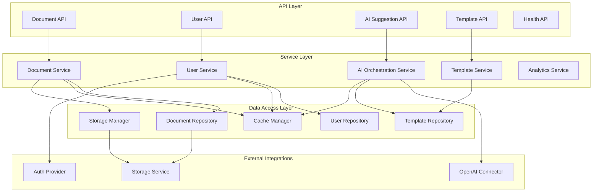
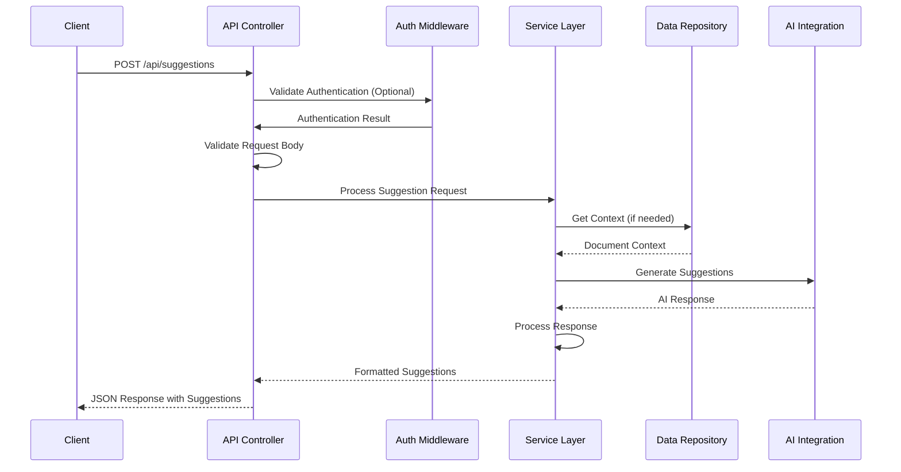
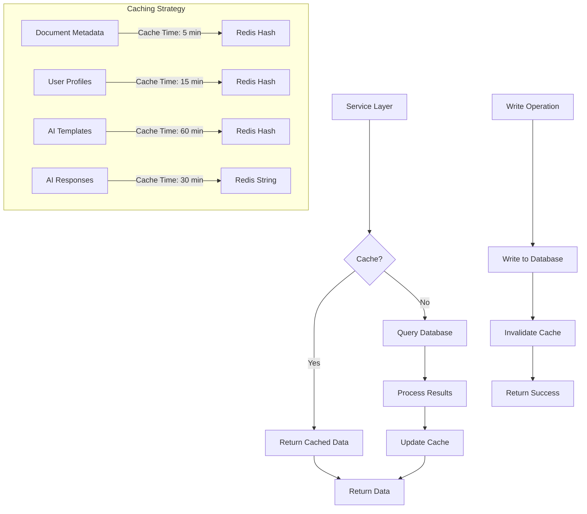

# Backend Architecture

This document outlines the backend architecture for the AI writing enhancement platform, detailing the design principles, component organization, API structure, and integration patterns.

## Backend Architecture Overview

The backend system follows a modular architecture designed around Flask, with clear separation of concerns between API handling, business logic, data access, and external integrations. This architecture prioritizes scalability, maintainability, and performance while supporting both anonymous and authenticated usage patterns.

### Design Principles

- **Modularity**: Components are organized into independent modules with well-defined interfaces
- **Separation of Concerns**: Clear distinction between API, service, and data access layers
- **Statelessness**: API endpoints maintain no session state to enable horizontal scaling
- **Defensive Coding**: Comprehensive input validation, error handling, and fault tolerance
- **Performance-First**: Optimized for AI request handling with appropriate caching strategies
- **Security by Design**: Authentication, authorization, and data protection built into core architecture

### Backend Component Diagram



### Technology Stack

| Component | Technology | Version | Purpose |
|-----------|------------|---------|---------|
| Web Framework | Flask | 2.3.0 | Core web framework |
| API Structure | Flask-RESTful | 0.3.10 | RESTful API patterns |
| AI Orchestration | Langchain | 0.0.267 | AI language model integration |
| WSGI Server | Gunicorn | 21.2.0 | Production application server |
| Authentication | PyJWT | 2.7.0 | JWT token handling |
| Database ODM | PyMongo | 4.5.0 | MongoDB client |
| Caching | Redis-py | 4.6.0 | Redis client for caching |
| AI Provider | OpenAI Python | 1.3.0 | OpenAI API integration |

## Component Architecture

The backend is structured as a modular Flask application with a clear separation of responsibilities across multiple layers.

### Module Organization

```
src/
├── api/                # API layer with route definitions
│   ├── __init__.py     # API initialization
│   ├── documents.py    # Document-related endpoints
│   ├── auth.py         # Authentication endpoints
│   ├── suggestions.py  # AI suggestion endpoints
│   ├── templates.py    # Template management endpoints
│   └── health.py       # Health and monitoring endpoints
│
├── services/           # Service layer with business logic
│   ├── __init__.py
│   ├── document.py     # Document processing services
│   ├── user.py         # User management services
│   ├── ai.py           # AI orchestration services
│   ├── template.py     # Template management services
│   └── analytics.py    # Analytics and telemetry services
│
├── data/               # Data access layer
│   ├── __init__.py
│   ├── document_repo.py # Document repository
│   ├── user_repo.py    # User repository
│   ├── template_repo.py # Template repository
│   ├── cache.py        # Caching utilities
│   └── storage.py      # Storage management
│
├── ai/                 # AI integration
│   ├── __init__.py
│   ├── openai_client.py # OpenAI API client
│   ├── prompt_manager.py # Prompt handling and optimization
│   ├── response_processor.py # Response processing
│   └── token_management.py # Token usage optimization
│
├── utils/              # Shared utilities
│   ├── __init__.py
│   ├── diff.py         # Text difference utilities
│   ├── auth.py         # Authentication utilities
│   ├── validation.py   # Input validation
│   └── errors.py       # Error handling
│
├── config/             # Configuration handling
│   ├── __init__.py
│   ├── settings.py     # Application settings
│   └── environment.py  # Environment-specific configuration
│
└── app.py              # Application entry point
```

### Dependency Management

Dependencies between components follow a clear hierarchical pattern:

- API layer depends on Service layer
- Service layer depends on Data layer and external integrations
- No circular dependencies between modules
- Shared utilities provide common functionality to all layers

## API Layer

The API layer provides RESTful endpoints for client interactions following consistent patterns for authentication, request validation, and response formatting.

### API Design Principles

- RESTful resource-oriented design
- Consistent URL structure and HTTP method usage
- Proper status code usage (200, 201, 400, 401, 403, 404, 500)
- Comprehensive input validation
- Detailed error responses with actionable information
- Versioned endpoints for backward compatibility

### Core Endpoints

| Endpoint | Method | Purpose | Auth Required |
|----------|--------|---------|---------------|
| `/api/auth/login` | POST | User authentication | No |
| `/api/auth/register` | POST | User registration | No |
| `/api/auth/refresh` | POST | Refresh access token | No (Requires refresh token) |
| `/api/documents` | GET | List user documents | Yes |
| `/api/documents` | POST | Create new document | Optional |
| `/api/documents/{id}` | GET | Retrieve document | Conditional |
| `/api/documents/{id}` | PUT | Update document | Yes |
| `/api/suggestions` | POST | Generate AI suggestions | No |
| `/api/chat` | POST | Process chat message | No |
| `/api/templates` | GET | List improvement templates | No |
| `/api/health` | GET | Service health status | No |

### Request Flow Sequence Diagram



### Request/Response Formats

Example of a suggestion request:

```json
POST /api/suggestions
{
  "document": {
    "content": "The big advantage of this approach is that it allows for greater flexibility.",
    "selection": {
      "start": 4,
      "end": 7
    }
  },
  "prompt": {
    "type": "template",
    "id": "more-professional"
  }
}
```

Example response:

```json
{
  "suggestions": [
    {
      "original": "big",
      "suggested": "significant",
      "start": 4,
      "end": 7,
      "explanation": "\"Significant\" sounds more professional than \"big\" in this business context."
    }
  ],
  "metadata": {
    "processTime": 1.23,
    "tokenCount": 47
  }
}
```

### Error Handling

The API employs standardized error responses:

```json
{
  "error": {
    "code": "VALIDATION_ERROR",
    "message": "Invalid request parameters",
    "details": [
      {
        "field": "document.content",
        "error": "Content exceeds maximum length of 25,000 words"
      }
    ]
  }
}
```

### API Versioning

API versioning is implemented through URL prefixing:

- `/api/v1/suggestions` - Initial API version
- `/api/v2/suggestions` - Updated API with new features

Backwards compatibility is maintained for at least 6 months when introducing breaking changes, with clear migration documentation provided.

## Service Layer

The service layer implements the core business logic of the application, orchestrating operations between the API layer and data access layer while integrating with external services.

### Document Service

The Document Service manages document creation, retrieval, and updates with the following key functions:

- Document validation and normalization
- Version management and history tracking
- Access control based on ownership
- Format conversion (when needed)
- Auto-save and recovery functionality

```python
# Simplified example of a Document Service
class DocumentService:
    def __init__(self, document_repo, storage_manager, cache_manager):
        self.document_repo = document_repo
        self.storage_manager = storage_manager
        self.cache_manager = cache_manager
        
    def create_document(self, user_id, content, title, tags=None):
        # Normalize and validate document content
        normalized_content = self._normalize_content(content)
        
        # Create document model
        document = {
            'user_id': user_id,
            'title': title,
            'content': normalized_content,
            'tags': tags or [],
            'created_at': datetime.utcnow(),
            'updated_at': datetime.utcnow()
        }
        
        # Save to database
        document_id = self.document_repo.create(document)
        
        # Cache for quick access
        self.cache_manager.set_document(document_id, document)
        
        return document_id
```

### AI Orchestration Service

The AI Orchestration Service manages interactions with the OpenAI API to generate suggestions:

- Prompt preparation and optimization
- Context management for accurate suggestions
- Token usage optimization
- Response processing and formatting
- Error handling and fallback strategies

```python
# Simplified example of AI Orchestration Service
class AIService:
    def __init__(self, openai_client, template_repo, cache_manager):
        self.openai_client = openai_client
        self.template_repo = template_repo
        self.cache_manager = cache_manager
        
    async def generate_suggestions(self, document_content, selection=None, prompt_info=None):
        # Prepare context from document
        context = self._prepare_context(document_content, selection)
        
        # Get prompt template if using a template
        prompt_template = None
        if prompt_info and prompt_info.get('type') == 'template':
            template_id = prompt_info.get('id')
            prompt_template = self.template_repo.get_by_id(template_id)
            
        # Custom prompt handling
        custom_prompt = None
        if prompt_info and prompt_info.get('type') == 'custom':
            custom_prompt = prompt_info.get('text')
            
        # Check cache for similar requests
        cache_key = self._generate_cache_key(context, prompt_template, custom_prompt)
        cached_result = self.cache_manager.get_suggestions(cache_key)
        if cached_result:
            return cached_result
            
        # Prepare final prompt
        final_prompt = self._construct_prompt(context, prompt_template, custom_prompt)
        
        # Call OpenAI API
        try:
            response = await self.openai_client.generate_completion(final_prompt)
            
            # Process response into suggestions
            suggestions = self._process_response(response, context)
            
            # Cache result
            self.cache_manager.set_suggestions(cache_key, suggestions)
            
            return suggestions
        except Exception as e:
            # Handle errors and implement fallback strategies
            return self._handle_ai_error(e, context)
```

### User Service

The User Service manages user accounts and authentication:

- User registration and profile management
- Password handling and security
- Session management for both anonymous and authenticated users
- Permission verification

### Template Service

The Template Service manages the prompt templates used for AI suggestions:

- Template CRUD operations
- Template categorization and organization
- Performance tracking (which templates yield best results)
- Default system templates vs. user-created templates

## Data Access Layer

The Data Access Layer manages interactions with the database, caching system, and storage services.

### Data Access Pattern Diagram



### Repository Pattern

The application uses the repository pattern to abstract database operations:

```python
# Example of a Repository implementation
class DocumentRepository:
    def __init__(self, db_client):
        self.collection = db_client.get_collection('documents')
        
    def create(self, document):
        result = self.collection.insert_one(document)
        return str(result.inserted_id)
        
    def get_by_id(self, document_id):
        document = self.collection.find_one({'_id': ObjectId(document_id)})
        if document:
            document['_id'] = str(document['_id'])
        return document
        
    def get_by_user(self, user_id, limit=10, offset=0, include_archived=False):
        query = {'user_id': user_id}
        if not include_archived:
            query['is_archived'] = {'$ne': True}
            
        cursor = self.collection.find(query) \
                              .sort('updated_at', -1) \
                              .skip(offset) \
                              .limit(limit)
                              
        documents = []
        for doc in cursor:
            doc['_id'] = str(doc['_id'])
            documents.append(doc)
            
        return documents
```

### Caching Strategy

The application implements a multi-level caching strategy:

1. **Redis-based caching** for frequently accessed data:
   - Document metadata (not full content)
   - User profiles
   - Prompt templates
   - Common AI responses

2. **Cache invalidation strategies**:
   - Time-based expiration
   - Event-based invalidation on updates
   - Selective invalidation for partial updates

3. **Cache key design**:
   - Hierarchical keys for effective organization
   - Hash functions for AI prompt caching
   - User-specific prefixing for isolation

```python
# Example Cache Manager implementation
class CacheManager:
    def __init__(self, redis_client):
        self.redis = redis_client
        
    def get_document(self, document_id):
        cache_key = f"doc:{document_id}"
        cached = self.redis.get(cache_key)
        if cached:
            return json.loads(cached)
        return None
        
    def set_document(self, document_id, document_data, expire=300):
        cache_key = f"doc:{document_id}"
        self.redis.setex(
            cache_key, 
            expire,
            json.dumps(document_data)
        )
```

### Document Storage

For document storage, the application uses a hybrid approach:

- MongoDB for document metadata and active content
- S3-compatible object storage for long-term archival
- Document versioning for history tracking

This approach balances performance, cost, and reliability for document management.

## AI Integration

The AI Integration component manages the interaction with OpenAI's API, optimizing prompts, handling responses, and tracking usage.

### OpenAI Connector

The OpenAI connector manages the communication with the OpenAI API:

```python
# Example OpenAI Client implementation
class OpenAIClient:
    def __init__(self, api_key, model="gpt-4", timeout=10):
        self.client = openai.AsyncOpenAI(api_key=api_key)
        self.model = model
        self.timeout = timeout
        
    async def generate_completion(self, prompt, max_tokens=1000):
        try:
            response = await asyncio.wait_for(
                self.client.chat.completions.create(
                    model=self.model,
                    messages=[
                        {"role": "system", "content": "You are an AI writing assistant that helps improve text."},
                        {"role": "user", "content": prompt}
                    ],
                    max_tokens=max_tokens,
                    temperature=0.7
                ),
                timeout=self.timeout
            )
            
            return response.choices[0].message.content
            
        except asyncio.TimeoutError:
            raise TimeoutError("OpenAI API request timed out")
        except Exception as e:
            # Log error
            raise RuntimeError(f"OpenAI API error: {str(e)}")
```

### Prompt Management

The application employs sophisticated prompt engineering:

1. **Structured prompts** with consistent formatting
2. **Context window management** to handle large documents
3. **Instruction optimization** for specific improvement types
4. **Template parameters** for customization of standard prompts

```python
# Example Prompt Manager implementation
class PromptManager:
    def __init__(self, template_repo):
        self.template_repo = template_repo
        self.system_instructions = {
            "default": "You are an AI writing assistant that helps improve text while maintaining the original meaning.",
            "professional": "You are an AI writing assistant specializing in professional business writing.",
            "academic": "You are an AI writing assistant specializing in academic writing and research papers."
        }
        
    def create_suggestion_prompt(self, document_text, selection=None, template_id=None, custom_prompt=None):
        # Get the relevant text section
        target_text = self._extract_target_text(document_text, selection)
        
        # Get appropriate system instruction
        system_instruction = self.system_instructions["default"]
        
        # If using a template, get it
        template = None
        if template_id:
            template = self.template_repo.get_by_id(template_id)
            if template and template.get('system_instruction'):
                system_instruction = template.get('system_instruction')
        
        # Build prompt components
        components = [
            f"SYSTEM: {system_instruction}",
            f"TEXT: {target_text}",
        ]
        
        # Add template instructions if available
        if template:
            components.append(f"INSTRUCTION: {template['prompt_text']}")
        elif custom_prompt:
            components.append(f"INSTRUCTION: {custom_prompt}")
        else:
            components.append("INSTRUCTION: Improve this text. Make it clearer and more professional.")
            
        # Add response formatting instructions
        components.append(
            "FORMAT: Respond with a JSON object containing 'suggestions' as an array. " +
            "Each suggestion should have 'original' (the original text), 'suggested' (your improvement), " +
            "'start' (character position), 'end' (character position), and 'explanation' (why this change improves the text)."
        )
        
        # Join all components with newlines
        full_prompt = "\n\n".join(components)
        
        return full_prompt
```

### Response Processing

The response processor converts AI outputs into actionable suggestions:

1. **JSON parsing** of structured responses
2. **Position mapping** to align with original text
3. **Validation** of suggestions against business rules
4. **Formatting** for the track changes interface
5. **Fallback processing** for unexpected response formats

### Token Optimization

To manage costs and performance, token usage is optimized:

1. **Content windowing** for large documents
2. **Prompt compression** techniques
3. **Response streaming** for improved perceived performance
4. **Token budget management** per request type
5. **Context pruning** to focus on relevant content

## Authentication and Authorization

The authentication system supports both anonymous and registered users with a secure, token-based approach.

### JWT Implementation

```python
# Example JWT implementation
class JWTManager:
    def __init__(self, secret_key, access_token_expiry=3600, refresh_token_expiry=604800):
        self.secret_key = secret_key
        self.access_token_expiry = access_token_expiry  # 1 hour
        self.refresh_token_expiry = refresh_token_expiry  # 7 days
        
    def generate_access_token(self, user_id):
        payload = {
            'user_id': str(user_id),
            'exp': datetime.utcnow() + timedelta(seconds=self.access_token_expiry),
            'iat': datetime.utcnow(),
            'token_type': 'access'
        }
        return jwt.encode(payload, self.secret_key, algorithm='HS256')
        
    def generate_refresh_token(self, user_id):
        payload = {
            'user_id': str(user_id),
            'exp': datetime.utcnow() + timedelta(seconds=self.refresh_token_expiry),
            'iat': datetime.utcnow(),
            'token_type': 'refresh'
        }
        return jwt.encode(payload, self.secret_key, algorithm='HS256')
        
    def validate_token(self, token):
        try:
            payload = jwt.decode(token, self.secret_key, algorithms=['HS256'])
            return payload
        except jwt.ExpiredSignatureError:
            raise ValueError("Token has expired")
        except jwt.InvalidTokenError:
            raise ValueError("Invalid token")
```

### Anonymous Sessions

For anonymous users, the system uses a session-based approach:

1. **Cryptographically secure session IDs** for anonymous tracking
2. **Redis-backed session storage** with appropriate TTLs
3. **Session promotion** when users register
4. **Rate limiting** based on session ID

```python
# Example Anonymous Session Manager
class AnonymousSessionManager:
    def __init__(self, redis_client, session_expiry=86400):
        self.redis = redis_client
        self.session_expiry = session_expiry  # 24 hours
        
    def create_session(self):
        # Generate secure random session ID
        session_id = secrets.token_urlsafe(32)
        
        # Create session data
        session_data = {
            'created_at': datetime.utcnow().isoformat(),
            'last_active': datetime.utcnow().isoformat(),
            'documents': []
        }
        
        # Store in Redis
        self.redis.setex(
            f"anon_session:{session_id}",
            self.session_expiry,
            json.dumps(session_data)
        )
        
        return session_id
```

### Permission Management

The permission system implements:

1. **Resource ownership** as the primary access control mechanism
2. **Role-based permissions** for administrative functions
3. **Anonymous capabilities** for non-registered users
4. **Session-based document ownership** tracking

```python
# Example Permission Manager
class PermissionManager:
    def __init__(self, user_repo, document_repo):
        self.user_repo = user_repo
        self.document_repo = document_repo
        
    def can_access_document(self, document_id, user_id=None, session_id=None):
        # If we have neither user_id nor session_id, deny access
        if not user_id and not session_id:
            return False
            
        # Get document
        document = self.document_repo.get_by_id(document_id)
        if not document:
            return False
            
        # Check user ownership
        if user_id and document.get('user_id') == user_id:
            return True
            
        # Check sharing permissions for registered users
        if user_id and 'shared_with' in document:
            if user_id in document['shared_with']:
                return True
                
        # Check anonymous session ownership
        if session_id and document.get('session_id') == session_id:
            return True
                
        # Public document check
        if document.get('is_public', False):
            return True
            
        return False
```

## Scaling and Performance

The backend is designed for horizontal scalability and optimal performance under varying loads.

### Scaling Strategy

The application employs a multi-faceted scaling approach:

1. **Horizontal scaling** of stateless API services
2. **Auto-scaling** based on CPU utilization and request queue depth
3. **Read replicas** for database scaling
4. **Distributed caching** for session state and frequently accessed data

### Performance Optimization

Key performance optimizations include:

1. **Asynchronous processing** for I/O-bound operations
2. **Connection pooling** for database and external services
3. **Query optimization** with appropriate indexing
4. **Response compression** to reduce network transfer
5. **Batched processing** for bulk operations

```python
# Example of asynchronous request handling
@app.route('/api/suggestions', methods=['POST'])
async def generate_suggestions():
    data = request.json
    
    # Process request asynchronously
    try:
        suggestions = await ai_service.generate_suggestions(
            document_content=data['document']['content'],
            selection=data['document'].get('selection'),
            prompt_info=data['prompt']
        )
        
        return jsonify({
            'suggestions': suggestions,
            'metadata': {
                'processTime': time.time() - request.start_time,
                'tokenCount': ai_service.get_token_count(data['document']['content'])
            }
        })
    except Exception as e:
        # Handle errors
        return jsonify({
            'error': {
                'code': 'PROCESSING_ERROR',
                'message': str(e)
            }
        }), 500
```

### AI Request Optimization

AI requests are optimized to reduce costs and improve responsiveness:

1. **Request deduplication** for identical prompts
2. **Prompt caching** for common operations
3. **Response streaming** for improved user experience
4. **Batch processing** for multiple document sections
5. **Adaptive timeout handling** based on document complexity

### Rate Limiting

Rate limiting protects the system from abuse while ensuring fair resource allocation:

1. **Token bucket algorithm** for request rate control
2. **Tiered limits** based on user authentication status
3. **Service-specific limits** for different endpoints
4. **Circuit breakers** for external service protection

## Monitoring and Observability

The monitoring and observability infrastructure provides comprehensive insights into system health, performance, and usage patterns.

### Logging Strategy

```python
# Example logging configuration
import logging
import json
from pythonjsonlogger import jsonlogger

def setup_logging():
    logger = logging.getLogger()
    logger.setLevel(logging.INFO)
    
    # Create handler
    handler = logging.StreamHandler()
    
    # Create formatter
    formatter = jsonlogger.JsonFormatter(
        '%(timestamp)s %(level)s %(name)s %(message)s %(module)s %(funcName)s %(lineno)d %(request_id)s'
    )
    handler.setFormatter(formatter)
    
    # Add handler
    logger.addHandler(handler)
    
    return logger
```

The logging strategy includes:

1. **Structured JSON logging** for machine-readable outputs
2. **Correlation IDs** for request tracing
3. **Contextual information** in all log entries
4. **Log levels** used appropriately (INFO, WARNING, ERROR)
5. **Sanitized logging** that excludes sensitive data

### Metrics Collection

Key metrics collected include:

1. **Request rates** and response times
2. **Error rates** and types
3. **Resource utilization** (CPU, memory, connections)
4. **Business metrics** (AI suggestion quality, acceptance rates)
5. **External service latency** and error rates

### Health Checks

```python
# Example health check endpoints
@app.route('/health/liveness', methods=['GET'])
def liveness_check():
    """Simple check to verify the application is running."""
    return jsonify({'status': 'ok'}), 200
    
@app.route('/health/readiness', methods=['GET'])
def readiness_check():
    """Check if the application is ready to handle requests."""
    # Check database connection
    try:
        document_repo.ping()
    except Exception as e:
        return jsonify({
            'status': 'error',
            'message': 'Database connection failed',
            'details': str(e)
        }), 503
        
    # Check Redis connection
    try:
        cache_manager.ping()
    except Exception as e:
        return jsonify({
            'status': 'error',
            'message': 'Cache connection failed',
            'details': str(e)
        }), 503
        
    # Check OpenAI API status
    try:
        openai_client.check_status()
    except Exception as e:
        # Non-critical dependency, just note the issue
        return jsonify({
            'status': 'degraded',
            'message': 'OpenAI API connection issues',
            'details': str(e)
        }), 200
        
    # All checks passed
    return jsonify({
        'status': 'ok',
        'version': app.config['VERSION'],
        'environment': app.config['ENVIRONMENT']
    }), 200
```

Health monitoring includes:

1. **Liveness probes** for basic service health
2. **Readiness probes** for dependency checking
3. **Detailed health status API** for operational visibility
4. **Circuit breaker status** for external dependencies

### Alerting Strategy

The system implements tiered alerting:

1. **Critical alerts** for service outages or data issues
2. **Warning alerts** for performance degradation
3. **Info alerts** for notable events or threshold crossings
4. **Business alerts** for unusual usage patterns

Alerts are routed to appropriate channels (email, Slack, PagerDuty) based on severity and type.

## Development and Deployment

### Local Development Setup

For local development, the application uses Docker Compose to create a consistent environment:

```yaml
# docker-compose.yml example
version: '3.8'

services:
  api:
    build:
      context: .
      dockerfile: Dockerfile.dev
    ports:
      - "5000:5000"
    volumes:
      - ./src:/app/src
    environment:
      - FLASK_APP=app.py
      - FLASK_ENV=development
      - MONGO_URI=mongodb://mongo:27017/aiwriting
      - REDIS_URI=redis://redis:6379/0
      - JWT_SECRET=dev_secret_key_do_not_use_in_production
      - OPENAI_API_KEY=${OPENAI_API_KEY}
    depends_on:
      - mongo
      - redis

  mongo:
    image: mongo:5.0
    ports:
      - "27017:27017"
    volumes:
      - mongo_data:/data/db

  redis:
    image: redis:7.0
    ports:
      - "6379:6379"
    volumes:
      - redis_data:/data

volumes:
  mongo_data:
  redis_data:
```

This setup provides:

1. **Containerized dependencies** for consistent environments
2. **Volume mounting** for real-time code changes
3. **Environment variable management** for configuration
4. **Port forwarding** for local access

### Testing Strategy

The testing approach includes:

1. **Unit tests** for isolated components
2. **Integration tests** for service interactions
3. **API tests** for endpoint validation
4. **Mocked external services** for reliable testing

### CI/CD Integration

The application integrates with CI/CD pipelines:

1. **Automated testing** on every commit
2. **Code quality checks** for styling and best practices
3. **Container building** and registry deployment
4. **Automated deployments** to testing and staging environments
5. **Manual approval** for production deployments

### Deployment Strategy

The deployment strategy follows a multi-environment approach:

1. **Development environment** for integration testing
2. **Staging environment** for pre-production validation
3. **Production environment** with blue-green deployment

## Summary

The backend architecture for the AI writing enhancement platform provides a robust, scalable foundation for delivering intelligent writing assistance. Built on Flask with a clear separation of concerns between layers, the system effectively integrates with AI services while providing a responsive, reliable experience for users.

Key strengths of the architecture include:

1. **Modular design** with well-defined component boundaries
2. **Scalable processing** for AI-intensive operations
3. **Flexible authentication** supporting both anonymous and registered usage
4. **Performance optimization** through effective caching and asynchronous processing
5. **Comprehensive monitoring** for operational visibility
6. **Maintainable codebase** with clear organization and testing

This architecture enables the system to deliver on its core value proposition: providing an intuitive, efficient AI-powered writing enhancement experience that seamlessly integrates with the user's workflow.