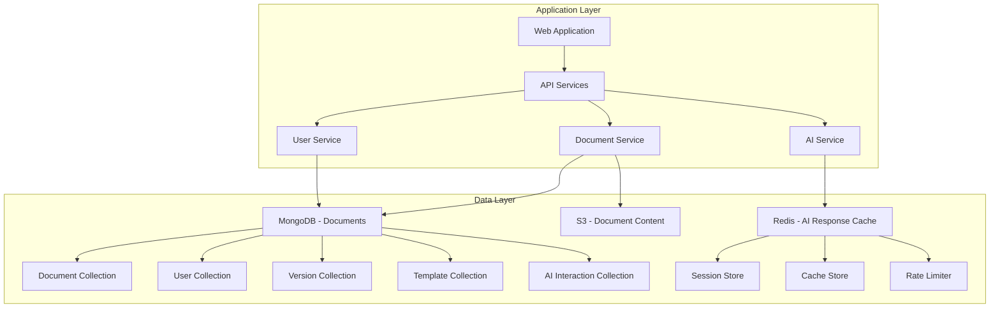
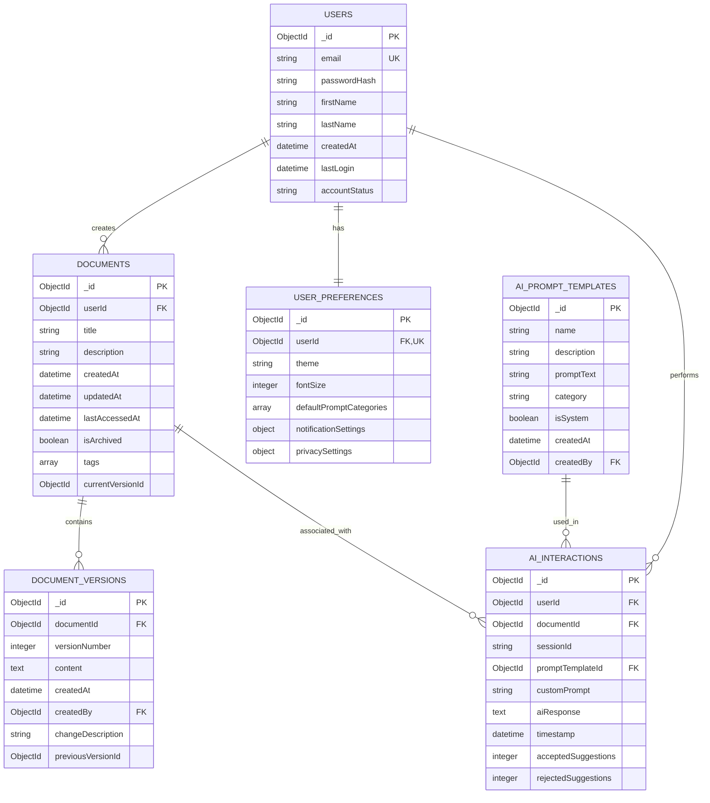

# Database Architecture

## Introduction
This document describes the database architecture for the AI writing enhancement platform, detailing the data storage mechanisms, schema design, caching strategies, and infrastructure configurations. The platform utilizes a multi-database approach with MongoDB for document metadata and user data, Redis for caching and session management, and Amazon S3 for document content storage.

For an overview of how this database architecture fits into the overall system, please refer to the system architecture overview documentation.

## Database Architecture Overview
The database architecture follows a polyglot persistence approach, selecting specialized database technologies for different data access patterns and requirements. The architecture supports both anonymous and authenticated users, document versioning, and high-performance AI suggestion retrieval.

### Design Rationale
The database design balances several competing concerns:
- Flexibility for document structure and metadata through MongoDB
- Performance for session management and caching through Redis
- Scalability and cost-efficiency for document content through S3
- Support for both anonymous and authenticated usage paths
- Versioning capabilities for document history tracking
- Efficient AI response caching to reduce external API costs

### Database Components
The database layer consists of three primary components:
1. **MongoDB Atlas**: Document-oriented database for structured metadata and user data
2. **Amazon ElastiCache Redis**: In-memory data store for caching, sessions, and rate limiting
3. **Amazon S3**: Object storage for document content and version history

## MongoDB Document Store
MongoDB Atlas serves as the primary database for structured data including document metadata, user profiles, version history, and AI interaction tracking. The document-oriented nature of MongoDB provides flexibility for evolving data structures while supporting the necessary query patterns.

### Connection Configuration
MongoDB connections are managed through a connection pooling system with the following configuration:
- Separate read and write connection pools
- Connection pool sizes scaled based on instance type
- Read preference set to 'primaryPreferred' for read scaling
- Write concern set to 'majority' for data durability
- Automatic retry mechanisms for transient errors

### Schema Design
The MongoDB database uses the following collection structure:

| Collection | Purpose | Key Fields |
|------------|---------|------------|
| Users | Stores user account information | email, passwordHash, accountStatus |
| Documents | Manages document metadata | userId, title, tags, currentVersionId |
| DocumentVersions | Stores document version history | documentId, versionNumber, content, changeDescription |
| UserPreferences | Contains user settings | userId, theme, fontSize, privacySettings |
| AIPromptTemplates | Predefined improvement prompts | name, promptText, category, isSystem |
| AIInteractions | Logs AI suggestion sessions | userId/sessionId, documentId, promptTemplateId, aiResponse |

### Entity Relationships
The database schema implements the following entity relationships:

### Anonymous User Handling
For anonymous users, the system uses browser-based session IDs to track document ownership temporarily. Anonymous documents are stored in the same collections but with null userId fields and an associated sessionId. The system implements session expiration with configurable TTL (time-to-live) settings to manage anonymous data lifecycle.

Migration from anonymous to authenticated status is handled through specialized repository methods that update ownership references when a user registers or logs in.

### Indexing Strategy
The following indexes are created to optimize query performance:

| Collection | Index | Type | Purpose |
|------------|-------|------|---------|
| Users | email | Unique | Fast lookup during authentication |
| Users | accountStatus | Standard | Filter active/inactive accounts |
| Documents | userId | Standard | Retrieve user's documents |
| Documents | tags | Multikey | Support tag-based filtering |
| Documents | (userId, isArchived) | Compound | Efficiently retrieve active documents |
| DocumentVersions | documentId | Standard | Retrieve document versions |
| DocumentVersions | (documentId, versionNumber) | Compound | Retrieve specific version |
| AIInteractions | sessionId | Standard | Track anonymous interactions |
| AIInteractions | (documentId, timestamp) | Compound | Document interaction history |
| AIPromptTemplates | category | Standard | Filter templates by category |

### Replication and Sharding
The MongoDB deployment uses the following replication and sharding strategy:

- **Replication**: 3-node replica set for high availability with automatic failover
- **Read Scaling**: Read operations directed to secondary nodes where possible
- **Data Distribution**: The Documents collection uses range-based sharding on userId for even distribution, while DocumentVersions uses hashed sharding on documentId
- **Geographical Distribution**: Replica nodes distributed across availability zones for fault tolerance

## Redis Caching and Session Store
Redis serves multiple critical functions in the architecture, including caching frequently accessed data, managing user sessions, and implementing rate limiting. The ElastiCache Redis deployment provides high performance, durability, and scalability for these time-sensitive operations.

### Redis Deployment Configuration
The Redis cluster is deployed with the following configuration in production:

- **Version**: Redis 7.0
- **Node Type**: cache.r6g.large in production, smaller sizes in dev/staging
- **Replication**: Enabled with primary and replica nodes
- **Multi-AZ**: Enabled for high availability
- **Encryption**: Enabled for both at-rest and in-transit data
- **Automatic Backups**: Daily snapshots with 7-day retention in production
- **Maintenance**: Weekly maintenance window during off-peak hours

### Caching Strategy
The Redis caching implementation uses a prefix-based organization with specialized methods for different data types:

| Cache Type | Prefix | TTL (seconds) | Purpose |
|------------|--------|---------------|---------|
| Document Cache | doc: | 300 | Caching frequently accessed document data |
| AI Response Cache | ai: | 1800 | Caching AI responses to reduce API calls |
| User Data Cache | user: | 900 | Caching user profiles and preferences |
| Template Cache | template: | 3600 | Caching prompt templates |

### AI Response Caching
The system implements a content-based hashing mechanism for AI responses to efficiently cache and retrieve similar requests:

1. Document content and prompt type are combined and hashed
2. The hash serves as a cache key for storing AI responses
3. When identical or very similar content is processed with the same prompt, the cached response is returned
4. This approach significantly reduces OpenAI API costs and improves response times

The cache implements time-based expiration to ensure content freshness while maximizing reuse potential.

### Session Management
Redis stores session information for both anonymous and authenticated users with appropriate security controls:

- **Anonymous Sessions**: Browser-generated session IDs with 24-hour expiration
- **Authenticated Sessions**: JWT refresh tokens with 7-day expiration and rotation
- **Session Data**: User context, current document references, and usage metrics
- **Security**: HTTP-only cookie storage with appropriate security flags

### Rate Limiting Implementation
Redis implements token bucket rate limiting for API access with differentiated limits:

- **Anonymous Users**: 10 requests/minute for AI suggestions
- **Authenticated Users**: 50 requests/minute for AI suggestions (configurable by tier)
- **Admin Operations**: 100 requests/minute

The rate limiter uses Redis sorted sets to track token allocation and consumption with decay over time. This approach ensures fair resource usage while preventing abuse.

## S3 Object Storage
Amazon S3 serves as the storage backend for document content, providing scalable, durable storage with versioning capabilities. Document metadata is stored in MongoDB while the actual content is stored in S3 for optimal performance and cost efficiency.

### Storage Organization
The S3 storage is organized using a structured key pattern:

- **Document Content**: `documents/{user_id or session_id}/{document_id}`
- **Version Content**: `versions/{user_id or session_id}/{document_id}/{version_id}`

This structure allows efficient retrieval and ownership management while supporting both anonymous and authenticated users.

### Security Controls
S3 storage implements multiple security controls:

- **Encryption**: Server-side encryption (SSE-S3) for all stored documents
- **Access Control**: No public access, all requests through application layer
- **Ownership Validation**: User/session ownership validation before access
- **Temporary Access**: Pre-signed URLs with short expiration for direct browser access

### Versioning Support
Document versioning is implemented through a combined approach:

1. Metadata about versions stored in MongoDB (DocumentVersions collection)
2. Actual version content stored in S3 under version-specific keys
3. Version relationships (previous/next) tracked in MongoDB
4. Differential storage approach for efficient space utilization

### Document Transfer Mechanism
When anonymous users register, their documents are transferred through a specialized process:

1. S3 objects are copied to new keys under the user's ID
2. MongoDB references are updated to the new user ownership
3. Original session-based records are maintained until session expiration
4. Process is atomic with appropriate error handling and rollback

## Data Management
This section details the ongoing data management processes, including migration, versioning, archival, and lifecycle management.

### Migration Procedures
Schema evolution is managed through a controlled migration approach:

1. Schema versioning in a dedicated collection tracks database schema state
2. Migrations execute through a dedicated management tool with:
   - Pre-migration validation
   - Ability to apply incremental changes
   - Automatic rollback for failed migrations
   - Developer-defined up/down scripts

For larger schema changes, the system uses a blue-green deployment approach with shadow writes during transition periods and gradual cutover to minimize impact.

### Versioning Strategy
Document versioning follows these principles:

| Version Type | Creation Trigger | Retention Policy |
|--------------|------------------|------------------|
| Major Version | Explicit user save | Indefinite |
| Minor Version | Auto-save (5 min) | 24 hours |
| AI Suggestion | Each AI improvement | Until accepted/rejected |

The versioning system implements:
- Linear version history with incrementing numbers
- Metadata tracking for version provenance
- Efficient storage using differential compression
- Version comparison and restoration capabilities

### Archival Policies
The system implements a tiered data lifecycle management approach:

| Data Type | Archival Trigger | Storage Location | Retention |
|-----------|------------------|------------------|-----------|
| Active Documents | N/A | Primary database | Indefinite |
| Inactive Documents | 90 days without access | Archive storage | 1 year |
| Deleted Documents | User deletion | Soft-deleted state | 30 days |
| Anonymous Documents | Session expiration | Marked for cleanup | 7 days |

The system implements automatic cleanup processes that run as scheduled tasks to enforce these retention policies. Archive data remains retrievable but is stored in lower-cost storage tiers.

## Performance Optimization
The database architecture implements several performance optimization techniques to ensure responsive user experience and efficient resource utilization.

### Query Optimization Patterns
Performance-critical queries are optimized through multiple techniques:

- **Covered Queries**: Indexes include all fields needed for common queries to avoid document lookups
- **Projection**: Queries request only needed fields to reduce network transfer
- **Aggregation Pipeline Optimization**: Complex queries use optimized aggregation stages
- **Text Search Optimization**: Text indexes with appropriate weights for document search functionality

All queries are analyzed during development, and explain plans are evaluated to ensure optimal execution paths.

### Caching Strategy
The multi-level caching strategy implements:

1. **Browser Storage**: For anonymous session data and document drafts
2. **Application Memory**: For current editing session and frequently accessed data
3. **Redis Cache**: For shared application cache with appropriate invalidation
4. **MongoDB Query Cache**: For frequently executed queries

The caching system uses intelligent invalidation based on write operations and TTL settings to ensure data freshness while maximizing performance benefits.

### Connection Pooling
Database connections are managed through sophisticated pooling:

| Pool Type | Size Strategy | Timeout | Health Check |
|-----------|---------------|---------|-------------|
| Write Connections | Fixed (instances × 5) | 30 seconds | 15-second interval |
| Read Connections | Dynamic (5-20 per instance) | 60 seconds | 30-second interval |
| Analytics Connections | Isolated pool | 120 seconds | On demand |

Connection pools are monitored for saturation, and pool sizes are adjusted based on actual usage patterns. Health checks ensure prompt removal of failed connections.

### Batch Processing
Resource-intensive operations are implemented as batch processes:

- **Document Cleanup**: Background task for expired anonymous documents
- **Version Pruning**: Scheduled task for removing old auto-save versions
- **Analytics Aggregation**: Periodic job for usage analytics
- **Index Maintenance**: Scheduled operations during off-peak hours

Batch processes implement resource throttling to prevent impact on user-facing operations and include comprehensive monitoring and error handling.

## Compliance and Security
The database architecture implements comprehensive security and compliance measures to protect user data and meet regulatory requirements.

### Data Protection
Multiple layers of data protection are implemented:

- **Encryption at Rest**: All persistent data is encrypted using AES-256
- **Encryption in Transit**: All database connections use TLS 1.2+
- **Field-Level Encryption**: Sensitive personal data has additional encryption
- **Access Controls**: Principle of least privilege for all database access

Sensitive operations like user data access implement additional verification steps and comprehensive audit logging.

### Data Retention Rules
The system implements configurable retention policies that align with regional requirements:

| Data Category | Retention Period | Deletion Process |
|---------------|------------------|------------------|
| User Accounts | Until deletion + 30 days | Soft delete, then anonymize |
| User Documents | Until deletion + 30 days | Soft delete, then purge |
| Anonymous Documents | 7 days from last access | Automatic purge |
| AI Interaction Logs | 90 days | Anonymize after 30 days |
| Authentication Logs | 1 year | Automated archival |

### Backup and Recovery
Comprehensive backup and recovery mechanisms include:

- **MongoDB**: Daily snapshots with 7-day retention, point-in-time recovery capability
- **Redis**: Daily snapshots with 3-day retention, replica for instant recovery
- **S3**: Versioning and cross-region replication for document content

Recovery procedures are regularly tested through automated restore validation to ensure RPO (Recovery Point Objective) and RTO (Recovery Time Objective) compliance.

### Access Controls
Granular access controls are implemented at multiple levels:

- **Database Users**: Role-based access with least privilege
- **Application Access**: Service accounts with specific permissions
- **Document Access**: Owner-based access controls in application logic
- **Audit Logging**: Comprehensive logging of all sensitive operations

Regular access reviews ensure appropriate permissions and monitor for potential privilege escalation paths.

## Monitoring and Alerting
Database performance and health are continuously monitored with comprehensive metrics and alerts.

### Key Metrics
Critical database metrics are monitored in real-time:

| Database | Key Metrics | Threshold | Alert Severity |
|----------|-------------|-----------|---------------|
| MongoDB | CPU Utilization | >70% for 5 minutes | Warning |
| MongoDB | Connection Count | >80% of limit | Warning |
| MongoDB | Replication Lag | >30 seconds | Critical |
| Redis | Memory Usage | >80% of max | Warning |
| Redis | Cache Hit Rate | <60% for 15 minutes | Warning |
| S3 | Error Rate | >1% for 5 minutes | Critical |
| All | Latency | >500ms avg for queries | Warning |

### Operational Dashboards
Operational dashboards provide visibility into database performance and health:

1. **Overview Dashboard**: High-level health indicators for all database systems
2. **MongoDB Dashboard**: Detailed metrics for query performance, storage, and replication
3. **Redis Dashboard**: Cache hit rates, memory usage, and connection metrics
4. **S3 Performance**: Request rates, latency, and error metrics

All dashboards include historical trending and anomaly detection to identify gradual degradation patterns.

### Capacity Planning
Proactive capacity management ensures adequate resources:

- **Storage Growth**: Monitored with 60-day forecasting
- **Connection Capacity**: Scaled based on user growth projections
- **Cache Sizing**: Adjusted based on hit/miss ratios and response times
- **Index Size**: Monitored and optimized for query performance

Capacity reviews are conducted monthly with automated scaling recommendations based on actual usage patterns and growth trends.

## Conclusion
The database architecture for the AI writing enhancement platform balances performance, flexibility, security, and compliance requirements through a multi-database approach. MongoDB provides the schema flexibility needed for document and user data, Redis delivers high-performance caching and session management, and S3 offers scalable content storage. This architecture supports both anonymous and authenticated usage patterns while maintaining security and performance for all users.

## References
Additional resources and documentation:

- [MongoDB Atlas Documentation](https://docs.atlas.mongodb.com/)
- [AWS ElastiCache Documentation](https://docs.aws.amazon.com/elasticache/)
- [AWS S3 Documentation](https://docs.aws.amazon.com/s3/)
- [Backend Architecture](./backend.md)
- [AI Integration Architecture](./ai-integration.md)