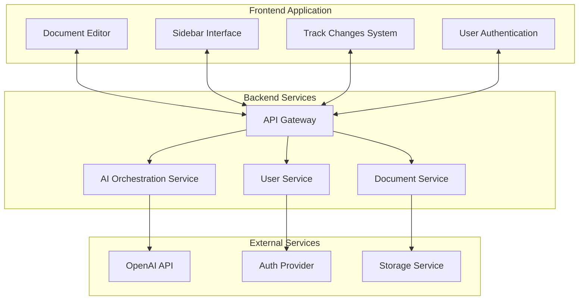
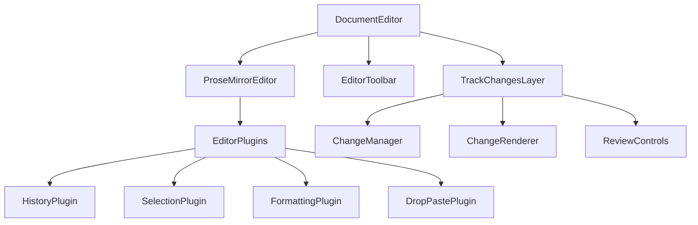
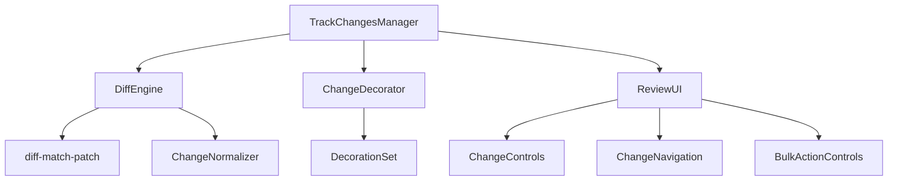
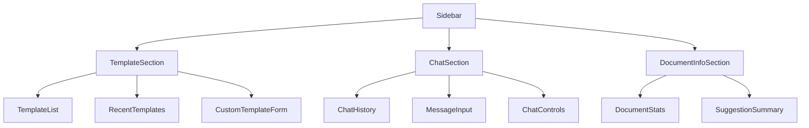
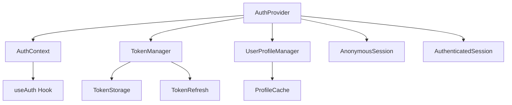
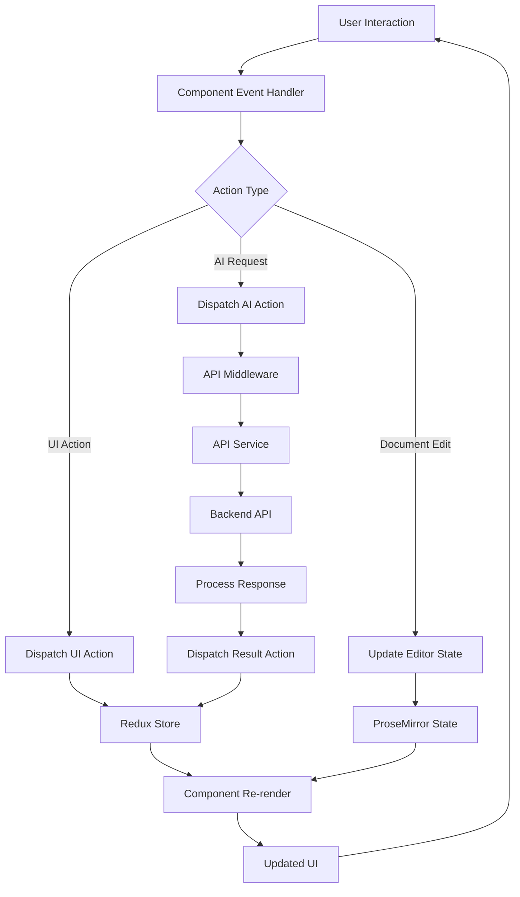
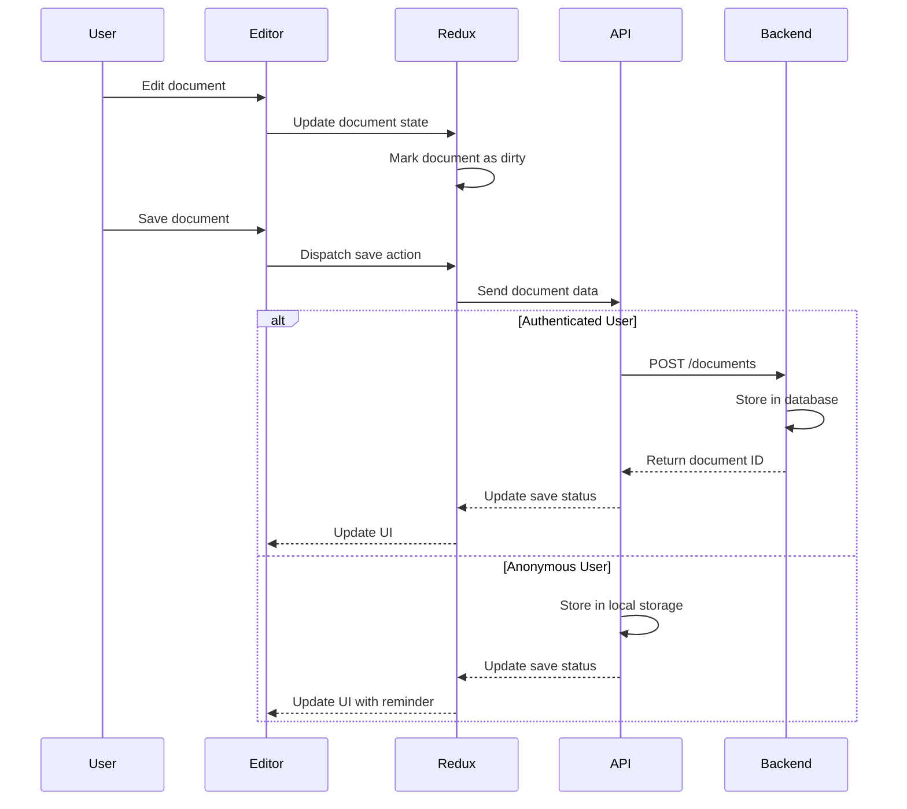
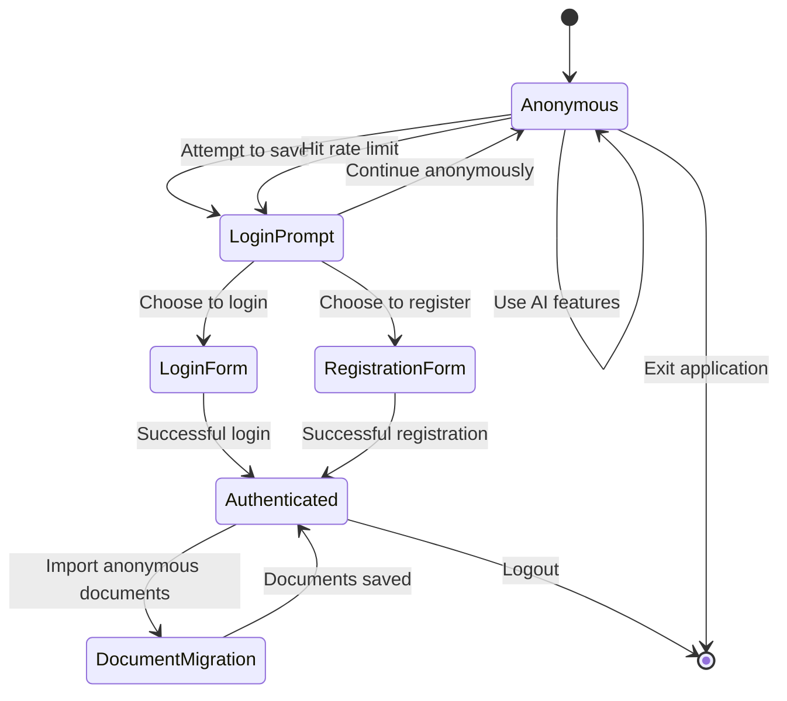

# Frontend Architecture Documentation

## Frontend Architecture Overview

The frontend architecture of the AI writing enhancement application is built as a modern, component-based Single Page Application (SPA) designed to provide a rich document editing experience with integrated AI capabilities. The architecture delivers a Microsoft Word-like interface with track changes functionality, enabling users to seamlessly work with AI-suggested improvements directly within the text.

The frontend is designed with several key architectural goals:

- **Immediate usability:** Supporting both anonymous and authenticated usage paths
- **Responsive editing:** Providing a fluid, low-latency document editing experience
- **Seamless AI integration:** Presenting AI suggestions in a familiar track changes format
- **Context-aware assistance:** Offering both guided templates and free-form AI interaction
- **Fault tolerance:** Maintaining core editing functionality even during network issues

This architecture balances the need for rich client-side functionality with efficient server communication, putting user experience at the forefront while managing the complexity of real-time text editing and AI integration.

## System Context

The frontend is a critical component within the broader AI writing enhancement platform, interacting with several backend services:



The frontend communicates with backend services through a RESTful API gateway, with the following key integration points:

- **Document Service:** Handles document storage, retrieval, and versioning
- **AI Orchestration Service:** Processes document content with AI models to generate improvement suggestions
- **User Service:** Manages authentication, user profiles, and session state

The frontend acts as the primary interface between users and these services, orchestrating data flow and presenting a cohesive user experience.

## Key Design Principles

The frontend architecture adheres to several core design principles to ensure maintainability, scalability, and a high-quality user experience:

1. **Component-Based Architecture**
   - Self-contained, reusable UI components with clear responsibilities
   - Hierarchical component organization for complex features
   - Consistent patterns for component communication

2. **Unidirectional Data Flow**
   - Single source of truth for application state
   - Predictable state updates through actions and reducers
   - Clear separation of state management from UI components

3. **Clear Separation of Concerns**
   - UI components focused on presentation
   - Business logic encapsulated in services and hooks
   - API interactions isolated in dedicated modules

4. **Progressive Enhancement**
   - Core functionality available to all users immediately
   - Enhanced features for authenticated users
   - Graceful degradation when services are unavailable

5. **Accessibility First**
   - WCAG 2.1 AA compliance throughout the application
   - Keyboard navigation support for all features
   - Screen reader compatibility for critical workflows

6. **Performance Optimization**
   - Efficient rendering through virtualization for large documents
   - Lazy loading of non-critical components
   - Strategic data caching to reduce API calls

## Technology Stack

The frontend leverages modern web technologies to deliver a robust, performant application:

| Technology | Version | Purpose |
|------------|---------|---------|
| React | 18.2.0 | Core UI framework providing component-based architecture |
| TypeScript | 4.9+ | Type safety and improved developer experience |
| ProseMirror | 1.19.0 | Rich text editor framework with document model capabilities |
| Redux Toolkit | 1.9.5 | State management with simplified Redux patterns |
| TailwindCSS | 3.3.0 | Utility-first styling for efficient UI development |
| React Router | 6.15.0 | Client-side routing between application views |
| Jest/RTL | 29.5.0 | Unit and component testing framework |
| diff-match-patch | 1.0.5 | Text differencing algorithm for track changes |
| React Query | 3.39.3 | Data fetching, caching, and synchronization |
| DOMPurify | 3.0.5 | Sanitizing user-generated content |

Additional utility libraries:

- **date-fns** - Modern JavaScript date utility library
- **lodash** - Utility library for common operations
- **react-hook-form** - Form state management and validation
- **framer-motion** - Animation library for UI transitions
- **react-error-boundary** - Error handling for React components

## Application Structure

The frontend codebase follows a modular organization pattern, structured by feature domains rather than technical concerns:

```
src/
├── assets/              # Static assets (images, icons, etc.)
├── components/          # Shared UI components
│   ├── common/          # Generic UI components
│   ├── editor/          # Document editor components
│   ├── sidebar/         # Sidebar and AI interaction components
│   ├── track-changes/   # Track changes implementation
│   └── auth/            # Authentication components
├── hooks/               # Custom React hooks
├── services/            # Business logic and API services
│   ├── api/             # API client implementation
│   ├── ai/              # AI service integration
│   ├── document/        # Document manipulation services
│   ├── auth/            # Authentication services
│   └── storage/         # Local storage and caching services
├── store/               # Redux state management
│   ├── slices/          # Feature-specific state slices
│   ├── middleware/      # Custom Redux middleware
│   └── selectors/       # Memoized state selectors
├── utils/               # Utility functions and helpers
├── types/               # TypeScript type definitions
├── pages/               # Top-level page components
├── routes/              # Routing configuration
├── styles/              # Global styles and Tailwind configuration
└── constants/           # Application constants and configuration
```

This organization provides several benefits:

- **Feature Locality:** Related code is grouped together, making it easier to understand and modify
- **Clear Module Boundaries:** Well-defined interfaces between components
- **Simplified Refactoring:** Changes to one feature have minimal impact on others
- **Team Collaboration:** Multiple developers can work on different features simultaneously

## Core Components

### Document Editor Component

The Document Editor serves as the centerpiece of the application, providing a rich text editing experience with seamless AI suggestion integration.

**Key Responsibilities:**
- Rendering and managing the editable document content
- Handling user input and text editing operations
- Managing document format and structure
- Displaying AI suggestions through the track changes interface
- Maintaining editing history and undo/redo capabilities

**Architecture:**



**Implementation Details:**

The Document Editor is built on ProseMirror, providing a robust foundation for rich text editing. The implementation includes:

1. **Document Model:** A structured representation of the document content, maintaining formatting and structure
2. **Plugin System:** Modular extensions for specific functionality like history management, formatting controls, and paste handling
3. **State Management:** Integration with Redux for global state while maintaining local state for performance-critical operations
4. **Change Tracking:** Custom extensions to ProseMirror for tracking and visualizing changes
5. **Performance Optimization:** Virtualization for handling large documents efficiently

**Key Interfaces:**
- `EditorState`: Represents the current state of the document
- `EditorView`: The visual presentation of the editor
- `Transaction`: Atomic updates to the editor state
- `ChangeSet`: Collection of suggested changes from AI

### Track Changes Component

The Track Changes component implements a Microsoft Word-like interface for reviewing, accepting, and rejecting suggested changes directly within the document.

**Key Responsibilities:**
- Computing differences between original and suggested text
- Visually highlighting additions, deletions, and modifications
- Providing accept/reject controls for individual changes
- Managing the change review workflow
- Preserving document integrity during the review process

**Architecture:**



**Implementation Details:**

1. **Diff Generation:** Uses diff-match-patch to compute text differences at a character level
2. **Change Representation:** Transforms raw diffs into structured change objects with metadata
3. **Inline Decoration:** Renders changes directly in the document with visual distinction (additions in green, deletions in red)
4. **Review Controls:** Provides contextual controls for accepting or rejecting changes
5. **Change Navigation:** Enables stepping through changes sequentially

**Key Interfaces:**
- `Change`: Represents a single suggested modification with metadata
- `ChangeSet`: Collection of changes for a document
- `ChangeDecorator`: Transforms changes into ProseMirror decorations
- `ChangeReviewControls`: UI components for accepting/rejecting changes

### Sidebar Interface Component

The Sidebar Interface provides access to AI capabilities including predefine improvement templates and free-form chat interaction.

**Key Responsibilities:**
- Organizing AI tools in a contextual sidebar layout
- Managing template selection for common improvement types
- Providing a chat interface for custom AI interactions
- Handling prompt submission and response display
- Adaptive layout for different screen sizes

**Architecture:**



**Implementation Details:**

1. **Responsive Layout:** Adapts between side panel (desktop) and bottom panel (mobile)
2. **Template Management:** Displays categorized improvement templates with description and usage guidance
3. **Chat Interface:** Maintains conversation history and context for free-form AI interaction
4. **Context Awareness:** Integrates with selected document content for targeted improvements
5. **State Management:** Maintains sidebar state independently from document editor for performance

**Key Interfaces:**
- `Template`: Represents a predefined improvement prompt
- `ChatMessage`: Individual message in the conversation history
- `PromptRequest`: Structured request to the AI service
- `SidebarState`: Current state of the sidebar and its components

### Authentication Component

The Authentication component manages user identity and access, supporting both anonymous and authenticated usage paths.

**Key Responsibilities:**
- Handling user registration and login
- Managing authentication tokens and session state
- Providing user profile information
- Supporting anonymous-to-authenticated transitions
- Implementing appropriate security measures

**Architecture:**



**Implementation Details:**

1. **Context Provider:** Wraps the application to provide authentication state and methods
2. **JWT Handling:** Secure management of access and refresh tokens
3. **Anonymous Sessions:** Support for immediate usage without login
4. **Transition Management:** Seamless upgrade from anonymous to authenticated state
5. **Persistence:** Appropriate storage strategies for auth state with security considerations

**Key Interfaces:**
- `AuthContext`: React context providing authentication state and methods
- `useAuth`: Custom hook for accessing auth functionality
- `User`: Represents authenticated user information
- `AuthState`: Current authentication state (anonymous, authenticating, authenticated)

## State Management

The application uses Redux Toolkit as its primary state management solution, with a carefully designed store structure to handle the complexity of document editing and AI interaction.

### Store Organization

```
store/
├── index.ts                # Store configuration and exports
├── slices/                 # Redux Toolkit slices
│   ├── documentSlice.ts    # Document content and metadata
│   ├── editorSlice.ts      # Editor UI state and configuration
│   ├── aiSlice.ts          # AI interaction state
│   ├── userSlice.ts        # User profile and preferences
│   └── uiSlice.ts          # General UI state
├── middleware/             # Custom middleware
│   ├── apiMiddleware.ts    # API request handling
│   ├── persistMiddleware.ts # State persistence
│   └── analyticsMiddleware.ts # Usage tracking
└── selectors/              # Memoized selectors
    ├── documentSelectors.ts
    ├── aiSelectors.ts
    └── uiSelectors.ts
```

### State Slices

**Document Slice:**
Manages the core document state including content, metadata, and track changes.

```typescript
interface DocumentState {
  currentDocument: {
    id: string | null;
    title: string;
    content: DocumentContent;
    metadata: DocumentMetadata;
    lastSaved: string | null;
    isDirty: boolean;
  };
  suggestedChanges: Change[];
  changeHistory: ChangeHistory;
  selection: TextSelection | null;
  viewMode: 'edit' | 'review';
}
```

**AI Slice:**
Handles AI interaction state including templates, conversation history, and suggestion status.

```typescript
interface AIState {
  activePrompt: string | null;
  templates: Template[];
  recentTemplates: string[];
  chatHistory: ChatMessage[];
  suggestionStatus: 'idle' | 'loading' | 'success' | 'error';
  suggestionError: string | null;
  currentRequest: PromptRequest | null;
}
```

**UI Slice:**
Manages general UI state such as sidebar visibility, modals, and notifications.

```typescript
interface UIState {
  sidebarOpen: boolean;
  sidebarTab: 'templates' | 'chat' | 'review';
  activeModal: string | null;
  notifications: Notification[];
  isLoading: boolean;
  editorToolbarVisible: boolean;
}
```

### Middleware Implementation

The application uses several custom middleware to enhance Redux functionality:

**API Middleware:**
Handles API communication, including request serialization, error handling, and response normalization.

**Persistence Middleware:**
Manages state persistence to browser storage, with different strategies for anonymous vs. authenticated users.

**Analytics Middleware:**
Tracks user interactions and feature usage for analytics, with appropriate anonymization and privacy controls.

### Local Component State

While Redux manages global application state, individual components maintain local state for performance-critical operations using React's built-in state management:

- Document editor uses internal ProseMirror state for real-time editing performance
- Form components use local state or react-hook-form for input handling
- UI animations and transitions use local state for performance

This hybrid approach balances the need for centralized state management with the performance requirements of a responsive editing experience.

## Data Flow

The application follows a unidirectional data flow pattern, ensuring predictable state updates and clear separation of concerns:



### Document Editing Flow

1. User makes edits in the document editor
2. ProseMirror captures changes and updates its internal state
3. Critical state changes are synchronized to Redux store
4. UI components react to state changes and re-render
5. Periodic state synchronization occurs for auto-save functionality

### AI Suggestion Flow

1. User selects text and chooses an improvement template
2. Action is dispatched to request AI suggestions
3. API middleware handles the request to the backend
4. Backend processes the document with AI and returns suggestions
5. Suggestions are transformed into track changes format
6. Track changes component renders the suggestions in the document
7. User reviews and accepts/rejects each suggestion
8. Accepted changes are applied to the document state

### Document Saving Flow



## API Integration

The frontend integrates with backend services through a well-defined API layer that handles communication, error management, and data transformation.

### API Client Architecture

```
services/api/
├── client.ts              # Base API client implementation
├── endpoints/             # API endpoint definitions
│   ├── documents.ts       # Document-related endpoints
│   ├── ai.ts              # AI suggestion endpoints
│   ├── auth.ts            # Authentication endpoints
│   └── user.ts            # User profile endpoints
├── types/                 # API type definitions
├── transformers/          # Data transformation utilities
├── hooks/                 # React Query hooks
│   ├── useDocuments.ts    # Document data hooks
│   ├── useAI.ts           # AI interaction hooks
│   └── useUser.ts         # User data hooks
└── errors/                # Error handling utilities
```

### Request Management

The API layer uses React Query for data fetching, providing:

- Automatic caching and deduplication of requests
- Background refetching for data freshness
- Loading and error states for UI integration
- Optimistic updates for improved responsiveness
- Retry logic for transient failures

Example hook implementation:

```typescript
export function useDocuments() {
  const { data, isLoading, error } = useQuery(
    'documents',
    () => api.documents.getAll(),
    {
      staleTime: 5 * 60 * 1000, // 5 minutes
      refetchOnWindowFocus: true,
      retry: 3,
    }
  );
  
  const saveDocument = useMutation(
    (document: Document) => api.documents.save(document),
    {
      onSuccess: () => {
        queryClient.invalidateQueries('documents');
        // Show success notification
      },
      onError: (error) => {
        // Handle error and show notification
      }
    }
  );
  
  return {
    documents: data || [],
    isLoading,
    error,
    saveDocument,
  };
}
```

### Error Handling Strategy

The API layer implements a comprehensive error handling strategy:

1. **Request-level error handling:** Tries to recover from transient errors with retries
2. **Response parsing:** Normalizes different error formats into consistent structures
3. **Error categorization:** Classifies errors as network, authentication, validation, or server errors
4. **User feedback:** Translates technical errors into user-friendly messages
5. **Recovery actions:** Provides appropriate recovery paths for different error types

Example error handling:

```typescript
try {
  const response = await api.ai.getSuggestions(documentText, prompt);
  return processSuggestions(response);
} catch (error) {
  if (error.status === 401) {
    // Authentication error - redirect to login
    return redirectToLogin();
  } else if (error.status === 429) {
    // Rate limiting - show appropriate message
    return showRateLimitMessage(error.retryAfter);
  } else if (isNetworkError(error)) {
    // Network error - offer offline mode
    return offerOfflineMode();
  } else {
    // General error - log and show generic message
    logError(error);
    return showErrorMessage();
  }
}
```

## Anonymous vs. Authenticated Usage

The application is designed to support both anonymous and authenticated usage paths, with a seamless transition between them.

### Anonymous Usage Features

- Immediate access to document editor without login
- Full access to AI suggestion capabilities (with rate limits)
- Session-based document storage in browser
- Track changes functionality for reviewing suggestions
- Limited document history within session

### Authenticated User Features

- All anonymous features plus:
- Persistent document storage across sessions
- Document organization and management
- Unlimited document history and versioning
- Higher rate limits for AI suggestions
- User preferences and customization

### State Transition Management

The application handles transitions between anonymous and authenticated states:



**Implementation Details:**

1. **Session Management:** Anonymous users get a session ID stored in browser storage
2. **Document Preservation:** Anonymous documents are stored temporarily with session ID
3. **Upgrade Path:** Clear prompts to create account when appropriate
4. **Data Migration:** Option to transfer anonymous documents to user account
5. **Session Expiry:** Clear notices about session limitations and expiry

## Responsive Design

The application employs a responsive design strategy to provide an optimal experience across device types and screen sizes.

### Breakpoint Strategy

| Breakpoint | Screen Width | Layout Adjustments |
|------------|--------------|-------------------|
| Mobile | < 640px | Stacked layout, bottom navigation |
| Tablet | 640px - 1024px | Collapsible sidebar, simplified UI |
| Desktop | > 1024px | Full sidebar, expanded toolbars |
| Large Desktop | > 1440px | Multi-panel layout, additional tools |

### Component Adaptations

**Document Editor:**
- Adjusted toolbar with prioritized actions on smaller screens
- Touch-optimized selection and cursor handling
- Simplified formatting controls on mobile

**AI Sidebar:**
- Transitions to bottom sheet on mobile
- Tab-based navigation between sections on smaller screens
- Compact template presentation on tablet

**Track Changes:**
- Sequential review mode on mobile (one change at a time)
- Simplified change indicators on small screens
- Touch-friendly accept/reject controls

### Responsive Layout Implementation

The application uses a combination of:

1. **TailwindCSS Breakpoints:** Utility classes for responsive styling
2. **CSS Grid/Flexbox:** Fluid layouts that adapt to available space
3. **Component Media Queries:** Conditional rendering based on screen size
4. **ResizeObserver:** Dynamic adjustments based on container size
5. **Feature Detection:** Optimizations for touch vs. mouse interaction

Example responsive component:

```tsx
function DocumentToolbar() {
  const isMobile = useMediaQuery('(max-width: 640px)');
  
  return (
    <div className="toolbar flex flex-wrap md:flex-nowrap">
      {isMobile ? (
        <MobileToolbarView />
      ) : (
        <DesktopToolbarView />
      )}
      
      {/* Common controls */}
      <div className="common-controls">
        <SaveButton />
        {!isMobile && <FormatButton />}
        <MoreOptionsMenu />
      </div>
    </div>
  );
}
```

## Accessibility

The application prioritizes accessibility to ensure usability for all users, including those with disabilities.

### Accessibility Standards

- WCAG 2.1 AA compliance throughout the application
- Support for screen readers using ARIA attributes
- Keyboard navigation for all interactive elements
- Sufficient color contrast for text and UI elements
- Focus management for complex interactions

### Keyboard Navigation

The application implements comprehensive keyboard support:

**Global Shortcuts:**
- `Ctrl+S` - Save document
- `Ctrl+Z` - Undo
- `Ctrl+Shift+Z` - Redo
- `Alt+A` - Open AI sidebar
- `Esc` - Close modals, cancel operations

**Editor Navigation:**
- Arrow keys for cursor movement
- `Shift+Arrow` for text selection
- `Ctrl+Arrow` for word-by-word navigation
- `Home/End` for line navigation
- `Ctrl+Home/End` for document start/end

**Track Changes Review:**
- `Alt+N` - Next change
- `Alt+P` - Previous change
- `Alt+A` - Accept current change
- `Alt+R` - Reject current change
- `Alt+Shift+A` - Accept all changes
- `Alt+Shift+R` - Reject all changes

### Screen Reader Support

The application includes specific enhancements for screen reader users:

1. **Semantic HTML:** Using appropriate elements for their semantic purpose
2. **ARIA Landmarks:** Identifying major page sections
3. **Live Regions:** Announcing dynamic content changes
4. **Descriptive Labels:** Clear instructions for interactive elements
5. **Status Updates:** Announcements for operations like saving or AI processing

Example implementation:

```tsx
function TrackChangesReview({ change, onAccept, onReject }) {
  return (
    <div 
      role="region" 
      aria-label="Track changes review"
    >
      <div id="change-description" className="sr-only">
        {getChangeDescription(change)}
      </div>
      
      <div aria-live="polite" aria-atomic="true">
        Reviewing change {change.index} of {change.total}
      </div>
      
      <button 
        onClick={onAccept}
        aria-describedby="change-description"
        aria-label="Accept change"
      >
        Accept
      </button>
      
      <button 
        onClick={onReject}
        aria-describedby="change-description"
        aria-label="Reject change"
      >
        Reject
      </button>
    </div>
  );
}
```

### Focus Management

The application implements careful focus management for interactive elements:

1. **Focus Trapping:** Modal dialogs trap focus for keyboard users
2. **Focus Restoration:** Returning focus to the appropriate element after operations
3. **Focus Indicators:** Visible focus styles for all interactive elements
4. **Skip Links:** Allowing keyboard users to bypass repetitive navigation
5. **Logical Tab Order:** Ensuring a natural flow through the interface

## Performance Optimization

The frontend implements multiple performance optimization strategies to ensure a responsive user experience, even with large documents and complex AI interactions.

### Code Optimization

1. **Code Splitting:** Dynamic imports for route-based and feature-based code splitting
2. **Tree Shaking:** Eliminating unused code through proper module imports
3. **Bundle Optimization:** Minimizing and compressing production builds
4. **Dependency Management:** Careful selection and auditing of dependencies

### Rendering Optimization

1. **Component Memoization:** Using React.memo for expensive components
2. **Virtualization:** Rendering only visible content for large documents
3. **State Access Optimization:** Using selectors with memoization for Redux state
4. **Render Batching:** Grouping state updates to minimize render cycles
5. **Lazy Loading:** Deferring non-critical component loading

Example virtualization implementation:

```tsx
function DocumentContent({ content }) {
  const containerRef = useRef(null);
  const [visibleRange, setVisibleRange] = useState({ start: 0, end: 50 });
  
  // Update visible range based on scroll position
  const updateVisibleRange = useCallback(() => {
    if (containerRef.current) {
      // Calculate visible paragraph range
      const newRange = calculateVisibleRange(
        containerRef.current, 
        content.paragraphs
      );
      setVisibleRange(newRange);
    }
  }, [content.paragraphs]);
  
  useEffect(() => {
    const container = containerRef.current;
    if (container) {
      container.addEventListener('scroll', updateVisibleRange);
      return () => {
        container.removeEventListener('scroll', updateVisibleRange);
      };
    }
  }, [updateVisibleRange]);
  
  // Render only visible paragraphs plus buffer
  const visibleParagraphs = content.paragraphs.slice(
    Math.max(0, visibleRange.start - 10),
    Math.min(content.paragraphs.length, visibleRange.end + 10)
  );
  
  return (
    <div 
      ref={containerRef} 
      className="document-content"
      style={{ height: '100%', overflow: 'auto' }}
    >
      <div style={{ height: `${visibleRange.start * 24}px` }} />
      {visibleParagraphs.map(paragraph => (
        <ParagraphComponent key={paragraph.id} data={paragraph} />
      ))}
      <div style={{ height: `${(content.paragraphs.length - visibleRange.end) * 24}px` }} />
    </div>
  );
}
```

### Resource Loading

1. **Asset Optimization:** Efficient image formats and compression
2. **Font Loading:** Optimized font loading with appropriate fallbacks
3. **Preloading:** Critical resources preloaded in document head
4. **Caching Strategy:** Appropriate cache headers for static resources

### AI Interaction Optimization

1. **Request Batching:** Combining multiple small requests
2. **Incremental Processing:** Processing document segments for large documents
3. **Response Streaming:** Progressive rendering of AI responses
4. **Caching Similar Requests:** Avoiding duplicate AI processing

Example API optimization:

```typescript
// Debounced API request for AI suggestions
const debouncedGetSuggestions = useMemo(
  () => debounce(async (text, prompt) => {
    // Check cache first
    const cacheKey = hashContent(text + prompt);
    const cached = suggestionCache.get(cacheKey);
    if (cached) {
      return cached;
    }
    
    // If document is large, split into chunks
    if (text.length > MAX_CHUNK_SIZE) {
      const chunks = splitTextIntoChunks(text);
      const results = await Promise.all(
        chunks.map(chunk => api.ai.getSuggestions(chunk, prompt))
      );
      const combined = combineResults(results);
      suggestionCache.set(cacheKey, combined);
      return combined;
    }
    
    // Normal processing for smaller documents
    const result = await api.ai.getSuggestions(text, prompt);
    suggestionCache.set(cacheKey, result);
    return result;
  }, 300),
  [suggestionCache]
);
```

## Testing Strategy

The frontend implements a comprehensive testing approach to ensure reliability and maintainability.

### Unit Testing

Unit tests focus on testing individual functions, hooks, and utility modules in isolation:

- **Function Tests:** Input/output validation for pure functions
- **Hook Tests:** Custom hook behavior verification
- **Utility Tests:** Testing helper functions and data transformations

Example unit test:

```typescript
// utils/text-diff.test.ts
import { generateDiff, applyChanges } from './text-diff';

describe('Text Difference Utilities', () => {
  test('generates correct diff between text versions', () => {
    const original = 'The quick brown fox';
    const modified = 'The quick red fox';
    
    const diff = generateDiff(original, modified);
    
    expect(diff).toEqual([
      { type: 'equal', text: 'The quick ' },
      { type: 'deletion', text: 'brown' },
      { type: 'addition', text: 'red' },
      { type: 'equal', text: ' fox' }
    ]);
  });
  
  test('correctly applies changes to original text', () => {
    const original = 'The quick brown fox';
    const changes = [
      { type: 'deletion', offset: 10, length: 5, text: 'brown' },
      { type: 'addition', offset: 10, length: 3, text: 'red' }
    ];
    
    const result = applyChanges(original, changes);
    expect(result).toBe('The quick red fox');
  });
});
```

### Component Testing

Component tests verify the behavior and rendering of UI components:

- **Rendering Tests:** Verify components render correctly with different props
- **Interaction Tests:** Simulate user interactions and verify correct behavior
- **State Tests:** Verify components respond correctly to state changes
- **Edge Cases:** Test behavior with empty/invalid data, loading states, and errors

Example component test:

```typescript
// components/track-changes/ChangeReview.test.tsx
import { render, screen, fireEvent } from '@testing-library/react';
import { ChangeReview } from './ChangeReview';

describe('ChangeReview Component', () => {
  const mockChange = {
    id: 'change-1',
    type: 'replacement',
    original: 'needs to',
    suggestion: 'should',
    explanation: 'More concise wording',
    location: { start: 10, end: 18 }
  };
  
  const mockHandleAccept = jest.fn();
  const mockHandleReject = jest.fn();
  
  test('renders change details correctly', () => {
    render(
      <ChangeReview 
        change={mockChange}
        onAccept={mockHandleAccept}
        onReject={mockHandleReject}
      />
    );
    
    expect(screen.getByText('Original:')).toBeInTheDocument();
    expect(screen.getByText('needs to')).toBeInTheDocument();
    expect(screen.getByText('Suggestion:')).toBeInTheDocument();
    expect(screen.getByText('should')).toBeInTheDocument();
    expect(screen.getByText('More concise wording')).toBeInTheDocument();
  });
  
  test('calls accept handler when accept button clicked', () => {
    render(
      <ChangeReview 
        change={mockChange}
        onAccept={mockHandleAccept}
        onReject={mockHandleReject}
      />
    );
    
    fireEvent.click(screen.getByText('Accept'));
    expect(mockHandleAccept).toHaveBeenCalledWith(mockChange.id);
  });
  
  test('calls reject handler when reject button clicked', () => {
    render(
      <ChangeReview 
        change={mockChange}
        onAccept={mockHandleAccept}
        onReject={mockHandleReject}
      />
    );
    
    fireEvent.click(screen.getByText('Reject'));
    expect(mockHandleReject).toHaveBeenCalledWith(mockChange.id);
  });
});
```

### Integration Testing

Integration tests verify the interactions between multiple components and services:

- **Feature Flows:** Testing complete user workflows
- **API Integration:** Verifying correct API interactions with mocked responses
- **State Management:** Testing Redux action flows and state updates
- **Error Handling:** Verifying graceful handling of error conditions

Example integration test:

```typescript
// features/ai-suggestions/AISuggestions.test.tsx
import { render, screen, fireEvent, waitFor } from '@testing-library/react';
import { Provider } from 'react-redux';
import { configureStore } from '@reduxjs/toolkit';
import { rest } from 'msw';
import { setupServer } from 'msw/node';
import rootReducer from '../../store/rootReducer';
import { DocumentEditor } from '../../components/editor/DocumentEditor';
import { Sidebar } from '../../components/sidebar/Sidebar';

// Mock API responses
const server = setupServer(
  rest.post('/api/suggestions', (req, res, ctx) => {
    return res(
      ctx.json({
        suggestions: [
          {
            id: 'sugg-1',
            original: 'needs to be done',
            suggestion: 'should be done',
            location: { start: 10, end: 25 }
          }
        ]
      })
    );
  })
);

beforeAll(() => server.listen());
afterEach(() => server.resetHandlers());
afterAll(() => server.close());

describe('AI Suggestion Flow', () => {
  let store;
  
  beforeEach(() => {
    store = configureStore({
      reducer: rootReducer,
      preloadedState: {
        document: {
          currentDocument: {
            content: 'This task needs to be done quickly.',
            id: 'doc-1',
            title: 'Test Document'
          }
        }
      }
    });
  });
  
  test('should request and display AI suggestions', async () => {
    render(
      <Provider store={store}>
        <div className="app-container">
          <DocumentEditor />
          <Sidebar />
        </div>
      </Provider>
    );
    
    // Select template from sidebar
    fireEvent.click(screen.getByText('More professional'));
    
    // Wait for suggestions to load
    await waitFor(() => {
      expect(screen.getByText('should be done')).toBeInTheDocument();
    });
    
    // Accept suggestion
    fireEvent.click(screen.getByText('Accept'));
    
    // Verify document updated
    expect(store.getState().document.currentDocument.content).toContain('should be done');
    expect(store.getState().document.currentDocument.content).not.toContain('needs to be done');
  });
});
```

### End-to-End Testing

End-to-end tests verify complete user journeys through the application:

- **Critical Paths:** Testing key user workflows end-to-end
- **Browser Compatibility:** Verifying behavior across supported browsers
- **Performance Validation:** Ensuring acceptable performance under load

The application uses Cypress for end-to-end testing, with tests organized by user journey:

```
cypress/
├── e2e/
│   ├── document-editing.cy.js   # Basic editing functionality
│   ├── ai-suggestions.cy.js     # AI improvement workflow
│   ├── track-changes.cy.js      # Review and accept/reject flow
│   ├── authentication.cy.js     # Login/register flows
│   └── document-management.cy.js # Save/load documents
├── fixtures/
│   ├── documents.json           # Test documents
│   └── ai-responses.json        # Mock AI responses
└── support/
    ├── commands.js              # Custom test commands
    └── e2e.js                   # Test configuration
```

Example E2E test:

```javascript
// cypress/e2e/ai-suggestions.cy.js
describe('AI Suggestions Workflow', () => {
  beforeEach(() => {
    // Mock AI API response
    cy.intercept('POST', '/api/suggestions', {
      fixture: 'ai-responses.json'
    }).as('getSuggestions');
    
    // Load the application
    cy.visit('/');
    
    // Type some content
    cy.get('.document-editor').type('The company needs to prioritize customer satisfaction.');
  });
  
  it('should request and display AI suggestions', () => {
    // Click on improvement template
    cy.get('[data-testid="template-professional"]').click();
    
    // Wait for API call
    cy.wait('@getSuggestions');
    
    // Verify suggestions displayed
    cy.get('.track-change-addition').should('contain', 'should');
    cy.get('.track-change-deletion').should('contain', 'needs to');
    
    // Accept a suggestion
    cy.get('[data-testid="accept-change"]').first().click();
    
    // Verify document updated
    cy.get('.document-editor').should('contain', 'The company should prioritize');
  });
  
  it('should handle suggestion rejection', () => {
    // Click on improvement template
    cy.get('[data-testid="template-professional"]').click();
    
    // Wait for API call
    cy.wait('@getSuggestions');
    
    // Reject a suggestion
    cy.get('[data-testid="reject-change"]').first().click();
    
    // Verify original text remains
    cy.get('.document-editor').should('contain', 'The company needs to prioritize');
  });
});
```

This testing strategy ensures comprehensive coverage of the frontend codebase, providing confidence in the reliability and maintainability of the application.
```

# docs/architecture/frontend.md
```markdown
# Frontend Architecture Documentation

## Frontend Architecture Overview

The frontend architecture of the AI writing enhancement application is built as a modern, component-based Single Page Application (SPA) designed to provide a rich document editing experience with integrated AI capabilities. The architecture delivers a Microsoft Word-like interface with track changes functionality, enabling users to seamlessly work with AI-suggested improvements directly within the text.

The frontend is designed with several key architectural goals:

- **Immediate usability:** Supporting both anonymous and authenticated usage paths
- **Responsive editing:** Providing a fluid, low-latency document editing experience
- **Seamless AI integration:** Presenting AI suggestions in a familiar track changes format
- **Context-aware assistance:** Offering both guided templates and free-form AI interaction
- **Fault tolerance:** Maintaining core editing functionality even during network issues

This architecture balances the need for rich client-side functionality with efficient server communication, putting user experience at the forefront while managing the complexity of real-time text editing and AI integration.

## System Context

The frontend is a critical component within the broader AI writing enhancement platform, interacting with several backend services:


The frontend communicates with backend services through a RESTful API gateway, with the following key integration points:

- **Document Service:** Handles document storage, retrieval, and versioning
- **AI Orchestration Service:** Processes document content with AI models to generate improvement suggestions
- **User Service:** Manages authentication, user profiles, and session state

The frontend acts as the primary interface between users and these services, orchestrating data flow and presenting a cohesive user experience.

## Key Design Principles

The frontend architecture adheres to several core design principles to ensure maintainability, scalability, and a high-quality user experience:

1. **Component-Based Architecture**
   - Self-contained, reusable UI components with clear responsibilities
   - Hierarchical component organization for complex features
   - Consistent patterns for component communication

2. **Unidirectional Data Flow**
   - Single source of truth for application state
   - Predictable state updates through actions and reducers
   - Clear separation of state management from UI components

3. **Clear Separation of Concerns**
   - UI components focused on presentation
   - Business logic encapsulated in services and hooks
   - API interactions isolated in dedicated modules

4. **Progressive Enhancement**
   - Core functionality available to all users immediately
   - Enhanced features for authenticated users
   - Graceful degradation when services are unavailable

5. **Accessibility First**
   - WCAG 2.1 AA compliance throughout the application
   - Keyboard navigation support for all features
   - Screen reader compatibility for critical workflows

6. **Performance Optimization**
   - Efficient rendering through virtualization for large documents
   - Lazy loading of non-critical components
   - Strategic data caching to reduce API calls

## Technology Stack

The frontend leverages modern web technologies to deliver a robust, performant application:

| Technology | Version | Purpose |
|------------|---------|---------|
| React | 18.2.0 | Core UI framework providing component-based architecture |
| TypeScript | 4.9+ | Type safety and improved developer experience |
| ProseMirror | 1.19.0 | Rich text editor framework with document model capabilities |
| Redux Toolkit | 1.9.5 | State management with simplified Redux patterns |
| TailwindCSS | 3.3.0 | Utility-first styling for efficient UI development |
| React Router | 6.15.0 | Client-side routing between application views |
| Jest/RTL | 29.5.0 | Unit and component testing framework |
| diff-match-patch | 1.0.5 | Text differencing algorithm for track changes |
| React Query | 3.39.3 | Data fetching, caching, and synchronization |
| DOMPurify | 3.0.5 | Sanitizing user-generated content |

Additional utility libraries:

- **date-fns** - Modern JavaScript date utility library
- **lodash** - Utility library for common operations
- **react-hook-form** - Form state management and validation
- **framer-motion** - Animation library for UI transitions
- **react-error-boundary** - Error handling for React components

## Application Structure

The frontend codebase follows a modular organization pattern, structured by feature domains rather than technical concerns:

```
src/
├── assets/              # Static assets (images, icons, etc.)
├── components/          # Shared UI components
│   ├── common/          # Generic UI components
│   ├── editor/          # Document editor components
│   ├── sidebar/         # Sidebar and AI interaction components
│   ├── track-changes/   # Track changes implementation
│   └── auth/            # Authentication components
├── hooks/               # Custom React hooks
├── services/            # Business logic and API services
│   ├── api/             # API client implementation
│   ├── ai/              # AI service integration
│   ├── document/        # Document manipulation services
│   ├── auth/            # Authentication services
│   └── storage/         # Local storage and caching services
├── store/               # Redux state management
│   ├── slices/          # Feature-specific state slices
│   ├── middleware/      # Custom Redux middleware
│   └── selectors/       # Memoized state selectors
├── utils/               # Utility functions and helpers
├── types/               # TypeScript type definitions
├── pages/               # Top-level page components
├── routes/              # Routing configuration
├── styles/              # Global styles and Tailwind configuration
└── constants/           # Application constants and configuration
```

This organization provides several benefits:

- **Feature Locality:** Related code is grouped together, making it easier to understand and modify
- **Clear Module Boundaries:** Well-defined interfaces between components
- **Simplified Refactoring:** Changes to one feature have minimal impact on others
- **Team Collaboration:** Multiple developers can work on different features simultaneously

## Core Components

### Document Editor Component

The Document Editor serves as the centerpiece of the application, providing a rich text editing experience with seamless AI suggestion integration.

**Key Responsibilities:**
- Rendering and managing the editable document content
- Handling user input and text editing operations
- Managing document format and structure
- Displaying AI suggestions through the track changes interface
- Maintaining editing history and undo/redo capabilities

**Architecture:**


**Implementation Details:**

The Document Editor is built on ProseMirror, providing a robust foundation for rich text editing. The implementation includes:

1. **Document Model:** A structured representation of the document content, maintaining formatting and structure
2. **Plugin System:** Modular extensions for specific functionality like history management, formatting controls, and paste handling
3. **State Management:** Integration with Redux for global state while maintaining local state for performance-critical operations
4. **Change Tracking:** Custom extensions to ProseMirror for tracking and visualizing changes
5. **Performance Optimization:** Virtualization for handling large documents efficiently

**Key Interfaces:**
- `EditorState`: Represents the current state of the document
- `EditorView`: The visual presentation of the editor
- `Transaction`: Atomic updates to the editor state
- `ChangeSet`: Collection of suggested changes from AI

### Track Changes Component

The Track Changes component implements a Microsoft Word-like interface for reviewing, accepting, and rejecting suggested changes directly within the document.

**Key Responsibilities:**
- Computing differences between original and suggested text
- Visually highlighting additions, deletions, and modifications
- Providing accept/reject controls for individual changes
- Managing the change review workflow
- Preserving document integrity during the review process

**Architecture:**


**Implementation Details:**

1. **Diff Generation:** Uses diff-match-patch to compute text differences at a character level
2. **Change Representation:** Transforms raw diffs into structured change objects with metadata
3. **Inline Decoration:** Renders changes directly in the document with visual distinction (additions in green, deletions in red)
4. **Review Controls:** Provides contextual controls for accepting or rejecting changes
5. **Change Navigation:** Enables stepping through changes sequentially

**Key Interfaces:**
- `Change`: Represents a single suggested modification with metadata
- `ChangeSet`: Collection of changes for a document
- `ChangeDecorator`: Transforms changes into ProseMirror decorations
- `ChangeReviewControls`: UI components for accepting/rejecting changes

### Sidebar Interface Component

The Sidebar Interface provides access to AI capabilities including predefine improvement templates and free-form chat interaction.

**Key Responsibilities:**
- Organizing AI tools in a contextual sidebar layout
- Managing template selection for common improvement types
- Providing a chat interface for custom AI interactions
- Handling prompt submission and response display
- Adaptive layout for different screen sizes

**Architecture:**


**Implementation Details:**

1. **Responsive Layout:** Adapts between side panel (desktop) and bottom panel (mobile)
2. **Template Management:** Displays categorized improvement templates with description and usage guidance
3. **Chat Interface:** Maintains conversation history and context for free-form AI interaction
4. **Context Awareness:** Integrates with selected document content for targeted improvements
5. **State Management:** Maintains sidebar state independently from document editor for performance

**Key Interfaces:**
- `Template`: Represents a predefined improvement prompt
- `ChatMessage`: Individual message in the conversation history
- `PromptRequest`: Structured request to the AI service
- `SidebarState`: Current state of the sidebar and its components

### Authentication Component

The Authentication component manages user identity and access, supporting both anonymous and authenticated usage paths.

**Key Responsibilities:**
- Handling user registration and login
- Managing authentication tokens and session state
- Providing user profile information
- Supporting anonymous-to-authenticated transitions
- Implementing appropriate security measures

**Architecture:**


**Implementation Details:**

1. **Context Provider:** Wraps the application to provide authentication state and methods
2. **JWT Handling:** Secure management of access and refresh tokens
3. **Anonymous Sessions:** Support for immediate usage without login
4. **Transition Management:** Seamless upgrade from anonymous to authenticated state
5. **Persistence:** Appropriate storage strategies for auth state with security considerations

**Key Interfaces:**
- `AuthContext`: React context providing authentication state and methods
- `useAuth`: Custom hook for accessing auth functionality
- `User`: Represents authenticated user information
- `AuthState`: Current authentication state (anonymous, authenticating, authenticated)

## State Management

The application uses Redux Toolkit as its primary state management solution, with a carefully designed store structure to handle the complexity of document editing and AI interaction.

### Store Organization

```
store/
├── index.ts                # Store configuration and exports
├── slices/                 # Redux Toolkit slices
│   ├── documentSlice.ts    # Document content and metadata
│   ├── editorSlice.ts      # Editor UI state and configuration
│   ├── aiSlice.ts          # AI interaction state
│   ├── userSlice.ts        # User profile and preferences
│   └── uiSlice.ts          # General UI state
├── middleware/             # Custom middleware
│   ├── apiMiddleware.ts    # API request handling
│   ├── persistMiddleware.ts # State persistence
│   └── analyticsMiddleware.ts # Usage tracking
└── selectors/              # Memoized selectors
    ├── documentSelectors.ts
    ├── aiSelectors.ts
    └── uiSelectors.ts
```

### State Slices

**Document Slice:**
Manages the core document state including content, metadata, and track changes.

```typescript
interface DocumentState {
  currentDocument: {
    id: string | null;
    title: string;
    content: DocumentContent;
    metadata: DocumentMetadata;
    lastSaved: string | null;
    isDirty: boolean;
  };
  suggestedChanges: Change[];
  changeHistory: ChangeHistory;
  selection: TextSelection | null;
  viewMode: 'edit' | 'review';
}
```

**AI Slice:**
Handles AI interaction state including templates, conversation history, and suggestion status.

```typescript
interface AIState {
  activePrompt: string | null;
  templates: Template[];
  recentTemplates: string[];
  chatHistory: ChatMessage[];
  suggestionStatus: 'idle' | 'loading' | 'success' | 'error';
  suggestionError: string | null;
  currentRequest: PromptRequest | null;
}
```

**UI Slice:**
Manages general UI state such as sidebar visibility, modals, and notifications.

```typescript
interface UIState {
  sidebarOpen: boolean;
  sidebarTab: 'templates' | 'chat' | 'review';
  activeModal: string | null;
  notifications: Notification[];
  isLoading: boolean;
  editorToolbarVisible: boolean;
}
```

### Middleware Implementation

The application uses several custom middleware to enhance Redux functionality:

**API Middleware:**
Handles API communication, including request serialization, error handling, and response normalization.

**Persistence Middleware:**
Manages state persistence to browser storage, with different strategies for anonymous vs. authenticated users.

**Analytics Middleware:**
Tracks user interactions and feature usage for analytics, with appropriate anonymization and privacy controls.

### Local Component State

While Redux manages global application state, individual components maintain local state for performance-critical operations using React's built-in state management:

- Document editor uses internal ProseMirror state for real-time editing performance
- Form components use local state or react-hook-form for input handling
- UI animations and transitions use local state for performance

This hybrid approach balances the need for centralized state management with the performance requirements of a responsive editing experience.

## Data Flow

The application follows a unidirectional data flow pattern, ensuring predictable state updates and clear separation of concerns:


### Document Editing Flow

1. User makes edits in the document editor
2. ProseMirror captures changes and updates its internal state
3. Critical state changes are synchronized to Redux store
4. UI components react to state changes and re-render
5. Periodic state synchronization occurs for auto-save functionality

### AI Suggestion Flow

1. User selects text and chooses an improvement template
2. Action is dispatched to request AI suggestions
3. API middleware handles the request to the backend
4. Backend processes the document with AI and returns suggestions
5. Suggestions are transformed into track changes format
6. Track changes component renders the suggestions in the document
7. User reviews and accepts/rejects each suggestion
8. Accepted changes are applied to the document state

### Document Saving Flow


## API Integration

The frontend integrates with backend services through a well-defined API layer that handles communication, error management, and data transformation.

### API Client Architecture

```
services/api/
├── client.ts              # Base API client implementation
├── endpoints/             # API endpoint definitions
│   ├── documents.ts       # Document-related endpoints
│   ├── ai.ts              # AI suggestion endpoints
│   ├── auth.ts            # Authentication endpoints
│   └── user.ts            # User profile endpoints
├── types/                 # API type definitions
├── transformers/          # Data transformation utilities
├── hooks/                 # React Query hooks
│   ├── useDocuments.ts    # Document data hooks
│   ├── useAI.ts           # AI interaction hooks
│   └── useUser.ts         # User data hooks
└── errors/                # Error handling utilities
```

### Request Management

The API layer uses React Query for data fetching, providing:

- Automatic caching and deduplication of requests
- Background refetching for data freshness
- Loading and error states for UI integration
- Optimistic updates for improved responsiveness
- Retry logic for transient failures

Example hook implementation:

```typescript
export function useDocuments() {
  const { data, isLoading, error } = useQuery(
    'documents',
    () => api.documents.getAll(),
    {
      staleTime: 5 * 60 * 1000, // 5 minutes
      refetchOnWindowFocus: true,
      retry: 3,
    }
  );
  
  const saveDocument = useMutation(
    (document: Document) => api.documents.save(document),
    {
      onSuccess: () => {
        queryClient.invalidateQueries('documents');
        // Show success notification
      },
      onError: (error) => {
        // Handle error and show notification
      }
    }
  );
  
  return {
    documents: data || [],
    isLoading,
    error,
    saveDocument,
  };
}
```

### Error Handling Strategy

The API layer implements a comprehensive error handling strategy:

1. **Request-level error handling:** Tries to recover from transient errors with retries
2. **Response parsing:** Normalizes different error formats into consistent structures
3. **Error categorization:** Classifies errors as network, authentication, validation, or server errors
4. **User feedback:** Translates technical errors into user-friendly messages
5. **Recovery actions:** Provides appropriate recovery paths for different error types

Example error handling:

```typescript
try {
  const response = await api.ai.getSuggestions(documentText, prompt);
  return processSuggestions(response);
} catch (error) {
  if (error.status === 401) {
    // Authentication error - redirect to login
    return redirectToLogin();
  } else if (error.status === 429) {
    // Rate limiting - show appropriate message
    return showRateLimitMessage(error.retryAfter);
  } else if (isNetworkError(error)) {
    // Network error - offer offline mode
    return offerOfflineMode();
  } else {
    // General error - log and show generic message
    logError(error);
    return showErrorMessage();
  }
}
```

## Anonymous vs. Authenticated Usage

The application is designed to support both anonymous and authenticated usage paths, with a seamless transition between them.

### Anonymous Usage Features

- Immediate access to document editor without login
- Full access to AI suggestion capabilities (with rate limits)
- Session-based document storage in browser
- Track changes functionality for reviewing suggestions
- Limited document history within session

### Authenticated User Features

- All anonymous features plus:
- Persistent document storage across sessions
- Document organization and management
- Unlimited document history and versioning
- Higher rate limits for AI suggestions
- User preferences and customization

### State Transition Management

The application handles transitions between anonymous and authenticated states:


**Implementation Details:**

1. **Session Management:** Anonymous users get a session ID stored in browser storage
2. **Document Preservation:** Anonymous documents are stored temporarily with session ID
3. **Upgrade Path:** Clear prompts to create account when appropriate
4. **Data Migration:** Option to transfer anonymous documents to user account
5. **Session Expiry:** Clear notices about session limitations and expiry

## Responsive Design

The application employs a responsive design strategy to provide an optimal experience across device types and screen sizes.

### Breakpoint Strategy

| Breakpoint | Screen Width | Layout Adjustments |
|------------|--------------|-------------------|
| Mobile | < 640px | Stacked layout, bottom navigation |
| Tablet | 640px - 1024px | Collapsible sidebar, simplified UI |
| Desktop | > 1024px | Full sidebar, expanded toolbars |
| Large Desktop | > 1440px | Multi-panel layout, additional tools |

### Component Adaptations

**Document Editor:**
- Adjusted toolbar with prioritized actions on smaller screens
- Touch-optimized selection and cursor handling
- Simplified formatting controls on mobile

**AI Sidebar:**
- Transitions to bottom sheet on mobile
- Tab-based navigation between sections on smaller screens
- Compact template presentation on tablet

**Track Changes:**
- Sequential review mode on mobile (one change at a time)
- Simplified change indicators on small screens
- Touch-friendly accept/reject controls

### Responsive Layout Implementation

The application uses a combination of:

1. **TailwindCSS Breakpoints:** Utility classes for responsive styling
2. **CSS Grid/Flexbox:** Fluid layouts that adapt to available space
3. **Component Media Queries:** Conditional rendering based on screen size
4. **ResizeObserver:** Dynamic adjustments based on container size
5. **Feature Detection:** Optimizations for touch vs. mouse interaction

Example responsive component:

```tsx
function DocumentToolbar() {
  const isMobile = useMediaQuery('(max-width: 640px)');
  
  return (
    <div className="toolbar flex flex-wrap md:flex-nowrap">
      {isMobile ? (
        <MobileToolbarView />
      ) : (
        <DesktopToolbarView />
      )}
      
      {/* Common controls */}
      <div className="common-controls">
        <SaveButton />
        {!isMobile && <FormatButton />}
        <MoreOptionsMenu />
      </div>
    </div>
  );
}
```

## Accessibility

The application prioritizes accessibility to ensure usability for all users, including those with disabilities.

### Accessibility Standards

- WCAG 2.1 AA compliance throughout the application
- Support for screen readers using ARIA attributes
- Keyboard navigation for all interactive elements
- Sufficient color contrast for text and UI elements
- Focus management for complex interactions

### Keyboard Navigation

The application implements comprehensive keyboard support:

**Global Shortcuts:**
- `Ctrl+S` - Save document
- `Ctrl+Z` - Undo
- `Ctrl+Shift+Z` - Redo
- `Alt+A` - Open AI sidebar
- `Esc` - Close modals, cancel operations

**Editor Navigation:**
- Arrow keys for cursor movement
- `Shift+Arrow` for text selection
- `Ctrl+Arrow` for word-by-word navigation
- `Home/End` for line navigation
- `Ctrl+Home/End` for document start/end

**Track Changes Review:**
- `Alt+N` - Next change
- `Alt+P` - Previous change
- `Alt+A` - Accept current change
- `Alt+R` - Reject current change
- `Alt+Shift+A` - Accept all changes
- `Alt+Shift+R` - Reject all changes

### Screen Reader Support

The application includes specific enhancements for screen reader users:

1. **Semantic HTML:** Using appropriate elements for their semantic purpose
2. **ARIA Landmarks:** Identifying major page sections
3. **Live Regions:** Announcing dynamic content changes
4. **Descriptive Labels:** Clear instructions for interactive elements
5. **Status Updates:** Announcements for operations like saving or AI processing

Example implementation:

```tsx
function TrackChangesReview({ change, onAccept, onReject }) {
  return (
    <div 
      role="region" 
      aria-label="Track changes review"
    >
      <div id="change-description" className="sr-only">
        {getChangeDescription(change)}
      </div>
      
      <div aria-live="polite" aria-atomic="true">
        Reviewing change {change.index} of {change.total}
      </div>
      
      <button 
        onClick={onAccept}
        aria-describedby="change-description"
        aria-label="Accept change"
      >
        Accept
      </button>
      
      <button 
        onClick={onReject}
        aria-describedby="change-description"
        aria-label="Reject change"
      >
        Reject
      </button>
    </div>
  );
}
```

### Focus Management

The application implements careful focus management for interactive elements:

1. **Focus Trapping:** Modal dialogs trap focus for keyboard users
2. **Focus Restoration:** Returning focus to the appropriate element after operations
3. **Focus Indicators:** Visible focus styles for all interactive elements
4. **Skip Links:** Allowing keyboard users to bypass repetitive navigation
5. **Logical Tab Order:** Ensuring a natural flow through the interface

## Performance Optimization

The frontend implements multiple performance optimization strategies to ensure a responsive user experience, even with large documents and complex AI interactions.

### Code Optimization

1. **Code Splitting:** Dynamic imports for route-based and feature-based code splitting
2. **Tree Shaking:** Eliminating unused code through proper module imports
3. **Bundle Optimization:** Minimizing and compressing production builds
4. **Dependency Management:** Careful selection and auditing of dependencies

### Rendering Optimization

1. **Component Memoization:** Using React.memo for expensive components
2. **Virtualization:** Rendering only visible content for large documents
3. **State Access Optimization:** Using selectors with memoization for Redux state
4. **Render Batching:** Grouping state updates to minimize render cycles
5. **Lazy Loading:** Deferring non-critical component loading

Example virtualization implementation:

```tsx
function DocumentContent({ content }) {
  const containerRef = useRef(null);
  const [visibleRange, setVisibleRange] = useState({ start: 0, end: 50 });
  
  // Update visible range based on scroll position
  const updateVisibleRange = useCallback(() => {
    if (containerRef.current) {
      // Calculate visible paragraph range
      const newRange = calculateVisibleRange(
        containerRef.current, 
        content.paragraphs
      );
      setVisibleRange(newRange);
    }
  }, [content.paragraphs]);
  
  useEffect(() => {
    const container = containerRef.current;
    if (container) {
      container.addEventListener('scroll', updateVisibleRange);
      return () => {
        container.removeEventListener('scroll', updateVisibleRange);
      };
    }
  }, [updateVisibleRange]);
  
  // Render only visible paragraphs plus buffer
  const visibleParagraphs = content.paragraphs.slice(
    Math.max(0, visibleRange.start - 10),
    Math.min(content.paragraphs.length, visibleRange.end + 10)
  );
  
  return (
    <div 
      ref={containerRef} 
      className="document-content"
      style={{ height: '100%', overflow: 'auto' }}
    >
      <div style={{ height: `${visibleRange.start * 24}px` }} />
      {visibleParagraphs.map(paragraph => (
        <ParagraphComponent key={paragraph.id} data={paragraph} />
      ))}
      <div style={{ height: `${(content.paragraphs.length - visibleRange.end) * 24}px` }} />
    </div>
  );
}
```

### Resource Loading

1. **Asset Optimization:** Efficient image formats and compression
2. **Font Loading:** Optimized font loading with appropriate fallbacks
3. **Preloading:** Critical resources preloaded in document head
4. **Caching Strategy:** Appropriate cache headers for static resources

### AI Interaction Optimization

1. **Request Batching:** Combining multiple small requests
2. **Incremental Processing:** Processing document segments for large documents
3. **Response Streaming:** Progressive rendering of AI responses
4. **Caching Similar Requests:** Avoiding duplicate AI processing

Example API optimization:

```typescript
// Debounced API request for AI suggestions
const debouncedGetSuggestions = useMemo(
  () => debounce(async (text, prompt) => {
    // Check cache first
    const cacheKey = hashContent(text + prompt);
    const cached = suggestionCache.get(cacheKey);
    if (cached) {
      return cached;
    }
    
    // If document is large, split into chunks
    if (text.length > MAX_CHUNK_SIZE) {
      const chunks = splitTextIntoChunks(text);
      const results = await Promise.all(
        chunks.map(chunk => api.ai.getSuggestions(chunk, prompt))
      );
      const combined = combineResults(results);
      suggestionCache.set(cacheKey, combined);
      return combined;
    }
    
    // Normal processing for smaller documents
    const result = await api.ai.getSuggestions(text, prompt);
    suggestionCache.set(cacheKey, result);
    return result;
  }, 300),
  [suggestionCache]
);
```

## Testing Strategy

The frontend implements a comprehensive testing approach to ensure reliability and maintainability.

### Unit Testing

Unit tests focus on testing individual functions, hooks, and utility modules in isolation:

- **Function Tests:** Input/output validation for pure functions
- **Hook Tests:** Custom hook behavior verification
- **Utility Tests:** Testing helper functions and data transformations

Example unit test:

```typescript
// utils/text-diff.test.ts
import { generateDiff, applyChanges } from './text-diff';

describe('Text Difference Utilities', () => {
  test('generates correct diff between text versions', () => {
    const original = 'The quick brown fox';
    const modified = 'The quick red fox';
    
    const diff = generateDiff(original, modified);
    
    expect(diff).toEqual([
      { type: 'equal', text: 'The quick ' },
      { type: 'deletion', text: 'brown' },
      { type: 'addition', text: 'red' },
      { type: 'equal', text: ' fox' }
    ]);
  });
  
  test('correctly applies changes to original text', () => {
    const original = 'The quick brown fox';
    const changes = [
      { type: 'deletion', offset: 10, length: 5, text: 'brown' },
      { type: 'addition', offset: 10, length: 3, text: 'red' }
    ];
    
    const result = applyChanges(original, changes);
    expect(result).toBe('The quick red fox');
  });
});
```

### Component Testing

Component tests verify the behavior and rendering of UI components:

- **Rendering Tests:** Verify components render correctly with different props
- **Interaction Tests:** Simulate user interactions and verify correct behavior
- **State Tests:** Verify components respond correctly to state changes
- **Edge Cases:** Test behavior with empty/invalid data, loading states, and errors

Example component test:

```typescript
// components/track-changes/ChangeReview.test.tsx
import { render, screen, fireEvent } from '@testing-library/react';
import { ChangeReview } from './ChangeReview';

describe('ChangeReview Component', () => {
  const mockChange = {
    id: 'change-1',
    type: 'replacement',
    original: 'needs to',
    suggestion: 'should',
    explanation: 'More concise wording',
    location: { start: 10, end: 18 }
  };
  
  const mockHandleAccept = jest.fn();
  const mockHandleReject = jest.fn();
  
  test('renders change details correctly', () => {
    render(
      <ChangeReview 
        change={mockChange}
        onAccept={mockHandleAccept}
        onReject={mockHandleReject}
      />
    );
    
    expect(screen.getByText('Original:')).toBeInTheDocument();
    expect(screen.getByText('needs to')).toBeInTheDocument();
    expect(screen.getByText('Suggestion:')).toBeInTheDocument();
    expect(screen.getByText('should')).toBeInTheDocument();
    expect(screen.getByText('More concise wording')).toBeInTheDocument();
  });
  
  test('calls accept handler when accept button clicked', () => {
    render(
      <ChangeReview 
        change={mockChange}
        onAccept={mockHandleAccept}
        onReject={mockHandleReject}
      />
    );
    
    fireEvent.click(screen.getByText('Accept'));
    expect(mockHandleAccept).toHaveBeenCalledWith(mockChange.id);
  });
  
  test('calls reject handler when reject button clicked', () => {
    render(
      <ChangeReview 
        change={mockChange}
        onAccept={mockHandleAccept}
        onReject={mockHandleReject}
      />
    );
    
    fireEvent.click(screen.getByText('Reject'));
    expect(mockHandleReject).toHaveBeenCalledWith(mockChange.id);
  });
});
```

### Integration Testing

Integration tests verify the interactions between multiple components and services:

- **Feature Flows:** Testing complete user workflows
- **API Integration:** Verifying correct API interactions with mocked responses
- **State Management:** Testing Redux action flows and state updates
- **Error Handling:** Verifying graceful handling of error conditions

Example integration test:

```typescript
// features/ai-suggestions/AISuggestions.test.tsx
import { render, screen, fireEvent, waitFor } from '@testing-library/react';
import { Provider } from 'react-redux';
import { configureStore } from '@reduxjs/toolkit';
import { rest } from 'msw';
import { setupServer } from 'msw/node';
import rootReducer from '../../store/rootReducer';
import { DocumentEditor } from '../../components/editor/DocumentEditor';
import { Sidebar } from '../../components/sidebar/Sidebar';

// Mock API responses
const server = setupServer(
  rest.post('/api/suggestions', (req, res, ctx) => {
    return res(
      ctx.json({
        suggestions: [
          {
            id: 'sugg-1',
            original: 'needs to be done',
            suggestion: 'should be done',
            location: { start: 10, end: 25 }
          }
        ]
      })
    );
  })
);

beforeAll(() => server.listen());
afterEach(() => server.resetHandlers());
afterAll(() => server.close());

describe('AI Suggestion Flow', () => {
  let store;
  
  beforeEach(() => {
    store = configureStore({
      reducer: rootReducer,
      preloadedState: {
        document: {
          currentDocument: {
            content: 'This task needs to be done quickly.',
            id: 'doc-1',
            title: 'Test Document'
          }
        }
      }
    });
  });
  
  test('should request and display AI suggestions', async () => {
    render(
      <Provider store={store}>
        <div className="app-container">
          <DocumentEditor />
          <Sidebar />
        </div>
      </Provider>
    );
    
    // Select template from sidebar
    fireEvent.click(screen.getByText('More professional'));
    
    // Wait for suggestions to load
    await waitFor(() => {
      expect(screen.getByText('should be done')).toBeInTheDocument();
    });
    
    // Accept suggestion
    fireEvent.click(screen.getByText('Accept'));
    
    // Verify document updated
    expect(store.getState().document.currentDocument.content).toContain('should be done');
    expect(store.getState().document.currentDocument.content).not.toContain('needs to be done');
  });
});
```

### End-to-End Testing

End-to-end tests verify complete user journeys through the application:

- **Critical Paths:** Testing key user workflows end-to-end
- **Browser Compatibility:** Verifying behavior across supported browsers
- **Performance Validation:** Ensuring acceptable performance under load

The application uses Cypress for end-to-end testing, with tests organized by user journey:

```
cypress/
├── e2e/
│   ├── document-editing.cy.js   # Basic editing functionality
│   ├── ai-suggestions.cy.js     # AI improvement workflow
│   ├── track-changes.cy.js      # Review and accept/reject flow
│   ├── authentication.cy.js     # Login/register flows
│   └── document-management.cy.js # Save/load documents
├── fixtures/
│   ├── documents.json           # Test documents
│   └── ai-responses.json        # Mock AI responses
└── support/
    ├── commands.js              # Custom test commands
    └── e2e.js                   # Test configuration
```

Example E2E test:

```javascript
// cypress/e2e/ai-suggestions.cy.js
describe('AI Suggestions Workflow', () => {
  beforeEach(() => {
    // Mock AI API response
    cy.intercept('POST', '/api/suggestions', {
      fixture: 'ai-responses.json'
    }).as('getSuggestions');
    
    // Load the application
    cy.visit('/');
    
    // Type some content
    cy.get('.document-editor').type('The company needs to prioritize customer satisfaction.');
  });
  
  it('should request and display AI suggestions', () => {
    // Click on improvement template
    cy.get('[data-testid="template-professional"]').click();
    
    // Wait for API call
    cy.wait('@getSuggestions');
    
    // Verify suggestions displayed
    cy.get('.track-change-addition').should('contain', 'should');
    cy.get('.track-change-deletion').should('contain', 'needs to');
    
    // Accept a suggestion
    cy.get('[data-testid="accept-change"]').first().click();
    
    // Verify document updated
    cy.get('.document-editor').should('contain', 'The company should prioritize');
  });
  
  it('should handle suggestion rejection', () => {
    // Click on improvement template
    cy.get('[data-testid="template-professional"]').click();
    
    // Wait for API call
    cy.wait('@getSuggestions');
    
    // Reject a suggestion
    cy.get('[data-testid="reject-change"]').first().click();
    
    // Verify original text remains
    cy.get('.document-editor').should('contain', 'The company needs to prioritize');
  });
});
```

This testing strategy ensures comprehensive coverage of the frontend codebase, providing confidence in the reliability and maintainability of the application.