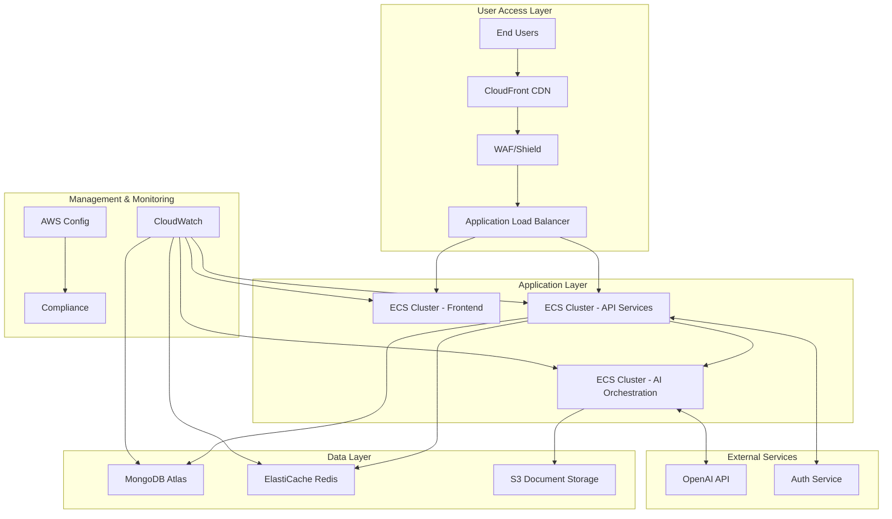

# Architecture Overview

## Introduction

This document provides a comprehensive overview of the system architecture for the AI writing enhancement platform. The platform enables users to improve their written content through AI-powered intelligent suggestions and edits presented in a familiar Microsoft Word-like track changes interface.

The architecture is designed to address several key goals:
- Supporting both anonymous and authenticated usage paths
- Providing a responsive, intuitive document editing experience
- Integrating AI capabilities for contextual writing improvements
- Ensuring scalability, security, and maintainability
- Delivering a seamless experience across devices

This overview document explains the high-level architecture, key components, design principles, and interactions between different parts of the system. For detailed documentation of specific components, please refer to the specialized architecture documents linked in the References section.

## System Overview

The AI writing enhancement platform is a web-based application that helps users improve their written content through AI-powered suggestions. The system provides a document editor with Microsoft Word-like track changes functionality, enabling users to accept or reject AI-generated improvements directly within the text.

Key capabilities of the system include:

- Rich text document editing with familiar controls
- AI-powered writing enhancement suggestions
- Track changes interface for reviewing suggestions
- Guided improvement templates and free-form AI chat
- Support for both anonymous and authenticated usage
- Document storage and management for registered users

The high-level architecture follows a client-heavy approach with the frontend handling document editing while communicating with backend services for AI processing, user management, and data persistence.

The system is organized into several key layers:
- **Client Layer**: Browser-based React application with rich document editing
- **API Layer**: RESTful services for backend functionality
- **Service Layer**: Core business logic and processing
- **Data Layer**: Storage for documents, user data, and system state
- **External Integrations**: AI services and supporting infrastructure

## Architecture Principles

The architecture adheres to several core principles that guide its design and implementation:

### Application Architecture Style

The application follows a Single Page Application (SPA) approach using React, providing a responsive, desktop-like experience for document editing. This architecture was chosen because it:
- Minimizes latency for document editing operations
- Enables rich user interactions without page reloads
- Supports client-side processing for immediate feedback
- Allows offline-capable functionality where appropriate

### Backend Organization

The backend follows a modular monolith approach with clear service boundaries. This design:
- Balances development velocity with service isolation
- Establishes clear interfaces between functional areas
- Avoids distributed system complexity in the initial release
- Provides a migration path to microservices if future scaling requires it

### State Management Approach

The platform implements a client-heavy state management approach with server synchronization:
- Document editing state primarily managed in the browser
- Critical data synchronized with the server at appropriate intervals
- Redis caching for session data and frequent access patterns
- Support for offline editing with synchronization on reconnection

### AI Integration Pattern

The integration with AI services follows an asynchronous request-response pattern with streaming options:
- Asynchronous processing accommodates variable LLM response times
- Streaming responses enable progressive rendering of suggestions
- Prompt templates and optimization improve AI response quality
- Caching of similar requests reduces API costs and improves responsiveness

## System Components

The system consists of several key components that work together to provide the complete functionality. This section provides an overview of each component area, with links to detailed documentation.

### Frontend Components

The frontend is a React-based Single Page Application that provides the primary user interface:

- **Document Editor**: Built on ProseMirror, providing rich text editing with track changes capabilities
- **Track Changes System**: Microsoft Word-like interface for reviewing AI suggestions
- **Sidebar Interface**: Context-aware panel providing access to AI capabilities
- **Authentication Components**: Login, registration, and session management

The frontend emphasizes responsive design, accessibility, and performance optimization to handle large documents efficiently.

For detailed frontend architecture documentation, see [Frontend Architecture](./frontend.md).

### Backend Services

The backend is built on Flask with a modular organization:

- **Document Service**: Manages document storage, retrieval, and version management
- **AI Orchestration Service**: Processes document content with AI models to generate suggestions
- **User Service**: Handles authentication, profiles, and session management
- **Template Service**: Manages predefined improvement templates

The backend services are designed to be stateless for horizontal scalability, with appropriate caching and performance optimizations.

For detailed backend architecture documentation, see [Backend Architecture](./backend.md).

### Data Storage

The data storage layer employs a polyglot persistence approach:

- **MongoDB**: Document-oriented database for structured metadata and user data
- **Redis**: In-memory data store for caching, sessions, and rate limiting
- **Amazon S3**: Object storage for document content and version history

This multi-database approach balances flexibility, performance, and cost-efficiency for different data access patterns.

For detailed database architecture documentation, see [Database Architecture](./database.md).

### AI Integration

The AI integration components manage interactions with language models:

- **OpenAI Connector**: Manages communication with the OpenAI API
- **Prompt Management**: Sophisticated prompt engineering for optimal results
- **Response Processing**: Converts AI outputs into actionable suggestions
- **Token Optimization**: Strategies for efficient token usage and cost management

The AI integration is designed to balance quality, performance, and cost considerations.

For detailed AI integration documentation, see [AI Integration Architecture](./ai-integration.md).

### Security Components

Security is implemented throughout the system with several key components:

- **Authentication Framework**: Supporting both anonymous and authenticated access
- **Authorization System**: Role-based access control with fine-grained permissions
- **Data Protection**: Encryption, masking, and secure storage of sensitive data
- **Security Monitoring**: Detection and response to potential security events

The security architecture balances strong protection with usability considerations.

For detailed security architecture documentation, see [Security Architecture](./security.md).

## Data Flow

This section describes how data flows through the system during key user scenarios.

### Document Creation and Editing

1. User inputs document content through the browser (paste, type, or upload)
2. Frontend processes and normalizes content in the document editor
3. ProseMirror maintains document state with real-time updates
4. Document changes are periodically synchronized to backend storage
5. For authenticated users, documents are persisted to MongoDB with S3 storage
6. For anonymous users, documents are stored in browser session with reminders about limitations

### AI Suggestion Generation

1. User selects text and chooses an improvement template (or provides custom prompt)
2. Frontend sends document content and prompt to the backend API
3. AI Orchestration Service processes the request, optimizing context and tokens
4. OpenAI API generates suggestions based on the optimized prompt
5. Backend transforms suggestions into track changes format
6. Frontend renders suggestions inline using the track changes interface
7. User reviews and accepts/rejects each suggestion
8. Accepted changes are applied to the document model

### Anonymous to Authenticated Transition

1. Anonymous user creates and edits documents with session-based storage
2. User decides to register or log in to save work permanently
3. After authentication, system migrates documents from session to user account
4. Session documents are copied to user's storage with appropriate metadata
5. User continues with authenticated access to preserved documents

## Deployment Architecture

The system is deployed using a container-based approach on AWS infrastructure.

### Container Strategy

The application uses Docker containers for all components:
- Standardized builds across environments
- Immutable infrastructure approach
- Clear isolation of dependencies
- Efficient scaling and deployment

Amazon ECR stores container images with semantic versioning and commit hash tagging to ensure deployment consistency.

### Cloud Services

The platform utilizes several AWS services:
- **ECS with Fargate**: Container orchestration without cluster management
- **Application Load Balancer**: Request routing and SSL termination
- **CloudFront**: CDN for static assets and global distribution
- **ElastiCache Redis**: Session management and caching
- **MongoDB Atlas**: Managed document database service
- **S3**: Document content storage and versioning

### Scaling Approach

Different components scale according to their specific requirements:
- **Frontend**: Scales based on user traffic
- **API Services**: Scales based on request volume
- **AI Services**: Scales independently based on processing queue
- **Database**: Scales through replica sets and sharding

Auto-scaling is configured using appropriate metrics for each service, with different scaling thresholds and cooldown periods.

### High Availability Design

The system implements high availability through:
- Multi-AZ deployments for all services
- Read replicas for database scaling
- Automatic failover for database primary
- Session affinity with distributed state
- Circuit breakers for external dependencies

## Cross-Cutting Concerns

### Logging and Monitoring

The system implements comprehensive logging and monitoring:
- Structured JSON logging with correlation IDs
- Centralized log aggregation in CloudWatch
- Custom application metrics for business insights
- Real-time dashboards for system health
- Alerting based on predefined thresholds

### Error Handling

Error handling follows a consistent approach across the system:
- Graceful degradation for non-critical failures
- Circuit breakers for external dependencies
- Appropriate user feedback for different error types
- Retry with exponential backoff for transient issues
- Comprehensive error logging for troubleshooting

### Performance Considerations

Performance optimization focuses on several key areas:
- Document editor virtualization for large documents
- Efficient rendering for track changes interface
- AI response streaming for perceived responsiveness
- Caching strategies for frequently accessed data
- CDN distribution for static assets

### Security Approach

Security is implemented using defense-in-depth principles:
- HTTPS for all communications
- JWT-based authentication with appropriate controls
- Input validation at multiple levels
- Content security policies and XSS protection
- Regular security testing and vulnerability scanning

## References

For detailed architecture documentation of specific components, please refer to:

- [Frontend Architecture](./frontend.md) - Detailed documentation of frontend components and design
- [Backend Architecture](./backend.md) - Detailed documentation of backend services and APIs
- [Database Architecture](./database.md) - Detailed documentation of data models and storage
- [AI Integration](./ai-integration.md) - Detailed documentation of AI service integration
- [Security Architecture](./security.md) - Detailed documentation of security mechanisms