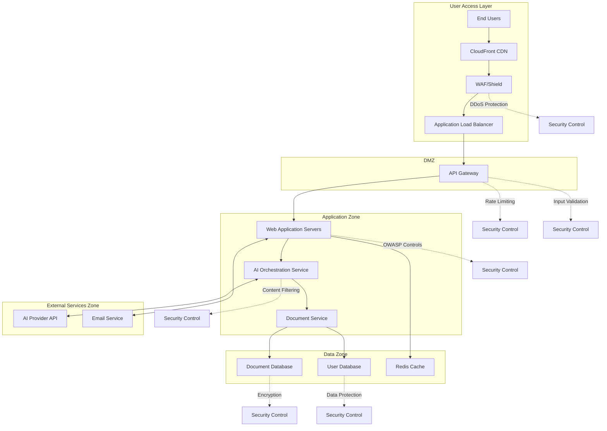
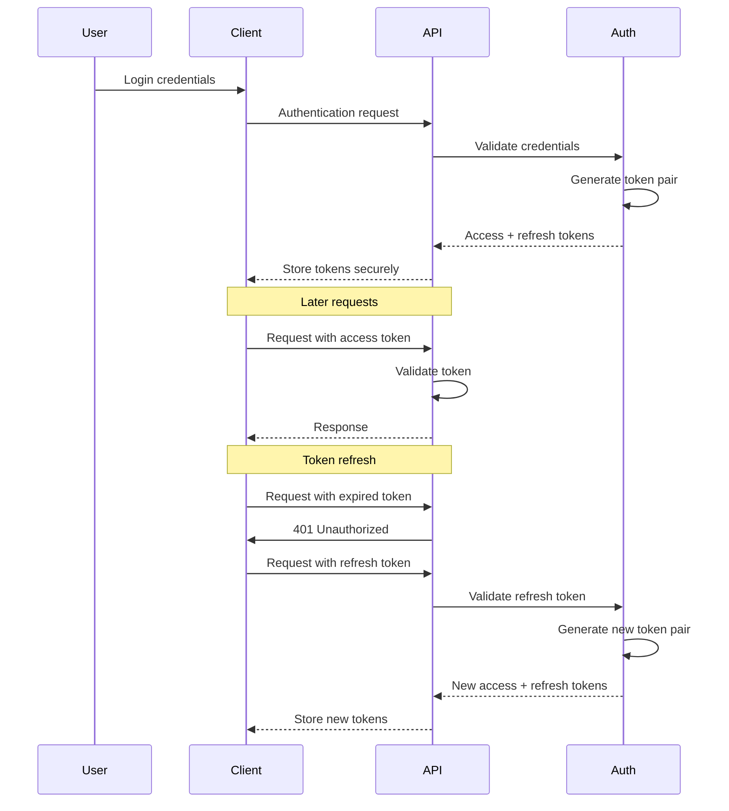
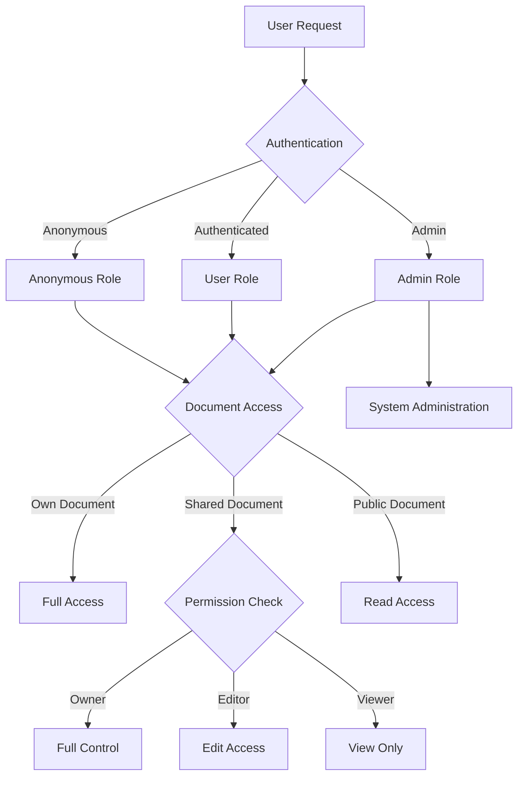
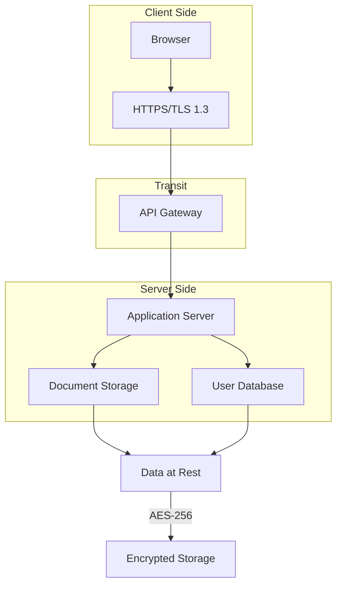

# Security Architecture

## Introduction
This document provides a comprehensive overview of the security architecture for the AI writing enhancement platform. The architecture implements defense-in-depth principles to protect user data and system integrity while supporting both anonymous and authenticated usage patterns.

The security architecture addresses authentication, authorization, data protection, network security, and threat mitigation strategies. It balances strong security controls with usability to provide a seamless user experience without compromising protection of sensitive information.

## Security Architecture Overview

The security architecture follows a multi-layered approach with controls implemented at each layer of the application stack. This section presents a high-level overview of the security components and their relationships.

### Security Architecture Principles

The security architecture is built on the following core principles:

- **Defense in Depth**: Multiple security controls at different layers
- **Least Privilege**: Access limited to the minimum required for functionality
- **Secure by Default**: Security enabled in default configurations
- **Privacy by Design**: Data protection integrated into all processes
- **Continuous Validation**: Regular testing and monitoring of security controls
- **Usability Balance**: Security measures that don't impose unnecessary friction

### Key Security Components

The security architecture consists of the following key components:

1. **Authentication Framework**: Supports both anonymous and authenticated access paths
2. **Authorization System**: Role-based access control with fine-grained permissions
3. **Data Protection**: Encryption, masking, and secure storage of sensitive data
4. **Network Security**: Segmentation, filtering, and traffic management
5. **Threat Mitigation**: Controls for common web application threats
6. **Security Monitoring**: Detection of suspicious activities and security events
7. **Incident Response**: Procedures for handling security incidents
8. **Compliance Controls**: Implementations of regulatory requirements

## Authentication Framework

The authentication system supports both anonymous and authenticated access paths while maintaining security for user data and documents.

### Identity Management

The platform implements the following identity management components:

- **Anonymous Access**: Session-based identifiers enable immediate usage without login
- **User Registration**: Email verification flow establishes verified user identities
- **Account Recovery**: Time-limited reset tokens provide secure account recovery
- **Identity Storage**: Credentials stored with bcrypt hashing and appropriate salting

| Method | Implementation | Purpose |
|--------|---------------|---------|
| Email/Password | Bcrypt hashing (cost factor 12) | Primary authentication method |
| OAuth Integration | Support for Google, Microsoft identities | Simplified authentication option |
| Anonymous Sessions | Secure session identifiers | Immediate access without registration |

### Multi-factor Authentication

Multi-factor authentication is implemented with the following components:

- **Email Verification**: One-time codes sent for account registration
- **Recovery Codes**: Pre-generated backup codes for account recovery
- **Optional TOTP**: Time-based one-time passwords for enhanced security

### Session Management

Session management is implemented with security as a priority:

| Session Type | Duration | Storage | Renewal Mechanism |
|--------------|----------|---------|-------------------|
| Anonymous | 24 hours | Browser storage + server session | Automatic with activity |
| Authenticated | 2 hours (access token) | HTTP-only cookies | Refresh token (7 days) |
| Remember Me | 30 days | Secure HTTP-only cookie | Rotating refresh tokens |

### Token Handling

The system implements a secure token handling approach:

- **Access Tokens**: Short-lived JWTs for API authorization
- **Refresh Tokens**: Longer-lived tokens for obtaining new access tokens
- **Token Rotation**: Refresh tokens are rotated with each use
- **Token Revocation**: Centralized mechanism for revoking compromised tokens

All tokens are transmitted over HTTPS and stored securely with appropriate HTTP security headers.

### Password Policies

The system enforces strong password policies:

- **Minimum Length**: 10 characters
- **Complexity**: Combination of character types required
- **History**: No reuse of last 5 passwords
- **Max Age**: Optional 90-day rotation
- **Breach Detection**: Check against known breached passwords

Password policies are enforced at both client and server levels with appropriate user feedback.

## Authorization System

The authorization system implements role-based access control with fine-grained permissions for different user types.

### Role-based Access Control

The platform uses a role-based access control model with the following roles:

- **Anonymous**: Unauthenticated users with limited functionality
- **User**: Authenticated users with access to their own content
- **Admin**: System administrators with elevated privileges

Roles determine available features, resource access, and administrative capabilities.

### Permission Management

The system implements granular permissions for different operations:

| Permission Type | Scope | Description |
|-----------------|-------|-------------|
| Document Create | Global | Ability to create new documents |
| Document Edit | Resource | Ability to modify specific document |
| Document Share | Resource | Ability to control document access |
| Template Manage | Global | Ability to create/edit prompt templates |
| User Manage | Global | Ability to manage user accounts |

### Resource Authorization

Access to resources is controlled through multiple mechanisms:

- **Documents**: Owner-based access with explicit sharing
- **Templates**: System vs. user-created templates with appropriate access
- **User Data**: Self-only access with admin override capability
- **System Settings**: Role-based access to configuration

### Policy Enforcement Points

Authorization is enforced at multiple levels:

- **UI Layer**: Feature visibility controlled by permissions
- **API Gateway**: Request filtering based on authentication
- **Service Layer**: Business logic enforces authorization rules
- **Data Layer**: Query filtering based on user context

### Audit Logging

Comprehensive audit logging records security-relevant actions:

| Event Category | Events Logged | Retention Period |
|----------------|---------------|------------------|
| Authentication | Login attempts, password changes, MFA events | 90 days |
| Document Access | View, edit, share, delete operations | 30 days |
| Admin Actions | User management, system configuration changes | 1 year |
| Security Violations | Failed access attempts, permission violations | 1 year |

## Data Protection

The data protection strategy ensures confidentiality, integrity, and availability of user data and system information.

### Encryption Standards

The system implements industry-standard encryption:

- **Data in Transit**: TLS 1.3 with strong cipher suites
- **Data at Rest**: AES-256 encryption for stored data
- **Sensitive Fields**: Additional field-level encryption for PII
- **Backups**: Encrypted with separate keys from production data

### Key Management

Cryptographic keys are managed securely:

- **Key Generation**: Strong random generation using cryptographic libraries
- **Key Storage**: Secure key management service with limited access
- **Key Rotation**: Regular rotation schedule based on key type
- **Key Backup**: Secure backup procedures with appropriate controls

| Key Type | Generation | Storage | Rotation Policy |
|----------|------------|---------|----------------|
| TLS Certificates | 2048-bit RSA or ECC | Secure certificate store | 1 year |
| Data Encryption Keys | 256-bit AES | Key management service | 90 days |
| Authentication Signing Keys | RSA or ECDSA | Hardware security module | 30 days |
| API Keys | Cryptographically random | Hashed in database | On demand |

### Data Masking Rules

Sensitive data is masked in appropriate contexts:

- **Email Addresses**: Partial masking in logs and displays
- **IP Addresses**: Truncation in analytics and logs
- **Document Content**: No storage of analyzed content in AI processing
- **Authentication Data**: No logging except success/failure status

### Secure Communication

All communications are secured with appropriate controls:

| Channel | Protection Mechanism | Additional Controls |
|---------|----------------------|---------------------|
| Browser to Server | TLS 1.3 with strong ciphers | HTTP Strict Transport Security |
| Server to AI Service | TLS 1.3 + API key authentication | Request signing, IP restrictions |
| Server to Database | TLS with mutual authentication | Network isolation, connection encryption |
| Email Communications | TLS + DKIM + SPF | Content encryption for sensitive info |

### Compliance Controls

Data protection measures address regulatory requirements:

- **GDPR**: Data minimization, right to erasure implementation
- **CCPA**: Privacy notices, opt-out options for data sharing
- **SOC 2**: Access controls, audit logging for compliance requirements
- **OWASP Top 10**: Security controls addressing common web vulnerabilities

## Security Zone Architecture

The network architecture implements security zones with appropriate controls between zones.

### Zone Definition

The system is divided into the following security zones:

- **Public Zone**: End user access through web browsers
- **DMZ**: Public-facing services with restricted access
- **Application Zone**: Application services with internal access only
- **Data Zone**: Data storage with tightly controlled access
- **External Services Zone**: Controlled connections to third-party services

### Boundary Controls

Zone boundaries implement multiple security controls:

- **WAF/Shield**: Protects public-facing services from web attacks
- **Network ACLs**: Controls traffic between zones
- **API Gateway**: Manages and secures API access
- **Security Groups**: Instance-level network security
- **VPC Endpoints**: Secure access to AWS services

### Network Traffic Management

Traffic between zones is controlled and monitored:

- **Ingress Filtering**: Validates incoming traffic to each zone
- **Egress Controls**: Limits outbound connections from sensitive zones
- **Traffic Encryption**: Ensures confidentiality between zones
- **Flow Logging**: Records network traffic for analysis
- **Anomaly Detection**: Identifies unusual traffic patterns

## Security Control Matrix

The security control matrix defines access controls and permissions for different user roles.

| Security Domain | Anonymous Users | Authenticated Users | Administrators |
|-----------------|-----------------|---------------------|----------------|
| Document Access | Session only | Own + shared | Full access |
| AI Features | Rate limited | Full access | Full access + config |
| User Data | None | Self only | Management access |
| System Features | Basic usage | Full features | Configuration access |

### Anonymous User Controls

Controls specific to anonymous users:

- **Session-based storage**: Document data tied to browser session
- **Rate limiting**: Prevents abuse of AI features and APIs
- **Usage limitations**: Restricted functionality until authentication
- **Transition path**: Easy upgrade to authenticated status

### Authenticated User Controls

Controls specific to authenticated users:

- **Document ownership**: Clear ownership and access rights
- **Sharing controls**: User-managed access to shared documents
- **Enhanced features**: Full access to platform capabilities
- **Profile security**: Self-management of security settings

### Administrator Controls

Controls specific to administrators:

- **User management**: Creation, suspension, and deletion of accounts
- **Configuration access**: System setting and parameter control
- **Analytics access**: Aggregated usage data and reports
- **Privileged operations**: Special functions requiring elevated privileges

## Threat Mitigation Strategies

The system implements multiple strategies to mitigate common security threats.

| Threat | Mitigation | Implementation |
|--------|------------|----------------|
| XSS Attacks | Content sanitization | DOMPurify for user content |
| CSRF | Anti-forgery tokens | Token per session/form |
| SQL Injection | Parameterized queries | ORM with prepared statements |
| Privilege Escalation | Strict permission checks | Multi-layer authorization |
| AI Prompt Injection | Input validation | Prompt templates, context isolation |
| Data Exfiltration | Data minimization | No persistent storage of process-only data |

### Web Application Vulnerabilities

Controls for common web application vulnerabilities:

- **Input Validation**: Client and server-side validation of all inputs
- **Output Encoding**: Context-appropriate encoding of output data
- **Authentication Controls**: Protection against authentication attacks
- **Session Management**: Secure handling of user sessions
- **Access Controls**: Proper authorization for all resources

### AI-Specific Threats

Controls for threats specific to AI integration:

- **Prompt Injection**: Validation and sanitization of user inputs to AI
- **Training Data Extraction**: Prevention of model manipulation to extract data
- **Response Validation**: Filtering and validation of AI responses
- **Content Safety**: Detection and blocking of inappropriate content
- **Quality Assurance**: Monitoring AI response quality and correctness

### Infrastructure Protection

Controls for infrastructure-level threats:

- **DDoS Protection**: WAF and Shield protection for public endpoints
- **Host Security**: Hardened instances with minimal attack surface
- **Container Security**: Image scanning and runtime protection
- **CI/CD Security**: Pipeline security with code scanning
- **Cloud Security**: IAM policies and service configurations

### Vulnerability Management

Processes for managing vulnerabilities:

- **Security Testing**: Regular SAST, DAST, and penetration testing
- **Dependency Management**: Monitoring and updating dependencies
- **Patch Management**: Timely application of security patches
- **Bug Bounty**: Responsible disclosure program for vulnerabilities
- **Security Monitoring**: Continuous monitoring for new threats

## Security Monitoring and Response

The security monitoring and incident response capabilities ensure timely detection and resolution of security issues.

### Security Monitoring

Comprehensive monitoring for security events:

- **Intrusion Detection**: Network and host-based detection
- **Log Analysis**: Centralized logging with analysis
- **Anomaly Detection**: Baseline-based anomaly identification
- **Security Information and Event Management (SIEM)**: Correlation and alerting
- **User Activity Monitoring**: Detection of suspicious user actions

### Incident Response

Structured approach to security incidents:

- **Incident Classification**: Categorization and prioritization
- **Response Procedures**: Documented procedures for different incidents
- **Escalation Paths**: Clear escalation for different incident types
- **Communication Plan**: Internal and external communication strategies
- **Recovery Procedures**: Steps for returning to normal operations

The incident response plan follows the processes defined in the [Incident Response Plan](../../security/policies/incident-response-plan.md) document, including detailed alert routing frameworks and escalation procedures.

### Security Testing

Regular security testing to validate controls:

- **Vulnerability Scanning**: Automated scanning for vulnerabilities
- **Penetration Testing**: Simulated attacks against the application
- **Security Code Reviews**: Identification of code-level issues
- **Configuration Audits**: Validation of security configurations
- **Compliance Assessments**: Validation against compliance requirements

## SOC 2 Compliance Implementation

The system implements controls to support SOC 2 compliance requirements across multiple trust principles.

### Security Controls

Implementation of controls for the Security trust principle:

- **Access Control**: Formal processes for user provisioning and deprovisioning
- **System Security**: Configuration management and hardening procedures
- **Change Management**: Controlled changes with appropriate testing
- **Risk Management**: Regular assessment and mitigation of security risks

### Confidentiality Controls

Implementation of controls for the Confidentiality trust principle:

- **Data Classification**: Categorization of data based on sensitivity
- **Access Restrictions**: Need-to-know access to confidential information
- **Secure Disposal**: Procedures for secure data destruction
- **Confidentiality Agreements**: Requirements for employees and contractors

### Availability Controls

Implementation of controls for the Availability trust principle:

- **Monitoring**: System health and performance monitoring
- **Disaster Recovery**: Procedures for recovering from service disruptions
- **Capacity Management**: Ensuring sufficient resources for operations
- **Incident Response**: Timely reaction to availability incidents

## Security Documentation and Training

Security documentation and training ensure consistent implementation and awareness.

### Security Policies and Procedures

Formal documentation of security requirements:

- **Information Security Policy**: Overall security framework
- **Acceptable Use Policy**: Rules for system usage
- **Access Control Policy**: Requirements for access management
- **Data Classification Policy**: Data handling requirements
- **Incident Response Procedures**: Steps for handling incidents

### Security Training

Training for security awareness and skills:

- **Security Awareness Training**: Basic security for all users
- **Developer Security Training**: Secure coding practices
- **Admin Security Training**: Secure system administration
- **Incident Response Training**: Handling security incidents
- **Social Engineering Awareness**: Recognizing manipulation attempts

## References

Additional resources and documentation related to security architecture.

- [Database Security](./database.md#data-protection)
- [AI Security Measures](./ai-integration.md#security-measures)
- [Incident Response Plan](../../security/policies/incident-response-plan.md)
- [OWASP Top 10](https://owasp.org/Top10/)