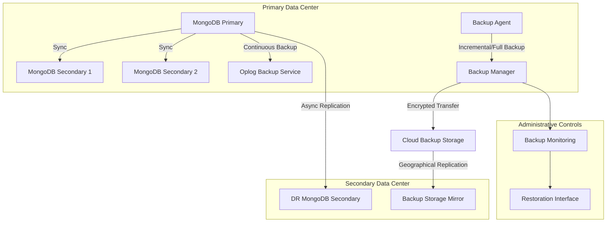
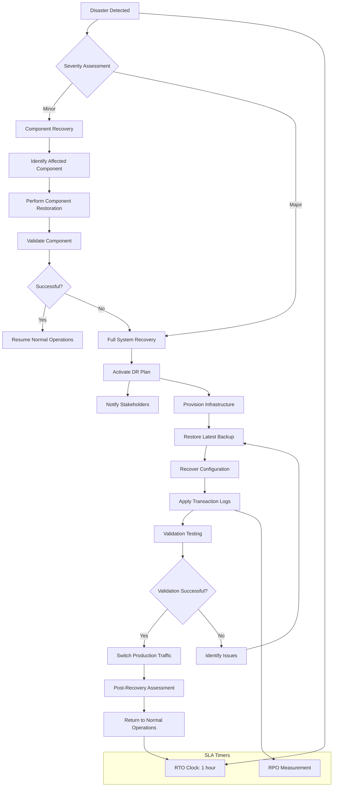
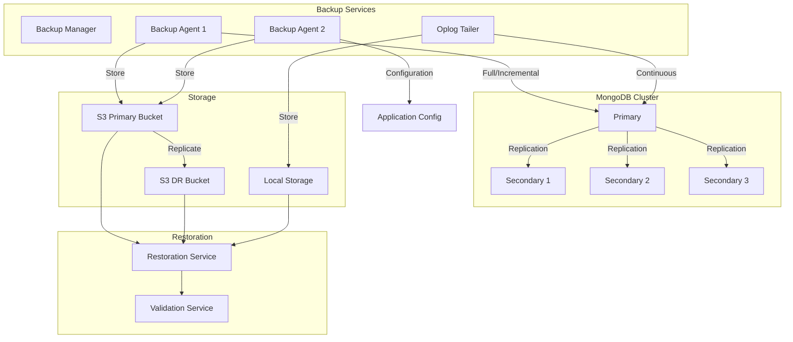

# Backup and Restoration Guide

## 1. Introduction

This document provides comprehensive procedures for the backup and restoration processes of the AI writing enhancement system. It serves as the primary reference for operations staff responsible for data protection, disaster recovery, and system restoration.

### 1.1 Purpose

The backup and restoration procedures outlined in this document ensure:
- Protection against data loss from hardware failures, software errors, or human mistakes
- Compliance with regulatory requirements for data retention
- Ability to recover from disaster scenarios with minimal business impact
- Verification of backup integrity and restoration capabilities

### 1.2 Backup Strategy Overview

The system implements a multi-layered backup strategy with the following components:
- **Continuous replication** across database nodes for real-time redundancy
- **Incremental backups** every 6 hours for granular recovery points
- **Full daily backups** for complete system snapshots
- **Geographic redundancy** to protect against regional outages
- **Automated verification** to ensure backup integrity

### 1.3 Scope

These procedures apply to all production environments of the AI writing enhancement system, including:
- Document databases (MongoDB)
- User authentication data
- Document content and version history
- AI interaction logs
- System configuration and infrastructure definitions

## 2. Backup Architecture

### 2.1 Backup Types

| Backup Type | Frequency | Retention | Storage Location | Purpose |
|-------------|-----------|-----------|-----------------|---------|
| Full Backup | Daily | 30 days | Encrypted cloud storage | Complete system snapshot |
| Incremental Backup | Every 6 hours | 7 days | Encrypted cloud storage | Granular recovery points |
| Oplog Backup | Continuous | 72 hours | Local + replicated storage | Point-in-time recovery |
| Configuration Backup | After each change | 90 days | Version-controlled repository | Infrastructure recovery |

### 2.2 Storage Architecture



### 2.3 Retention Policies

The system applies the following data retention policies:

| Data Category | Retention Period | Deletion Process |
|---------------|------------------|------------------|
| User Accounts | Until deletion + 30 days | Soft delete, then anonymize |
| User Documents | Until deletion + 30 days | Soft delete, then purge |
| Anonymous Documents | 7 days from last access | Automatic purge |
| AI Interaction Logs | 90 days | Anonymize after 30 days |
| Authentication Logs | 1 year | Automated archival |
| Full Backups | 30 days | Secure deletion with verification |
| Incremental Backups | 7 days | Secure deletion with verification |
| Oplog Backups | 72 hours | Automatic rotation |

### 2.4 Backup Security

All backups implement the following security measures:

- **Encryption at rest** using AES-256 encryption
- **Encryption in transit** using TLS 1.3
- **Access controls** limited to authorized operations personnel
- **Immutability protection** for 24 hours to prevent immediate tampering
- **Audit logs** for all backup access and restoration activities

## 3. Backup Procedures

### 3.1 Database Backup Procedure

#### 3.1.1 Automated Full Backups

Full database backups are performed automatically by the backup management system on the following schedule:

```
Schedule: Daily at 01:00 UTC
Target: MongoDB Production Cluster
Retention: 30 days
Verification: Automated integrity check after completion
```

The backup process uses MongoDB's native backup capabilities with the following parameters:

```
mongodump --host mongodb://${PRIMARY_HOST}:${PORT} \
  --username ${BACKUP_USER} \
  --password ${BACKUP_PASSWORD} \
  --authenticationDatabase admin \
  --oplog \
  --out /backup/full/$(date +%Y%m%d) \
  --gzip
```

#### 3.1.2 Incremental Backups

Incremental backups capture changes since the last full or incremental backup:

```
Schedule: Every 6 hours (03:00, 09:00, 15:00, 21:00 UTC)
Target: MongoDB Production Cluster
Retention: 7 days
Method: Oplog capture since previous backup
```

#### 3.1.3 Manual Backup Procedure

In case manual backups are required:

1. Log in to the backup management console at https://backup-admin.internal
2. Navigate to "Manual Backup" section
3. Select the target database cluster
4. Choose backup type (Full or Incremental)
5. Add a descriptive label with reason for manual backup
6. Click "Start Backup" and monitor progress

### 3.2 Document Storage Backup

Document content is stored in MongoDB with the following backup procedures:

1. All documents are included in the regular MongoDB backup schedule
2. Documents marked as critical receive additional point-in-time versioning
3. S3 document backups (for external storage) are handled by automated daily sync:

```
Schedule: Daily at 02:00 UTC
Source: MongoDB document collections
Target: S3 encrypted bucket (s3://aiwriting-backup-documents/)
Retention: Matches MongoDB retention (30 days)
```

### 3.3 Configuration and Infrastructure Backup

System configuration and infrastructure definitions are version-controlled:

1. All Terraform configurations are stored in the GitHub repository
2. Infrastructure state files are backed up daily:

```
Schedule: Daily at 00:30 UTC
Source: Terraform state files
Target: S3 encrypted bucket (s3://aiwriting-backup-infra/)
Retention: 90 days with versioning enabled
```

3. Application configuration is captured via:

```
Schedule: After each deployment and daily at 00:15 UTC
Source: Configuration files and environment variables
Target: Encrypted Git repository + S3 bucket
Retention: 90 days with complete version history
```

### 3.4 Backup Validation Procedure

Each backup undergoes automated validation:

1. **Integrity Check**: Verification of backup file integrity and completeness
2. **Metadata Validation**: Confirmation that all database collections are included
3. **Restoration Test**: Weekly automated restoration to test environment
4. **Data Sampling**: Verification of randomly selected records

A validation report is generated after each backup with results sent to operations@example.com.

## 4. Disaster Recovery

### 4.1 Recovery Objectives

The system maintains the following recovery objectives:

| Metric | Target | Verification |
|--------|--------|-------------|
| Recovery Time Objective (RTO) | < 1 hour | 99.9% compliance |
| Recovery Point Objective (RPO) | < 5 minutes | 99.9% compliance |
| Data Durability | 99.999999999% | Redundancy and verification |
| Recovery Success Rate | 100% | Regular DR testing |

### 4.2 Disaster Recovery Workflow



### 4.3 Disaster Classification

| Severity | Description | Examples | Response |
|----------|-------------|----------|----------|
| P1 - Critical | Complete system unavailability | Data center outage, DB cluster failure | Full DR activation |
| P2 - Major | Significant function unavailability | API service down, Auth service failure | Component restoration |
| P3 - Moderate | Limited functionality affected | Non-critical service degradation | Targeted recovery |
| P4 - Minor | Minimal impact, no service disruption | Single node failure with redundancy | Scheduled restoration |

### 4.4 DR Team Roles and Responsibilities

| Role | Responsibilities | Contact |
|------|-----------------|---------|
| DR Coordinator | Overall coordination, stakeholder communication | dr-coordinator@example.com |
| Database Recovery Lead | Database restoration, data integrity verification | db-recovery@example.com |
| Infrastructure Lead | Environment provisioning, configuration restoration | infra-recovery@example.com |
| Application Recovery Lead | Application deployment, service validation | app-recovery@example.com |
| Security Officer | Security validation, access management during recovery | security@example.com |

## 5. Restoration Procedures

### 5.1 Full System Restoration

For complete system restoration, follow these steps:

1. **Initiate DR protocol**:
   ```
   dr-activate --environment=production --reason="[INCIDENT DESCRIPTION]"
   ```

2. **Provision infrastructure**:
   ```
   terraform apply -var-file=dr-restore.tfvars
   ```

3. **Restore database from latest backup**:
   ```
   restore-db --source=latest --target=dr-cluster --validate=true
   ```

4. **Apply transaction logs**:
   ```
   apply-oplog --source=oplog-backup --target=dr-cluster --until="[TIMESTAMP]"
   ```

5. **Deploy application**:
   ```
   deploy-app --environment=dr --version=[LAST_STABLE_VERSION]
   ```

6. **Validate system**:
   ```
   validate-system --environment=dr --tests=critical
   ```

7. **Switch traffic**:
   ```
   switch-traffic --from=production --to=dr --gradual=false
   ```

8. **Verify operations**:
   ```
   monitor-health --environment=dr --duration=15m
   ```

### 5.2 Point-in-Time Recovery

To restore the system to a specific point in time:

1. **Identify target timestamp**:
   ```
   find-recovery-point --target="YYYY-MM-DD HH:MM:SS"
   ```

2. **Restore latest full backup before the target time**:
   ```
   restore-db --source=full --before="[TIMESTAMP]" --target=recovery-db
   ```

3. **Apply incremental backups**:
   ```
   apply-incremental --source=incremental --before="[TIMESTAMP]" --target=recovery-db
   ```

4. **Apply oplog to reach exact point in time**:
   ```
   apply-oplog --source=oplog-backup --target=recovery-db --until="[TIMESTAMP]"
   ```

5. **Validate restoration**:
   ```
   validate-db --target=recovery-db --sample-size=500
   ```

6. **Promote to production if required**:
   ```
   promote-db --source=recovery-db --target=production
   ```

### 5.3 Single Document Restoration

For restoring individual documents:

1. Access the backup management console at https://backup-admin.internal
2. Navigate to "Document Recovery"
3. Search for the document by ID, user, or content keywords
4. Select the version point to restore from
5. Choose between "Restore in Place" or "Restore as Copy"
6. Review and confirm the restoration
7. Verify document contents after restoration

### 5.4 Post-Restoration Validation

After any restoration, perform these validation steps:

1. **Data integrity check**:
   ```
   verify-integrity --target=[RESTORED_SYSTEM] --level=comprehensive
   ```

2. **Functional validation**:
   ```
   run-test-suite --target=[RESTORED_SYSTEM] --suite=post-recovery
   ```

3. **Performance validation**:
   ```
   benchmark --target=[RESTORED_SYSTEM] --compare-to=baseline
   ```

4. **Security verification**:
   ```
   security-scan --target=[RESTORED_SYSTEM] --scope=full
   ```

## 6. Backup Monitoring and Testing

### 6.1 Monitoring

The backup system is continuously monitored:

- **Real-time alerts** for backup failures or delays
- **Capacity monitoring** for backup storage
- **Completion verification** for scheduled backups
- **Integrity monitoring** for stored backups

Alerts are configured to notify the operations team via:
- Email: ops-alerts@example.com
- Slack: #backup-alerts channel
- PagerDuty: For critical failures

### 6.2 Regular Testing Schedule

| Test Type | Frequency | Scope | Responsibility |
|-----------|-----------|-------|----------------|
| Backup Integrity | Daily | Automated validation | Backup System |
| Restoration Test | Weekly | Random sample to test environment | Operations Team |
| DR Simulation | Monthly | Component-level recovery | DR Team |
| Full DR Test | Quarterly | Complete system recovery simulation | DR Team + Leadership |

### 6.3 DR Testing Procedure

1. **Preparation**:
   - Schedule maintenance window
   - Notify stakeholders
   - Create test plan with success criteria

2. **Execution**:
   - Simulate disaster scenario
   - Execute DR plan without affecting production
   - Measure RTO and RPO achievements
   - Document all steps and timing

3. **Validation**:
   - Verify data integrity
   - Confirm system functionality
   - Test external integrations
   - Validate security controls

4. **Review**:
   - Document lessons learned
   - Identify improvement areas
   - Update procedures as needed
   - Share report with stakeholders

## 7. Compliance and Security

### 7.1 Regulatory Compliance

The backup and restoration procedures are designed to comply with:

- GDPR requirements for data protection
- CCPA requirements for consumer data
- SOC 2 requirements for availability and security
- Internal data protection policies

### 7.2 Access Controls

Access to backup systems and data is strictly controlled:

| Role | Access Level | Authentication Method |
|------|-------------|----------------------|
| Backup Administrator | Full access to backup systems | MFA + dedicated credentials |
| DR Team Member | Restoration capabilities | MFA + temporary elevated access |
| Operations Engineer | Monitoring and validation | MFA + standard access |
| Security Team | Audit and review | MFA + read-only access |

### 7.3 Backup Security Measures

All backups implement these security controls:

1. **Encryption**:
   - AES-256 encryption for all backup data
   - Encryption keys managed through AWS KMS
   - Separate encryption keys for different environments

2. **Access Logging**:
   - Comprehensive audit logs for all backup operations
   - Immutable logs stored for 1 year
   - Regular review of access patterns

3. **Integrity Verification**:
   - Checksums for all backup files
   - Tamper-evident sealing of backup sets
   - Regular integrity verification

4. **Secure Disposal**:
   - Secure wiping of expired backups
   - Verification of complete removal
   - Documented disposal process

## 8. Appendices

### 8.1 Backup System Architecture Diagram



### 8.2 Recovery Time Objective (RTO) History

| Date | Scenario | Actual Recovery Time | Target Met? | Notes |
|------|----------|----------------------|------------|-------|
| 2023-06-15 | Simulated DB Failure | 42 minutes | Yes | Full recovery test |
| 2023-09-23 | Actual Region Outage | 38 minutes | Yes | Automated failover worked as expected |
| 2023-12-10 | DR Test Exercise | 45 minutes | Yes | Manual recovery test |
| 2024-03-05 | Simulated Data Corruption | 52 minutes | Yes | Complex point-in-time recovery |

### 8.3 Common Restoration Scenarios

#### 8.3.1 User Document Restoration

**Scenario**: User accidentally deleted important document and requests recovery

**Procedure**:
1. Authenticate the user request through proper channels
2. Identify the document ID from logs or user information
3. Locate the most recent backup containing the document
4. Perform single-document restoration procedure
5. Notify user of successful recovery

#### 8.3.2 System Configuration Restoration

**Scenario**: Misconfiguration causing system instability

**Procedure**:
1. Identify the last known good configuration
2. Restore configuration files from version control
3. Apply configuration to affected components
4. Validate system behavior
5. Document the incident and resolution

#### 8.3.3 Database Corruption Recovery

**Scenario**: Data corruption detected in production database

**Procedure**:
1. Isolate affected collections/data
2. Determine corruption timeframe
3. Initiate point-in-time recovery to before corruption
4. Validate recovered data
5. Promote recovered database to production
6. Verify application functionality

### 8.4 Contact Information

| Team | Primary Contact | Secondary Contact | Escalation |
|------|----------------|-------------------|------------|
| Operations | ops-lead@example.com<br>+1-555-123-4567 | ops-backup@example.com<br>+1-555-123-4568 | cto@example.com<br>+1-555-123-4569 |
| DR Team | dr-coordinator@example.com<br>+1-555-123-4570 | dr-backup@example.com<br>+1-555-123-4571 | ceo@example.com<br>+1-555-123-4572 |
| Database Team | db-lead@example.com<br>+1-555-123-4573 | db-backup@example.com<br>+1-555-123-4574 | cto@example.com<br>+1-555-123-4569 |
| Security Team | security@example.com<br>+1-555-123-4575 | security-backup@example.com<br>+1-555-123-4576 | ciso@example.com<br>+1-555-123-4577 |

### 8.5 Revision History

| Version | Date | Author | Changes |
|---------|------|--------|---------|
| 1.0 | 2023-01-15 | J. Smith | Initial document creation |
| 1.1 | 2023-03-20 | A. Johnson | Updated DR procedures |
| 1.2 | 2023-07-12 | M. Williams | Enhanced monitoring section |
| 2.0 | 2024-01-10 | J. Smith | Major revision with updated architecture |
| 2.1 | 2024-04-01 | S. Brown | Added compliance section updates |