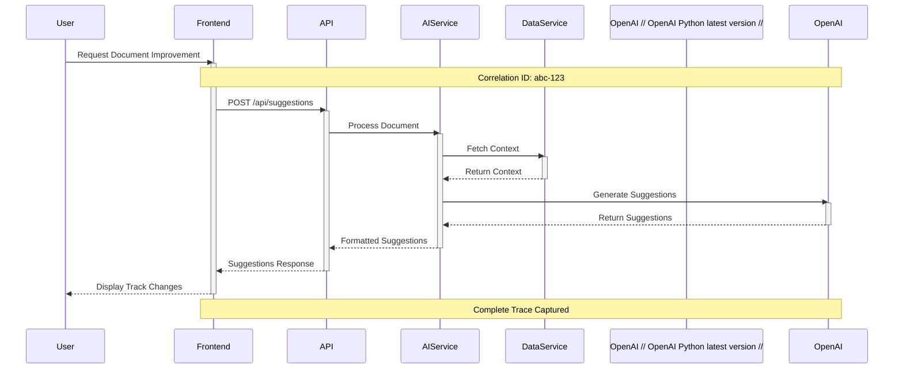
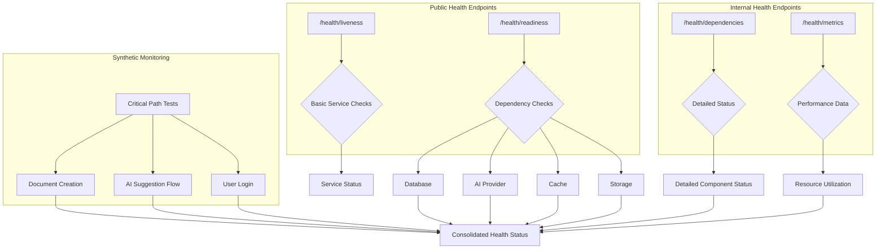
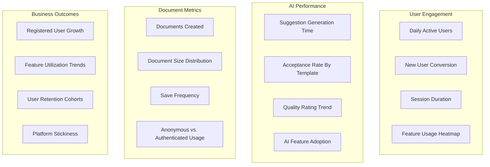
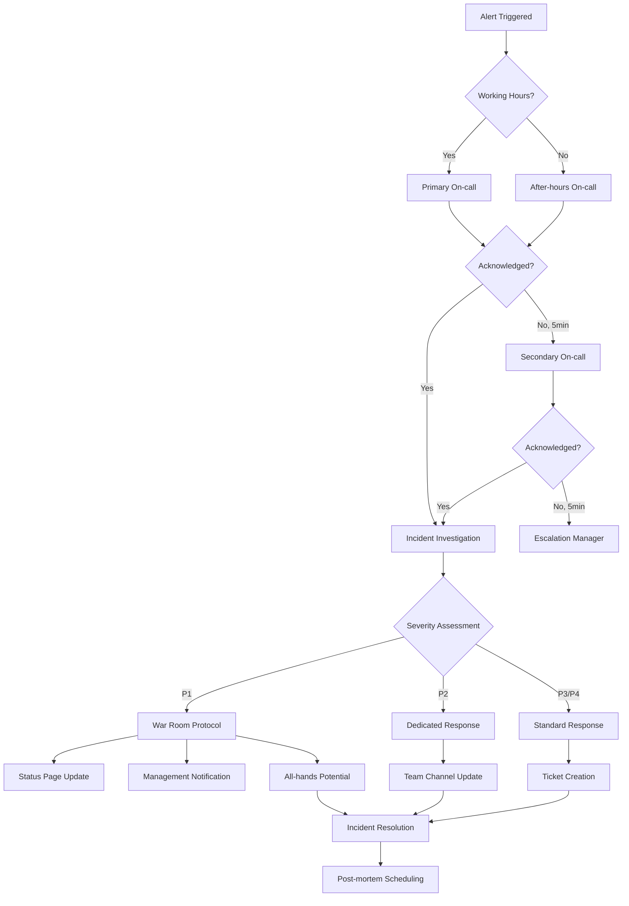
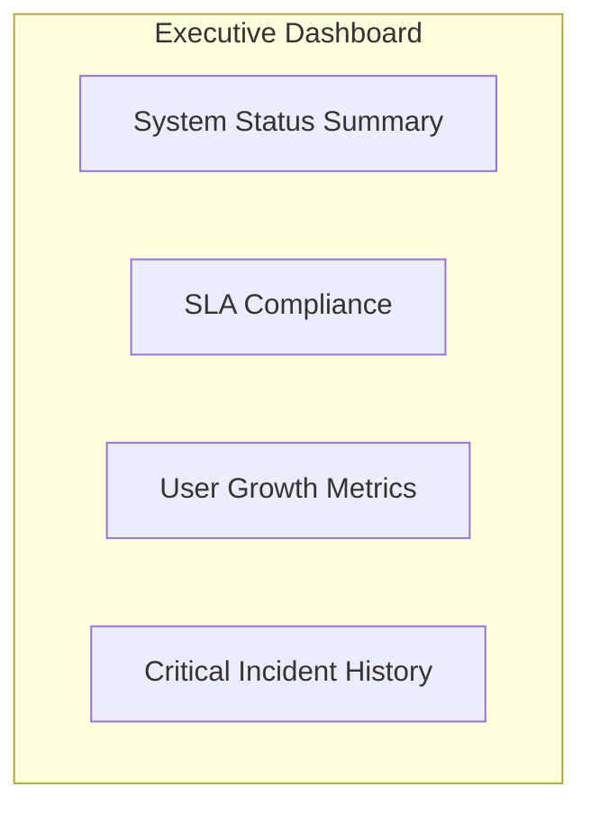
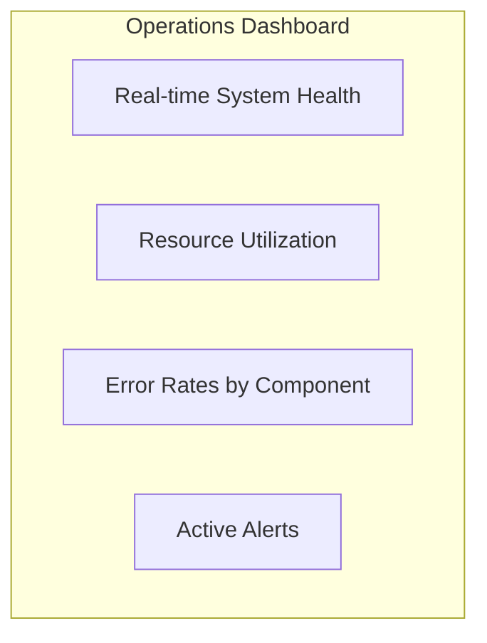
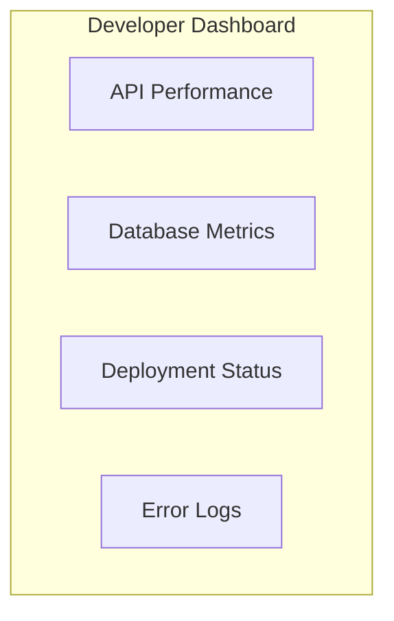
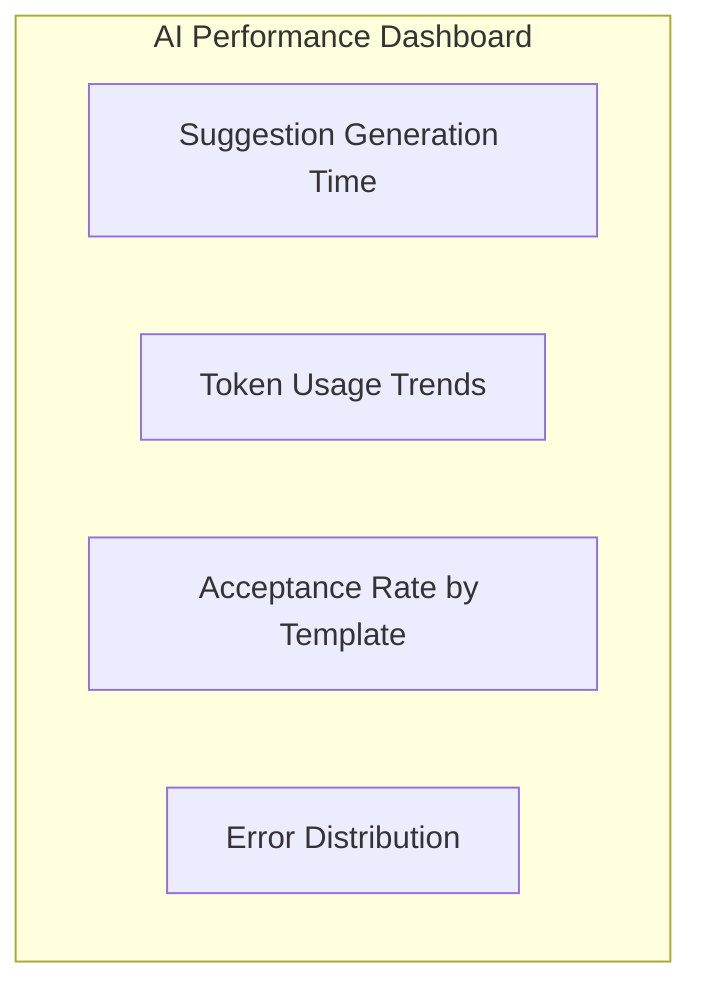

# Monitoring and Observability

## Introduction
This document provides a comprehensive overview of the monitoring and observability practices for the AI writing enhancement platform, covering metrics collection, logging strategies, distributed tracing, alerting, dashboards, and incident detection. The goal is to ensure reliability, performance, and security while providing insights into user behavior patterns.

## Monitoring Infrastructure
The monitoring infrastructure is designed to collect, process, and visualize data from various components of the platform. It uses a combination of tools and techniques to provide a holistic view of system health and performance.

### Metrics Collection Architecture
Metrics are collected from the client-side, API layer, services, and infrastructure components.

```mermaid
graph TD
    subgraph "Client Side"
        A[Browser] --> B[Telemetry SDK]
        B --> C[Performance Events]
        B --> D[User Events]
    end
    
    subgraph "API Layer"
        E[API Gateway] --> F[Request Metrics]
        E --> G[Response Metrics]
    end
    
    subgraph "Application Layer"
        H[Document Service] --> I[Document Metrics]
        J[AI Service] --> K[AI Processing Metrics]
        L[User Service] --> M[Auth Metrics]
    end
    
    subgraph "Data Layer"
        N[Database] --> O[Query Metrics]
        P[Cache] --> Q[Cache Metrics]
    end
    
    subgraph "Collection Infrastructure"
        C --> R[Real-User Monitoring]
        D --> R
        F --> S[Service Metrics]
        G --> S
        I --> S
        K --> S
        M --> S
        O --> S
        Q --> S
        
        R --> T[Metrics Store]
        S --> T
        
        T --> U[Prometheus] // Prometheus latest version //
        U --> V[Grafana Dashboards] // Grafana latest version //
        
        R --> W[Log Aggregator]
        S --> W
        W --> X[Elasticsearch]
        X --> Y[Kibana]
    end
    
    subgraph "Alerting Systems"
        V --> Z[Alert Manager]
        Y --> Z
        Z --> AA[PagerDuty]
    end
```

### Log Aggregation System
Structured logging is implemented with JSON format, correlation IDs, and PII protection.

| Component | Log Types | Retention | Aggregation Method |
|-----------|-----------|-----------|-------------------|
| Frontend | User actions, errors, performance | 14 days | Browser to backend batching |
| API Gateway | Request/response, security events | 30 days | Direct to centralized logging |
| Services | Application events, errors, warnings | 30 days | Structured logging to ELK |
| AI Integration | Request details, performance metrics | 14 days | Anonymized to central logging |

### Distributed Tracing Framework
Request tracing is implemented across services using correlation IDs and OpenTelemetry instrumentation.



### Alert Management System
Alerts are configured with severity levels, notification channels, and on-call procedures.

| Alert Level | Criteria | Response Time | Notification Channel |
|------------|----------|---------------|---------------------|
| Critical (P1) | Service outage, security breach | 15 minutes | Phone + SMS + Email |
| High (P2) | Degraded performance, elevated errors | 30 minutes | SMS + Email |
| Medium (P3) | Minor functionality issues | 4 hours | Email |
| Low (P4) | Non-impacting anomalies | 24 hours | Dashboard |

## Observability Patterns
Implementation patterns for system observability.

### Health Check Implementation
Liveness and readiness probes, dependency checks, and synthetic monitoring are implemented.



### Key Performance Metrics
Critical metrics are tracked for user experience, API, AI, and system resources.

| Metric Category | Specific Metrics | Collection Method | Purpose |
|-----------------|------------------|-------------------|---------|
| User Experience | Page load time, Time to interactive, Input latency | Browser performance API | Ensure responsive UI |
| API Performance | Response time, Error rate, Request volume | API gateway metrics | Monitor service quality |
| AI Processing | Suggestion generation time, Token usage, Quality score | Application instrumentation | Monitor AI effectiveness |
| System Resources | CPU, Memory, Disk I/O, Network | Infrastructure metrics | Capacity planning |

### Business Metrics Dashboard
User engagement, feature usage, AI quality, and business outcome metrics are tracked.



### SLA Monitoring Framework
SLA definition, measurement methods, error budgets, and reporting are implemented.

| Service | SLA Target | Measurement Method | Reporting Frequency |
|---------|------------|-------------------|---------------------|
| Overall Platform | 99.9% availability | Synthetic monitoring | Daily |
| Document Editor | < 300ms response | RUM performance timing | Real-time |
| AI Suggestions | < 5s generation time | Application timing | Real-time |
| API Endpoints | 99.95% success rate | Gateway metrics | Hourly |

### Capacity Monitoring
Resource utilization tracking, growth forecasting, and scaling triggers are implemented.

| Resource | Monitoring Approach | Scaling Trigger | Growth Forecast |
|----------|---------------------|----------------|-----------------|
| Application Servers | CPU, memory, request rate | 70% sustained utilization | 15% monthly |
| Database | Storage/IOPS | 80% utilization | 20% monthly |
| AI Service | Queue Depth | > 100 requests | 25% monthly |
| User Storage | Total size, growth rate | 80% of allocated storage | 30% monthly |

## Incident Detection
How monitoring leads to incident detection and triggers response.

### Alert Routing Framework
Alerts are routed to appropriate teams based on severity and component.



### Escalation Procedures Matrix
Escalation paths for different types of incidents and severities are defined.

| Incident Type | First Responder | Secondary Escalation | Tertiary Escalation |
|---------------|-----------------|----------------------|---------------------|
| Frontend Issues | Frontend Developer | UX Lead | Engineering Manager |
| Backend API | Backend Developer | Service Owner | CTO |
| AI Service | AI Engineer | ML Team Lead | CTO |
| Security Event | Security Engineer | CISO | CEO |
| Data Issues | Database Engineer | Data Architect | CTO |

### On-Call Rotation
On-call schedule, handoff procedures, and responsibilities are documented.

## Monitoring Dashboard Design
Design and organization of monitoring dashboards.

### Executive Dashboard
High-level system status, SLA compliance, and business metrics for leadership are displayed.



### Operations Dashboard
Real-time system health, resource utilization, and error rates for operations team are displayed.



### Developer Dashboard
API performance, database metrics, and deployment status for development team are displayed.



### AI Performance Dashboard
AI-specific metrics including suggestion time, token usage, and quality metrics are displayed.



## Alert Thresholds
Threshold configuration for different components and metrics.

### Frontend Thresholds
Thresholds for page load time, client errors, and user experience metrics are configured.

### API Gateway Thresholds
Thresholds for error rates, response times, and request volumes are configured.

### Service Thresholds
Thresholds for CPU usage, memory usage, and service-specific metrics are configured.

### AI Service Thresholds
Thresholds for queue depth, completion time, and token usage are configured.

### Database Thresholds
Thresholds for connection count, query performance, and storage metrics are configured.

## Security Monitoring
Security-specific monitoring practices.

### Authentication Monitoring
Monitoring of login attempts, failures, and suspicious patterns is implemented.

### Access Control Monitoring
Monitoring of permission violations and unusual access patterns is implemented.

### Threat Detection
Monitoring for potential security threats and intrusions is implemented.

### Compliance Monitoring
Tracking compliance with security policies and regulations is implemented.

## Synthetic Monitoring
Automated tests for critical user paths.

### Critical Path Tests
Synthetic tests for homepage load, document creation, AI suggestions, and user login are implemented.

### Regional Testing
Multi-region synthetic tests to verify global availability are implemented.

### Test Frequency
Test execution frequency and alerting configuration are defined.

## Best Practices
Recommended practices for effective monitoring.

### Logging Best Practices
Guidelines for effective logging including structured format and appropriate detail are defined.

### Alert Design Best Practices
Guidelines for creating actionable alerts with minimal noise are defined.

### Dashboard Design Best Practices
Guidelines for creating informative and usable dashboards are defined.

### Incident Analysis Best Practices
Guidelines for using monitoring data during incident investigation are defined.

## References
Links to related documentation and resources.
- [Architecture Overview](../architecture/overview.md)
- [Incident Response Procedures](incident-response.md)
- [AWS CloudWatch Documentation](https://docs.aws.amazon.com/cloudwatch/) // AWS latest version //
- [Prometheus Documentation](https://prometheus.io/docs/introduction/overview/) // Prometheus latest version //
- [Grafana Documentation](https://grafana.com/docs/grafana/latest/) // Grafana latest version //